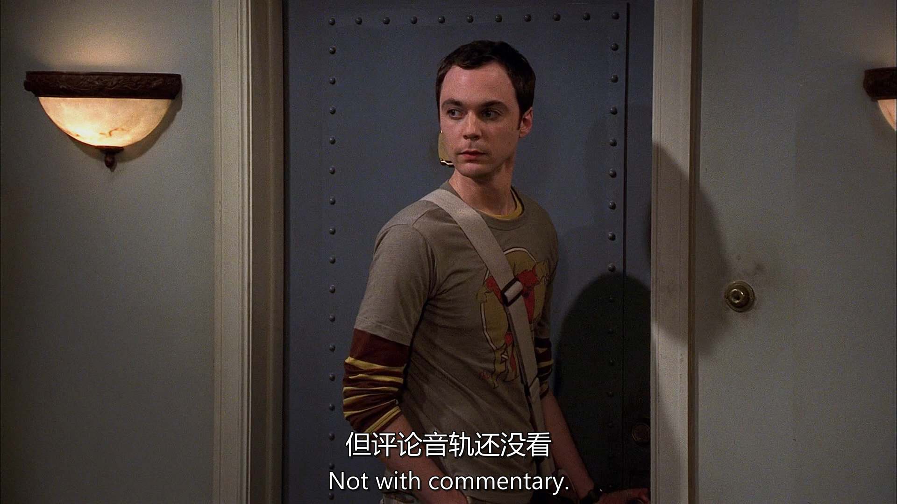

[台词](./s01e01.pdf)

# 生词

laxative 谢邀
colon 大肠；冒号
masturbate 自摸
doodle 乱涂
lactose-intolerant 乳糖不耐
shampoo 洗发水
conditioner 护发素

is there a trick to getting it to switch from tub to shower?
trick 旋钮

it's a sentiment i can say in 6 languages
sentiment 情绪；祝词

# 句子

---

Should we have invited her for lunch?
这里的have invited表示a past possibility or missed opportunity，这里强调Leonerd有点懊悔刚才没有邀请Penny来吃饭
"Should we invite her for lunch?" → This is asking about a present or future action.

"Should we have invited her for lunch?" → This is asking about whether inviting her in the past would have been the right decision.
同样的例子还有
"We should have studied more for the test." → We didn’t study enough, and now we regret it.

"Should I have told her the truth?" → I'm wondering if telling her the truth in the past was the right choice.

---

In this context, "commentary" refers to audio commentary, which is an additional feature included in DVDs or Blu-rays where the creators, directors, actors, or other involved people discuss the episode while it plays.

---

the phrase "might want to" is a polite or indirect way of giving advice or making a suggestion.

Meaning of "might want to"
It means "should" or "it would be better if you", but in a softer, less direct way.

It implies that it is advisable or a good idea to do something, without sounding too forceful.

Rewriting the Sentence for Clarity
Direct version: "Leonard, don’t mention bowel movements when inviting someone to lunch."

Polite version: "Leonard, you might want to avoid mentioning bowel movements when inviting someone to lunch."

---

In the phrase "Here I sit, broken-hearted", "Here I sit" is a way of describing one's current state or situation.

Context and Meaning:
This phrase is actually a reference to a common joke or piece of restroom graffiti:

"Here I sit, broken-hearted,
Tried to poop but only farted."

This is a humorous and well-known rhyme often found scribbled in public restrooms.

Breaking It Down:
"Here I sit" → Means "I am sitting here", usually referring to sitting on a toilet.

"Broken-hearted" → A humorous exaggeration of disappointment, in this case, about an unsuccessful bathroom trip.

In the context of The Big Bang Theory, the character is joking that the differential equation being referenced is as common and trivial as this famous piece of restroom graffiti.

---

i'm a sagittarius
which probably tells you way more than you need to know
yes,it tells us that you participate in the mass cultural delusion that the sun's apparent position 
ralative to arbitrarily defined constellations at the time of your birth somehow affects your personality
这又是一个长难句
"The sun's apparent position" refers to the position of the sun relative to certain constellations in the sky at the time of your birth.

"Arbitrarily defined constellations" points out that the constellations are subjectively defined and don't have a universal meaning across all cultures or throughout history.

The speaker is poking fun at the idea that this position can somehow influence or determine someone's personality.

The speaker is mocking astrology by suggesting that claiming one's astrological sign (e.g., Sagittarius) is a way of participating in an unfounded, widespread belief that the position of celestial bodies at birth can influence personality. The sarcasm implies that astrology is unscientific and not a reliable way to understand a person’s character.

既然谈到了星座，扩展一下
Here’s a list of all 12 zodiac signs, their English names, Chinese names, birth date ranges, and general personality traits:

### **1. Aries (白羊座)**
   - **Date:** March 21 - April 19
   - **Personality Traits:** Aries are known for being **energetic**, **confident**, and **determined**. They are natural leaders who often take initiative, but can sometimes be **impulsive** and **impatient**.

### **2. Taurus (金牛座)**
   - **Date:** April 20 - May 20
   - **Personality Traits:** Tauruses are **practical**, **patient**, and **loyal**. They value stability and security, and are often seen as **reliable** and **persistent**, though they can also be **stubborn**.

### **3. Gemini (双子座)**
   - **Date:** May 21 - June 20
   - **Personality Traits:** Geminis are **curious**, **adaptable**, and **intelligent**. They are often seen as **sociable** and **expressive**, but can be perceived as **inconsistent** or **indecisive**.

### **4. Cancer (巨蟹座)**
   - **Date:** June 21 - July 22
   - **Personality Traits:** Cancers are **sensitive**, **empathetic**, and **protective**. They deeply care about their loved ones and value home life, but can also be **moody** and **easily hurt**.

### **5. Leo (狮子座)**
   - **Date:** July 23 - August 22
   - **Personality Traits:** Leos are **charismatic**, **confident**, and **generous**. They often love being the center of attention and are natural leaders, though they can sometimes be seen as **arrogant** or **proud**.

### **6. Virgo (处女座)**
   - **Date:** August 23 - September 22
   - **Personality Traits:** Virgos are **practical**, **analytical**, and **detail-oriented**. They are often perfectionists, valuing cleanliness and order, but can be **overly critical** or **worry-prone**.

### **7. Libra (天秤座)**
   - **Date:** September 23 - October 22
   - **Personality Traits:** Libras are **charming**, **diplomatic**, and **fair-minded**. They value harmony and balance in relationships, but can sometimes be **indecisive** and have difficulty with confrontation.

### **8. Scorpio (天蝎座)**
   - **Date:** October 23 - November 21
   - **Personality Traits:** Scorpios are **passionate**, **determined**, and **resourceful**. They are known for their intensity and loyalty, but can also be **secretive**, **jealous**, and **possessive**.

### **9. Sagittarius (射手座)**
   - **Date:** November 22 - December 21
   - **Personality Traits:** Sagittarians are **adventurous**, **optimistic**, and **independent**. They are often curious and love exploring new ideas, but can be **restless** and **impatient**.

### **10. Capricorn (摩羯座)**
   - **Date:** December 22 - January 19
   - **Personality Traits:** Capricorns are **disciplined**, **responsible**, and **ambitious**. They are hardworking and goal-oriented, though they can sometimes be seen as **cold** or **pessimistic**.

### **11. Aquarius (水瓶座)**
   - **Date:** January 20 - February 18
   - **Personality Traits:** Aquarians are **innovative**, **independent**, and **idealistic**. They are often visionaries who enjoy thinking outside the box, but can be **detached** or **eccentric**.

### **12. Pisces (双鱼座)**
   - **Date:** February 19 - March 20
   - **Personality Traits:** Pisceans are **compassionate**, **artistic**, and **intuitive**. They are highly empathetic and sensitive, but can sometimes be **overly idealistic** or **escapist**.

---

### **Summary:**
- **Fire signs**: Aries, Leo, Sagittarius  
- **Earth signs**: Taurus, Virgo, Capricorn  
- **Air signs**: Gemini, Libra, Aquarius  
- **Water signs**: Cancer, Scorpio, Pisces  

Each sign has its own unique blend of strengths and weaknesses, and astrology enthusiasts often use these personality traits to better understand themselves or others.

---

Anyways,im also writing a screenplay
It;s about a sensitive girl who comes to la from lincoln nebraska
tobe a actress and winds up at the cheesecake factory
so it's based on your life
no im from Omaha
If that was movie,i would go see it
最后一句为什么用过去式

The last sentence "If that was a movie, I would go see it" uses the past tense "was" in a hypothetical situation, which is a common structure in English when talking about imaginary or unreal scenarios.

---

“Hate someone’s guts”是一个常见的英语习语，尤其在口语中用来表达强烈的厌恶情绪。它起源于“guts”作为人体核心部位的隐喻，逐渐演变为表示一个人的内在本质。这种用法在英语国家非常自然，特别是在非正式场合。

---

这个短语常用于表达负担、惊讶或情绪的叠加。例如：
“I have so much work to do, and now, on top of everything else, my computer crashed.”
（我已经有很多工作要做了，现在除了其他一切之外，我的电脑还坏了。）

“She’s rude, selfish, and, on top of everything else, she never apologizes.”
（她很粗鲁，很自私，而且在所有这些之上，她从不道歉。）

---

Really?would it be totally weird if i used it?
“Would”是助动词“will”的过去式，在这里表示一种假设情况，而不是实际发生的事实。这是一种虚拟语气的标志，用于讨论可能性或想象中的情景。

---

“Point taken” 是一个英语短语，意思是“我明白了你的意思”或“你的观点我接受了”。它通常用在对话中，表示说话者认可对方提出的看法、论点或纠正，并且愿意根据这个观点调整自己的说法或立场。语气上，它往往是简洁且略带让步的，既承认对方的意见，又不展开过多争辩。

---

do you think this posibility will be helped or hindered
when she discovers your luke skywalker no-more-tears shampoo

I’d say it could go either way—helped or hindered—depending on her sense of humor! If she’s a Star Wars fan and appreciates a good laugh, discovering a “Luke Skywalker no-more-tears shampoo” might help the possibility. I mean, who wouldn’t be charmed by a guy with Jedi-themed grooming products that promise no crying? It’s quirky and endearing—might even make her stick around longer, clothes or no clothes!
But if she’s not into sci-fi puns or thinks it’s too weird, it could hinder things. She might raise an eyebrow and wonder what kind of nerd she’s dealing with—maybe even bolt for the door! So, I guess it hinges on whether she’d say, “Use the Force, that’s hilarious!” or “I’ve got a bad feeling about this…”

---

hang on ,there really is a lady here?
and you want us out because youre anticipating coitus?
so she's available for coitus?

---

“Coitus interruptus”是一个拉丁词，直译是“中断的性交”，指的是性行为中途停止（通常是为了避孕，男性在高潮前退出）。  

在这里，说话者用这个词制造了一个双关语（pun）：  
前一句是“能不能别老说coitus”，意思是想停止使用这个词。  

最后一句接茬说“如果停下来，那就是coitus interruptus”，把“停止说coitus”和“性交中途停止”联系起来，玩了个文字游戏。

幽默点：这句故意用了一个更复杂的术语（coitus interruptus）来回应“别说coitus”的请求，既没停用“coitus”，还升级了笑点，显得很机智又有点调皮。

---

i really think we should examine the chain of causality here
must we? event A
a beautiful woman stand naked in our shower
event B
we drive halfway across town to retrieve a television set from the aforementioned woman's ex-boyfriend

在“we drive halfway across town”中：  
字面意思：“Halfway” 是“半路”或“一半”的意思，指的是距离上的一半。  

具体含义：  
“Across town” 表示“穿过镇子”或“到镇子的另一边”，通常指从一个地方到镇子的对侧（可能是整个镇子的宽度或长度）。  

“Halfway across town” 就是“穿过镇子一半的距离”或“到镇子中间”。  

所以这句话的意思是：他们开车走了镇子一半的路程，去取电视机，但并没有走完全程（到对侧）。

翻译：“我们开车到镇子一半的地方” 或 “我们开了半个镇的路”。

---

Query,on what plane of existance
is there even a semi-rational link between these events

"semi-rational link" 可译为"勉强合理的关联"以保留原文的讽刺语气

---

There's some kind of dispute between Penny and her ex boyfriend
as to who gets custody of the tv

"as to" 在这里相当于 "regarding"（关于） 或 "concerning"（涉及），强调争论的焦点。

类似用法举例：
"There was a debate as to whether the plan would work."
（关于这个计划是否可行，存在争论。）

"He was uncertain as to what to do next."
（他对于下一步该做什么不太确定。）

---

she just wanted to avoid having a scene with him

"avoid having a scene"

"scene" 在这里指 "公开争吵、难堪的场面"（类似中文的 "闹剧、当众出丑"）。

所以 "avoid having a scene" ≈ "避免当众吵架/闹得难看"。

例句对比：
英文："She made a scene at the restaurant."
中文："她在餐厅大吵大闹/当众出丑。"

英文："I don’t want to cause a scene."
中文："我不想搞得大家难堪。"

---

we're here to pick up penny's tv
get lost

"Get lost."

字面意思："迷路去吧"（但实际是强烈要求对方离开）

中文对应："滚开"（强硬）、"一边去"（稍缓和）、"别碍事"（带不耐烦）

根据语境，这里适合用**"滚开"**（因涉及争执，语气较冲）

---

l,the tv's in the building
we've been denied access to the building,ergo,we are done

"Ergo, we are done."

"Ergo"（拉丁语）= "因此"，这里带点正式/讽刺语气，可译为 "所以" 或拉长语调 "所以——"。

"we are done" = "我们完了/没戏了/搞不定了"，中文习惯说 "这事黄了" 或 "到此为止吧"。

---

exccuse me ,if i were to give up on the first little hitch
i never would have identified the fingerprints of string theory
in the aftermath of the big bang

"first little hitch"

"hitch"=障碍，用"小挫折"更符合中文"小困难"的轻描淡写感。

"fingerprints of string theory"

直译"弦理论的指纹"保留原文诗意的隐喻（理论存在的证据）。

"in the aftermath of the big bang"

"aftermath"本指灾难后果，但"余辉"既符合物理语境（宇宙微波背景辐射），又添文学美感。

---

sheldon,im sos sorry i dragged you through this
it's ok,it's not my first pantsing and it wont be my last

"pantsing"并不是指裤子

字面指"被扒裤子"，在校园文化中是一种恶作剧式的公开羞辱

中文采用"当众出丑"既保留原意，又符合口语场景

若保留美式幽默可译为："又不是第一次被人当众扒裤衩了"（需看受众接受度）

"dragged you through this"

"卷进这种破事"比直译"拖你经历这个"更符合中文抱怨语气

---

anyway,i've learned my lesson
she's out of my league,i'm done with her

"out of my league"

字面意思是"不在我的联赛级别"，中文采用"不是一个世界的人"

其他可选译法："我高攀不起"/"她档次太高"（更具自嘲性）

"I'm done with her"

根据上下文情绪译为"到此为止"比直译"我完事了"更准确

也可译为"彻底翻篇了"（更决绝）

---

this is one of my favorite places to kick back after a quest

"kick back"

本意"踢回去"，俚语指"彻底放松"

译为"瘫着"比"休息"更传神，体现慵懒感

也可用"躺平"/"放空"（根据角色性格调整）

"after a quest"

游戏术语"任务"直接保留，符合年轻群体用语

若面向非玩家可译"完事儿后"

---

it would be gastronnomically redundant

从食物化学角度看，这种搭配会产生味觉冗余

---

i can see we're going to spell out everything for this girl

"spell out"

字面意思是"拼写"，实际指"详细解释"

中文用"掰开揉碎"这个烹饪比喻，既形象又符合口语习惯

也可译为"手把手教"（更温和）或"一个字一个字解释"（更贬义）

---

i dont know what the odds are in the world as a whole,
but as far as the population of this car goes
you’re  a  veritable  Mack Daddy.

"veritable Mack Daddy"

"Mack Daddy"：90年代黑人俚语，指"极具魅力的男性"（词源与麦当劳无关）

中文选用：
• "真·万人迷"（网络化表达+保留年代感）
• 备选："情圣本圣"（更戏谑）/ "活体荷尔蒙"（更夸张）

"as far as the population of this car goes"

直译"就本车人口而言"太生硬

译为"这辆车里的人口统计"既保留学术幽默，又带戏谑感

