[台词](../e02/s01e02.pdf)

[手打台词](./02.txt)

# 生词

predicated 使基于

dolly 手推车

fulcrum 支点

lever 杠杆

immaculate 整洁的

航空级铝合金(aircraft grade aluminum)

# 句子

Accelerating at an initial rate of 32 feet per second per second" 的意思是：

初始加速度为每秒32英尺每秒。

这是美制单位下的加速度，32 ft/s² 恰好是地球引力加速度的近似值（在英制单位中），类似于我们在国际单位制中常用的 9.8 m/s²。

---

Superman's flight（超人的飞行）：指的是超人能在空中飞行的能力。

feat of strength（力量的壮举）：

feat 指的是非凡的技能或英勇行为，常常是某种了不起的成就。

strength 这里指的是体力、力量、能力。

---

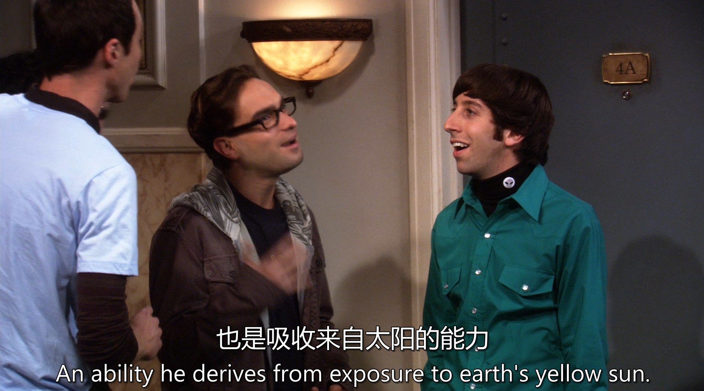

在DC漫画宇宙的设定中，超人来自氪星（Krypton），那里的太阳是红色的，而地球的黄色太阳会激发他体内的细胞，使他获得超人的能力，比如飞行、超级力量、激光眼等。

所以yellow sun并不是英语里的搭配，而是DC宇宙的设定

---

Yeah, and you don’t have a problem with that, how does he fly at night?

and you don’t have a problem with that
——“你对这都没意见啊？”
👉 含有质疑语气，暗示“这听起来就很不合理，你居然还能接受？”

“哈？你居然觉得这没问题？那他晚上是怎么飞的？”

---

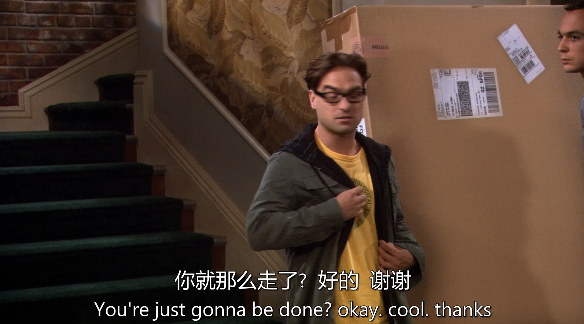

"so you're just gonna be done?"
you're just gonna be done?

直译有点难懂，但其实这句话是带有一点讽刺或质疑的语气。

be done 这里意思是“你就打算不做了？”、“你就放弃了？”

相当于在说：

“所以你就打算不管了？”
“所以你就不愿意上楼了？”

🔹 这句话通常是在面对对方半途而废、不愿意吃苦时说的。

"Okay, cool, thanks."
Okay = 好吧

cool = 好的，行（语气可能带点冷淡）

thanks = 谢谢

➡️ 这三词连在一起，说话人通常带点 讽刺 或 不太高兴 的语气，比如：

“哦，好啊，知道了，谢谢你啊～”

---

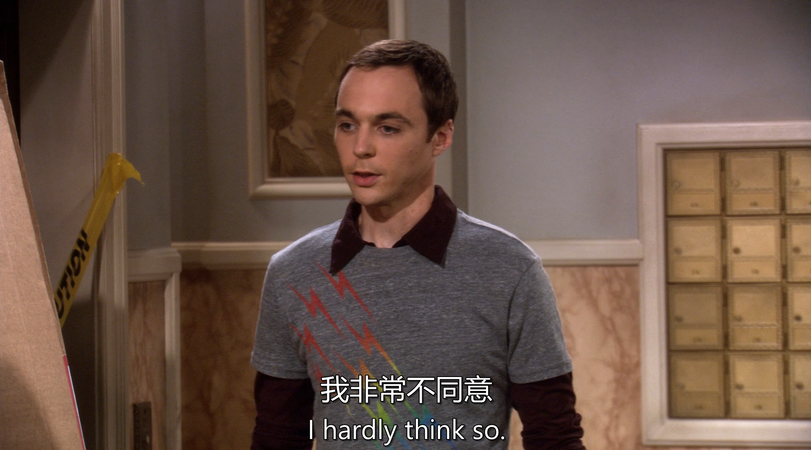
"I hardly think so."
hardly = 几乎不，根本不

think so = 认为是那样

🔹 整句意思：

“我才不这么认为。”
“我一点也不觉得行。”

---

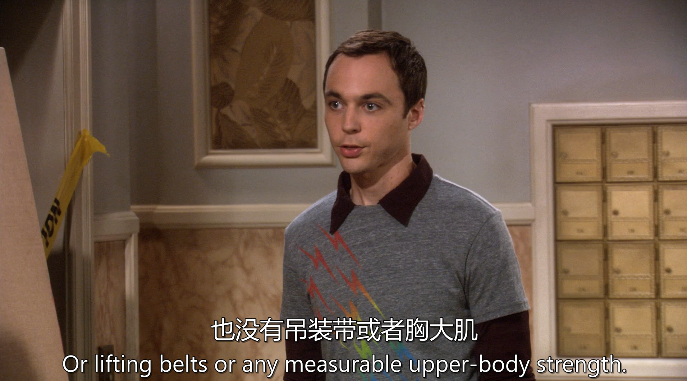

a dolly
👉 指搬运大件物品用的小推车，通常是带轮子的平板车，搬冰箱、沙发常用。
🔹 中文：小推车 / 搬运车

lifting belts
👉 举重时用的保护腰部的“腰带”，搬重物时也可用，保护不扭伤。
🔹 中文：举重带 / 搬运腰带

any measurable upper-body strength
👉 “任何可以测得的上半身力量”
🔹 即夸张地说“我们完全没力气”
🔸 measurable（可测量的）+ upper-body strength（上半身力量）= 一本正经地搞笑！

---

"I don't have this."（我做不到/我不行）

---

do you have any ideas
yes but they all involve a green lantern and a power ring

Green Lantern（绿灯侠） 是 DC 漫画中的超级英雄。

他靠一枚**能量戒指（power ring）**施展各种超能力，这枚戒指可以根据佩戴者的意志力和想象力创造出任何东西（武器、工具、飞船、护盾等）。

这枚戒指几乎可以解决所有问题——但它是虚构的。

再举一个例子

"Sure, there's a way — as long as I have Doraemon's magic pocket."
daw·ray·maan哆啦A梦

---

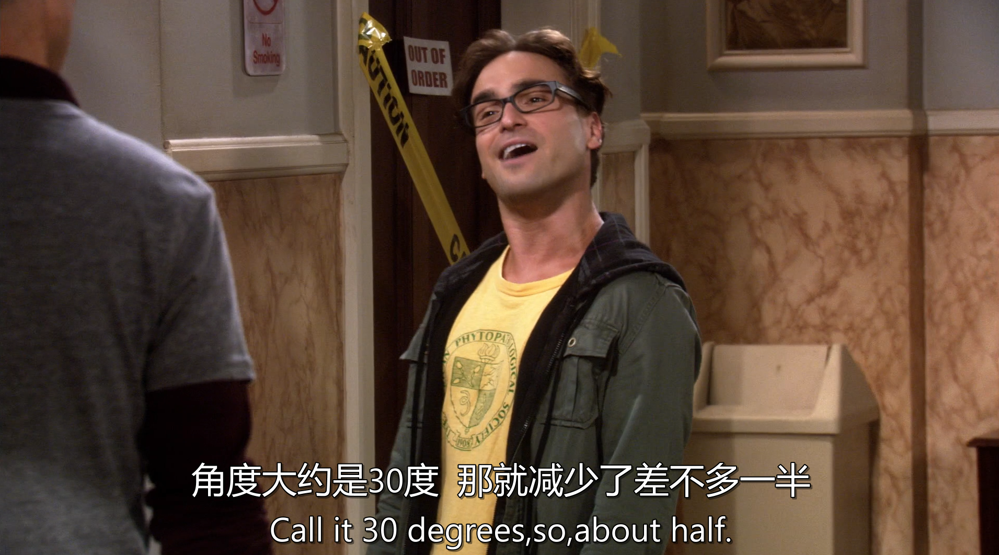

"Call it 30 degrees, so about half."

✅ “Call it...” 的意思是：
在口语中，“Call it”的意思是：

“就算作是...” / “我们就当它是...” / “姑且认为...”

它并不是真要“打电话”，而是一种非正式估算或简化的说法。

类似例子：
Call it 5 bucks.
→ “就算5块钱吧。”（即使不确定，也先按这个来估算）

Call it even.
→ “咱们就算扯平了。”

Let’s call it a day.
→ “今天就到这儿吧。”（常用于工作结束）

---

Ah：表示感叹，“啊”。

gravity：重力，引力。

thou art：文言式英语，“你是”（现代英语是 you are）。

a heartless bitch：直译是“一个无情的贱人”，用来形容某事令人讨厌、麻烦。

"thou art" 是仿照莎士比亚式英语，营造一种戏剧效果。Sheldon 说话常常引经据典，带有一点“戏精”气质。

---

you do understand that our efforts here will in no way increase the odds of you having sexual congress with this woman

正式用语"sexual congress"（性交的文雅说法）

---

you do understand that our efforts here will in no way increase the odds of you having sexual congress with this woman
Men do things for woman without expecting sex,Those would be men who just had sex
i'm doing this to be a good neighbor
in any case, there's no way it could lower the odds
反正，这总不会让机会变得更低吧。

---

"Great Caesar's ghost" 的起源与含义

这是一个古老的美式感叹语，源自19世纪，可能受莎士比亚戏剧（如《尤利乌斯·凯撒》）影响。

字面意思是“伟大的凯撒的鬼魂啊！”，类似中文的“老天爷！”“我的天！”

在20世纪中期后逐渐过时，但仍在怀旧或戏剧化语境中使用，比如《超人》漫画中佩里·怀特（Perry White）常喊这句话。

---
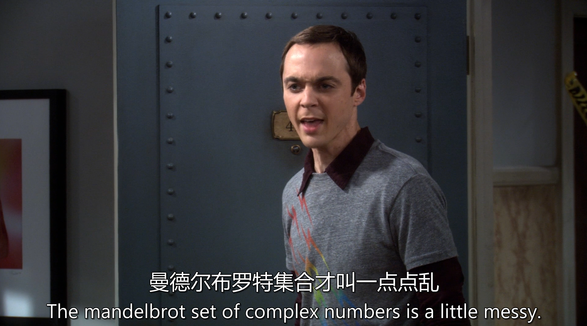

https://baike.baidu.com/item/%E6%9B%BC%E5%BE%B7%E5%8B%83%E7%BD%97%E9%9B%86/4888291

---

"Hard as it may be for you to believe" 这句话的意思是“尽管你可能很难相信”

---

"What are you doing? I'm straightening up."
翻译： “你在干嘛呢？” “我在收拾东西。”

文化背景解析
"Straightening up" 的日常含义

直译是“弄直”，但在口语中常表示：

整理房间（比如把乱放的东西归位）

快速清洁（临时有客人来访时的紧急收拾）

让自己看起来体面（整理衣服、头发等）

---

“Run cable” 的技术含义

Run 在这里指“铺设/安装线路”（如网线、电源线），是IT/工程领域的常见术语。

中文类似表达：“布线”（专业）或“拉线”（口语）。

Web cam 的语境

可能是为了视频会议、直播、安防监控等用途，反映现代远程办公或智能家居的需求。

中文习惯说“网络摄像头”，但年轻人也可能直接说“摄像头”（默认是联网的）。

---

“Get out of your hair” 的起源与含义

字面意思是“从你的头发里出来”，实际源自20世纪中期口语，比喻“不再纠缠某人”或“结束打扰”。

类似中文的“不碍你事了”或“不烦你了”，带有轻松、非正式的语气。

使用场景

朋友/同事间：当对方明显忙碌或想结束对话时，用这句话礼貌退出。

例：

A: “我还有个会要开…”

B: “OK, we’ll get out of your hair!” （“好，你先忙！”）

服务行业：工作人员完成服务后可能说这句话，表示“不继续占用您时间”。

---
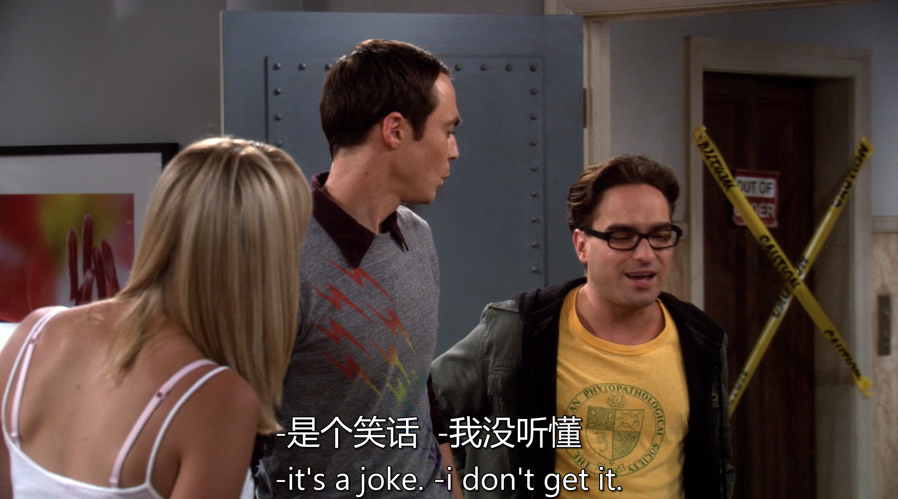

A: “Why did the scarecrow win an award?” （稻草人为什么得奖？）

B: “I don’t know…”

A: “Because he was outstanding in his field!”（谐音梗：田地里站着的/杰出的）

B: “…It’s a joke? I don’t get it.” （“这…算笑话？我没懂。”）

---
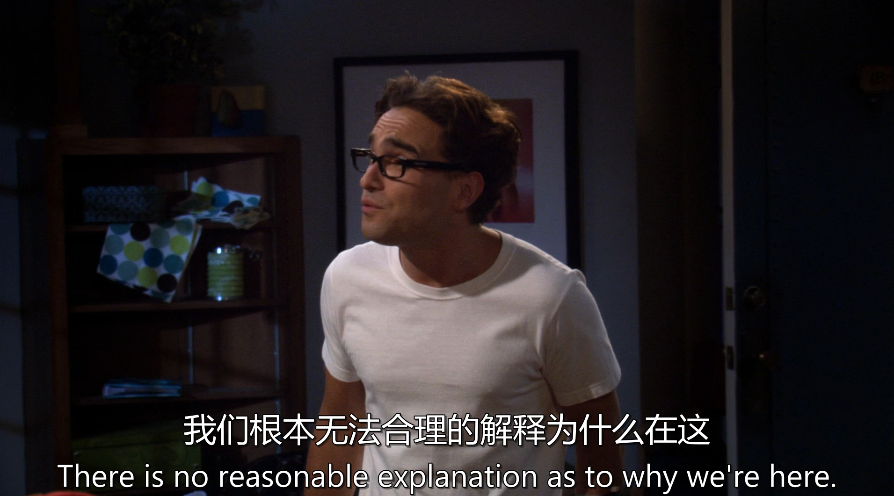

表示 "关于" (about, regarding)

用于正式语境，引出讨论的主题或对象。

例句：

There is no agreement as to the best method.
（关于最佳方法，目前没有共识。）

He was uncertain as to which path to take.
（他对该选哪条路犹豫不决。）

表示 "至于" (concerning, when it comes to)

强调话题的转向或对比。

例句：

The data is clear; as to the interpretation, opinions vary.
（数据很明确，至于如何解读，众说纷纭。）

表示 "根据" (according to)

较少见，多用于法律或正式文本。

例句：

The items are sorted as to size.
（物品按尺寸分类。）

---
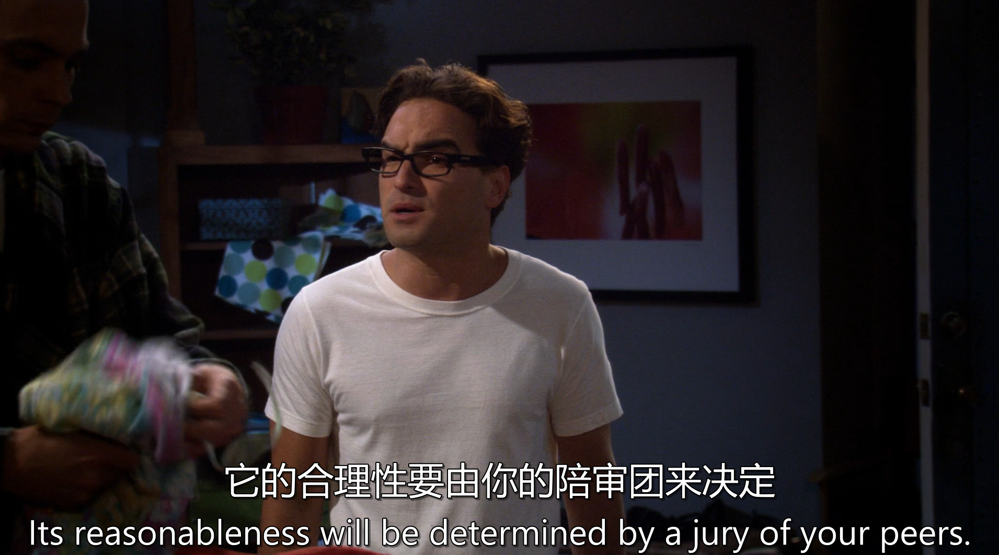

"Jury of your peers" 的法律含义

这是英美法系的核心概念，指由与被告社会地位相似的普通公民组成的陪审团（而非法官或精英群体）。

源自《大宪章》"trial by one's peers"（同辈审判），体现司法公正性。

中文无直接对应术语，需意译，如“平民陪审团”或“与你同等身份的陪审员”。

"Reasonableness" 的司法语境

法律中常评估某行为是否属于"a reasonable person"（理性人）的标准。

例如：自卫是否合理（reasonable self-defense）、合同条款是否公平等。

典型使用场景

刑事审判：

法官对被告说："Whether your actions were justified will be decided by a jury of your peers."
（“你的行为是否正当，将由陪审团裁决。”）

讽刺用法：

同事争论时开玩笑："Fine, let’s take a vote—a jury of your peers!"
（“行啊，咱们投票表决——让你的‘陪审团’来评理！”）

---

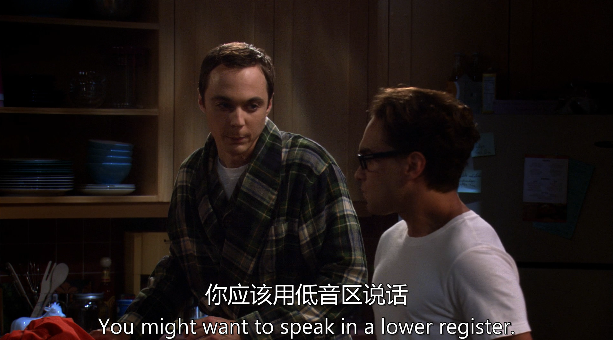

"might want to" 通常翻译为 "最好……"、"建议……" 或 "或许该……"，表示一种委婉的建议或提醒，带有“这样做更明智/更安全”的隐含意义。

"Lower register" 的具体含义

音乐/声学术语：指“较低的声区”（如男低音 vs 女高音）。

日常引申义：

音量：降低声音响度（避免打扰他人）。

音调：避免尖锐/激动的语调（显得更沉稳）。

修辞层级：使用更简单/朴实的词汇（避免高高在上）。

使用场景与潜台词

礼貌提醒：

对方声音太大时（图书馆、会议室）：
"Could you speak in a lower register? The acoustics here carry."
（“能小声些吗？这里回声很大。”）

社交暗示：

对方因激动而语调尖锐时，委婉建议冷静：
"A lower register might help your argument."
（“语气平和点，更容易说服人。”）

---

"Granted" 的让步语气

承认某个事实（通常是不完美的部分），再转折强调积极面。

类似中文的“虽说/固然……但……”结构。

"Not long, but deeply and well" 的潜台词

常用于描述短暂但高质量的关系或经历，比如：

一段恋情

一次合作

人生某个阶段

隐含价值观：质量重于时长（西方文化中常见对“深度体验”的推崇）。

描述恋情

"We were together for only a month—granted, not long, but just deeply and well."
（“我们只在一起一个月——诚然短暂，但却深刻而美好。”）

评价项目经验

"The internship was short—granted, not long, but I learned deeply and well."
（“实习期很短，但学到的东西却扎实有用。”）

生活感悟

"Life in that town? Granted, not long, but deeply and well lived."
“在那小镇的日子？虽不久驻，却活得真切。”）

---

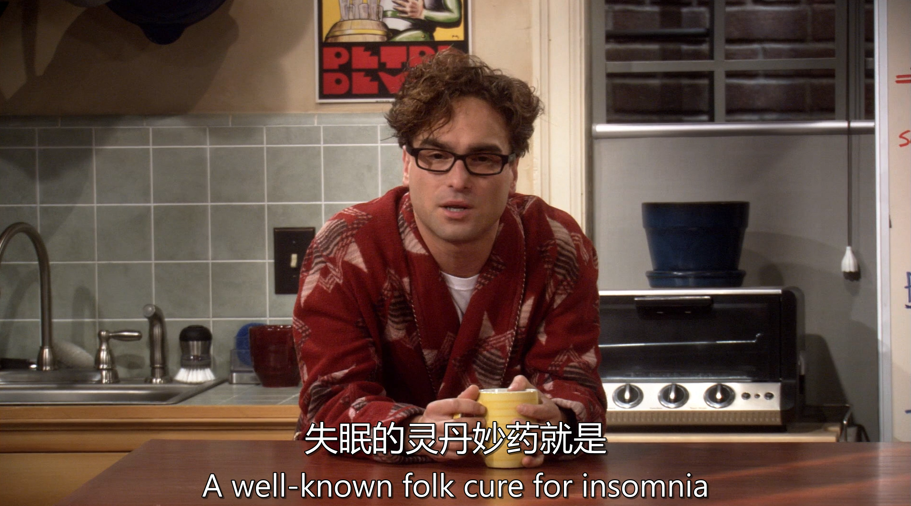

"Folk cure" 的深层含义

指代代相传的非正规疗法，通常包含：

传统草药（如薰衣草、洋甘菊）

行为仪式（如数羊、睡前喝热牛奶）

玄学操作（如枕头下放水晶）

中文对应概念：“土方子”（带亲民感）或“偏方”（中性学术词）。

---

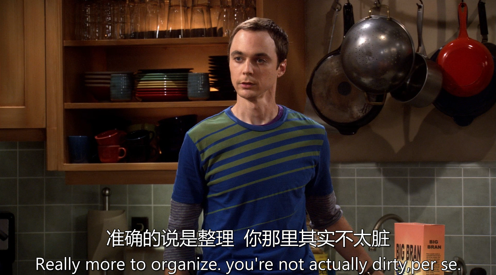

"per se" 通常译为 "本身"、"本质上" 或 "就其本身而言"，强调事物独立于其他因素的固有属性。

拉丁语源

直译为 "by itself"（靠自身），用于排除外部干扰因素的分析。

正式语境

学术/法律文本中精确界定概念：

The law is not unjust per se, but its application may be.
（法律本身并非不公，但执行可能不公。）

中文对应："从本质上说" / "严格来讲"

日常使用

纠正过度解读时：

I don't hate the movie per se, just its pacing.
（我不讨厌电影本身，只是节奏有问题。）

中文类似："倒不是说……而是……"

---

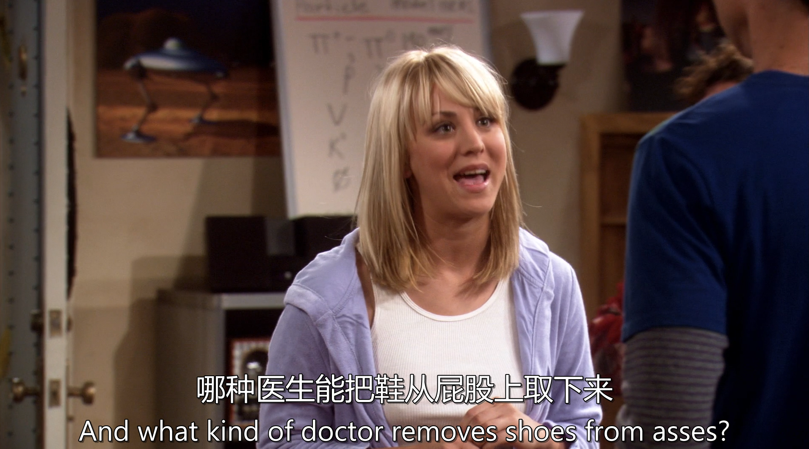
“那得是哪种医生才负责把鞋子从别人屁股里拿出来？”

这是一种夸张的幽默表达方式，通常用来讽刺对方说话太荒唐、做法太过分，或者拿某种“医生”这个身份开玩笑，暗示对方不懂专业，还胡乱干预别人的事。

---

Boy, you are all over the place this morning."
翻译： “老兄，你今天早上真是东一榔头西一棒槌啊！”

---

"Color your opinion" 的隐喻

源自绘画中“色彩影响整体画面”的概念，指某件事会潜移默化地改变判断。

中文类似表达：

“带上有色眼镜”（预设立场）

“留下污点”（特指负面印象）

使用场景

替人解释时：

"He was stressed that day—I hope it won’t color your opinion of him."
（“他那天压力大，希望你别因此否定他。”）

提前预防偏见：

"This rumor is false, so don’t let it color your view."
（“谣言别当真，别让它影响你。”）

---

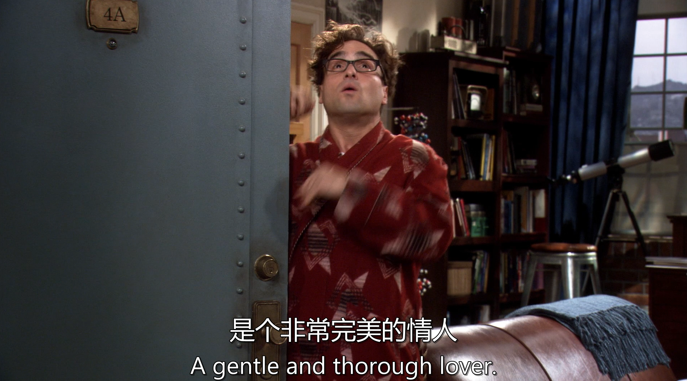

"Gentle" 的双重含义

行为层面：动作轻柔，避免粗暴（physical tenderness）

情感层面：尊重对方感受（emotional attentiveness）

"Thorough" 的特殊暗示

并非字面“彻底”，而是强调：

细致入微的观察力（察觉伴侣未言明的需求）

全方位的投入（前戏-过程-后戏的完整关怀）

中文对应词：“周全”/“细腻入微”

---

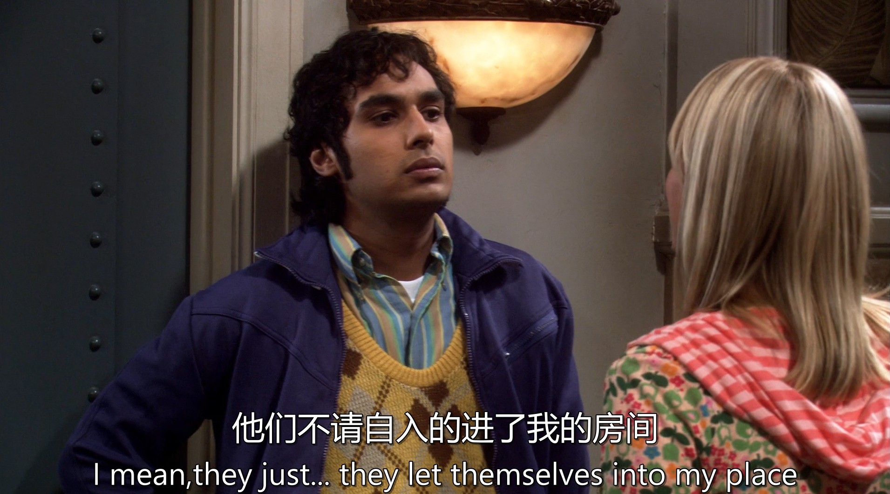

"Let themselves in" 的潜台词

表面意思是“自己进来”，但隐含 “未经允许擅自进入”，可能是：

用钥匙/密码（有权限但滥用，比如室友带人进来）

撬锁/破门（非法闯入，更严重）

中文类似表达：“不请自来” / “擅闯”

"My place" 的语境

非正式说法，指 “我家” 或 “我住处”（公寓、房间等）。

和 "my house" 的区别：

"My place" → 泛指住所（租房、自己家都行）

"My house" → 特指自己拥有的房子

可能的场景

朋友越界：

"I gave him a key for emergencies, but he just let himself in!"
（“我给他钥匙是应急用的，结果他随便进出！”）

---

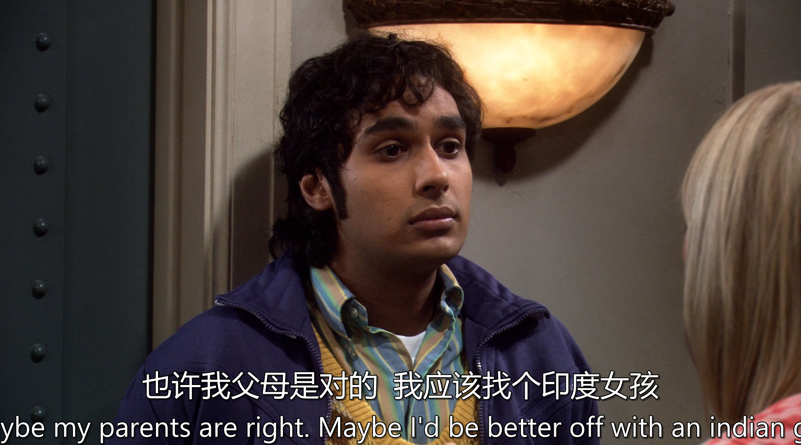

"Better off" 的隐含对比

暗示 “比现状/其他选择更有利”，可能涉及：

文化兼容性（如家庭观念相似）

个人偏好（如欣赏某种性格特质）

现实考量（如语言/生活习惯更契合）

---

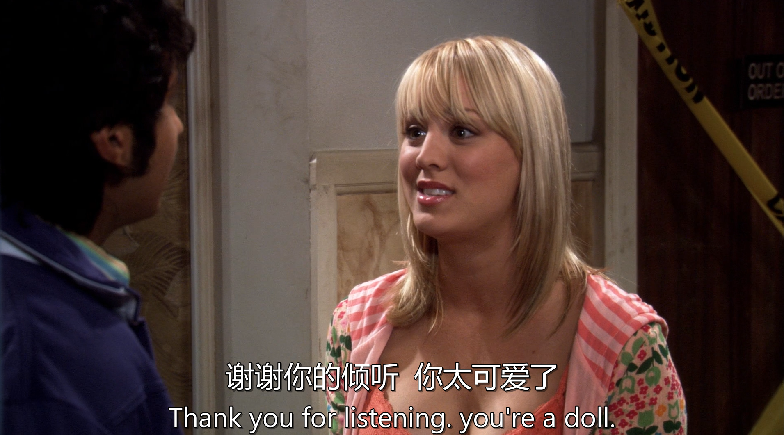

"Doll" 的比喻含义

本义是“洋娃娃”，在口语中喻指：

甜美可爱的人（尤其夸女性/小孩）

贴心周到的人（如主动帮忙时被夸）

类似中文用“甜心”“宝贝”表达亲昵

使用场景

夸赞外表：
"That dress suits you! You’re such a doll."
（“这裙子真配你！美得像洋娃娃。”）

感谢帮助：
"You brought me coffee? You’re a doll!"
（“你还给我带咖啡？太贴心了！”）

---

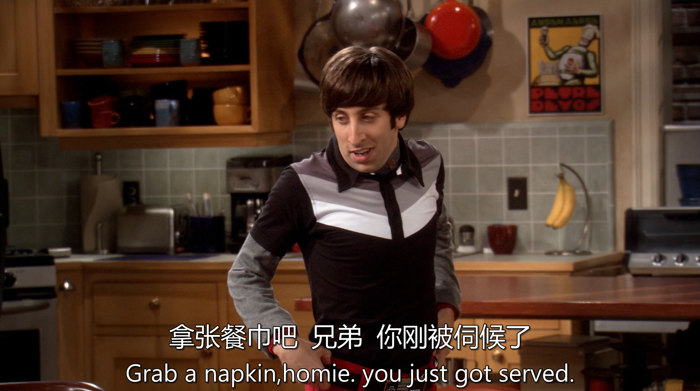

"You just got served" 的起源

源自80年代黑人街头文化，最初在篮球斗牛（1v1）中使用，意为“你被彻底击败/羞辱了”。

后因2004年电影《You Got Served》（街舞狂潮）普及，延伸至舞蹈Battle、说唱对决等场景。

"Grab a napkin" 的隐喻

字面是“拿纸巾”，实际暗示：

擦汗（因被碾压而狼狈）

擦血（像拳击赛中被打倒后处理伤口）

类似中文梗：“快拿冰袋敷敷脸，都被打肿了！”

"Homie" 的语境

黑人俚语中对好友的称呼（=兄弟/老铁），用在这里削弱攻击性，增加戏谑感。

---

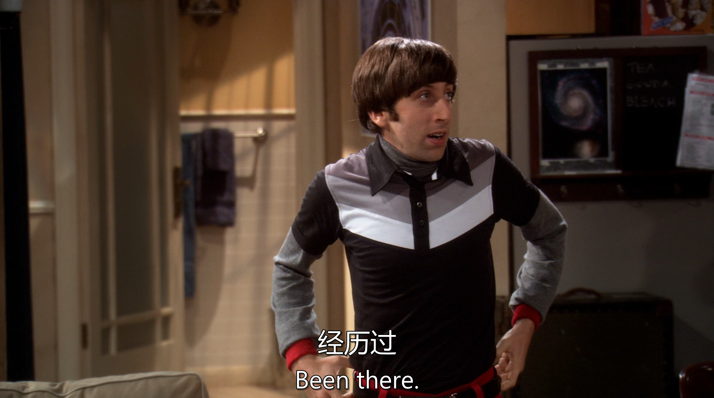

"Been there" 的潜台词

表面意思是“去过那里”，实际表达：

感同身受（对他人遭遇表示理解）

见怪不怪（对某种情况习以为常）

常接下半句：

"Been there, done that."（“早经历过了，没啥新鲜。”）

"Been there, got the T-shirt."（幽默版，暗指“经验丰富到能出纪念T恤”）

使用场景

安慰他人：

A: "I failed my driver's test twice..."

B: "Been there. You'll get it next time!"
（“考驾照挂两次？我也一样！下次必过。”）

调侃自己：

"All-nighters in college? Been there, survived on ramen."
（“大学通宵？过来人了，靠泡面续命的。”）

---

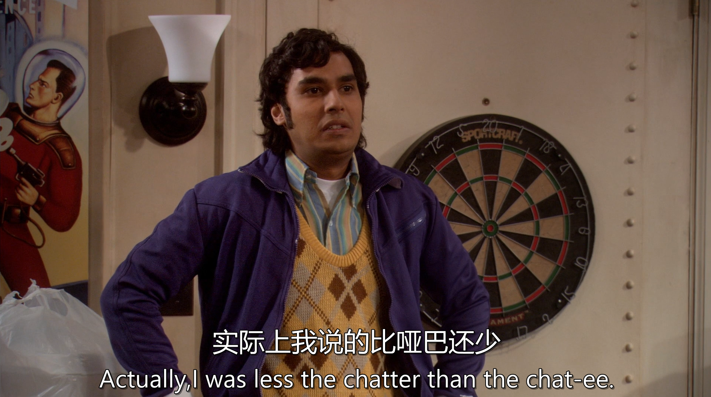

其实，与其说我是闲聊者，不如说是被闲聊的对象

"less...than..." 在这里表示 “与其说是……不如说是……”，强调两者对比中更符合后者的特质。

否定前者，肯定后者

结构：less A than B = “不是A，而是B” / “A的成分少，B的成分多”

例句：

He's less a teacher than a performer.
（他与其说是老师，不如说是表演者。）

It was less a debate than a shouting match.
（那根本不是辩论，纯属吵架。）

"Chatter" vs. "Chatee" 的文字游戏

Chatter：主动闲聊的人（类似“话痨”）

Chatee：生造词，仿照 employee（雇员）/interviewee（受访者） 的构词法，指“被闲聊的对象”

幽默效果来自：

用正式后缀 -ee 搭配不正式的词根 chat（形成反差萌）

暗示自己被动卷入八卦（类似中文“吃瓜吃到自己头上”）

使用场景

澄清误会时：

A: "You love gossiping!"

B: "Actually, I was less the chatter than the chatee."
（“冤枉啊，我才是被八卦的那个！”）

自嘲被讨论：

"In high school? Oh, I wasn’t popular—just the chatee in locker room talk."
（“高中时我可不受欢迎，只是更衣室话题的素材库。”）

---

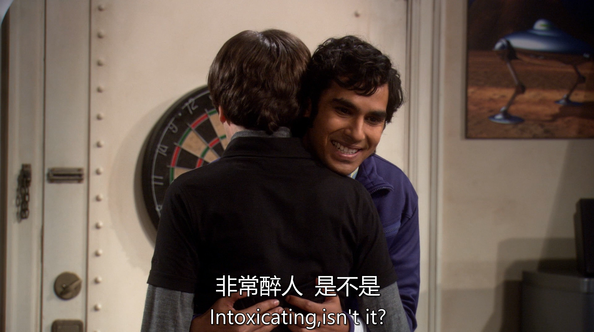

词源与双重含义

源自拉丁语 toxicum（毒药），原指酒精或毒物的致醉效果，后引申为：

生理陶醉（如酒饮、香气）

精神沉迷（如爱情、音乐）

中文对应“醉人”一词同样兼具酒精与隐喻用法（如“醉人的夜色”）。

使用场景

感官描述：
"The intoxicating scent of jasmine filled the room."
（“茉莉花香弥漫房间，令人沉醉。”）

情感表达：
"Her laugh was intoxicating."
（“她的笑声让人心荡神驰。”）

危险警示：
"Power can be intoxicating."
（“权力令人迷失。”）

---

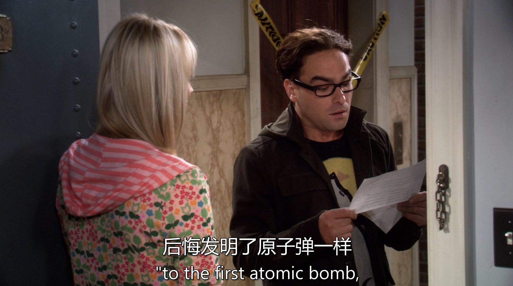

A Bomb（Atomic Bomb，原子弹）	H Bomb（Hydrogen Bomb，氢弹）

---

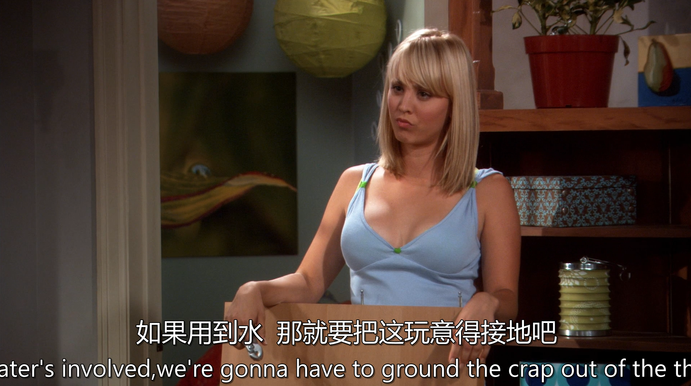

原文： "If water's involved, we're gonna have to ground the crap out of the thing."
翻译： “如果沾水了，我们就得把这玩意儿往死里接地！”
（或更口语化：“但凡跟水有关，这东西不接地线接出火星子不算完！”）

文化背景解析
"Ground the crap out of" 的暴力美学

Ground（接地）：电工术语，指用导线将设备与大地连接以防触电。

The crap out of：美式俚语，表“极端程度”（类似中文“往死里……”）。

组合效果：用粗俗表达强调安全措施的紧迫性。

"Water's involved" 的潜台词

水是电的良导体，涉及水的电器故障可能引发：

短路（short circuit）

漏电（electric leakage）

中文类似预警：“一沾水，必作妖”。

典型使用场景

家电维修：

A: "The hairdryer fell in the sink!"

B: "If water's involved, we're gonna have to ground the crap out of it before testing."
（“吹风机掉水池了？想试机先往死里接地线！”）

工业安全：

"With this flooded server room, we’ll be grounding the crap out of everything."
（“机房淹成这样，所有设备都得加接地到冒烟。”）

---

