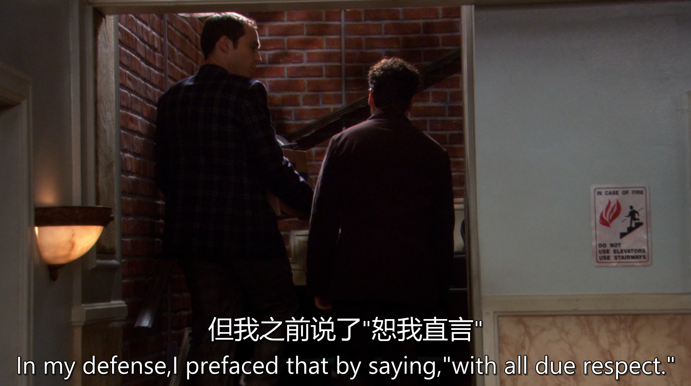

[台词](./s01e04.pdf)

[手打台词](./04.txt)

# 生词

roadblock 路障

suffice 足够

sabbatical

scrambled eggs

# 句子

"Put it on the back burner."
翻译： “先搁置一边” / “暂时缓缓”
（或更口语化：“放一放，不急。” / “先扔冰箱里，等会儿再炒。”）

文化背景解析
字面来源

源自厨房灶具：前灶（front burner）火力猛（优先处理），后灶（back burner）小火慢炖（次要任务）。

使用场景

情境	英文	中文地道说法
项目管理	"Let’s put the redesign on the back burner."	“界面改版先放一放。”
家庭决策	"Mom, can we back-burner the piano lessons?"	“妈，钢琴课能缓缓吗？”
拖延战术	*"He ‘back-burnered’ my request for 6 months."*	“他把我需求晾了半年！”

---

Each one dumbed down to accommodate the duration of an average bowel movement."
翻译： “每条内容都简化到适合普通人上厕所的时间读完。”
（或更直白：“每条信息都降智到拉泡屎的功夫就能看懂。”）

文化背景解析
"Dumbed down"（降智化）

指刻意简化内容，甚至牺牲准确性以适应低认知水平。

中文类似：“注水” / “快餐化” / “接地气接到地府”。

"Duration of a bowel movement"（排便时长）

西方研究显示平均时长：3-10分钟（手机刷屏黄金时间）。

中文幽默表达：“蹲坑时长” / “带薪如厕标准时”。

讽刺对象

短视频平台（TikTok/抖音）的“15秒知识胶囊”。

厕所读物（如《男人装》杂志碎片化排版）。

---

"With all due respect..."
翻译： “恕我直言……” / “无意冒犯，但……”
（或更犀利：“不是我说你……” / “给脸了，我还是要说……”）

文化背景解析
表面礼貌，实则开炮

字面意思是“给予应有的尊重”，实际用于铺垫尖锐批评。

类似中文的“有句话不知当讲不当讲”（然后必讲难听话）。

使用场景

情境	英文	中文地道说法
职场怼领导	"With all due respect, this plan is garbage."	“领导，这方案真不行。”
家庭辩论	"Mom, with all due respect, your tofu could break teeth."	“妈，您这豆腐能练牙口。”
政客互撕	"With all due respect, the senator is lying."	“议员先生，您这是睁眼说瞎话。”

---

"Vis-à-vis"（关于）

法语借词，学术装X专用，类似中文“就……而言”。

日常对话用 "regarding" 更自然，此处显刻意较真。

---

"Decades"（几十年）的冲击力

西方常用夸张表达（可能实际仅5-10年），突出“苦熬已久”的辛酸。

中文类似：“半辈子没休息” / “熬到地老天荒”。

"Savor"（品味）的深层含义

不止是“享受”，更强调珍惜转瞬即逝的放松。

中文对应：“细品”（如“终于能细品一杯咖啡了”）。

---

She says that free-range chickens taste much better than factory-farmed ones
走地鸡

---

如果你听说某人在公司被解雇了,你可以说:“He got canned.” 或者 “He got laid off.

---

"Oh, I’m sorry, did I insult you? Is your body mass somehow tied into your self-worth?"

翻译：
“哦抱歉，我冒犯到你了？难道你的自我价值还和体重挂钩了？”

---

“an impossibility that nature will quickly resolve into death, mutilation”：
“an impossibility” 是对前面 “we’ll be occupying the same space as that Buick in front of us” 这种情况的评价，即认为这种情况是 “不可能的事” 。
“that nature will quickly resolve into death, mutilation” 是一个定语从句，修饰先行词 “an impossibility” 。
在这个定语从句中，“resolve into” 是一个短语，意思是 “分解为；转化为” ，这里 “nature will quickly resolve into death, mutilation” 表示 “大自然会迅速地将这种（不可能的情况）转化为死亡和伤残” ，“nature” 在这里可以理解为自然规律、客观情况等。
整句话大致意思是：我们将会和我们前面的那辆别克车处于相同的空间位置，而这是一种不可能的情况，自然规律会迅速地将这种情况演变成死亡和伤残（即这种危险的情况必然会以死亡和伤残告终）。

---

“Mum’s the word” 是一个源自英语文化的习语。“mum” 在这里用作拟声词，模仿嘴巴闭紧不发出声音的状态，就像把嘴巴闭上不说话的样子。这个表达通常用于强调要保守秘密，不要把某件事情说出去。在英语文化中，人们在很多场合下会使用这样的习语来提醒他人不要泄密，比如在讨论一些不想让其他人知道的计划、惊喜活动等情境中。例如，当准备给某人一个生日惊喜派对时，组织者可能会对参与筹备的人说 “Mum’s the word about the party. We don't want them to know.”（关于这个派对要保密哦，我们不想让他们知道。 ）

---

“grown man” 是名词短语，“grown” 是形容词，意为 “成年的、成熟的”，修饰名词 “man”，表示 “成年男子”。
“capable of” 是一个固定短语，意为 “能够…… 的、有…… 能力的”，后面接名词或动名词形式，这里 “capable of living my life” 作后置定语，修饰 “a grown man”，说明这个人有能力按照自己的方式生活。
“as I see fit” 是一个方式状语从句，“as” 是引导词，意为 “按照、如同”，“I see fit” 表示 “我认为合适”，整个从句表示 “按照我认为合适的方式”，用来修饰 “living my life”，说明生活的方式。

---

关于 “smouldering good looks” 的描述，“smouldering” 本意是 “闷燃、阴燃”，在这里用来形容外貌时，传达出一种充满魅力、性感且内敛的吸引力。在西方的审美和语言习惯中，用这样富有表现力的词汇来夸赞他人的外貌是比较常见的，尤其是在表达对某人独特魅力的欣赏时。比如在一些影视作品、社交场合中，人们会用类似的词汇来赞美有吸引力的人。

---

对于 “had a fit” 的描述，“fit” 在这里通常指 “痉挛、抽搐” 或 “突发的一阵（如疾病发作等情况）”。在西方社会的日常生活和医疗场景中，人们会用这样的词汇来描述身体上的突发异常状况。比如在一些关于健康问题的交流、紧急情况处理等情境下，会出现这样的表达。而且，当描述一个人身体出现这种状况时，说 “the poor boy”（这个可怜的男孩）也反映出一种对遭遇这种状况的人的同情和关切的态度，这也是西方文化中常见的情感表达。

---

“It pissed our dog off” 部分：
“It” 在这里作主语，通常指代前文提到的某件事情（由于没有前文具体语境，这里 “It” 所指内容不明确）。
“pissed” 是谓语动词，是 “piss” 的过去式，“piss off” 是一个动词短语，“our dog” 是 “piss off” 的宾语。“off” 在这里是副词，与 “piss” 构成短语动词，“piss sb. off” 表示 “使某人恼怒”。
“to no end” 部分：
“to no end” 是一个介词短语，作程度状语，修饰 “pissed our dog off” 这个动作，说明使狗生气的程度达到了极点。整个句子的结构是 “主语 + 谓语动词短语 + 宾语 + 程度状语” 

---

“pluck a nerve” 这一表达源于英语文化中对身体和情感关系的一种形象比喻。在西方文化里，人们常用身体的某些部位或生理现象来比喻情感或心理上的反应。“nerve” 本意是 “神经”，当身体的神经被触碰或刺激时会有强烈的反应，在这里 “pluck a nerve” 就形象地表示触动了某人敏感的情感或引发了某人强烈的情绪反应，比如生气、伤心、尴尬等。这种表达常用于人际交往中，当一个人不确定自己的话或行为是否引起了对方的强烈情绪波动时，就会说这样的话。例如，在争论或讨论中，一方可能会觉得自己的话可能触碰到了对方的痛处，从而询问 “Did I pluck a nerve there?”。
从语言使用场景来看，这种表达在日常对话、影视剧情、小说等情境中都比较常见，尤其在刻画人物之间微妙的互动和情感冲突时经常出现，帮助展现人物关系和情绪变化。

---

“get back on his rocker”：“get back on one's rocker” 是一个比较形象的习语表达。“rocker” 有 “摇椅” 的意思，从字面理解，“get back on one's rocker” 表示回到摇椅上，实际引申为 “恢复正常状态、恢复平静、恢复以往的活力或理智”。在英语文化中，当人们形容某人经历了一段混乱、困扰或失去常态的时期后，希望其能重新回到正常状态时，就会使用这样的表达。比如在某人经历了疾病、挫折或情绪波动后，朋友或家人可能会希望他能 “get back on his rocker”。

---

“snap out of it” 是一个非常口语化且常用的英语表达。在英语文化的日常生活中，当一个人看到另一个人处于消极的情绪状态（如悲伤、沮丧、愤怒、迷茫、沉浸在某种幻想或不良习惯中）时，就会用这个短语来鼓励对方快速摆脱这种状态，恢复到正常或积极的状态。例如，朋友因为失恋而一直萎靡不振，其他人可能会说 “Come on, snap out of it! There are better things waiting for you.”（得了，振作起来吧！还有更好的事情等着你呢。）这种表达体现了英语文化中注重积极向上、鼓励人们快速克服困难和不良情绪的态度。

---

You know how 
your daddy used to say that 
you can only fish for so long 
before you got to throw a 
stick of dynamite in the water?

“that you can only fish for so long before you got to throw a stick of dynamite in the water” 这部分是 “say” 的宾语从句。“that” 是引导词，在从句中不充当成分。“for so long” 中的 “for” 表示一段时间，“so long” 表示 “这么长时间”，作时间状语修饰 “fish”。“before you got to throw a stick of dynamite in the water” 是一个时间状语从句，“before” 是引导词，“got to” 在这里相当于 “have to”（过去式），表示 “不得不、必须”，“a stick of” 是固定短语，表示 “一根”，修饰 “dynamite” 。

---

