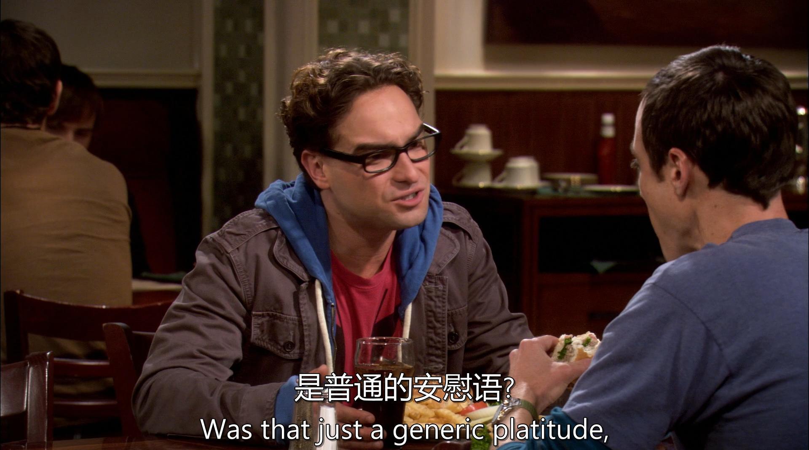
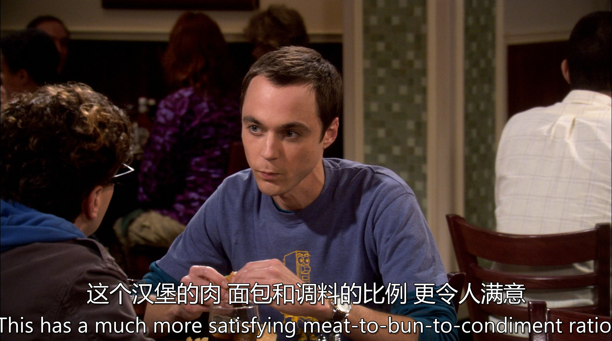

[台词](./s01e05.pdf)

[手打台词](./05.txt)

# 生词

battalion 营
division 师
infantry 步兵

Cavalry 骑兵

cellist 大提琴手
quartet 四重奏

# 句子

我们从侧翼包抄田纳西大学志愿者队（这里 “Tennessee Volunteers” 常指美国田纳西大学的体育代表队，特别是橄榄球队等），北方军队又一次赢得了葛底斯堡战役的胜利。
从句子本身来看，“flank” 在这里作动词，表示 “从侧翼包抄、侧翼攻击” ；“the Tennessee Volunteers” 田纳西大学志愿者队，是一个特定的团体名称；“the North” 指的是美国南北战争时期的北方军队；“the Battle of Gettysburg” 是美国南北战争中非常著名的葛底斯堡战役，这场战役是南北战争的转折点之一。

---

“When the smoke clears, Abraham Lincoln will be speaking Hindi and drinking mint juleps.” ：“当硝烟散去（“When the smoke clears” 字面意思是当烟雾消散，这里可理解为当混乱或某种情境结束后），亚伯拉罕・林肯（Abraham Lincoln，美国第 16 任总统，领导了美国南北战争）将会说着印地语（Hindi，印度的主要语言之一）并且喝着薄荷朱利普酒（mint juleps，一种传统的美国南方鸡尾酒）。” 这里将历史上的林肯与印度语言以及美国南方特色饮品联系起来，这种组合非常不寻常，带有一种荒诞、戏谑或超现实的意味，可能是在以一种夸张、幽默或讽刺的方式表达一种文化的错乱、混合或对某种不合理现象的调侃

---

这句话故意制造性暗示+反转：

前半句 “come for the breasts”
指的是吸引注意的“外在”或“性感”的东西（比如穿着性感的女性），属于一种典型的“引人注目”的噱头。

后半句 “stay for the brains”
指的是真正留下来，是因为对方聪明、智慧、有深度，强调内在价值。

---

“Leonard”这个名字，在美国青少年文化中，有点书呆子、老派、宅的感觉；

“Advanced Placement classes（AP班）”是为成绩特别优秀的学生开设的课程，通常被视为“学霸”才上的；

“wasn’t getting me beaten up enough” 是讽刺地说，这些“书呆子”标签已经够让人被欺负了，爸妈还不满足，仿佛故意让他更容易被霸凌。

---

“Boy” 在这里是一种称呼语，用来引起对方的注意，并非指真正意义上的小男孩，在口语中常用于加强语气或表达一种亲昵、调侃的态度。
“you’re wound awfully tight” 是主系表结构，“you’re” 是 “you are” 的缩写，“wound” 在这里是形容词 “wound up”（紧张的、焦虑不安的）的一种简略形式，“awfully” 是副词，意为 “非常、极其”，用来修饰形容词 “tight”（紧张的），表示程度很深。
“for a man who just had sexual intercourse” 是一个介词短语作状语，“for” 表示 “对于”，“a man” 是介词 “for” 的宾语，“who just had sexual intercourse” 是一个定语从句，修饰先行词 “a man”，“who” 是关系代词，在从句中作主语，“just” 是副词表示 “刚刚”，“had sexual intercourse” 是谓语动词短语，意为 “发生了性行为”。

---

penny的这个笑谁懂啊！！！

句子结构：这是一个主系表结构的陈述句。“This” 是句子的主语，指代所谈论的某个事物（很可能是一种食物，比如汉堡之类的带面包的食物）；“has” 是谓语动词，意为 “有”；“a much more satisfying meat to bun to condiment ratio” 是宾语部分。
词汇及短语：
“much more” 是比较级的修饰语，“much” 用来加强 “more” 的程度，“satisfying” 是形容词，意为 “令人满意的”，用来修饰 “ratio”。
“meat to bun to condiment ratio” 是一个名词短语，“meat”（肉）、“bun”（小圆面包）、“condiment”（调味品）通过 “to” 连接，表明这三者之间的比例关系，即肉、面包和调味品之间的比例。

