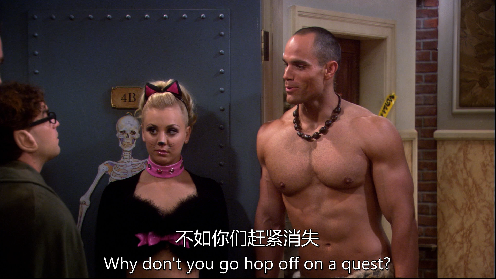

[台词](./s01e06.pdf)

[手打台词](./06.txt)

# 生词

# 句子

“lose to” 是一个固定短语，意为 “输给……”。“Kyle Bernstein’s Bar-Mitzvah party” 中，“Kyle Bernstein’s” 是名词所有格，表示 “凯尔・伯恩斯坦的”，“Bar-Mitzvah party” 是名词短语，指犹太男孩的成人仪式派对（犹太教中男孩 13 岁时举行的一种重要宗教和社交仪式） 。
文化背景解释：
Bar-Mitzvah 文化：Bar-Mitzvah（成人礼）是犹太文化中非常重要的一部分，标志着一个犹太男孩从儿童步入成年，在宗教、社会和家庭中承担更多的责任和义务。在这个仪式上，会有宗教仪式、庆祝活动和社交聚会等。在剧中提到的 “Kyle Bernstein’s Bar-Mitzvah party”，说明这是凯尔・伯恩斯坦举行成人礼时举办的派对，可能会有很多亲朋好友参加，充满欢乐、热闹的氛围。

---

句子整体结构：这是一个简单句，“You know” 作为插入语，用于引起对方注意或作为一种说话的习惯开场，在句子中不承担主要的语法成分。句子的主干是 “we were annihilated”，使用了一般过去时的被动语态，“we” 是主语，“were annihilated”（被彻底击败、摧毁）是谓语部分。
介词短语作状语：“by our own incompetence and the inability of some people to follow the chain of command” 是由 “by” 引导的介词短语，作方式状语，说明 “我们被击败” 的原因。其中 “our own incompetence”（我们自己的无能）和 “the inability of some people to follow the chain of command”（一些人无法遵循指挥系统）是并列关系，由 “and” 连接。
后置定语：“of some people to follow the chain of command” 是一个后置定语，修饰 “the inability”，“to follow the chain of command” 是动词不定式短语作后置定语，进一步说明 “无能” 的具体内容，即 “一些人在遵循指挥系统方面的无能”。

---

：“clear space” 是一个短语，“clear” 在这里是动词，意为 “清理、腾出”，“space” 表示 “空间”，“clear space on your calendar” 即 “在你的日程安排上腾出时间”；“enquiry”（英式英语，美式英语常用 “inquiry”）是名词，意思是 “调查、询问” 。

---

“random”（随机的、任意的）和 “genre specific”（特定类型的、有风格限制的）是两个并列的表语，通过 “or” 连接，让对方在这两种可能性中进行选择，询问服装是随意选择的，还是有特定的风格类型要求。

---

D&D：即龙与地下城（Dungeons & Dragons），是一款极具影响力的桌上角色扮演游戏。玩家在游戏中可以扮演各种奇幻角色，如战士、法师、盗贼等，在虚拟的奇幻世界中进行冒险。剧中角色们经常玩这款游戏，所以也可以以游戏中的角色形象作为装扮。

Manga：指日本漫画。日本漫画有众多丰富的角色和风格，如《火影忍者》《海贼王》等作品中的角色，都可以成为他们装扮的灵感来源，反映出他们对不同文化背景下的流行文化的喜爱和关注。
Greek Gods, Roman Gods, Norse Gods：分别指希腊神话、罗马神话和北欧神话中的众神。这些神话体系中有许多个性鲜明、形象独特的神祇，如希腊神话中的宙斯、罗马神话中的朱庇特、北欧神话中的奥丁等，选择以这些神话角色作为装扮，能够展现出他们对古代神话文化的兴趣，同时也能在派对上呈现出独特而神秘的风格。

---

“nobody gets to be The Flash” 是一个主谓宾结构的句子，“nobody” 作主语，表示 “没有人”；“gets to be” 是谓语部分，“get to” 在这里表示 “有机会、被允许”，“be” 是系动词，“The Flash”（闪电侠，美国 DC 漫画旗下超级英雄）作表语，整句话意思是 “没有人可以扮演闪电侠”。

---

“this party is my first chance for Penny to see me in the context of her social group”：
这是一个主系表结构的句子。“this party” 是主语，“is” 是系动词，“my first chance” 作表语。
“for Penny to see me in the context of her social group” 是一个动词不定式的复合结构，作后置定语修饰 “chance”。“for Penny” 表示不定式动作 “to see me” 的逻辑主语，“in the context of her social group” 是介词短语作状语，修饰 “see me”，表示 “在佩妮的社交圈子这个情境下”。
“and I need you not to embarrass me tonight”：
“and” 是并列连词，连接前后两个句子。
“I” 是主语，“need” 是谓语动词，“you” 是宾语，“not to embarrass me tonight” 是动词不定式的否定形式作宾语补足语，“need sb. not to do sth.” 表示 “需要某人不要做某事”，“tonight” 是时间状语。

---

“Just a heads up fellas”：“Just” 是副词，起强调作用，“a heads up” 是固定短语，意思是 “事先提醒；预警”，“fellas” 是 “fellow” 的复数形式，在这里用作称呼语，意为 “伙计们”，这部分是一个简单的表达，用于引起其他人的注意并传达提醒的意图。
“if anyone gets lucky”：这是一个由 “if” 引导的条件状语从句，“anyone” 作从句的主语，“gets lucky” 是系表结构，“lucky” 作表语，这里 “gets lucky” 结合语境可理解为 “有性方面的幸运（即有机会发生性行为）”。
“I’ve got a dozen condoms in my quiver”：“I’ve got” 是 “I have got” 的缩写，相当于 “I have”，表示 “我有”。“a dozen” 意为 “一打，十二个”，修饰 “condoms”（避孕套）。“in my quiver” 是介词短语作地点状语，“quiver” 原意为 “箭筒；箭袋”，这里形象地表示 “储备；存货”，整句话意思是 “我储备了十二个避孕套”。

---

“by Odin’s beard” 是一个介词短语，在这里作状语，“by” 表示 “以…… 的名义；借助于”，“Odin’s beard” 中 “Odin” 是北欧神话中的众神之王奥丁，“beard” 是 “胡须” 的意思，“by Odin’s beard” 类似于一种感叹语，表达惊讶、赞叹等强烈的情绪，有 “看在奥丁的份上；天哪” 等含义。
“this is good Chex Mix” 是一个主系表结构的句子，“this” 是主语，“is” 是系动词，“good Chex Mix” 作表语，“Chex Mix” 是一种混合零食（由谷物片、坚果、饼干等混合而成），“good” 是形容词，修饰 “Chex Mix”，表示这种零食很好吃。

---

“check out the sexy nurse”：“check out” 是一个动词短语，意思是 “看看、瞧瞧”，“the sexy nurse” 是 “check out” 的宾语，“sexy” 是形容词修饰 “nurse”，表示 “性感的护士”，整句话是让大家看那个性感的护士。
“I believe it’s time for me to turn my head and cough”：“I believe” 后接宾语从句 “it’s time for me to turn my head and cough”。“it’s time for sb. to do sth.” 是一个常用句型，意为 “是某人做某事的时候了”，“turn my head and cough” 是 “to” 后面的动词短语，字面意思是 “转过头然后咳嗽”。

在西方文化中，“turn your head and cough” 是医生在给男性患者做身体检查（尤其是检查腹股沟区域）时常见的指令。说话者在这里故意借用这个情境，以一种诙谐的方式表达自己对性感护士的反应，暗示自己希望得到护士像医生检查那样的 “特别关注”，营造出一种轻松、搞笑的氛围。

---

“I have transient idiopathic arrhythmia”：“I” 是主语，“have” 是谓语动词，意为 “患有；拥有”。“transient idiopathic arrhythmia” 是宾语，“transient” 是形容词，意为 “短暂的；暂时的”；“idiopathic” 是形容词，意思是 “特发性的（原因不明的）”；“arrhythmia” 是名词，指 “心律失常”，整句话意思是 “我患有短暂性特发性心律失常”。

---

这是一个特殊疑问句，采用了 “疑问词 + 系动词 + 主语” 的倒装结构。“How” 是疑问副词，在这里用来询问程度，意为 “多么”；“wasted” 是形容词，在口语中常用来表示 “（因饮酒或吸毒等而）喝醉的、神志不清的”；“am” 是系动词，“I” 是主语。整句话的正常语序应该是 “I am how wasted”，但在疑问句中要将系动词 “am” 提到主语 “I” 前面，以构成特殊疑问句的形式来询问 “我醉到什么程度了？”

---

“if this was 15,000 years ago” 是一个由 “if” 引导的虚拟条件状语从句，使用了一般过去时 “was” 来表示与现在事实相反的假设（在虚拟语气中，“be” 动词常用 “were”，但在口语中 “was” 也较为常见），意思是 “如果这是在一万五千年前”。
“by virtue of his size and strength” 是一个介词短语，作方式状语，“by virtue of” 是固定短语，意为 “由于；凭借”，“his size and strength” 表示 “他的体型和力量”，说明后面情况的原因。
“Kurt would be entitled to his choice of female partners” 是主句，使用了虚拟语气，“would be” 是谓语部分，“entitled to” 是固定短语，意为 “有权；有资格”，“his choice of female partners” 作 “entitled to” 的宾语，整句话意思是 “库尔特就有资格选择他的女性伴侣”。

---

“pretty much whatever tickled his fancy”：“pretty much” 是一个副词短语，意为 “几乎；差不多”，起强调作用。“whatever tickled his fancy” 是一个宾语从句，“whatever” 既作引导词又在从句中充当主语，“tickled” 是谓语动词，“tickle one's fancy” 是固定短语，意思是 “合某人的心意；使某人感兴趣”，“his” 指代前文提到的库尔特（Kurt），“fancy” 在这里是名词，意为 “喜好；幻想”。整句话意思是 “差不多任何合他心意的东西”。

---

“in the information age” 是一个介词短语，作时间状语，表明句子所描述的情况发生的时代背景，意思是 “在信息时代”。
“Sheldon, you and I are the alpha males”：“Sheldon” 在这里是称呼语，“you and I” 是并列的主语，“are” 是系动词，“the alpha males” 作表语。“alpha males” 直译为 “雄性领袖；主导男性”，在这里表示在某个群体或环境中处于优势、主导地位的男性。
“We shouldn’t have to back down”：“We” 是主语，“shouldn’t” 是情态动词 “should” 的否定形式，“have to” 是固定短语，意为 “不得不；必须”，“back down” 是动词短语，意思是 “退缩；让步”。整句话表示 “我们不应该不得不退缩（即我们不应该退缩）”。

---

“Given the reaction to my costume”：“given” 在这里是介词，意为 “考虑到；鉴于”，“the reaction to my costume” 是 “given” 的宾语，“to my costume” 是介词短语作后置定语修饰 “reaction”，表示 “对我服装的反应”，整个短语在句中作原因状语，表明后面结论产生的依据。
“this party is a scathing indictment of the American education system”：这是一个主系表结构的句子。“this party” 是主语，“is” 是系动词，“a scathing indictment” 是表语，“scathing” 是形容词，意为 “严厉的；尖刻的”，“indictment” 是名词，意思是 “谴责；控诉”。“of the American education system” 是介词短语作后置定语，修饰 “indictment”，表示 “对美国教育体系的（谴责）” 。

---

“Yet” 在这里是一个副词，意思是 “还；仍然；又”，用于加强语气，强调情况的重复性或连续性。
“another” 是限定词，意为 “又一；再一；另一”，修饰后面的名词 “child”。
“child” 是名词，“孩子” 的意思。
“left behind” 是过去分词短语作后置定语，修饰 “child”。“leave behind” 是一个动词短语，意为 “留下；遗忘；丢弃”，这里用过去分词形式表示被动，即 “被留下的孩子”。整个句子可以理解为 “又一个被留下的孩子”。

---

“a Hobbit is a mortal Halfling inhabitant of Middle Earth”：这是一个主系表结构的句子。“a Hobbit” 是主语，表示 “一个霍比特人”；“is” 是系动词；“a mortal Halfling inhabitant of Middle Earth” 是表语部分，其中 “a” 是不定冠词，“mortal” 是形容词，意为 “凡人的、终有一死的”，“Halfling” 是名词，指 “半身人（霍比特人的别称）”，“inhabitant” 是名词 “居民”，“of Middle Earth” 是介词短语作后置定语，修饰 “inhabitant”，表示 “中土世界的居民”，整句话意思是 “一个霍比特人是中土世界里终有一死的半身人居民”。
“whereas an Elf is an immortal tall warrior”：“whereas” 是连词，意为 “然而、而”，用于对比或对照两个句子。“an Elf” 是主语，“is” 是系动词，“an immortal tall warrior” 是表语，“an” 是不定冠词，“immortal” 是形容词 “不朽的、长生不老的”，“tall” 是形容词 “高大的”，“warrior” 是名词 “战士”，这句话表示 “而一个精灵是长生不老的高大战士”

---

“why don’t you go hop off on a quest”：“why don’t you...” 是一个常用的句式，用于提出建议或表示不满、不耐烦等情绪，意思是 “你为什么不……”。“go hop off” 中 “go” 和后面的动词 “hop off” 构成 “go + 动词原形” 的结构，表示去做某事，在这里 “hop off” 是动词短语，意为 “离开；出发”。“on a quest” 是介词短语作状语，“quest” 意为 “探索；寻求；冒险”，“on a quest” 表示 “进行一次冒险”。所以整句话意思是 “你为什么不离开去进行一次冒险呢”。

---

“and so you’re driven to animalistic puffery”：“and so” 是连词短语，起到连接和引出结果的作用，“so” 在这里表示 “因此；所以”。“you’re” 是 “you are” 的缩写，“are driven” 是被动语态结构，“drive” 在这里意为 “驱使”，“you are driven” 即 “你被驱使”。“to animalistic puffery” 是介词短语，“animalistic” 是形容词，意为 “兽性的；动物本能的”，“puffery” 是名词，意思是 “吹嘘；夸大其词”，整句话意思是 “所以你就只能诉诸于兽性般的吹嘘”。

---

“Are misfiring neurons in your hippocampus preventing the conversion from short-term to long-term memory?” 这是一个一般疑问句，采用了现在进行时的疑问结构。
“Are” 是助动词，用于构成疑问句和现在进行时，帮助将陈述句变为疑问句形式。
“misfiring neurons” 是句子的主语，“misfiring” 是现在分词作定语，修饰 “neurons”，表示 “功能异常放电的神经元”，“neurons” 是名词 “神经元” 的复数形式。
“in your hippocampus” 是介词短语作后置定语，修饰 “neurons”，“hippocampus” 是名词 “海马体（大脑中的一个区域）”，说明这些神经元的位置是在海马体中。
“preventing” 是现在分词，与前面的 “are” 一起构成现在进行时的谓语部分，“prevent” 是动词，意为 “阻止；妨碍”。
“the conversion from short-term to long-term memory” 是 “preventing” 的宾语，“the conversion” 是名词 “转换”，“from short-term to long-term memory” 是介词短语作后置定语，修饰 “conversion”，表示 “从短期记忆到长期记忆的转换”。

---

    

“A homo-habilus discovering his opposable thumbs”：这是一个名词短语，核心词是 “homo-habilus”（能人，早期人类的一种），“discovering his opposable thumbs” 是现在分词短语作后置定语修饰 “homo-habilus”。“discovering” 是现在分词，“his” 是形容词性物主代词修饰 “opposable thumbs”（对生拇指），表示 “发现他的对生拇指的（能人）”。
“says what?”：这是一个口语化的表达，“says” 是动词 “说” 的第三人称单数形式，“what” 是疑问词，在这里 “says what” 意思是 “会说什么呢”，构成一个简短的疑问句，用来询问 “发现对生拇指的能人会说些什么”。

---

“put him down” 是一个动词短语，“put” 是动词，在这里是 “放置；放下” 的意思，“him” 是人称代词宾格，作 “put” 的宾语，“down” 是副词，作补语，补充说明 “put” 的方向，即 “放下”。
“this instant” 是一个时间短语，相当于 “right now” 或 “immediately”，意思是 “立刻；马上”，在句中作时间状语，修饰动词短语 “put him down”，强调动作要迅速完成。整个句子是一个祈使句，省略了主语 “you”，表达命令或强烈的要求。

---

