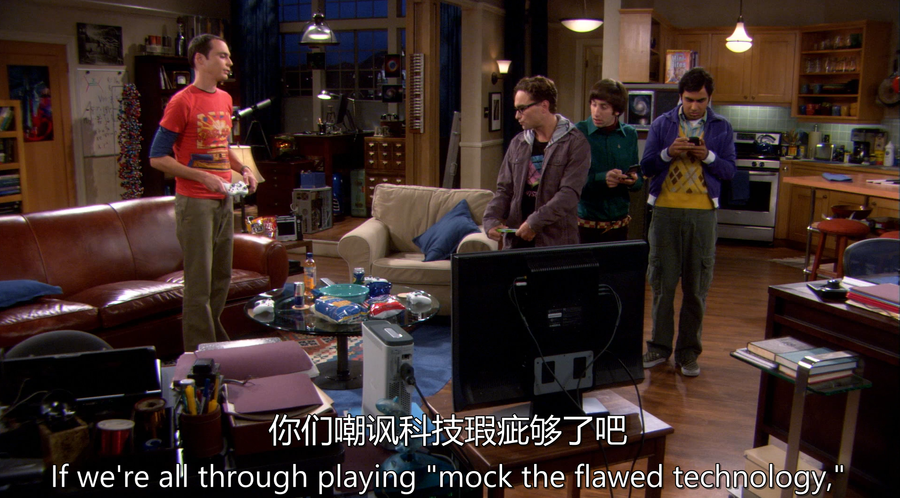
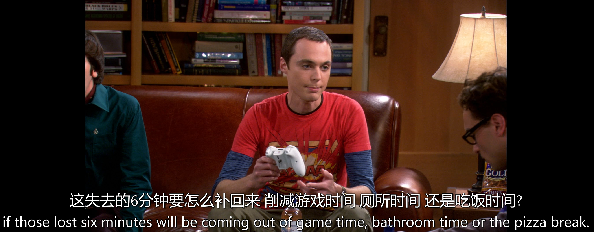
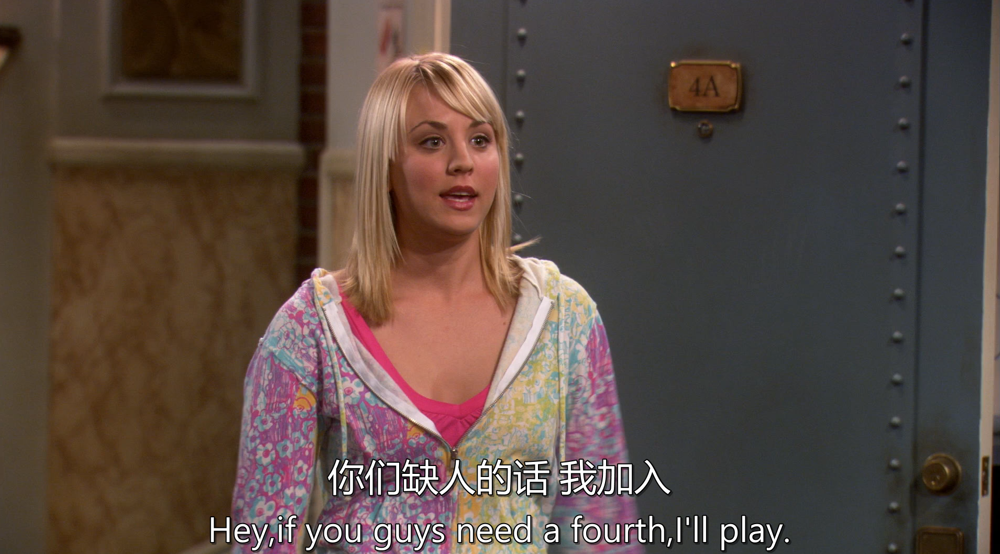
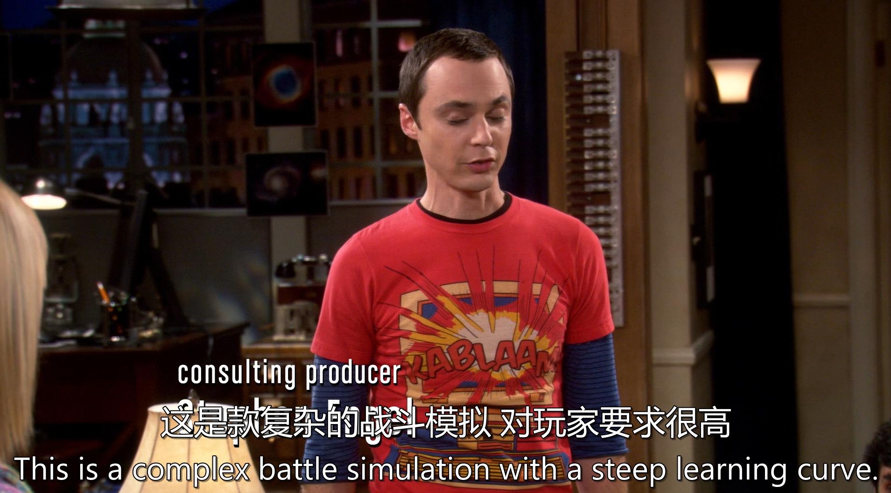

[台词](./s01e06.pdf)

[手打台词](./06.txt)

# 生词

# 句子

If we’re all through 
playing mock the flawed 
technology

句子结构：这是一个条件状语从句，主句部分被省略，完整的表达可能是一个隐含的建议或命令，如 “If we’re all through playing mock the flawed technology, then let's do something else”（如果我们玩够了嘲笑有缺陷的技术，那就做点别的吧）。
关键短语：
be through (doing sth.)：意为 “结束、完成（做某事）”，表示对某行为的厌倦或不再继续。
mock the flawed technology：“mock” 是动词 “嘲笑”，“flawed technology” 指 “有缺陷的技术”，整个短语表示 “嘲笑有缺陷的技术” 这一行为。

---

句子结构：这是一个复合句，主句是 “first we have to decide...”，宾语从句是 “if those lost six minutes will be coming out of game time, bathroom time or the pizza break”。
if 引导宾语从句，此处意为 “是否”，但根据语境更偏向于 “该从…… 中扣除” 的选择（类似 “whether” 的用法）。
have to 表示 “必须”，强调客观需要；coming out of 是短语动词，意为 “从…… 中扣除 / 减去”，这里指时间分配的取舍。

---

the next thing I know：固定短语，意为 “接下来我就发现 / 突然”，引导时间状语，表示某事发生得突然且出乎意料。
she’s invited herself out here to stay with me：主句，使用现在完成时 “has invited”，强调动作对现在的影响。
invite oneself：固定搭配，意为 “擅自邀请自己，不请自来”，带有被动接受或无奈的语气。
out here：表示 “到这里来”，强调地理位置的移动；to stay with me 是不定式短语作目的状语。

---

第一部分：“is she doing it one thong at a time”
do it：口语中常用的委婉表达，指代具体行为（此处结合语境为带有性暗示的动作）。
one thong at a time：“thong” 指丁字裤，“一次一件丁字裤” 隐喻逐步、缓慢的动作，可能调侃某人刻意营造诱惑的节奏。
第二部分：“does she just throw it all in, like some sort of erotic bouillabaisse”
throw it all in：字面意为 “全部扔进”，隐喻 “一股脑儿完成”，与前半句的 “逐步” 形成对比。
erotic bouillabaisse：“bouillabaisse” 是法式炖鱼羹，此处将 “ erotic（色情的）” 与食物类比，用夸张的比喻调侃对方行为的混乱或 “大杂烩” 式风格，带有戏谑的侮辱性。

---

在社交媒体时代，“dial it down” 不仅指线下行为的收敛，也可指代网络上的 “降噪”—— 停止过度展示、争论或情绪宣泄。剧中角色的困扰（如谢尔顿对 “节日装饰过度” 的吐槽）暗合当代人对 “信息过载”“社交疲劳” 的普遍焦虑，使台词具有超越剧情的现实共鸣。

---

who needs Halo：“Halo” 是知名科幻题材电子游戏《光环》，“who needs” 意为 “谁需要”，反问语气表示 “无需、没必要”。
be regaled with：固定搭配，意为 “被款待以……、聆听……（尤指故事）”，此处用被动语态强调 “被迫听” 的意味。
the delightfully folksy tale of the whore of Omaha：核心是对 “奥马哈荡妇” 故事的戏谑描述。
delightfully folksy：反讽用法，“民俗般愉悦的” 实则暗示故事低俗、市井；
whore of Omaha：“奥马哈（美国城市）的妓女”，用地域 + 身份的组合制造荒诞感，可能指代某虚构的低俗传闻或角色。

---

if you guys need a fourth：条件从句，“if” 引导条件状语，“you guys” 是口语化的 “你们”，“need” 是谓语动词，“a fourth” 指 “第四个（参与者）”，省略了 “player” 等名词，属于英语中数字作名词的简洁用法（如 “a third” 表示 “第三人”）。
I’ll play：主句，“I will play” 的缩写，“play” 在此处根据语境可理解为 “参与（游戏、活动等）”。

---

This is a complex 
battle simulation with a steep
learning curve, there are 
myriad weapons, vehicles 
and strategies to master, not 
to mention an extremely 
intricate back-story

主句：This is a complex battle simulation with a steep learning curve
with a steep learning curve：介词短语作后置定语，“learning curve” 指 “学习曲线”，“steep” 形容难度大，整体意为 “需要大量时间精力掌握的”。
分句 1：there are myriad weapons, vehicles and strategies to master
myriad：形容词 “无数的”，强调数量庞大；to master：不定式作后置定语，隐含 “需逐一精通” 的挑战性。
分句 2：not to mention an extremely intricate back-story
not to mention：固定短语 “更不用说”，引出递进内容；intricate back-story：“复杂的背景故事”，“intricate” 强调情节盘根错节。

---

whoever’s her partner：主语从句，“whoever” 引导主语，意为 “无论谁”，强调不确定性；“her partner” 为主语从句的表语，构成 “谁是她的搭档” 的泛指。
will be hamstrung by her lack of experience：主句，被动语态，“hamstrung” 是过去分词（原形为 “hamstring”，原指 “割断肌腱使无法行动”，引申为 “阻碍、束缚”）；“by her lack of experience” 是介词短语作状语，说明阻碍的原因。

---

‌respawned‌是一个动词，主要在电子游戏中使用，表示角色或物体在消失后再次出现。具体来说，当游戏中的角色被杀死后，它会再次出现，这个过程就称为respawn。例如：“On level five of the game, enemies respawn very quickly.”（在游戏的第五关，敌人很快就会再次出现）‌

此外，respawn也可以作为名词使用，表示重新出现的事物或现象。例如：“When you respawn, you'll fight again with the same enemies.”（当你重新出现时，你会再次与相同的敌人战斗）‌

---

kind of a sore loser：口语化表达，“kind of” 意为 “有点、稍微”，弱化语气；“sore loser” 是固定短语，指 “输不起的人”（输了后容易生气、抱怨的人）。
isn’t he?：反义疑问部分，遵循 “前肯后否” 规则，用于征求对方认同，带有调侃或无奈的意味。

---

主句：It’s culturally universal...headboard away from the door
It：指代 “床的摆放方式” 这一现象；
oriented with the headboard away from the door：被动语态，“床头远离门” 的方位设定，强调该行为的普遍性。
解释句：It serves the ancient imperative of protecting oneself against marauders
serves：意为 “符合、满足”；
ancient imperative：“古老的生存需求”，“imperative” 强调必要性；
marauders：指 “掠夺者、入侵者”，呼应原始社会的安全威胁。

