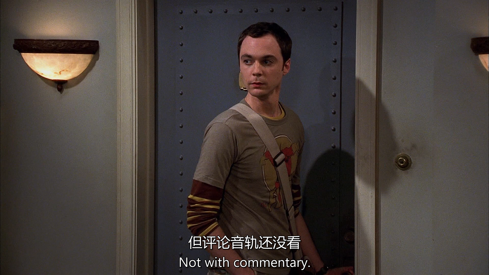

[台词](./script/s01e01.pdf)

# 生词

laxative 谢邀
colon 大肠；冒号
masturbate 自摸
doodle 乱涂

# 句子

---

Should we have invited her for lunch?
这里的have invited表示a past possibility or missed opportunity，这里强调Leonerd有点懊悔刚才没有邀请Penny来吃饭
"Should we invite her for lunch?" → This is asking about a present or future action.

"Should we have invited her for lunch?" → This is asking about whether inviting her in the past would have been the right decision.
同样的例子还有
"We should have studied more for the test." → We didn’t study enough, and now we regret it.

"Should I have told her the truth?" → I'm wondering if telling her the truth in the past was the right choice.

---

In this context, "commentary" refers to audio commentary, which is an additional feature included in DVDs or Blu-rays where the creators, directors, actors, or other involved people discuss the episode while it plays.

---

the phrase "might want to" is a polite or indirect way of giving advice or making a suggestion.

Meaning of "might want to"
It means "should" or "it would be better if you", but in a softer, less direct way.

It implies that it is advisable or a good idea to do something, without sounding too forceful.

Rewriting the Sentence for Clarity
Direct version: "Leonard, don’t mention bowel movements when inviting someone to lunch."

Polite version: "Leonard, you might want to avoid mentioning bowel movements when inviting someone to lunch."

---

