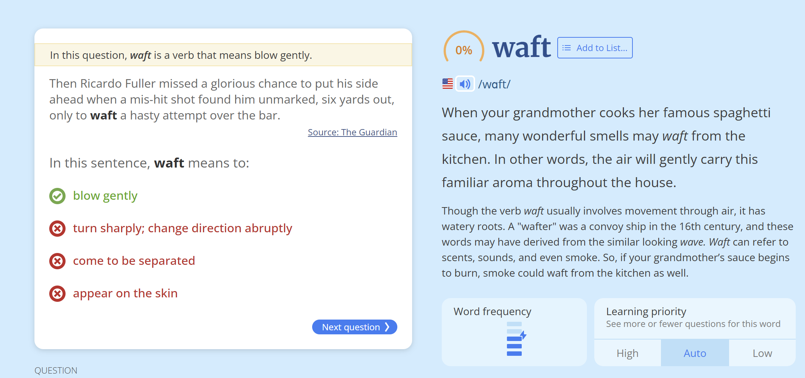
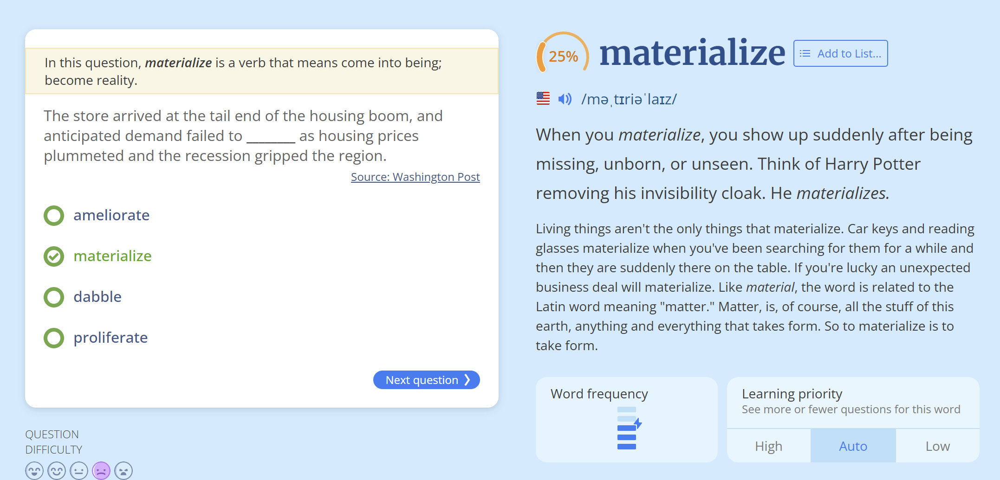
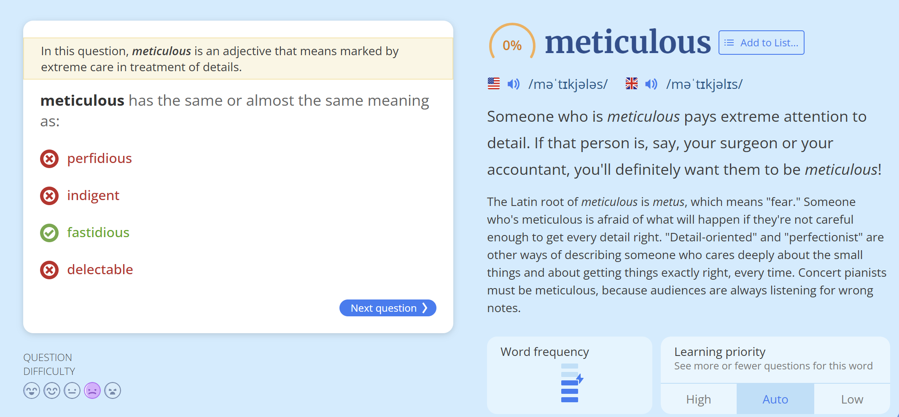

随后，里卡多·富勒错失了一次绝佳的破门良机——他在六码处无人盯防的情况下接到一记传球，却仓促起脚，将球打飞越过横梁。  

（翻译说明：  
1. **"mis-hit shot"** 译为“一记传球”，结合上下文理解为队友的传球不够精准但意外落到富勒脚下。  
2. **"unmarked"** 译为“无人盯防”，符合足球术语。  
3. **"waft a hasty attempt"** 意译为“仓促起脚”，保留动作的匆忙感。  
4. **"over the bar"** 译为“越过横梁”，是足球比赛中射门偏出的标准表达。）

---

The correct answer is: **materialize**  

### **Full Sentence:**  
"The store arrived at the tail end of the housing boom, and anticipated demand failed to **materialize** as housing prices plummeted and the recession gripped the region."  

### **Translation (Chinese):**  
这家商店开业时正值房地产繁荣的尾声，但随着房价暴跌和经济衰退席卷该地区，预期的需求**并未实现**。  

### **Explanation:**  
- **Materialize** (实现，成为现实) means to happen or develop as expected.  
  - In this context, the store expected high demand, but due to the recession, that demand **did not materialize** (没有实现).  
- Other options:  
  - **Ameliorate** (改善) – Doesn’t fit; demand doesn’t "improve."  
  - **Dabble** (涉猎) – Irrelevant here.  
  - **Proliferate** (激增) – The opposite of what happened (demand decreased, not increased).  

Thus, **"materialize"** is the best choice.

---

The correct answer is: **fastidious**  

### **Explanation:**  
- **Meticulous** (一丝不苟的，严谨的) means showing great attention to detail and being very careful and precise.  
- **Fastidious** (挑剔的，苛求的) also means being very attentive to accuracy and detail, making it the closest synonym.  

### **Why Not the Others?**  
- **Perfidious** (背信弃义的) – Means deceitful or treacherous (completely different meaning).  
- **Indigent** (贫困的) – Means poor or needy (no relation to attention to detail).  
- **Delectable** (美味的) – Means delicious (unrelated to carefulness).  

### **Example Usage:**  
- "She was **meticulous** in her research, checking every source twice."  
- "He was **fastidious** about keeping his workspace perfectly organized."  

Thus, **fastidious** is the best synonym for **meticulous**.

---

"A2A" 是 "Asked to Answer" 的缩写，常见于论坛（如Quora）中，表示回答者是被邀请（或点名）来回答该问题的。

---

