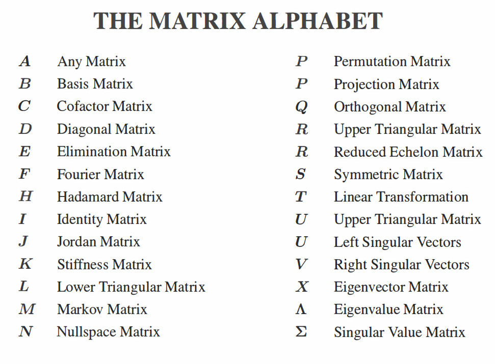

i dont know the meaning

以下是翻译后的矩阵术语，并包含英文名称：

- A - 任意矩阵 (Any Matrix)
- B - 基础矩阵 (Basis Matrix)
- C - 余子矩阵 (Cofactor Matrix)
- D - 对角矩阵 (Diagonal Matrix)
- E - 消元矩阵 (Elimination Matrix)
- F - 傅里叶矩阵 (Fourier Matrix)
- G - 哈达玛矩阵 (Hadamard Matrix)
- H - 单位矩阵 (Identity Matrix)
- I - 乔丹矩阵 (Jordan Matrix)
- J - 刚度矩阵 (Stiffness Matrix)
- K - 下三角矩阵 (Lower Triangular Matrix)
- L - 马尔可夫矩阵 (Markov Matrix)
- M - 零空间矩阵 (Nullspace Matrix)
- N - 排列矩阵 (Permutation Matrix)
- O - 投影矩阵 (Projection Matrix)
- P - 正交矩阵 (Orthogonal Matrix)
- Q - 上三角矩阵 (Upper Triangular Matrix)
- R - 简化阶梯矩阵 (Reduced Echelon Matrix)
- S - 对称矩阵 (Symmetric Matrix)
- T - 线性变换 (Linear Transformation)
- U - 上三角矩阵 (Upper Triangular Matrix)
- V - 左奇异向量 (Left Singular Vectors)
- X - 右奇异向量 (Right Singular Vectors)
- Λ - 特征向量矩阵 (Eigenvector Matrix)
- Σ - 特征值矩阵 (Eigenvalue Matrix)

这些是矩阵相关的术语，左边是中文，右边是对应的英文名。

