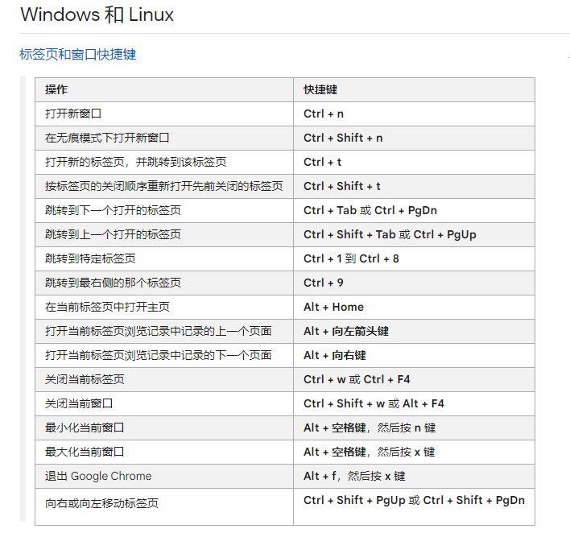

今天早上起来以后，没有按照约定起来，苹果的手环震动太差了，没办法把我叫醒。其实不需要一个手表，就是装饰作用的话，还不如用手机记录，闹钟用苹果手机震动就行了。
重点是我在这个事情上浪费了太多时间，这是最严重的错误，你看卷卷就不会这样，虽然她不太会用，但是不会导致浪费时间。

### cs

#### sort

sort是最基础的问题了

关于稳定性
稳定性是指相等的元素经过排序之后相对顺序是否发生了改变。

拥有稳定性这一特性的算法会让原本有相等键值的纪录维持相对次序，即如果一个排序算法是稳定的，当有两个相等键值的纪录  r和s ，且在原本的列表中r  出现在s  之前，在排序过的列表中  r也将会是在 s 之前。

基数排序、计数排序、插入排序、冒泡排序、归并排序是稳定排序。

选择排序、堆排序、快速排序、希尔排序不是稳定排序。

### 数学

#### 6042

四色猜想的错误答案已经被发表很多了，其中一个十年没有被发现出错误，laborious意为艰苦卓绝的

. In fact, just a handful of axioms, called the Zermelo-Fraenkel with Choice axioms(ZFC), together with a few logical deduction rules, appear to be sufficient to derive essentially all of mathematics.
ZFC公理系统，是由策梅洛和弗伦克尔提出的ZF系统，在此基础上加上选择公理构成的

哥德巴赫猜想：任意大于2 的偶数都能表示成两个质数的和
![[Pasted image 20240809185243.png]]

这门课的session1 主要讲的是什么是proof，以及怎么做一个完备的proof

### 金融

#### CPI
 什么是CPI

消费者物价指数（CPI）用于衡量美国消费者每月支付的价格变动。这个数值是由劳工统计局（BLS）按照加权平均数计算的，使用一篮子代表美国消费者通常购买的商品和服务的价格。BLS发布了两种CPI指数——一种是城市消费者物价指数（CPI-U），另一种是城市工人和文员物价指数（CPI-W）。

CPI使用不同的价格样本、指数权重和调查技术与生产者价格指数（PPI）不同，后者帮助计算美国生产者获得商品和服务的价格。

### 英语

元音分为tense和relaxed两种，如feet和fit，前者是紧张的，后者是放松的

### 其他

chrome的快捷键，之前一直不知道CTRL+w关闭标签页，CTRL+pageUP切换标签页，CTRL+t打开新的标签页，这都是可以加快工作流的方法，之前一直用鼠标点点点，太浪费时间了，我把快捷键的位置保存在下面

