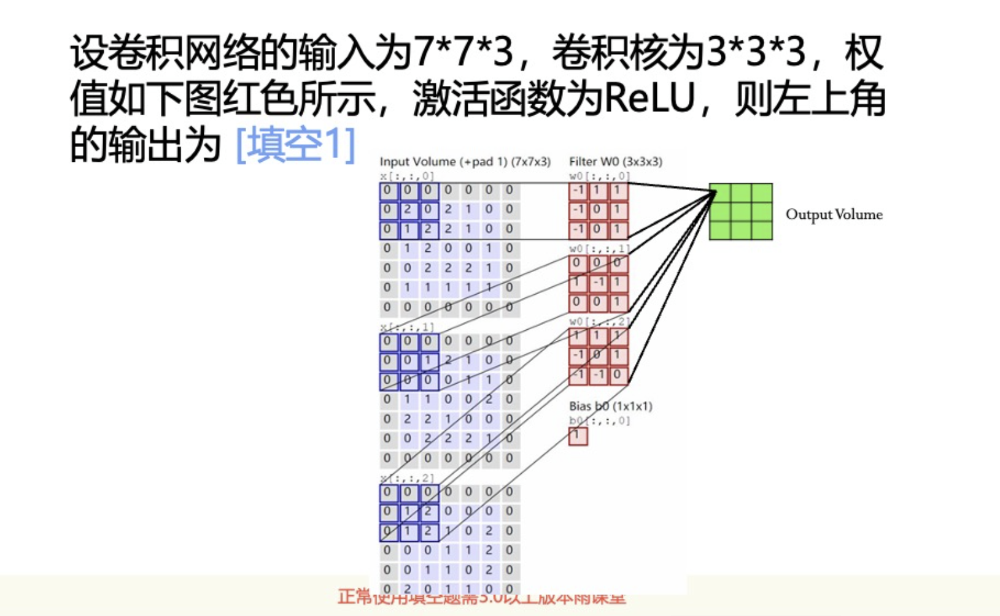

第6周课程

卷积和全连接神经网络

## 全连接网络

# 卷积网络

## 习题

## 池化
一种降维的方法

平均池化和最大化池化

## LetNet

yang lecun发明的

Impact:
LeNet was one of the first CNN architectures to show the power of deep learning, particularly in computer vision tasks.

It laid the foundation for more advanced architectures like AlexNet, VGG, and ResNet, which have achieved remarkable success in image classification, object detection, and other areas of deep learning.

## VGG-16

为什么使用64，128这样的数字
和计算机体系结构有关，二进制为基础

in VGG-16,the picture is 224x224x3,but the input of the network is 224x224x64,why

So, in short, the 224x224x64 is not the input image size, but the output from the first convolutional layer after processing the initial input image of 224x224x3. The 64 represents the number of filters applied in the first convolution layer, which generate 64 different feature maps.

So, in short, the 224x224x64 is not the input image size, but the output from the first convolutional layer after processing the initial input image of 224x224x3. The 64 represents the number of filters applied in the first convolution layer, which generate 64 different feature maps.

## 神经网络遇到的两大问题

### 梯度消失问题

#### GOOGLENET

GoogLeNet 的L大写，用来致敬LeNet
引入了梯度消失层

#### ResNet

在1000层以内都没有梯度消失问题

为什么不能设计一个激活函数，梯度大于1？
梯度大于1就是指数增长，会爆炸

### 过拟合问题

