这门课竟然是英文授课的
https://www.cs.tsinghua.edu.cn/info/1107/6209.htm

he was a professer at Purdue University before coming to Tsinghua.

# 预备知识

文法/正规式/有限自动机
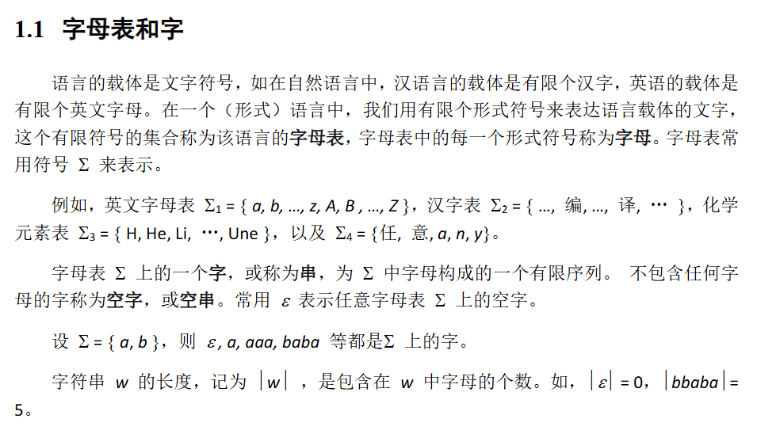

幂运算
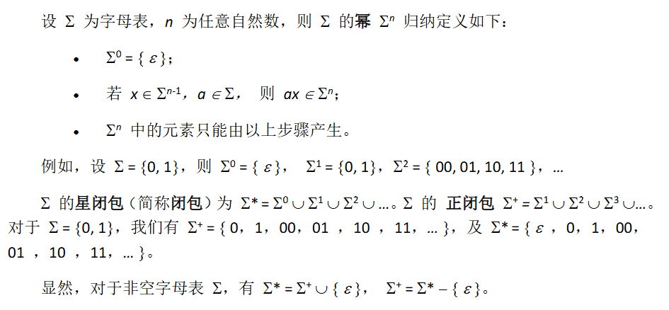

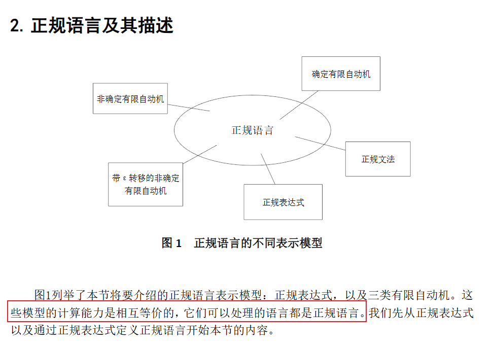

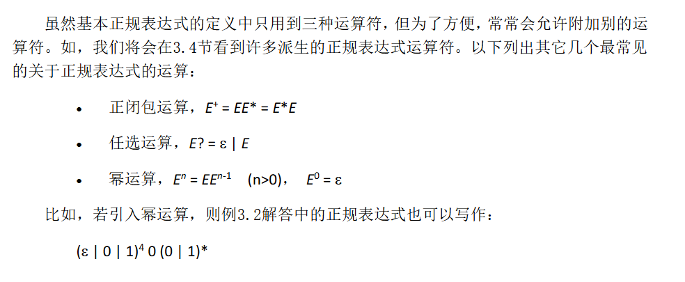

正规语言

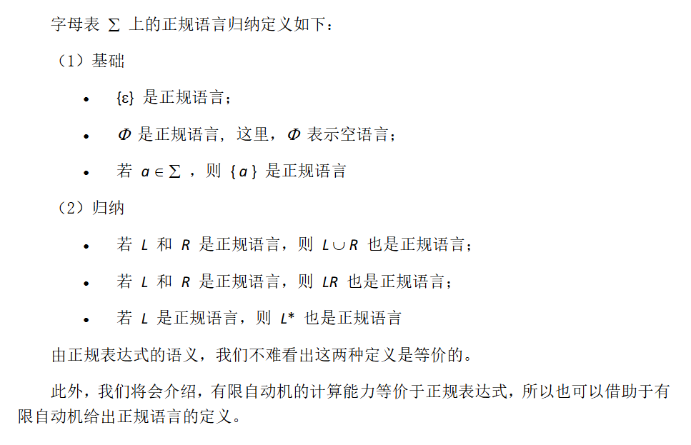

有限自动机（包括确定有限自动机（DFA）和非确定有限自动机（NFA））与正规表达式在计算能力上完全等价—— 即任何由正规表达式描述的语言，都能被某台有限自动机识别；反之，任何能被有限自动机识别的语言，也都可以用正规表达式描述。

正规语言是可以通过正规表达式定义，或能被有限自动机识别的语言

有限自动机
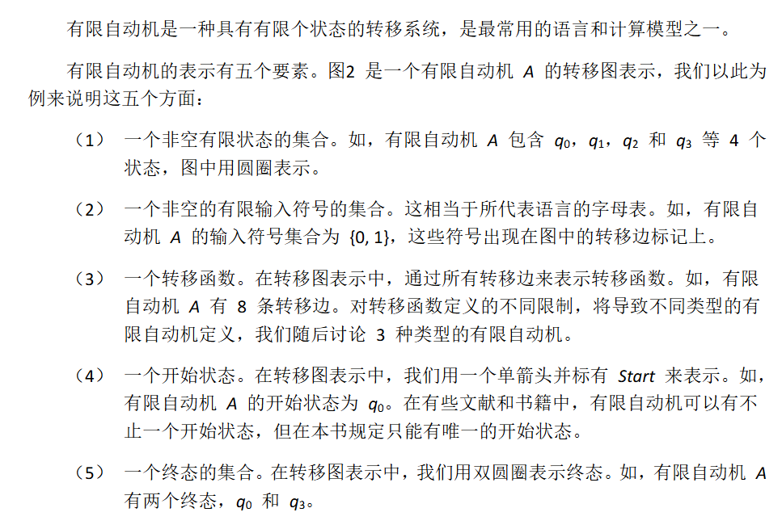
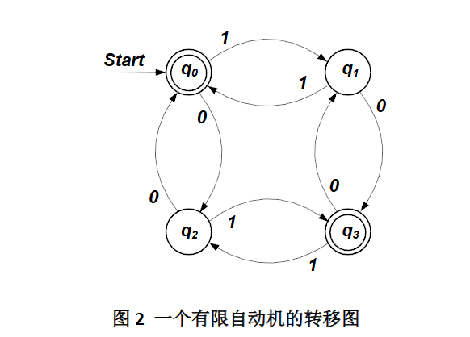

确定有限自动机
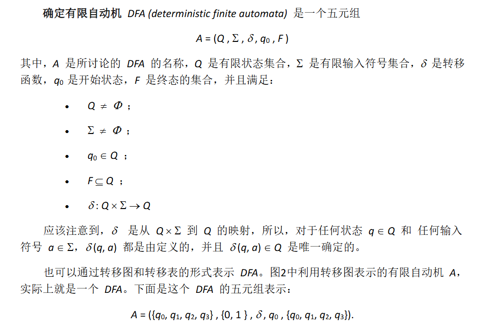

非确定有限自动机

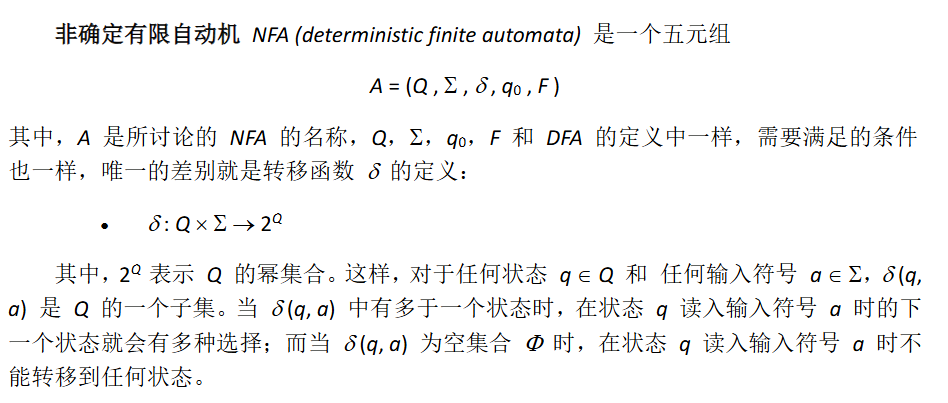

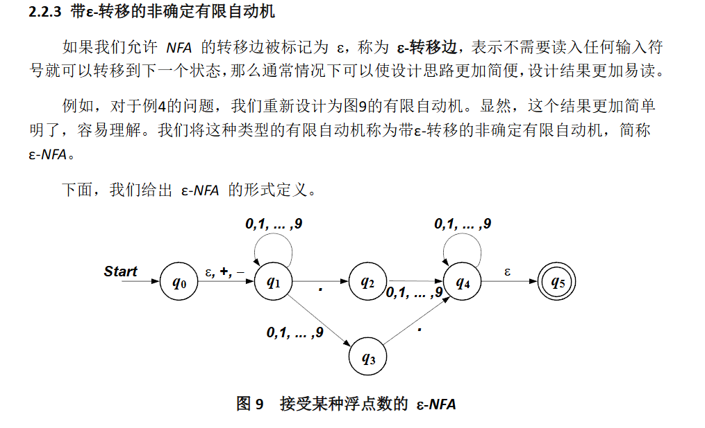

扩展的转移函数
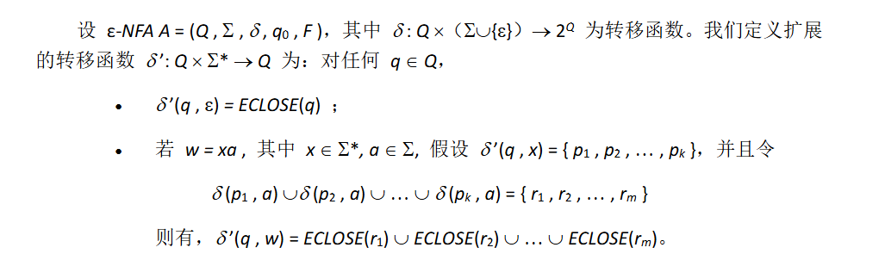

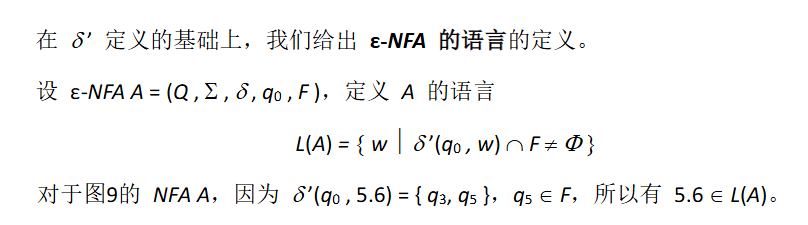

有限自动机的确定化

