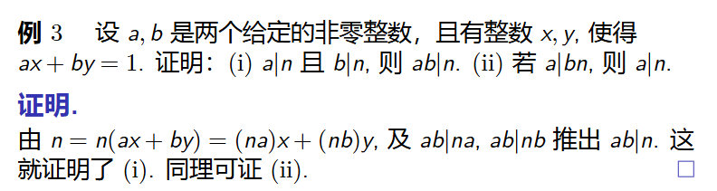
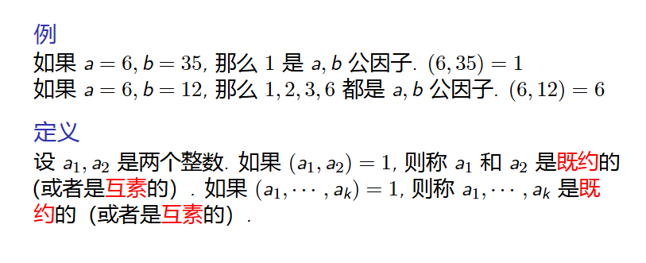
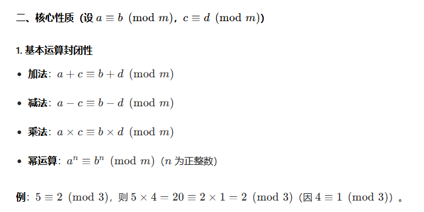
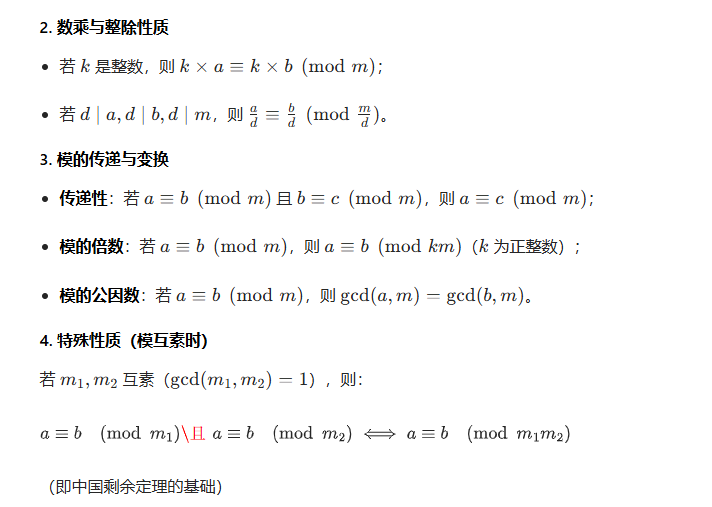
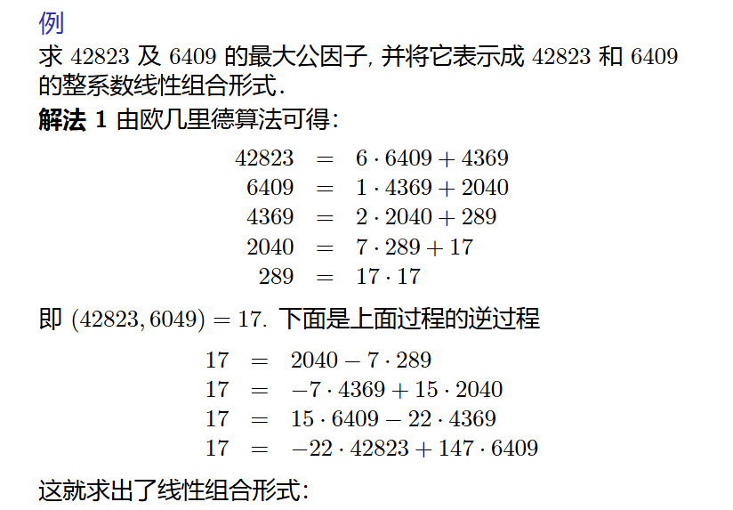
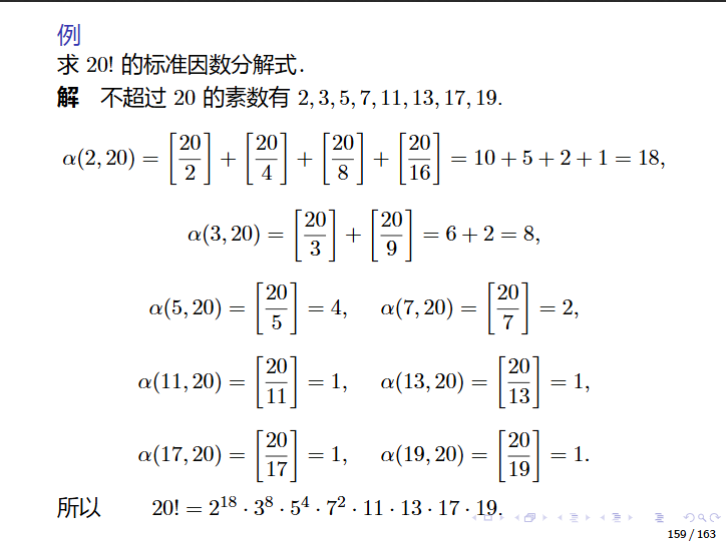

为什么能推出21整除n

最大公因子 gcd 性质 （  ）

互素 gcd = 1

互素消去理论

互素的数，乘方后仍互素

素数的整除分配性

最小公倍数 【 】 lcd

带余除法

整数分类

就分成奇偶数代入计算

同余的性质

欧几里得算法：求gcd和线性组合

欧几里得算法 + 回代法
将欧几里得算法的步骤 “逆推”，把余数逐步替换为前一步的表达式，最终得到 17 用 42823 和 6409 表示的形式

算数基本定理

整数部分

求阶乘的标准因数分解

