基础

图灵机模型

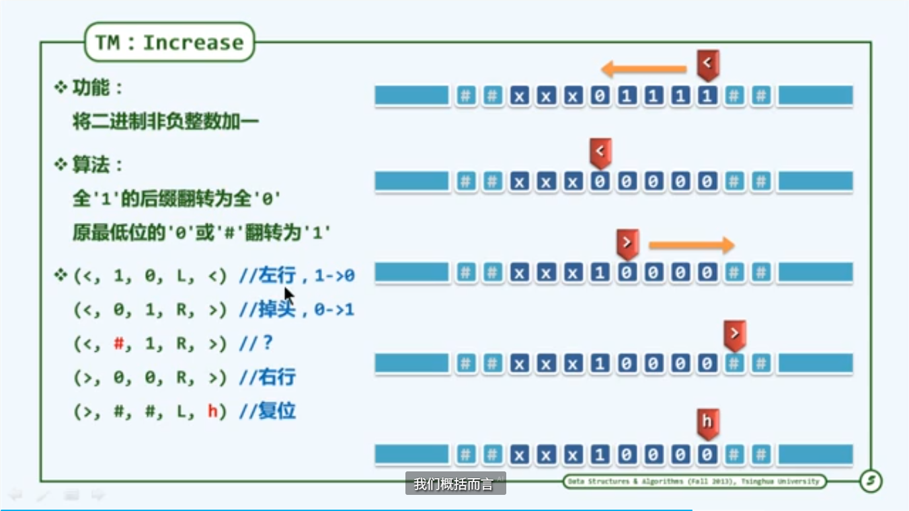

ram 模型

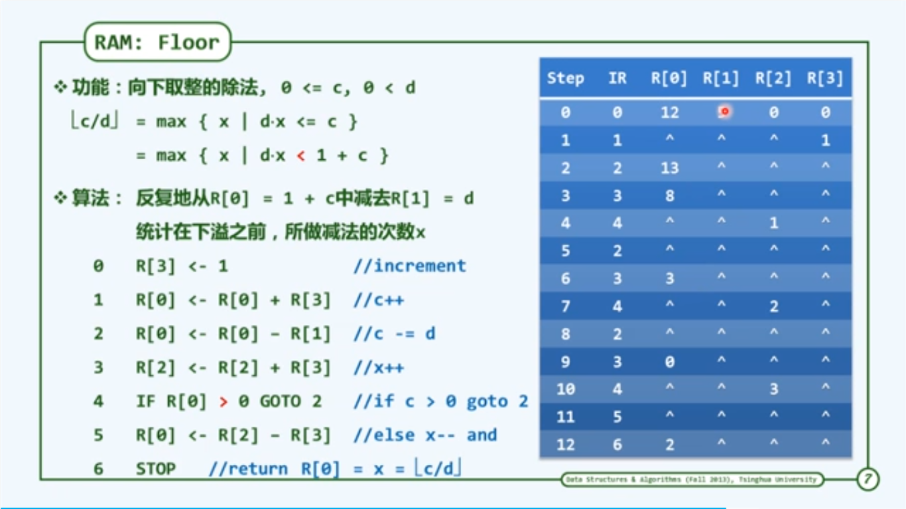

大O记号

Big O记号是由德国数论学家保罗·巴赫曼（Paul Bachmann）在其1892年的著作《解析数论》（Analytische Zahlentheorie）中首先引入的。而这个记号则是在另一位德国数论学家艾德蒙·朗道（Edmund Landau）的著作中得到推广的，因此它有时又称为朗道符号（Landau symbols）。

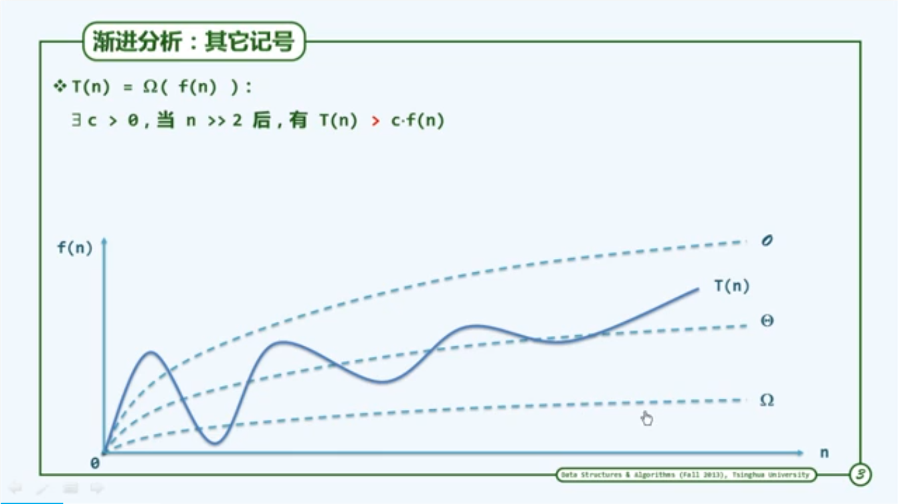

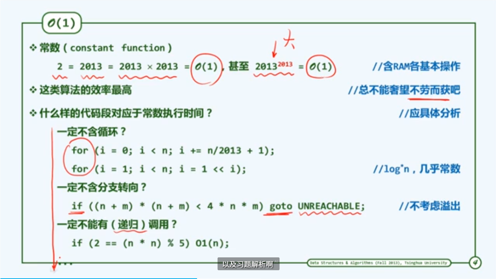

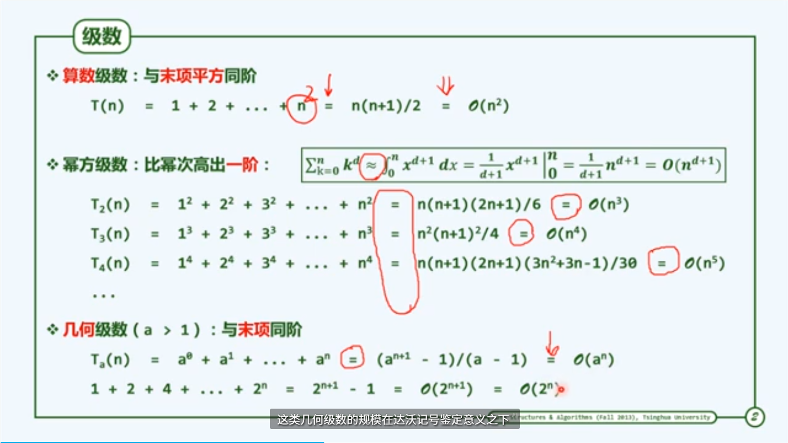

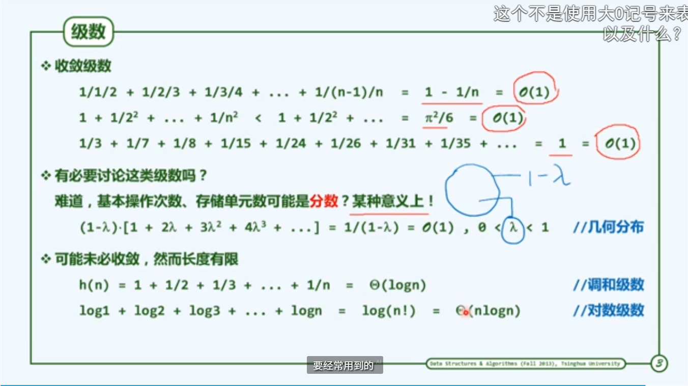

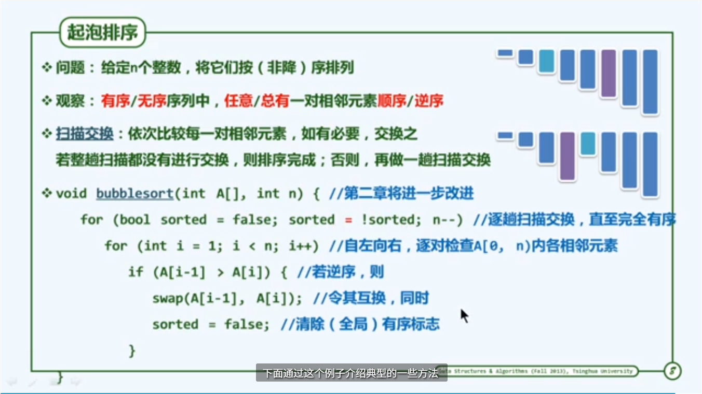

封底估算

迭代与递归

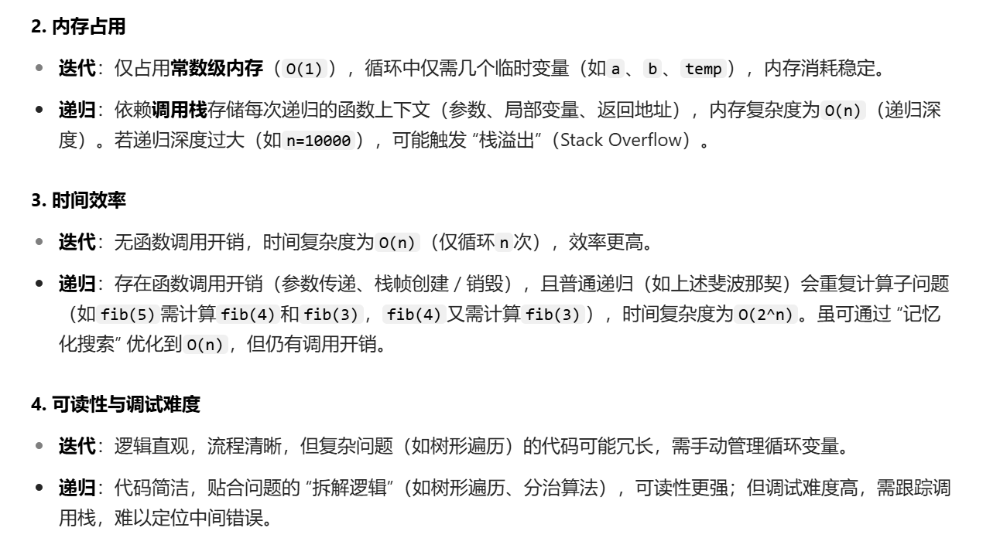

减而治之
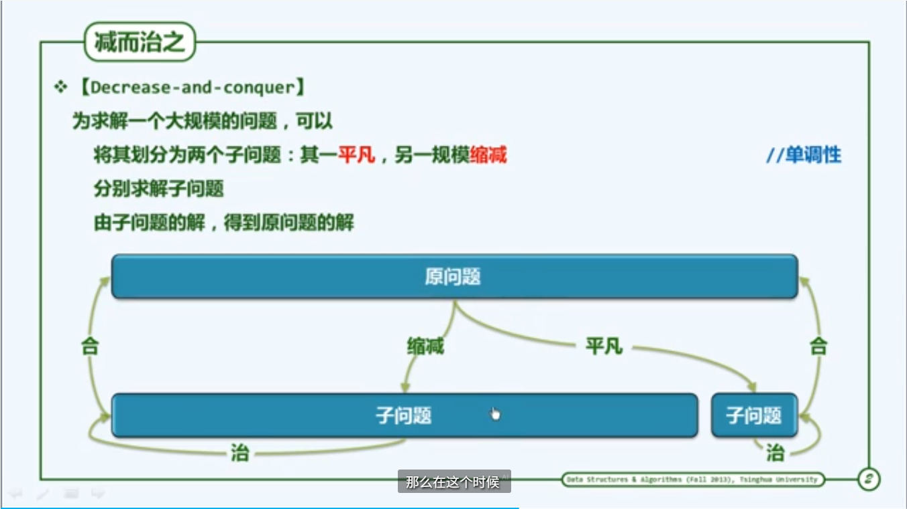

线性递归

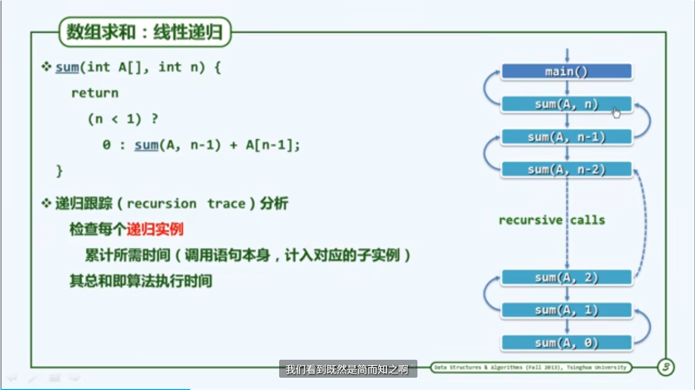

动态规划

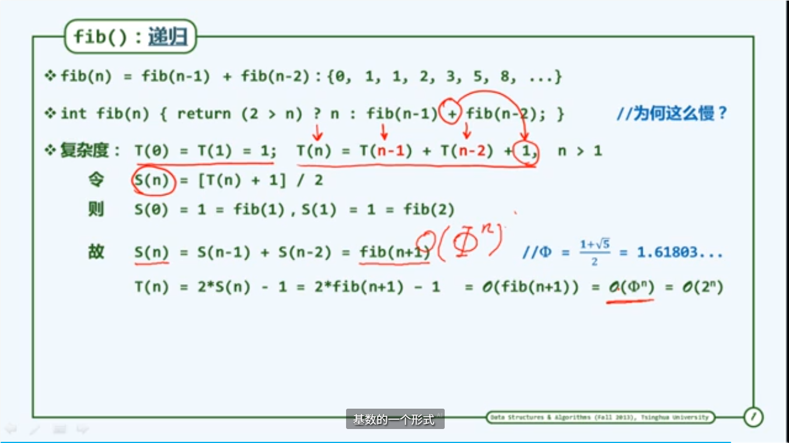

交替滚动

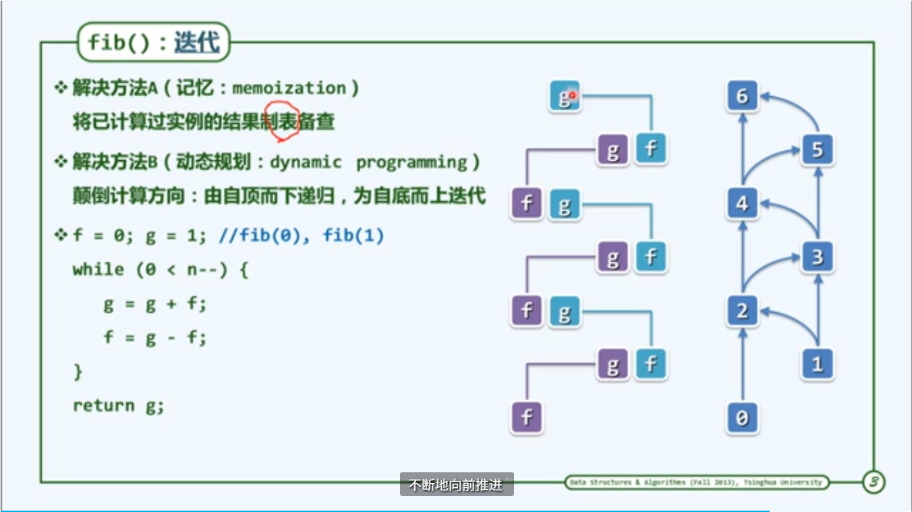

动态规划求LCS
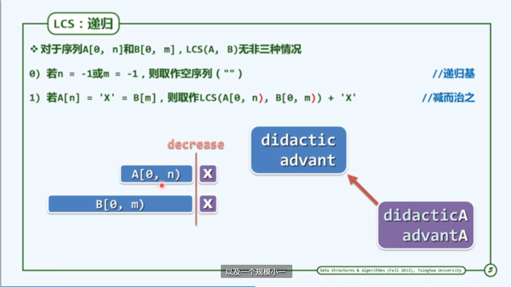
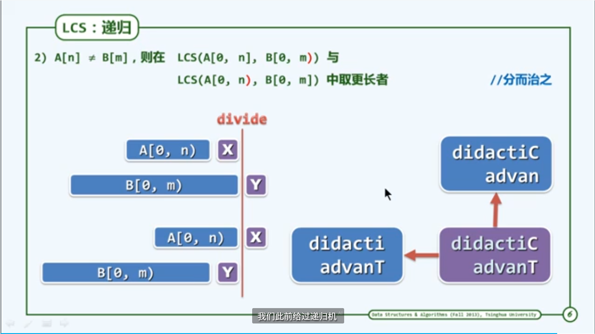

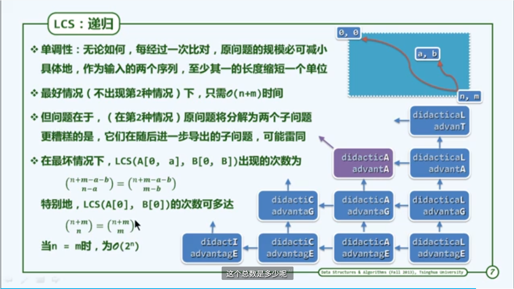

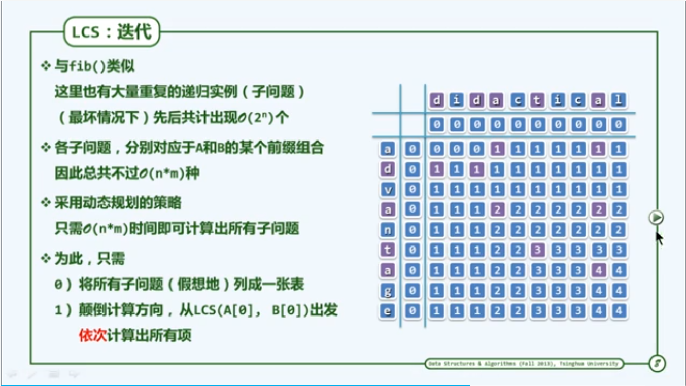

