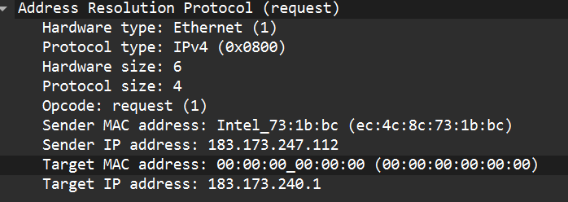
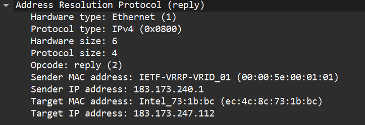
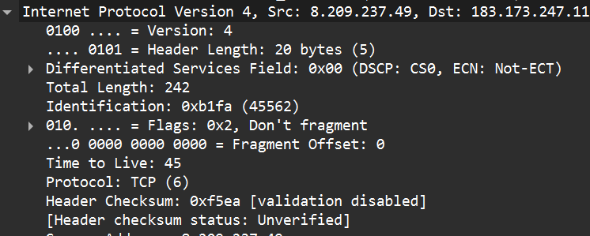
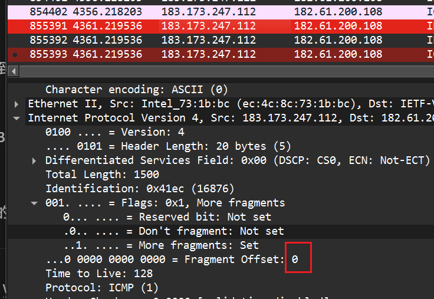

# Wireshark抓包实验-2

1.
EtherType = 0x0806

2.
Hardware type（HTYPE，以太网）= 1
Protocol type（PTYPE，IPv4）= 0x0800

3.
Opcode = 1（request）
源 IP  183.173.247.112
源 MAC ec:4c:8c:73:1b:bc
目的 IP 183.173.240.1
目的 MAC 00:00:00:00:00:00

4.
Opcode = 2（reply）
源 IP  183.173.240.1
源 MAC 00:00:5e:00:01:01
目的 IP 183.173.247.112
目的 MAC ec:4c:8c:73:1b:bc

简述题
（1）

会。局域网内 ping：ARP 解析的是目标主机 IP→MAC；局域网外 ping：ARP 解析的是默认网关 IP→MAC。因为 ARP 只在本链路解析“下一跳”的 MAC，跨网段必须先发给网关。

（2）

影响：广播风暴占带宽/CPU；ARP 表被污染导致断网/错投递；可被用于 ARP 欺骗/中间人/DoS。
发现：Wireshark/arpwatch 看到异常频率或 IP-MAC 频繁变更。应对：隔离异常主机、清 ARP 缓存、静态 ARP；交换机启用 DHCP Snooping + DAI、端口安全、限速与分 VLAN。

# Wireshark抓包实验-3

## 抓包实验1：观察IPv4包与分段现象	

Version = 4
IHL  = 5
IHL 单位：32-bit word（4字节），所以 5×4=20 字节头部

(1)

相等，都是0x41ec

(2)

DF=0：允许分片

MF=1：后面还有分片

(3)

DF=0：允许分片
MF=0：这是最后一个分片

(4)

分片1 offset = 0

分片2 offset = 1480

分片3 offset = 1480+1480 = 2960

(5)
因为 ping -l 3000 指的是 ICMP 数据部分 3000B
还要加 ICMP 头部 8B
所以进入 IP 层的 payload = 3000 + 8 = 3008B

## 抓包实验2：观察IPv6包

(1)

Version = 6

源地址 = 240c:c0a9:100d::3

目的地址 = 2402:f000:3:f001:fc68:9c16:c94f:2621

IPv6 地址长度：128 bit = 16 字节

(2)

IPv6 不允许路由器分片，只由源主机分片
通过 Fragment Extension Header（分片扩展头，Next Header=44）
里面有 Identification / Fragment Offset / M 标志
若超 MTU，路由器会回 ICMPv6 Packet Too Big 促使源端调整（PMTUD）

(3)

IPv6 用 Hop Limit 替代 IPv4 的 TTL

简述题
（1）什么情况下 IPv4 需要分段？哪里分段？哪里重组？

当 IPv4 报文长度 > 下一跳链路 MTU 且 DF=0 时需要分段。
分段发生在：源主机或中间路由器（IPv4 允许路由器分片）
重组发生在：目的主机（通常不在路由器重组）。

（2）IPv6 头部不含 checksum，如何做完整性校验？

IPv6 不做首部校验：依赖 链路层 CRC/FCS 检错；
端到端依赖 传输层校验和
需要更强安全可用 IPsec 做认证/完整性保护。

