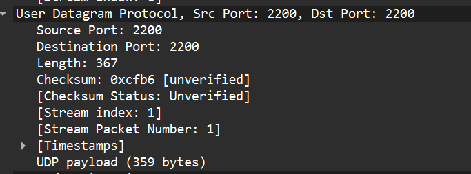
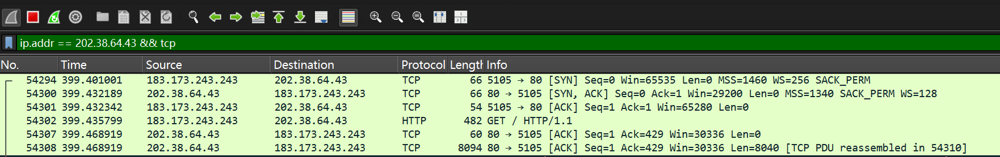

# Wireshark 抓包实验报告

## 实验 1：观察 UDP 消息

### (1) UDP 数据包在 IP 层的类型编号

在 IP 数据报的首部中，“Protocol”字段标识了上层协议类型。对于 UDP 协议，其协议编号为 17（十六进制为 `0x11`）。

---

### (2) UDP 数据包头字段依次是？

UDP 首部共有 8 个字节，字段依次为：源端口号 (Source Port)、目的端口号 (Destination Port)、长度 (Length) 以及校验和 (Checksum)。

---

## 实验 2：观察 TCP 消息

### (1) TCP 数据包在 IP 层的类型编号

在 IP 数据报首部的“Protocol”字段中，TCP 协议的类型编号为 6。

---

### (2) TCP 数据包头字段依次是？

TCP 首部包含：源端口、目的端口、序列号、确认号、数据偏移、保留位、控制标志位（URG/ACK/PSH/RST/SYN/FIN）、窗口大小、校验和、紧急指针以及可选的选项字段。

### (3) 三次握手过程及选项协商

特点：第一次 (SYN)：标记位为 SYN，$Seq = 0$，$Ack = 0$。第二次 (SYN+ACK)：标记位为 SYN, ACK，$Seq = 0$，$Ack = 1$ (对原 Seq 加 1)。第三次 (ACK)：标记位为 ACK，$Seq = 1$，$Ack = 1$。选项协商例子：图中可见 MSS=1460，表示发送方在本连接中能接收的最大报文段长度为 1460 字节。

---

### (4) 序列号与确认序列号的关系

序列号增长与包长关系：下一个数据包的 $Seq = \text{当前 } Seq + \text{当前包的 TCP Payload 长度}$。确认号表示接收方已经成功收到该序号之前的所有数据，并期待接收该序号开始的数据。

## 实验 3：简述题

### (1) TCP 选项还支持什么特殊功能？

除了 MTU/MSS 协商外，TCP 选项还支持：

 窗口缩放 (Window Scale)：扩展 16 位窗口限制，支持更大带宽延迟积。
 时间戳 (Timestamps)：用于计算 RTT 及防止序列号回绕 (PAWS)。
 选择性确认 (SACK)：允许只重传丢失的分段，提高重传效率。

### (2) 反射 DoS 攻击为什么大多使用基于 UDP 的公共服务？

1. 无须握手：UDP 无连接，伪造源 IP 发送请求后，服务器直接回复受害者，而 TCP 需要三次握手验证 IP 有效性。
2. 放大倍数高：DNS、NTP 等协议请求小、回复大，能产生巨大的流量放大效应，使受害者带宽快速耗尽。

