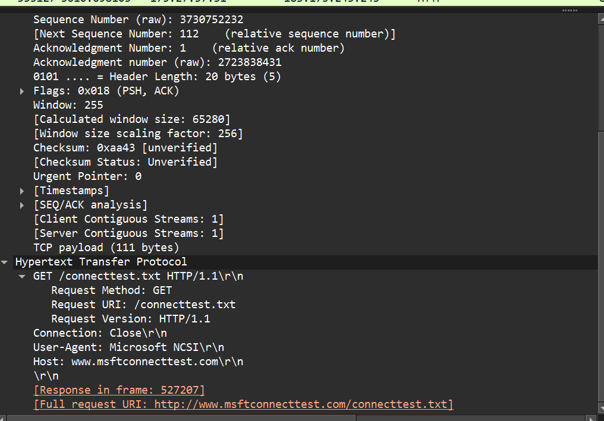
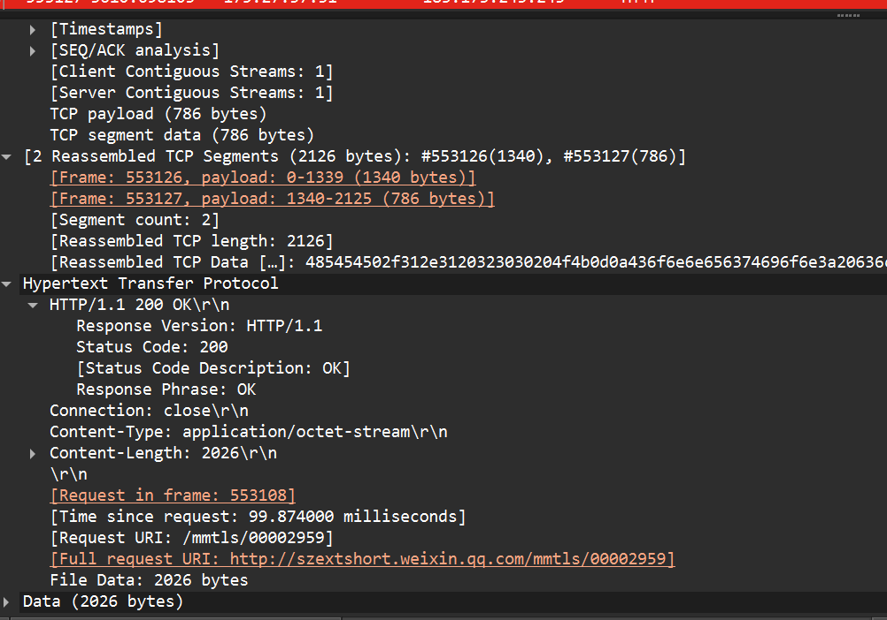
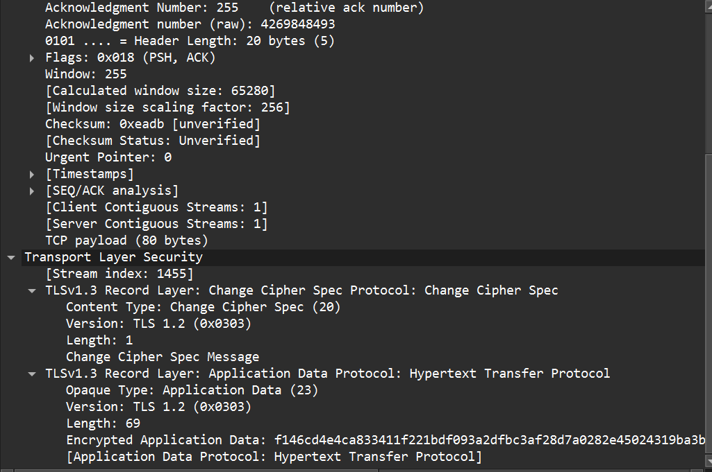

# Wireshark 抓包实验-5 实验报告

## 2. 实验题目及指导

### 抓包实验 1：观察 HTTP 数据包

#### (1) HTTP 使用的传输层协议是什么？

HTTP 协议使用的传输层协议是 TCP。它通过 TCP 建立可靠的连接后进行数据交换。

---

#### (2) HTTP 请求包信息

 请求方法：GET
 Host：example.com
 URL：/ （根目录）
 HTTP 版本：HTTP/1.1

#### (3) HTTP 响应包信息

 状态码：200 OK
 Content-Type：text/html; charset=UTF-8

### 观察 TLS (HTTPS) 数据包

#### (4) TLS 版本及内容可见性

 TLS 版本： TLS 1.3。
 内容可见性：无法看到具体的 HTTP 请求或响应内容。
 原因：由于 TLS 协议对应用层数据进行了加密传输，在 Wireshark 中只能看到加密后的 Application Data，确保了数据的私密性。

#### (5) HTTPS 整体交互流程简述

HTTPS 流程主要包括：

1. TCP 三次握手建立基础连接。
2. TLS 握手：客户端发送 `Client Hello`，服务器回复 `Server Hello`、证书及密钥交换信息。
3. 加密传输：双方协商对称加密密钥后，开始传输加密的 `Application Data`。

## 3. 简述题

### (1) 分析 HTTP 头部与 IP/TCP 头的设计思路差异

 表现形式：IP/TCP 头部采用二进制定长/偏移设计，字段位置固定（如协议号始终在 IP 头的固定偏移处），旨在提高硬件处理和转发效率。
 文本化 vs 二进制：HTTP 头部采用 ASCII 文本形式（Key-Value 结构），每行以回车换行符结束。
 扩展性：HTTP 设计思路侧重于灵活性与可读性，允许通过自定义 Header 轻松扩展功能；而 IP/TCP 头部设计更侧重于传输效率与低开销。

