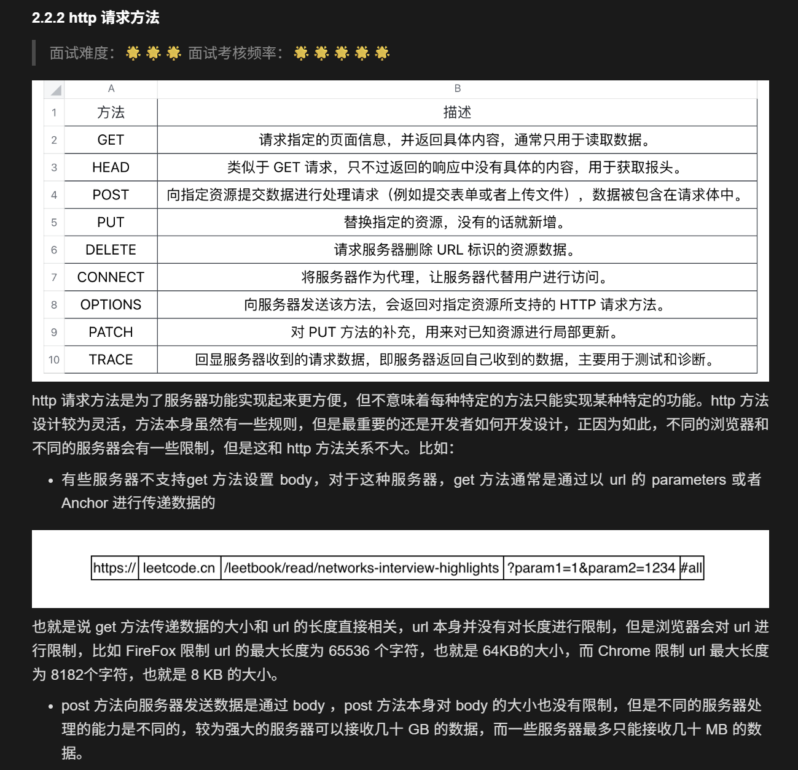

# 计算机网络


## 第一部分：计算机网络体系结构


### 1.1 OSI 七层模型

OSI(Open System Interconnection Reference Model) 模型是国际标准化组织 ISO（International Organization for Standardization) 提出的一个试图使各种计算机在世界范围内互连为网络的标准框架。
OSI 将计算机网络体系结构划分为七层，每一层实现各自的功能和协议，并完成与相邻层的接口通信。OSI 的服务定义详细说明了各层所提供的服务。

应用层：通过应用程序间的交互来完成特定的网络应用
表示层：解释交换数据的含义。该层提供的服务主要包括数据压缩，数据加密以及数据描述。
会话层：负责建立、管理和终止表示层实体之间的通信会话。该层提供了数据交换的定界和同步功能，包括了建立检查点和恢复方案的方法。
传输层：负责因特网中两台主机的进程提供通信服务。
网络层：选择合适的网间路由和交换节点，确保数据按时成功传送。
数据链路层(链路层)：数据链路层将网络层交下来的 IP 数据报组装成帧，在两个相邻节点间的链路上传送帧。
物理层：实现计算机节点之间比特流的透明传送，尽可能屏蔽掉具体传输介质和物理设备的差异。该层的主要任务是确定与传输媒体的接口的一些特性（机械特性、电气特性、功能特性，过程特性）


### 1.2 TCP/IP 五层参考模型


五层体系的协议结构是综合了 OSI 和 TCP/IP 优点的一种协议，包括应用层、传输层、网络层、数据链路层和物理层。其中应用层对应 OSI 的上三层，下四层和 OSI 相同。五层协议的体系结构只是为介绍网络原理而设计的，实际应用还是 TCP/IP 四层体系结构。

应用层 ：为特定应用程序提供数据传输服务。
传输层 ：为进程提供通用数据传输服务。
网络层 ：为主机提供数据传输服务。而传输层协议是为主机中的进程提供数据传输服务。
数据链路层 ：网络层针对的还是主机之间的数据传输服务，而主机之间可以有很多链路，链路层协议就是为同一链路的主机提供数据传输服务。
物理层 ：负责比特流在传输介质上的传播。

### 1.3 对比两种网络模型

| 特性 | OSI 七层模型 | TCP/IP 五层模型 |
|------|---------------|-----------------|
| 层数 | 7 层 | 5 层 |
| 应用层 | 包含应用层、表示层、会话层 | 仅包含应用层 |
| 传输层 | 仅提供端到端的通信 | 提供端到端的通信 |
| 网络层 | 提供逻辑地址和路由选择 | 提供逻辑地址和路由选择 |
| 数据链路层 | 提供物理地址和链路控制 | 提供物理地址和链路控制 |
| 物理层 | 定义物理媒介和信号 | 定义物理媒介和信号 |


### 1.4 数据如何在各层直接传输


假设一个主机上的一个应用向另一个主机的一个应用发送数据。

在发送主机端，一个应用层报文被传送到传输层。在最简单的情况下，传输层收取到报文并附上附加信息，该首部将被接收端的传输层使用。
应用层报文和传输层首部信息一道构成了传输层报文段。附加的信息可能包括：允许接收端传输层向上向适当的应用程序交付报文的信息以及差错检测位信息。该信息让接收端能够判断报文中的比特是否在途中已被改变。
传输层则向网络层传递该报文段，网络层增加了如源和目的端系统地址等网络层首部信息，生成了网络层数据报文。
该数据报文接下来被传递给链路层，在数据链路层数据包添加发送端 MAC 地址和接收端 MAC 地址后被封装成数据帧。
在物理层数据帧被封装成比特流，之后通过传输介质传送到对端。而在接收主机端，整个过程正好反过来。

## 第二部分：应用层


网络应用是计算机网络存在的理由，而网络应用都是处于应用层的，所以应用层是计算机网络中最重要的部分之一。

本章高频面试题
uri 和 url 的区别 ？
dns 是啥工作原理，主要解析过程是啥？
用户输入网址到显示对应页面的全过程是啥？
http 头部包含哪些信息？
http 方法了解哪些？
http 状态码了解哪些？
get 和 post 的区别？
https 和 https 的区别？
https 的加密方式？
http 是不保存状态的协议,如何保存用户状态？
http 不同版本的区别？

### 2.1 万维网和域名系统


2.1.5 网页解析全过程


### 2.2 http


```bash
// 第一部分：简略信息
GET https://leetcode.cn/problemset/all/ HTTP/1.1.  
// 第二部分：请求首部或者响应首部
Accept: text/html,application/xhtml+xml,application/xml;q=0.9,image/webp,image/apng,*/*;q=0.8,application/signed-exchange;v=b3;q=0.9
Accept-Encoding: gzip, deflate
Accept-Language: zh-CN,zh;q=0.9,en;q=0.8
Cache-Control: max-age=0
Host: leetcode.cn
If-Modified-Since: Thu, 17 Oct 2019 07:18:26 GMT
If-None-Match: "3147526947+gzip"
Proxy-Connection: keep-alive
Upgrade-Insecure-Requests: 1
User-Agent: Mozilla/5.0 xxx
// --------- 空行 --------------
// 第三部分，内容主体
param1=1&param2=2


```



http请求首部目录：https://developer.mozilla.org/en-US/docs/Web/HTTP/Headers

与状态码一样，对于 http 首部，只要记住几个常用的就可以


### 2.3 网络编程 socket


