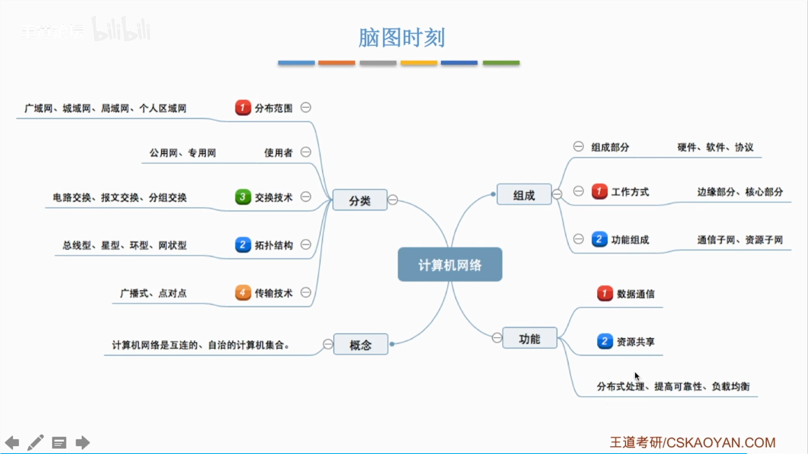

# 1计网体系结构

## 组成

清华和北大机房中的电脑有可能又相同的ip
192.168.0.1

## 分类

电路交换、报文交换、分组交换的区别，存储转发

1. 电路交换
   - 定义：在通信双方之间建立一个专用的通信线路，数据以固定的速率传输。
   - 优点：传输延迟小，适合实时通信。
   - 缺点：资源利用率低，建立连接时间长。
    - 例子：传统电话系统。

2. 报文交换
   - 定义：将数据分成多个报文，独立传输，最终在目的地重新组装。
   - 优点：资源利用率高，适合大规模数据传输。
   - 缺点：传输延迟大，不适合实时通信。
   - 例子：电子邮件。

3. 分组交换
   - 定义：将数据分成多个小分组，独立传输，路由选择灵活。
   - 优点：资源利用率高，适合多种类型的通信。
   - 缺点：传输延迟不稳定，可能出现丢包。
   - 例子：互联网。

## 指标

### 速度

速率和存储单位换算单位不一样，1B=8b，1KB=1024B，1MB=1024KB，1GB=1024MB。

### 时间

## 体系结构 参考模型

对等实体之间才有协议，是因为它们需要在相同的层次上进行通信，以便理解彼此的消息和行为。

接口和服务是不同的概念。接口定义了不同层次之间的交互方式，而服务则是一个层次向上层提供的功能或操作。接口是服务的实现方式，而服务是通过接口提供给上层的功能。

### OSI

路由器只接受底下三层，网关和交换机下面两层

上面四层是直接端到端的链接，点到点是下面三层

七层分别结构

### TCP IP

### 5层参考模型

# 物理层

单工 半双工 双工

串行和并行

同步和异步

## 码元 速率 带宽

码元是最小可分的波形组合，比如4进制就是四种00 01 10 11

## 奈氏准则 香农定理

香农定理

两者曲奇小

## 编码与调制
 

曼彻斯特编码

差分曼彻斯特编码

采样定理

## 数据交换方式

电路交换

报文交换

分组交换

数据报

虚电路方式

## 传输介质

 

光纤，光的频率非常高，所以带宽非常大

非导向性传输介质

## 物理层设备

# 数据链路层

## 封装成帧

## 差错控制

### 检错编码

 

### 纠错编码

校验码负责的位数中1的个数要是偶数

## 可靠传输和流量控制

