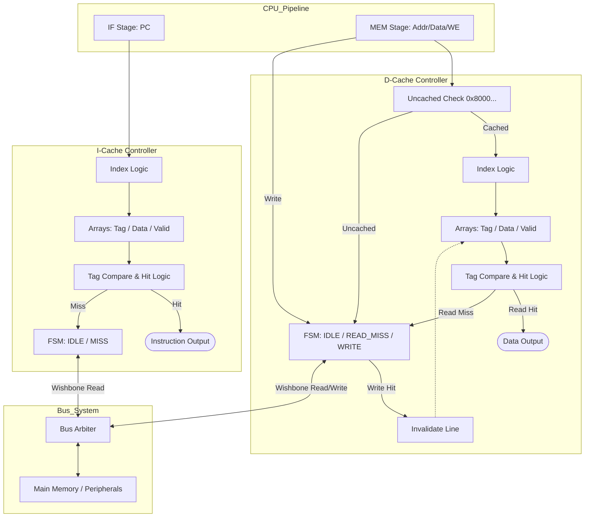
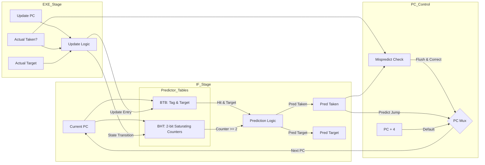

# Cache 与分支预测子系统设计文档

## 1. Cache 子系统设计

我采用了独立的指令缓存和数据缓存的哈佛架构设计两者均采用 直接映射 方式，但在写策略和一致性维护上有所不同

### 1.1 I-Cache

#### 设计规格
   映射方式: 直接映射 (Direct Mapped)
   行大小 (Line Size): 4 Bytes (1 Word)
   容量: 默认 16 行 
   替换策略: 直接覆盖

#### 状态机设计
I-Cache 内部维护了一个简单的二段式状态机：
1.  STATE_IDLE:
       Hit: 若 `valid` 有效且 `tag` 匹配，直接在一个周期内返回指令 (`inst_valid_o = 1`)
       Miss: 若未命中，拉低 `inst_valid_o`（导致流水线暂停），发起 Wishbone 读请求，并跳转至 `STATE_MISS`
2.  STATE_MISS:
       等待 Wishbone 总线应答 (`wbm_ack_i`)
       数据返回后，写入 Cache 行 (Tag + Data + Valid)，并返回 `STATE_IDLE`

### 1.2 D-Cache 

#### 设计规格
   映射方式: 直接映射 (Direct Mapped)
   行大小: 4 Bytes (1 Word)
   写策略: 写失效 (Write-Invalidate) + 写穿透 (Write-Through) 类似机制
       所有写操作都直接发送到总线（Write-Through）
       若写命中，则直接将 Cache 中的该行置为无效，这种一致性维护策略实现起来很简单，避免了更新 Cache 数据或处理 Dirty 位的复杂性
   Uncached 区域:
       通过地址高位判断：`addr[31:28] != 4'h8` (即非 `0x8...` 开头的地址) 认定为 Uncached 区域
       Uncached 地址（如外设 IO）的读写均直接走总线，且读回的数据不会填入 Cache

#### 状态机设计
D-Cache 维护三段式状态机：
1.  STATE_IDLE:
       读 Hit (Cached): 直接返回数据
       读 Miss / Uncached: 发起 Wishbone 读请求，跳转至 `STATE_READ_MISS`
       写操作: 发起 Wishbone 写请求，跳转至 `STATE_WRITE`
2.  STATE_READ_MISS:
       等待读响应数据返回后，若是 Cached 区域，则填入 Cache
3.  STATE_WRITE:
       等待写响应若写命中，则 Invalidate 对应的 Cache 行

---

## 2. 分支预测设计

我采用了 动态分支预测 技术，结合了 BTB (分支目标缓冲) 和 BHT (分支历史表)

### 2.1 预测器结构
   BTB (Branch Target Buffer):
       存储跳转指令的 Tag 和 目标地址 (Target)
       用于识别当前 PC 是否是一条跳转指令，并提供跳转目标
   BHT (Branch History Table):
       维护一组 2-bit 饱和计数器
       状态定义：`00` (强不跳), `01` (弱不跳), `10` (弱跳), `11` (强跳)
       只有当计数器最高位为 1 (即 10 或 11) 时，才预测跳转

### 2.2 工作流程
1.  预测阶段 (IF Stage):
       使用当前 `pc_i` 索引 BTB 和 BHT
       预测跳转条件: BTB 命中 (Valid & Tag Match) 且 BHT 计数器指示跳转 (>= 2)
       若预测跳转，输出 `pred_taken_o = 1` 和 `pred_target_o`
2.  更新阶段 (EXE Stage):
       在 EXE 阶段计算出实际的分支结果后，通过 `update_` 信号更新预测器
       更新 BTB: 写入新的 Tag 和 Target
       更新 BHT: 根据实际跳转结果 (`update_taken_i`) 更新饱和计数器状态机

### 2.3 恢复机制 
PC 选择逻辑具有严格的优先级，以处理误预测：
1.  最高优先级 (Mispredict): 若 EXE 阶段发现预测错误 (`mispredict_i`)，强制使用修正后的地址 (`correct_pc_i`)
2.  次优先级 (Prediction): 若 IF 阶段预测跳转 (`pred_taken_i`)，使用预测地址 (`pred_target_i`)
3.  默认: 使用 `PC + 4`

## 3. 遇到的困难与解决方案

### 3.1 困难：数据一致性与外设副作用
   问题: D-Cache 如果缓存了串口状态寄存器，会导致轮询程序死循环（读不到最新状态）而且同时，Store 指令如果是只更新 Cache 不更新主存，外设 DMA 就没办法获取最新数据
   解决方案:
       地址空间划分: 硬件识别 `0x80000000` 以下地址为 Uncached，强制走总线
       Write-Invalidate: 写操作直接使 Cache 行失效虽然牺牲了部分写后读 (Read-After-Write) 的性能，但是这样的话彻底消除了 Cache 与主存不一致的风险，而且硬件实现很简单

### 3.2 困难：分支预测的更新时机
   问题: 预测是在 IF 阶段进行的，但真实结果在 EXE 阶段才产生，那应该如何将 EXE 的结果反馈给 IF 的预测器？
   解决方案:
       预测器模块同时暴露两组接口：一组给 IF (读/预测)，一组给 EXE (写/更新)
       利用 SystemVerilog语言 的 `always_ff` 块在时钟沿处理更新，保证下一周期的预测能利用最新的历史信息

### 3.3 困难：流水线气泡控制
   问题: Cache Miss 需要暂停流水线，但是分支误预测需要冲刷流水线两者同时发生怎么办？
   解决方案:
       将 Cache 的 `valid/ready` 信号作为流水线寄存器的 `stall` 信号
       将分支误预测信号作为流水线寄存器的 `flush/bubble` 信号
       在流水线控制单元 (`hazard_unit`) 中统一仲裁，设置 Flush 优先级高于 Stall

## 4. 设计框图

cache

分支预测

