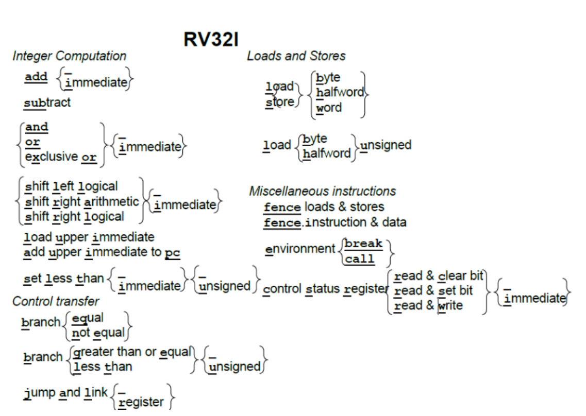

# supervisor-rv

Windows 用户可在解压缩 rv.zip 之后，从 supervisor-rv 子目录中找到监控程序，但强烈建议依据上述的 URL 获得最新版本的监控程序。

进入目录后，可以看到两个文件和两个目录：

LICENSE Apache 版权申明文件；
README.md 这个文件非常重要，务必仔细阅读，包含了监控程序的相关内容，以及需要实现的指令和格式；
kernel 这个目录包含了监控程序的代码，务必仔细阅读；
term 这个目录包含了终端程序的代码，务必仔细阅读。

## kernel

## term


# rv32i

[课程相关页面](https://lab.cs.tsinghua.edu.cn/cod-lab-docs/labs/lab1/riscv-inst/)



RV32I 里“右移”有两种：**逻辑右移 SRL/SRLI** 和 **算术右移 SRA/SRAI**。区别在于高位如何填充、以及是否保持符号。

* **SRL / SRLI（逻辑右移）**
  高位**补 0**。不看符号位，适用于**无符号数**或当作位移/掩码操作。
  例：`0x8000_0001 SRL 1 → 0x4000_0000`

* **SRA / SRAI（算术右移）**
  高位用**原符号位（bit31）复制**，保持数值的正负号。相当于对二补数做“除以 2 且向负无穷取整”。
  例：`0xFFFF_FFFD (-3) SRA 1 → 0xFFFF_FFFE (-2)`
  `0x8000_0001 SRA 1 → 0xC000_0000`

补充要点

* `…I` 结尾的是**立即数**版本；寄存器版本的移位量来自 `rs2`。
* 在 **RV32** 中移位量只取**低 5 位**（0–31），更高位被忽略。
* C 里 `>>` 对无符号通常对应 **SRL**，对有符号常实现为 **SRA**（但标准上曾是实现相关），在汇编里需显式选 **SRL** 或 **SRA**。


下面给你一份**RV32I 一页速查表**（只含基础整数指令）。每行包含：**助记符**、**类型**（R/I/S/B/U/J）、**编码关键字**（opcode / funct3 / funct7 或说明）、**语义**、**影响**（写哪些寄存器/是否改PC；RV32I 无条件码标志位）。

---

## RV32I 一页速查表

### 算术/逻辑（寄存器-寄存器，`opcode=0110011`）

| 指令                | 类型 | funct7    | funct3 | 语义                      | 影响   |
| ----------------- | -- | --------- | ------ | ----------------------- | ---- |
| `ADD rd,rs1,rs2`  | R  | `0000000` | `000`  | rd = rs1 + rs2          | 写 rd |
| `SUB rd,rs1,rs2`  | R  | `0100000` | `000`  | rd = rs1 - rs2          | 写 rd |
| `SLL rd,rs1,rs2`  | R  | `0000000` | `001`  | rd = rs1 << (rs2\[4:0]) | 写 rd |
| `SLT rd,rs1,rs2`  | R  | `0000000` | `010`  | rd = (rs1 < rs2) 有符号    | 写 rd |
| `SLTU rd,rs1,rs2` | R  | `0000000` | `011`  | rd = (rs1 < rs2) 无符号    | 写 rd |
| `XOR rd,rs1,rs2`  | R  | `0000000` | `100`  | rd = rs1 ^ rs2          | 写 rd |
| `SRL rd,rs1,rs2`  | R  | `0000000` | `101`  | 逻辑右移                    | 写 rd |
| `SRA rd,rs1,rs2`  | R  | `0100000` | `101`  | 算术右移                    | 写 rd |
| `OR  rd,rs1,rs2`  | R  | `0000000` | `110`  | 位或                      | 写 rd |
| `AND rd,rs1,rs2`  | R  | `0000000` | `111`  | 位与                      | 写 rd |

### 算术/逻辑立即数（`opcode=0010011`）

| 指令                   | 类型 | 额外字段             | funct3 | 语义                   | 影响   |
| -------------------- | -- | ---------------- | ------ | -------------------- | ---- |
| `ADDI rd,rs1,imm12`  | I  | —                | `000`  | rd = rs1 + imm       | 写 rd |
| `SLTI rd,rs1,imm12`  | I  | —                | `010`  | rd = (rs1 < imm) 有符号 | 写 rd |
| `SLTIU rd,rs1,imm12` | I  | —                | `011`  | rd = (rs1 < imm) 无符号 | 写 rd |
| `XORI rd,rs1,imm12`  | I  | —                | `100`  | rd = rs1 ^ imm       | 写 rd |
| `ORI  rd,rs1,imm12`  | I  | —                | `110`  | rd = rs1 \| imm      | 写 rd |
| `ANDI rd,rs1,imm12`  | I  | —                | `111`  | rd = rs1 & imm       | 写 rd |
| `SLLI rd,rs1,shamt`  | I  | `funct7=0000000` | `001`  | 左移 shamt(0–31)       | 写 rd |
| `SRLI rd,rs1,shamt`  | I  | `funct7=0000000` | `101`  | 逻辑右移                 | 写 rd |
| `SRAI rd,rs1,shamt`  | I  | `funct7=0100000` | `101`  | 算术右移                 | 写 rd |

### 载入（`opcode=0000011`）

| 指令                | 类型 | funct3 | 语义（地址 = rs1 + imm12） | 影响   |
| ----------------- | -- | ------ | -------------------- | ---- |
| `LB  rd,imm(rs1)` | I  | `000`  | 读 8 位，符号扩展到 32       | 写 rd |
| `LH  rd,imm(rs1)` | I  | `001`  | 读 16 位，符号扩展          | 写 rd |
| `LW  rd,imm(rs1)` | I  | `010`  | 读 32 位               | 写 rd |
| `LBU rd,imm(rs1)` | I  | `100`  | 读 8 位，无符号零扩展         | 写 rd |
| `LHU rd,imm(rs1)` | I  | `101`  | 读 16 位，无符号零扩展        | 写 rd |

### 存储（`opcode=0100011`）

| 指令                | 类型 | funct3 | 语义（地址 = rs1 + imm12\[分裂成 S 型]） | 影响 |
| ----------------- | -- | ------ | ------------------------------ | -- |
| `SB rs2,imm(rs1)` | S  | `000`  | 写 rs2\[7:0]                    | 内存 |
| `SH rs2,imm(rs1)` | S  | `001`  | 写 rs2\[15:0]                   | 内存 |
| `SW rs2,imm(rs1)` | S  | `010`  | 写 rs2\[31:0]                   | 内存 |

### 跳转/分支

| 指令                 | 类型 | opcode    | funct3 | 语义                                 | 影响        |
| ------------------ | -- | --------- | ------ | ---------------------------------- | --------- |
| `JAL rd,offset`    | J  | `1101111` | —      | rd = pc+4；pc += signext(offset)    | 写 rd、改 PC |
| `JALR rd,rs1,imm`  | I  | `1100111` | `000`  | t = (rs1+imm)&\~1；rd = pc+4；pc = t | 写 rd、改 PC |
| `BEQ rs1,rs2,off`  | B  | `1100011` | `000`  | rs1==rs2 则 pc += off               | 改 PC      |
| `BNE rs1,rs2,off`  | B  | `1100011` | `001`  | 不等则跳                               | 改 PC      |
| `BLT rs1,rs2,off`  | B  | `1100011` | `100`  | 有符号 < 则跳                           | 改 PC      |
| `BGE rs1,rs2,off`  | B  | `1100011` | `101`  | 有符号 ≥ 则跳                           | 改 PC      |
| `BLTU rs1,rs2,off` | B  | `1100011` | `110`  | 无符号 < 则跳                           | 改 PC      |
| `BGEU rs1,rs2,off` | B  | `1100011` | `111`  | 无符号 ≥ 则跳                           | 改 PC      |

### 立即数装入/PC 相对（U 型）

| 指令               | 类型 | opcode    | 语义                      | 影响   |
| ---------------- | -- | --------- | ----------------------- | ---- |
| `LUI rd,imm20`   | U  | `0110111` | rd = imm20 << 12        | 写 rd |
| `AUIPC rd,imm20` | U  | `0010111` | rd = pc + (imm20 << 12) | 写 rd |

### 杂项 / 屏障 / 系统

| 指令                   | 类型 | opcode    | funct3 | 语义                      | 影响         |          |
| -------------------- | -- | --------- | ------ | ----------------------- | ---------- | -------- |
| `FENCE pred,succ`    | I  | `0001111` | `000`  | 内存屏障（次序约束）              | 无寄存器；顺序影响  |          |
| `FENCE.I`            | I  | `0001111` | `001`  | 指令取指与数据可见性同步            | 无寄存器       |          |
| `ECALL`              | I  | `1110011` | `000`  | 环境调用                    | 进入环境；PC 转移 |          |
| `EBREAK`             | I  | `1110011` | `000`  | 断点                      | 进入调试；PC 转移 |          |
| `CSRRW rd,csr,rs1`   | I  | `1110011` | `001`  | 交换：t=CSR; CSR=rs1; rd=t | 写 rd/CSR   |          |
| `CSRRS rd,csr,rs1`   | I  | `1110011` | `010`  | 读并置位：CSR                | = rs1      | 写 rd/CSR |
| `CSRRC rd,csr,rs1`   | I  | `1110011` | `011`  | 读并清位：CSR &= \~rs1       | 写 rd/CSR   |          |
| `CSRRWI rd,csr,uimm` | I  | `1110011` | `101`  | 立即数版本（写 CSR=uimm）       | 写 rd/CSR   |          |
| `CSRRSI rd,csr,uimm` | I  | `1110011` | `110`  | 立即数置位                   | 写 rd/CSR   |          |
| `CSRRCI rd,csr,uimm` | I  | `1110011` | `111`  | 立即数清位                   | 写 rd/CSR   |          |

> 备注
>
> * `x0` 恒为 0；对 `rd=x0` 的写入被丢弃。
> * RV32I **没有条件码标志位**（ZF、CF 等都不存在）；所有比较通过结果寄存器或分支立即判断完成。
> * 立即数字段：I/S/B 为 12 位有符号；U/J 为 20 位（拼接时按各自编码位布局）；移位量 `shamt` 为 5 位。
> * 分支/跳转位移按 2 字节对齐（最低位为 0）。

---

## 迷你示例：PC 相对寻址 + 条件分支

```asm
    # 以 AUIPC 做基址 + LW 读常量表
    AUIPC  a0, %pcrel_hi(table)   # a0 = pc + hi20(table-pc)
    LW     t0, %pcrel_lo(table)(a0) # t0 = *(a0 + lo12)
    ADDI   t1, x0, 100
    BLT    t0, t1, less            # if t0 < 100 跳转
    ADDI   a1, x0, 1               # not less
    J      done
less:
    ADDI   a1, x0, -1
done:
    EBREAK

table:
    .word 42
```

如果你希望，我也可以把这份速查表导出成 **A4/PDF**（带更紧凑排版与页眉页脚），或者按你日常使用的寄存器别名（`a0–a7, t0–t6, s0–s11`）再补一张寄存器速查。


## 位置与作用（以 RV32I 为例）

简短说：

* **opcode**：7 位“主操作码”，在指令最低位 `[6:0]`。它先决定**指令格式**（R/I/S/B/U/J 之一）和大类（如“寄寄算术”“载入”“存储”“分支”“系统”等）。
* **funct3**：3 位“功能码”，在 `[14:12]`。在同一个 opcode 之下进一步区分**具体子操作**（如分支条件、载入/存储数据宽度、算术/逻辑是哪一种等）。
* **funct7**：7 位“功能码”，在最高位 `[31:25]`。在某些 R 型/移位类指令里再细分操作（比如 ADD vs SUB、SRL vs SRA）。很多非 R 型指令把这 7 位拿去做立即数的一部分，因此**并不总是存在**“funct7”的意义。

---


### R 型（寄存器-寄存器算术）

```
31        25 24  20 19  15 14  12 11   7 6      0
[ funct7   ][ rs2 ][ rs1 ][funct3][ rd ][ opcode]
```

* `opcode=0110011` 表示“整数寄寄运算”。
* `funct3` 指出是哪一组操作；`funct7` 再细分：

  * `ADD`：funct7=`0000000`、funct3=`000`
  * `SUB`：funct7=`0100000`、funct3=`000`（与 ADD 仅 funct7 不同）
  * `SRL`：funct7=`0000000`、funct3=`101`
  * `SRA`：funct7=`0100000`、funct3=`101`

### I 型（算术立即数 / 载入 / JALR / CSR）

```
31           20 19  15 14  12 11   7 6      0
[   imm[11:0]  ][ rs1 ][funct3][ rd ][ opcode]
```

* 这里没有 funct7，这些高位是**立即数**。
* `opcode=0010011`（算术立即数）时，`funct3` 区分操作：`000`=ADDI，`110`=ORI，`111`=ANDI 等；
* 移位立即数用 `funct3=001/101` 再用“伪 funct7”位区分：`0000000`=SLLI/SRLI，`0100000`=SRAI。
* `opcode=0000011`（载入）时，`funct3` 指定宽度：`000`=LB，`001`=LH，`010`=LW，`100`=LBU，`101`=LHU。
* `opcode=1100111`（JALR）固定 `funct3=000`。
* `opcode=1110011`（系统/CSR）时，`funct3` 区分 CSRRW/CSRRS/CSRRC 以及它们的立即数版本。

### S 型（存储）

```
31   25 24  20 19  15 14  12 11   7 6      0
[imm[11:5]][ rs2 ][ rs1 ][funct3][imm[4:0]][opcode]
```

* `opcode=0100011`；`funct3` 指定宽度：`000`=SB，`001`=SH，`010`=SW。

### B 型（条件分支）

```
31   30  25 24  20 19  15 14  12 11   8 7    6 6      0
[imm[12|10:5]][ rs2 ][ rs1 ][funct3][imm[4:1|11]][opcode]
```

* `opcode=1100011`；`funct3` 指定条件：`000`=BEQ，`001`=BNE，`100`=BLT，`101`=BGE，`110`=BLTU，`111`=BGEU。

### U/J 型（高位立即数 / 立即跳转）

```
U: 31           12 11   7 6      0      J: 31 30 21 20 19   12 11   7 6      0
   [   imm[31:12]  ][ rd ][ opcode]        [imm[20|10:1|11|19:12]][ rd ][opcode]
```

* 没有 funct3/funct7。
* `LUI` `opcode=0110111`，`AUIPC` `opcode=0010111`；`JAL` `opcode=1101111`。

---

## 小结

* **opcode**：决定“这是一大类什么指令 + 用什么格式解码”。
* **funct3 / funct7**：在该大类下**精确到哪条具体指令**；R 型大量使用两者组合；其它格式多用 `funct3`，高位则用于立即数。
* 它们三者一起构成了解码表的关键字段：**同一 opcode + funct3 +（可选）funct7** ≈ 一条唯一的指令。


