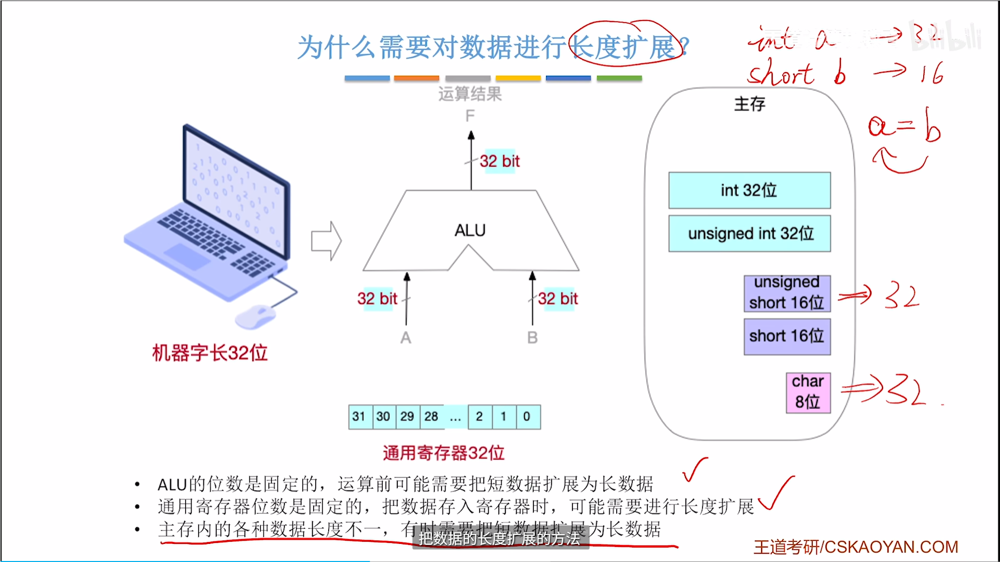

# 简介

## 硬件

[这个视频非常好](https://www.bilibili.com/video/BV1ps4y1d73V?t=1114.5&p=5)

取指令动作完成之后，PC 会自动加 1，指向下一条指令。

MQ中存储器：乘法器和除法器的中间结果寄存器，存储低位

## 软件

## 计算机系统层次

## 工作原理

## 性能指标

主频除以CPI就是每秒钟执行的指令数

# 数据的表示和运算

乘积取整

## 定点数编码表示

原码

反码

补码

移码

补码为什么要取反加一

零扩展，符号扩展是什么意思，

零扩展是指在高位补零，使得数据位数增加而数值不变。例如，将8位的0b00001111扩展为16位的0b0000000000001111。
符号扩展是指在高位补符号位（正数补零，负数补一），使得数据位数增加而数值不变。例如，将8位的0b11110000（-16）扩展为16位的0b1111111111110000。

## 多路选择器

## 三态门

