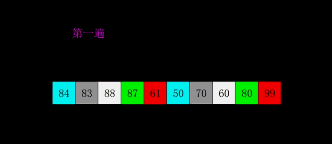

here to write my code in leetcode

# 算法面试小抄

## 算法和数据结构

### 时间复杂度


这张表很全面


### 输入规模


### 排序算法
所有主要的编程语言都有一个内置的排序方法。假设并说排序成本为 O(n⋅logn)。通常是正确的，其中 n 是要排序的元素数。为了完整起见，这里有一个图表，列出了许多常见的排序算法及其完整性。编程语言实现的算法各不相同；例如，Python 使用 Timsort，但在 C++ 中，特定算法不是强制性的并且会有所不同


### 通用DSA流程图

这是一个流程图，可以帮助您确定应该使用哪种数据结构或算法。请注意，此流程图非常笼统，因为不可能涵盖每个场景。


## 算法题代码模板

### 双指针
只有一个输入, 从两端开始遍历


### 双指针
有两个输入, 两个都需要遍历完


### 滑动窗口


### 构建前缀和


### 高效的字符串构建


### 链表: 快慢指针


### 反转链表


### 找到符合确切条件的子数组数


### 单调递增栈


### 二叉树: DFS (递归)


### 二叉树: DFS (迭代)

```java
public int dfs(TreeNode root) {
    Stack<TreeNode> stack = new Stack<>();
    stack.push(root);
    int ans = 0;

    while (!stack.empty()) {
        TreeNode node = stack.pop();
        // 根据题意补充代码
        if (node.left != null) {
            stack.push(node.left);
        }
        if (node.right != null) {
            stack.push(node.right);
        }
    }

    return ans;
}

```
```cpp
int dfs(TreeNode* root) {
    stack<TreeNode*> stack;
    stack.push(root);
    int ans = 0;

    while (!stack.empty()) {
        TreeNode* node = stack.top();
        stack.pop();
        // 根据题意补充代码
        if (node->left != nullptr) {
            stack.push(node->left);
        }
        if (node->right != nullptr) {
            stack.push(node->right);
        }
    }

    return ans;
}
```


```python
def dfs(root):
    stack = [root]
    ans = 0

    while stack:
        node = stack.pop()
        # 根据题意补充代码
        if node.left:
            stack.append(node.left)
        if node.right:
            stack.append(node.right)

    return ans


```

### 二叉树: BFS

```java
public int fn(TreeNode root) {
    Queue<TreeNode> queue = new LinkedList<>();
    queue.add(root);
    int ans = 0;

    while (!queue.isEmpty()) {
        int currentLength = queue.size();
        // 做一些当前层的操作

        for (int i = 0; i < currentLength; i++) {
            TreeNode node = queue.remove();
            // 根据题意补充代码
            if (node.left != null) {
                queue.add(node.left);
            }
            if (node.right != null) {
                queue.add(node.right);
            }
        }
    }

    return ans;
}


```

```cpp
int fn(TreeNode* root) {
    queue<TreeNode*> queue;
    queue.push(root);
    int ans = 0;

    while (!queue.empty()) {
        int currentLength = queue.size();
        // 做一些当前层的操作

        for (int i = 0; i < currentLength; i++) {
            TreeNode* node = queue.front();
            queue.pop();
            // 根据题意补充代码
            if (node->left != nullptr) {
                queue.push(node->left);
            }
            if (node->right != nullptr) {
                queue.push(node->right);
            }
        }
    }

    return ans;
}


```

```python
from collections import deque

def fn(root):
    queue = deque([root])
    ans = 0

    while queue:
        current_length = len(queue)
        # 做一些当前层的操作

        for _ in range(current_length):
            node = queue.popleft()
            # 根据题意补充代码
            if node.left:
                queue.append(node.left)
            if node.right:
                queue.append(node.right)

    return ans


```

### 图: DFS (递归)
以下图模板假设节点编号从 0 到 n - 1 ，并且图是以邻接表的形式给出的。根据问题的不同，您可能需要在使用模板之前将输入转换为等效的邻接表。

```java
Set<Integer> seen = new HashSet<>();

public int fn(int[][] graph) {
    seen.add(START_NODE);
    return dfs(START_NODE, graph);
}

public int dfs(int node, int[][] graph) {
    int ans = 0;
    // 根据题意补充代码
    for (int neighbor: graph[node]) {
        if (!seen.contains(neighbor)) {
            seen.add(neighbor);
            ans += dfs(neighbor, graph);
        }
    }

    return ans;
}


```

```cpp
unordered_set<int> seen;

int fn(vector<vector<int>>& graph) {
    seen.insert(START_NODE);
    return dfs(START_NODE, graph);
}

int fn dfs(int node, vector<vector<int>>& graph) {
    int ans = 0;
    // 根据题意补充代码
    for (int neighbor: graph[node]) {
        if (seen.find(neighbor) == seen.end()) {
            seen.insert(neighbor);
            ans += dfs(neighbor, graph);
        }
    }

    return ans;
}


```

```python
def fn(graph):
    def dfs(node):
        ans = 0
        # 根据题意补充代码
        for neighbor in graph[node]:
            if neighbor not in seen:
                seen.add(neighbor)
                ans += dfs(neighbor)
        
        return ans

    seen = {START_NODE}
    return dfs(START_NODE)


```

### 图: DFS (迭代)

```java
public int fn(int[][] graph) {
    Stack<Integer> stack = new Stack<>();
    Set<Integer> seen = new HashSet<>();
    stack.push(START_NODE);
    seen.add(START_NODE);
    int ans = 0;

    while (!stack.empty()) {
        int node = stack.pop();
        // 根据题意补充代码
        for (int neighbor: graph[node]) {
            if (!seen.contains(neighbor)) {
                seen.add(neighbor);
                stack.push(neighbor);
            }
        }
    }

    return ans;
}


```

```cpp
int fn(vector<vector<int>>& graph) {
    stack<int> stack;
    unordered_set<int> seen;
    stack.push(START_NODE);
    seen.insert(START_NODE);
    int ans = 0;

    while (!stack.empty()) {
        int node = stack.top();
        stack.pop();
        // 根据题意补充代码
        for (int neighbor: graph[node]) {
            if (seen.find(neighbor) == seen.end()) {
                seen.insert(neighbor);
                stack.push(neighbor);
            }
        }
    }
}

作者：LeetCode
链接：https://leetcode.cn/leetbook/read/arithmetic-interview-cheat-sheet/0el556/
来源：力扣（LeetCode）
著作权归作者所有。商业转载请联系作者获得授权，非商业转载请注明出处。
```

```python
def fn(graph):
    stack = [START_NODE]
    seen = {START_NODE}
    ans = 0

    while stack:
        node = stack.pop()
        # 根据题意补充代码
        for neighbor in graph[node]:
            if neighbor not in seen:
                seen.add(neighbor)
                stack.append(neighbor)
    
    return ans

作者：LeetCode
链接：https://leetcode.cn/leetbook/read/arithmetic-interview-cheat-sheet/0el556/
来源：力扣（LeetCode）
著作权归作者所有。商业转载请联系作者获得授权，非商业转载请注明出处。
```

### 图: BFS

```java
public int fn(int[][] graph) {
    Queue<Integer> queue = new LinkedList<>();
    Set<Integer> seen = new HashSet<>();
    queue.add(START_NODE);
    seen.add(START_NODE);
    int ans = 0;

    while (!queue.isEmpty()) {
        int node = queue.remove();
        // 根据题意补充代码
        for (int neighbor: graph[node]) {
            if (!seen.contains(neighbor)) {
                seen.add(neighbor);
                queue.add(neighbor);
            }
        }
    }

    return ans;
}

作者：LeetCode
链接：https://leetcode.cn/leetbook/read/arithmetic-interview-cheat-sheet/0elfx2/
来源：力扣（LeetCode）
著作权归作者所有。商业转载请联系作者获得授权，非商业转载请注明出处。
```

```cpp
int fn(vector<vector<int>>& graph) {
    queue<int> queue;
    unordered_set<int> seen;
    queue.add(START_NODE);
    seen.insert(START_NODE);
    int ans = 0;

    while (!queue.empty()) {
        int node = queue.front();
        queue.pop();
        // 根据题意补充代码
        for (int neighbor: graph[node]) {
            if (seen.find(neighbor) == seen.end()) {
                seen.insert(neighbor);
                queue.push(neighbor);
            }
        }
    }
}

作者：LeetCode
链接：https://leetcode.cn/leetbook/read/arithmetic-interview-cheat-sheet/0elfx2/
来源：力扣（LeetCode）
著作权归作者所有。商业转载请联系作者获得授权，非商业转载请注明出处。
```


```python
from collections import deque

def fn(graph):
    queue = deque([START_NODE])
    seen = {START_NODE}
    ans = 0

    while queue:
        node = queue.popleft()
        # 根据题意补充代码
        for neighbor in graph[node]:
            if neighbor not in seen:
                seen.add(neighbor)
                queue.append(neighbor)
    
    return ans

作者：LeetCode
链接：https://leetcode.cn/leetbook/read/arithmetic-interview-cheat-sheet/0elfx2/
来源：力扣（LeetCode）
著作权归作者所有。商业转载请联系作者获得授权，非商业转载请注明出处。
```


### 找到堆的前 k 个元素

```java
public int[] fn(int[] arr, int k) {
    PriorityQueue<Integer> heap = new PriorityQueue<>(CRITERIA);
    for (int num: arr) {
        heap.add(num);
        if (heap.size() > k) {
            heap.remove();
        }
    }

    int[] ans = new int[k];
    for (int i = 0; i < k; i++) {
        ans[i] = heap.remove();
    }

    return ans;
}

作者：LeetCode
链接：https://leetcode.cn/leetbook/read/arithmetic-interview-cheat-sheet/0eiyfc/
来源：力扣（LeetCode）
著作权归作者所有。商业转载请联系作者获得授权，非商业转载请注明出处。
```

```cpp
vector<int> fn(vector<int>& arr, int k) {
    priority_queue<int, CRITERIA> heap;
    for (int num: arr) {
        heap.push(num);
        if (heap.size() > k) {
            heap.pop();
        }
    }

    vector<int> ans;
    while (heap.size() > 0) {
        ans.push_back(heap.top());
        heap.pop();
    }

    return ans;
}

作者：LeetCode
链接：https://leetcode.cn/leetbook/read/arithmetic-interview-cheat-sheet/0eiyfc/
来源：力扣（LeetCode）
著作权归作者所有。商业转载请联系作者获得授权，非商业转载请注明出处。
```

```python
import heapq

def fn(arr, k):
    heap = []
    for num in arr:
        # 做根据题意补充代码，根据问题的条件来推入堆中
        heapq.heappush(heap, (CRITERIA, num))
        if len(heap) > k:
            heapq.heappop(heap)
    
    return [num for num in heap]

作者：LeetCode
链接：https://leetcode.cn/leetbook/read/arithmetic-interview-cheat-sheet/0eiyfc/
来源：力扣（LeetCode）
著作权归作者所有。商业转载请联系作者获得授权，非商业转载请注明出处。
```

### 二分查找

```java
public int fn(int[] arr, int target) {
    int left = 0;
    int right = arr.length - 1;
    while (left <= right) {
        int mid = left + (right - left) / 2;
        if (arr[mid] == target) {
            // 根据题意补充代码
            return mid;
        }
        if (arr[mid] > target) {
            right = mid - 1;
        } else {
            left = mid + 1;
        }
    }

    // left 是插入点
    return left;
}

作者：LeetCode
链接：https://leetcode.cn/leetbook/read/arithmetic-interview-cheat-sheet/0eusji/
来源：力扣（LeetCode）
著作权归作者所有。商业转载请联系作者获得授权，非商业转载请注明出处。
```

```cpp
int binarySearch(vector<int>& arr, int target) {
        int left = 0;
        int right = int(arr.size()) - 1;
        while (left <= right) {
            int mid = left + (right - left) / 2;
            if (arr[mid] == target) {
                // 根据题意补充代码
                return mid;
            }
            if (arr[mid] > target) {
                right = mid - 1;
            } else {
                left = mid + 1;
            }
        }
        
        // left 是插入点
        return left;
    }

作者：LeetCode
链接：https://leetcode.cn/leetbook/read/arithmetic-interview-cheat-sheet/0eusji/
来源：力扣（LeetCode）
著作权归作者所有。商业转载请联系作者获得授权，非商业转载请注明出处。
```

```python
def fn(arr, target):
    left = 0
    right = len(arr) - 1
    while left <= right:
        mid = (left + right) // 2
        if arr[mid] == target:
            # 根据题意补充代码
            return
        if arr[mid] > target:
            right = mid - 1
        else:
            left = mid + 1
    
    # left 是插入点
    return left

作者：LeetCode
链接：https://leetcode.cn/leetbook/read/arithmetic-interview-cheat-sheet/0eusji/
来源：力扣（LeetCode）
著作权归作者所有。商业转载请联系作者获得授权，非商业转载请注明出处。
```

### 二分查找: 重复元素，最左边的插入点

```java
public int fn(int[] arr, int target) {
    int left = 0;
    int right = arr.length;
    while (left < right) {
        int mid = left + (right - left) / 2;
        if (arr[mid] >= target) {
            right = mid
        } else {
            left = mid + 1;
        }
    }

    return left;
}

作者：LeetCode
链接：https://leetcode.cn/leetbook/read/arithmetic-interview-cheat-sheet/0etkbe/
来源：力扣（LeetCode）
著作权归作者所有。商业转载请联系作者获得授权，非商业转载请注明出处。
```

```cpp
int binarySearch(vector<int>& arr, int target) {
    int left = 0;
    int right = arr.size();
    while (left < right) {
        int mid = left + (right - left) / 2;
        if (arr[mid] >= target) {
            right = mid;
        } else {
            left = mid + 1;
        }
    }
    
    return left;
}

作者：LeetCode
链接：https://leetcode.cn/leetbook/read/arithmetic-interview-cheat-sheet/0etkbe/
来源：力扣（LeetCode）
著作权归作者所有。商业转载请联系作者获得授权，非商业转载请注明出处。
```

```python
def fn(arr, target):
    left = 0
    right = len(arr)
    while left < right:
        mid = (left + right) // 2
        if arr[mid] >= target:
            right = mid
        else:
            left = mid + 1

    return left

作者：LeetCode
链接：https://leetcode.cn/leetbook/read/arithmetic-interview-cheat-sheet/0etkbe/
来源：力扣（LeetCode）
著作权归作者所有。商业转载请联系作者获得授权，非商业转载请注明出处。
```

### 二分查找: 重复元素，最右边的插入点

```java
public int fn(int[] arr, int target) {
    int left = 0;
    int right = arr.length;
    while (left < right) {
        int mid = left + (right - left) / 2;
        if (arr[mid] > target) {
            right = mid;
        } else {
            left = mid + 1;
        }
    }

    return left;
}

作者：LeetCode
链接：https://leetcode.cn/leetbook/read/arithmetic-interview-cheat-sheet/0e83yg/
来源：力扣（LeetCode）
著作权归作者所有。商业转载请联系作者获得授权，非商业转载请注明出处。
```

```cpp
int binarySearch(vector<int>& arr, int target) {
    int left = 0;
    int right = arr.size();
    while (left < right) {
        int mid = left + (right - left) / 2;
        if (arr[mid] > target) {
            right = mid;
        } else {
            left = mid + 1;
        }
    }
    
    return left;
}

作者：LeetCode
链接：https://leetcode.cn/leetbook/read/arithmetic-interview-cheat-sheet/0e83yg/
来源：力扣（LeetCode）
著作权归作者所有。商业转载请联系作者获得授权，非商业转载请注明出处。
```

```python
def fn(arr, target):
    left = 0
    right = len(arr)
    while left < right:
        mid = (left + right) // 2
        if arr[mid] > target:
            right = mid
        else:
            left = mid + 1

    return left

作者：LeetCode
链接：https://leetcode.cn/leetbook/read/arithmetic-interview-cheat-sheet/0e83yg/
来源：力扣（LeetCode）
著作权归作者所有。商业转载请联系作者获得授权，非商业转载请注明出处。
```


### 二分查找: 贪心问题

寻找最小值

```cpp
int fn(vector<int>& arr) {
    int left = MINIMUM_POSSIBLE_ANSWER;
    int right = MAXIMUM_POSSIBLE_ANSWER;
    while (left <= right) {
        int mid = left + (right - left) / 2;
        if (check(mid)) {
            right = mid - 1;
        } else {
            left = mid + 1;
        }
    }

    return left;
}

bool check(int x) {
    // 这个函数的具体实现取决于问题
    return BOOLEAN;
}

作者：LeetCode
链接：https://leetcode.cn/leetbook/read/arithmetic-interview-cheat-sheet/0e3u1v/
来源：力扣（LeetCode）
著作权归作者所有。商业转载请联系作者获得授权，非商业转载请注明出处。
```


寻找最大值

```cpp
int fn(vector<int>& arr) {
    int left = MINIMUM_POSSIBLE_ANSWER;
    int right = MAXIMUM_POSSIBLE_ANSWER;
    while (left <= right) {
        int mid = left + (right - left) / 2;
        if (check(mid)) {
            left = mid + 1;
        } else {
            right = mid - 1;
        }
    }

    return right;
}

bool check(int x) {
    // 这个函数的具体实现取决于问题
    return BOOLEAN;
}

作者：LeetCode
链接：https://leetcode.cn/leetbook/read/arithmetic-interview-cheat-sheet/0e3u1v/
来源：力扣（LeetCode）
著作权归作者所有。商业转载请联系作者获得授权，非商业转载请注明出处。
```

```python
def fn(arr):
    def check(x):
        # 这个函数的具体实现取决于问题
        return BOOLEAN

    left = MINIMUM_POSSIBLE_ANSWER
    right = MAXIMUM_POSSIBLE_ANSWER
    while left <= right:
        mid = (left + right) // 2
        if check(mid):
            left = mid + 1
        else:
            right = mid - 1
    
    return right

作者：LeetCode
链接：https://leetcode.cn/leetbook/read/arithmetic-interview-cheat-sheet/0e3u1v/
来源：力扣（LeetCode）
著作权归作者所有。商业转载请联系作者获得授权，非商业转载请注明出处。
```


### 回溯

```cpp
int backtrack(STATE curr, OTHER_ARGUMENTS...) {
    if (BASE_CASE) {
        // 修改答案
        return 0;
    }

    int ans = 0;
    for (ITERATE_OVER_INPUT) {
        // 修改当前状态
        ans += backtrack(curr, OTHER_ARGUMENTS...)
        // 撤消对当前状态的修改
    }

    return ans;
}

作者：LeetCode
链接：https://leetcode.cn/leetbook/read/arithmetic-interview-cheat-sheet/0eq7sj/
来源：力扣（LeetCode）
著作权归作者所有。商业转载请联系作者获得授权，非商业转载请注明出处。
```

```python
def backtrack(curr, OTHER_ARGUMENTS...):
    if (BASE_CASE):
        # 修改答案
        return
    
    ans = 0
    for (ITERATE_OVER_INPUT):
        # 修改当前状态
        ans += backtrack(curr, OTHER_ARGUMENTS...)
        # 撤消对当前状态的修改
    
    return ans

作者：LeetCode
链接：https://leetcode.cn/leetbook/read/arithmetic-interview-cheat-sheet/0eq7sj/
来源：力扣（LeetCode）
著作权归作者所有。商业转载请联系作者获得授权，非商业转载请注明出处。
```


### 动态规划: 自顶向下法

```cpp
unordered_map<STATE, int> memo;

int fn(vector<int>& arr) {
    return dp(STATE_FOR_WHOLE_INPUT, arr);
}

int dp(STATE, vector<int>& arr) {
    if (BASE_CASE) {
        return 0;
    }

    if (memo.find(STATE) != memo.end()) {
        return memo[STATE];
    }

    int ans = RECURRENCE_RELATION(STATE);
    memo[STATE] = ans;
    return ans;
}

作者：LeetCode
链接：https://leetcode.cn/leetbook/read/arithmetic-interview-cheat-sheet/0e6wzt/
来源：力扣（LeetCode）
著作权归作者所有。商业转载请联系作者获得授权，非商业转载请注明出处。
```


```py
def fn(arr):
    def dp(STATE):
        if BASE_CASE:
            return 0
        
        if STATE in memo:
            return memo[STATE]
        
        ans = RECURRENCE_RELATION(STATE)
        memo[STATE] = ans
        return ans

    memo = {}
    return dp(STATE_FOR_WHOLE_INPUT)

作者：LeetCode
链接：https://leetcode.cn/leetbook/read/arithmetic-interview-cheat-sheet/0e6wzt/
来源：力扣（LeetCode）
著作权归作者所有。商业转载请联系作者获得授权，非商业转载请注明出处。
```


### 构建前缀树（字典树）

```cpp
// 注意:只有需要在每个节点上存储数据时才需要使用类。
// 否则，您可以只使用哈希映射实现一个前缀树。
struct TrieNode {
    int data;
    unordered_map<char, TrieNode*> children;
    TrieNode() : data(0), children(unordered_map<char, TrieNode*>()) {}
};

TrieNode* buildTrie(vector<string> words) {
    TrieNode* root = new TrieNode();
    for (string word: words) {
        TrieNode* curr = root;
        for (char c: word) {
            if (curr->children.find(c) == curr->children.end()) {
                curr->children[c] = new TrieNode();
            }
            curr = curr->children[c];
            // 这个位置上的 curr 已经有一个完整的单词
            // 如果你愿意，你可以在这里执行更多的操作来给 curr 添加属性
        }
    }

    return root;
}

作者：LeetCode
链接：https://leetcode.cn/leetbook/read/arithmetic-interview-cheat-sheet/0ek2gr/
来源：力扣（LeetCode）
著作权归作者所有。商业转载请联系作者获得授权，非商业转载请注明出处。
```

```py
# 注意:只有需要在每个节点上存储数据时才需要使用类。
# 否则，您可以只使用哈希映射实现一个前缀树。
class TrieNode:
    def __init__(self):
        # you can store data at nodes if you wish
        self.data = None
        self.children = {}

def fn(words):
    root = TrieNode()
    for word in words:
        curr = root
        for c in word:
            if c not in curr.children:
                curr.children[c] = TrieNode()
            curr = curr.children[c]
        # 这个位置上的 curr 已经有一个完整的单词
        # 如果你愿意，你可以在这里执行更多的操作来给 curr 添加属性
    
    return root

作者：LeetCode
链接：https://leetcode.cn/leetbook/read/arithmetic-interview-cheat-sheet/0ek2gr/
来源：力扣（LeetCode）
著作权归作者所有。商业转载请联系作者获得授权，非商业转载请注明出处。
```


## 算法面试详解


### 介绍

在面试开始时，大多数情况下面试官会简单介绍自己和他们在公司的角色，然后让你做自我介绍。

准备并排练一段自我介绍。自我介绍应该在 30 秒内总结你的教育背景、工作经历和兴趣爱好。
保持微笑，且让说话的声音听起来自信。
当面试官谈论他们在公司的工作时，请注意听 - 这有助于稍后提出相关问题。
如果面试官提到任何你也感兴趣的事情，无论是他们的工作还是爱好，提出来。

### 问题陈述


在自我介绍之后，面试官会给你一个问题陈述。如果您在共享文本编辑器中答题，他们很可能将问题描述和测试用例一起粘贴到编辑器中，然后将问题读给您听。

确保你完全理解了这个问题。在面试官把问题读完之后，通过将其解释回给他们来确认问题在问什么。

询问有关输入的问题阐述，例如:

输入是只有整数，还是可以有其他类型？
我能假设输入是有序的吗？
输入是保证有元素还是可以为空？
如果给出了无效输入，我该如何处理？
询问预期的输入大小。有时候，面试官会含糊其辞，但如果他们确实给了你一个范围，这可能是一个线索。例如，如果 n 非常小，则可能是回溯。如果 n 在 100 - 1000 左右，O(n^2) 的解决方案可能是最优的。 如果 n 非常大, 那么你可以需要比 O(n) 更好的解决方案。

提出明确的问题不仅能帮助你更好地理解问题，还能表现出对细节的关注，以及对边缘情况的考虑。

### 头脑风暴 DS&A

尝试找出适用的数据结构或算法。分解问题并尝试找到你会的常用解法。弄清楚问题需要你做什么，并考虑什么样的数据结构或算法可以以较好的时间复杂度来完成。

把你的想法都说出来。这会让面试官知道你善于权衡利弊。如果问题涉及到查看子数组，那么应该考虑滑动窗口，因为每个窗口都代表一个子数组。即使你错了，面试官仍然会欣赏你的思考过程。

通过把想法都说出来，面试官也可以借此给你提示，并为你指出正确的方向。

一旦决定了要使用的数据结构/算法，现在就需要构造实际的算法。在编码之前，你应该考虑算法的大致步骤，向面试官解释这些步骤，并确保他们理解并同意这是一个合理的方法。通常，如果你走错了路，他们会巧妙地暗示你。

在这个阶段你能接受面试官所说的话是 非常 重要的。请记住：他们知道最佳解决方案。如果他们给你提示，那是因为他们希望你成功。不要固执，准备好探索他们给你的想法。

### 实操


一旦你想出了一个算法，并让面试官同意了，就该开始写代码了。

如果你打算使用一个库或模块，例如 Python 的集合，在开始之前确保面试官可以接受。
当你写代码时，解释你的决策。例如，如果你正在解决一个图形问题，当你声明一个集合 seen，解释它是为了防止访问同一个节点超过一次，从而也防止了循环。
编写干净的代码。每一种主流的编程语言都有一个关于代码应该如何编写的约定。确保你知道你打算使用的语言的基础知识。Google 提供了适用于所有主流语言的 [google code style 总结](https://google.github.io/styleguide/)。最重要的部分是大小写约定、缩进、空格和全局变量。
避免重复代码。例如，如果您在网格上进行 DFS 操作，则应该反复使用方向数组 [(0, 1), (1, 0), (0, -1), (-1, 0)] ，而不是为每个方向编写相同的逻辑 4 次。如果你发现自己在多个地方编写类似的代码，可以考虑创建一个函数或使用循环来简化它。
不要害怕使用辅助函数。它们使你的代码更加模块化，这在实际软件工程中非常重要。之后的代码说不定还会用上辅助函数。
如果你遇到困难或意识到你最初的计划可能行不通，不要慌。与面试官交流你的疑虑。如果你默默地挣扎，很可能又会钻牛角尖。

一种策略是首先实现一个暴力解决方案，同时承认 这是一个次优解决方案。完成后，分析算法的每个部分，找出哪些步骤 “慢”，并尝试思考如何加快速度。让面试官参与进来，让他们参与讨论 —— 他们通常愿意提供帮助。


### 测试 & debug


一旦你写完代码，你的面试官可能会想要测试你的代码。根据公司的不同，会有一些不同的环境:

内置测试用例，代码需要运行

这些平台类似于 LeetCode。将会有各种各样的测试用例 —— 小输入，大输入，测试边缘用例的输入。
这种环境给您的代码带来了最大的压力，因为会暴露出不完美的解决方案。
但是，它也为创建您自己的测试带来了最小的压力，因为测试用例已经内置在了内部。
自己写测试用例，代码需要运行

这些平台通常是支持运行代码的共享文本编辑器。面试官会希望你编写自己的测试用例。
要真正测试代码，你应该在代码的最外层范围编写，即代码将首先运行的地方。假设你在函数中解决了问题 (就像在 LeetCode 上)，你可以用你编写的测试用例调用你的函数，并将结果打印到控制台。
在编写自己的测试时，请确保尝试各种测试。包括边缘情况、直觉输入和可能无效的输入 (如果面试官想让你处理这种情况)。
自己写测试用例，代码不需要运行

这些平台只是共享文本编辑器，不支持运行代码。面试官会希望你编写自己的测试用例，并且手动模拟运行。
为了 “测试” 代码，你必须在每个测试用例中手动检查算法。试着压缩一些琐碎的部分 —— 例如，你正在创建一个前缀和，不要 字面上 遍历每个元素的 for 循环。可以这样说:“在这个 for 循环之后，我们将有一个前缀和，他是这样的……”。
在遍历代码时，将函数中使用的变量写入 (在编辑器中，函数外部的某处)，并不断更新它们。
不管在什么情况下，如果您的代码出现了错误，不要慌!如果环境支持运行代码，请在相关位置放置打印语句以尝试识别问题。用一个小的测试用例手动遍历(就像你没有运行环境时所做的那样)。当你这样做的时候，讨论变量的期望值应该是什么，并将它们与实际值进行比较。再说一遍，你说话越多，面试官就越容易帮助你。

### 解释与跟进

在编写算法并运行测试用例之后，准备回答关于算法的问题。你应该准备好回答的问题包括:

算法的时间和空间复杂度是多少？
你应该从最坏的情况来考虑。但是，如果最坏的情况很少，并且平均情况的运行时明显更快，那么你还应该提到这一点。
你为什么选择……？
这可以是你对数据结构的选择，算法的选择，循环配置的选择。准备好解释你的思考过程。
你认为算法在时间和空间复杂度上是否可以改进？
如果问题需要遍历输入中的每个元素 (假设输入没有排序，需要找到最大的元素)，那么你很可能无法比 O(n) 更快。否则你很可能无法比 O(logn) 更快。
如果面试官问这个问题，答案 通常 是肯定的。在断言你的算法是最优的时候要小心 —— 不要轻易使用绝对的形容。
如果面试还有剩余时间，你可能会被问到一个全新的问题。在这种情况下，从步骤 2（问题陈述）重新开始。但是，你也可能会被要求对你已经解决的问题进行跟进。面试官可能会引入新的约束，要求改进空间复杂度，或任何其他数量的东西。

这部分是为什么真正理解解决方案而不是仅仅记住它们很重要的原因。

### 结尾


面试官通常会在面试结束时留出几分钟的时间让你问一些关于他们或公司的问题。在这一点上，很少能改善面试的结果，但你肯定能让它变得更糟。

面试是双向的。你应该利用这段时间来了解这家公司，看看你是否愿意在那里工作。你应该在面试前准备一些问题，比如:

在公司的一天中会做些什么？
你为什么决定加入这家公司而不是另一家公司？
关于这份工作，你最喜欢和最不喜欢的是什么？
我可以从事什么样的工作？
所有的大公司都会有自己的科技博客。展示你对这家公司感兴趣的一个好方法是阅读一些博客文章，并编制一个关于公司为什么做出这些决定的问题清单。

保持兴趣，保持微笑，倾听面试官的回答，并提出后续问题，以表明你理解他们的答案。

如果你没有高质量的问题，或者表现得无聊或不感兴趣，这可能会给面试官一个不好的信号。如果面试官最后不喜欢你，你在技术方面做得再好也没用。

### 面试备考总览


以下是「面试的阶段」一文的摘要。如果您进行远程面试，您可以打印此浓缩版并在面试期间将其放在您面前。

第一阶段：介绍

30-60 秒介绍您的教育、工作经验和兴趣。
自信，保持微笑。
当面试官谈论他们自己时要注意，稍后将他们的工作纳入您的问题。
第二阶段：问题陈述

在面试官将问题读给你听后，将问题复述给他们。
询问有关输入的问题描述，例如预期的输入大小、边缘情况和无效输入。
第三阶段：头脑风暴 DS&A

把你所有的想法都说出来。
分解问题：弄清楚你需要做什么，并思考什么数据结构或算法可以以良好的时间复杂度完成它。
接受面试官的任何评论或反馈，他们可能试图暗示您找到正确的解决方案。
一旦你有了想法，在编码之前，向面试官解释你的想法，并确保他们理解并同意这是一种合理的方法。
第四阶段：实操

在你实际编码时解释你的决策。当你声明集合之类的东西时，解释一下目的是什么。
编写符合规范编程语言约定的代码。
避免编写重复代码 - 如果你多次编写类似代码，请使用辅助函数或 for 循环。
如果你被卡住了，不要惊慌 - 与你的面试官交流你的疑虑。
不要害怕暴力解决方案（同时承认它是暴力解法），然后通过优化 “慢” 的部分来改进它。
继续把你的想法说出来并与面试官交谈。这让他们更容易给你提示。
第五阶段：测试 & debug

遍历测试用例时，通过在文件底部写入来跟踪变量，并不断更新它们。压缩琐碎的部分，例如创建前缀和以节省时间。
如果有错误并且环境支持运行代码，将打印语句放入你的算法并遍历一个小测试用例，比较变量的预期值和实际值。
如果遇到任何问题，请直接说出问题并继续与面试官交谈。
第六阶段：解释和跟进

您应该准备回答的问题：

时间和空间复杂度，平均和最坏情况。
你为什么选择这个数据结构、算法或逻辑？
您认为该算法可以在复杂性方面进行改进吗？如果他们问你这个问题，那么答案通常是，特别是如果你的算法比 O(n) 慢。
第七阶段：结尾

准备好有关公司的问题。
对面试官的回答表现出感兴趣、微笑并提出后续问题。


# 排序算法


在不同领域，排序算法的实现各有千秋。总体来看，排序算法大致可分为十类：

选泡插：选择排序、冒泡排序、插入排序
快归希堆：快速排序、归并排序、希尔排序、堆排序
桶计基：桶排序、计数排序、基数排序
虽然工作中很少需要我们手打排序算法，只需要调用基础库中的 Arrays.sort() 便可解决排序问题。但你可曾静下心来，阅读 Arrays.sort() 背后的原理，它是采用了哪种排序算法呢？

事实上，Arrays.sort() 函数并没有采用单一的排序算法。Java 中的 Arrays.sort() 函数是由 Java 语言的几位创始人编写的，这个小小的函数逻辑严密，并且每个步骤都被精心设计，为了最大化性能做了一层又一层的优化，根据数据的概况采用双轴快排、归并或二分插入算法完成排序，堪称工业级排序算法的典范，理清之后其乐无穷。

并且，排序算法深受面试官的喜爱，在人才招聘时，总是将排序算法作为程序员的基本功来考察。对排序算法的理解深度在一定程度上反映了程序员逻辑思维的严谨度。攻克排序算法的难关是每位程序大牛的必经之路。

如牛顿所言，正是站在巨人的肩膀上，我们才能望得更远。本系列文章我们就来一起梳理一下排序算法的前世今生。

##  O(n^2) 级排序算法

### 冒泡排序

冒泡排序是入门级的算法，但也有一些有趣的玩法。通常来说，冒泡排序有三种写法：

一边比较一边向后两两交换，将最大值 / 最小值冒泡到最后一位；
经过优化的写法：使用一个变量记录当前轮次的比较是否发生过交换，如果没有发生交换表示已经有序，不再继续排序；
进一步优化的写法：除了使用变量记录当前轮次是否发生交换外，再使用一个变量记录上次发生交换的位置，下一轮排序时到达上次交换的位置就停止比较。

first method

```java
public static void bubbleSort(int[] arr) {
    for (int i = 0; i < arr.length - 1; i++) {
        for (int j = 0; j < arr.length - 1 - i; j++) {
            if (arr[j] > arr[j + 1]) {
                // 如果左边的数大于右边的数，则交换，保证右边的数字最大
                swap(arr, j, j + 1);
            }
        }
    }
}
// 交换元素
private static void swap(int[] arr, int i, int j) {
    int temp = arr[i];
    arr[i] = arr[j];
    arr[j] = temp;
}


```

second method

```java
public static void bubbleSort(int[] arr) {
    // 记录每轮冒泡是否发生了交换
    boolean swapped;
    for (int i = 0; i < arr.length - 1; i++) {
        swapped = false;
        for (int j = 0; j < arr.length - 1 - i; j++) {
            if (arr[j] > arr[j + 1]) {
                swap(arr, j, j + 1);
                swapped = true;
            }
        }
        // 如果没有发生过交换，直接退出循环
        if (!swapped) break;
    }
}


```

third method

```java

public static void bubbleSort(int[] arr) {
    boolean swapped = true;
    // 最后一个没有经过排序的元素的下标
    int indexOfLastUnsortedElement = arr.length - 1;
    // 上次发生交换的位置
    int swappedIndex = -1;
    while (swapped) {
        swapped = false;
        for (int i = 0; i < indexOfLastUnsortedElement; i++) {
            if (arr[i] > arr[i + 1]) {
                // 如果左边的数大于右边的数，则交换，保证右边的数字最大
                swap(arr, i, i + 1);
                // 表示发生了交换
                swapped = true;
                // 更新交换的位置
                swappedIndex = i;
            }
        }
        // 最后一个没有经过排序的元素的下标就是最后一次发生交换的位置
        indexOfLastUnsortedElement = swappedIndex;
    }
}
// 交换元素
private static void swap(int[] arr, int i, int j) {
    int temp = arr[i];
    arr[i] = arr[j];
    arr[j] = temp;
}


```

经过再一次的优化，代码看起来就稍微有点复杂了。最外层的 while 循环每经过一轮，剩余数字中的最大值仍然是被移动到当前轮次的最后一位。

在下一轮比较时，只需比较到上一轮比较中，最后一次发生交换的位置即可。因为后面的所有元素都没有发生过交换，必然已经有序了。

当一轮比较中从头到尾都没有发生过交换，则表示整个列表已经有序，排序完成。


通过位运算完成数字交换
```c
a = a ^ b;
b = b ^ a;
a = a ^ b;
```

### 选择排序


选择排序的思想是：双重循环遍历数组，每经过一轮比较，找到最小元素的下标，将其交换至首位。

```java
public static void selectionSort(int[] arr) {
    int minIndex;
    for (int i = 0; i < arr.length - 1; i++) {
        minIndex = i;
        for (int j = i + 1; j < arr.length; j++) {
            if (arr[minIndex] > arr[j]) {
                // 记录最小值的下标
                minIndex = j;
            }
        }
        // 将最小元素交换至首位
        int temp = arr[i];
        arr[i] = arr[minIndex];
        arr[minIndex] = temp;
    }
}


```

相同点：

都是两层循环，时间复杂度都为 n^2 都只使用有限个变量，空间复杂度 O(1)。
不同点：

冒泡排序在比较过程中就不断交换；而选择排序增加了一个变量保存最小值 / 最大值的下标，遍历完成后才交换，减少了交换次数。
事实上，冒泡排序和选择排序还有一个非常重要的不同点，那就是：

冒泡排序法是稳定的，选择排序法是不稳定的。

### 插入排序


插入排序有两种写法：

交换法：在新数字插入过程中，不断与前面的数字交换，直到找到自己合适的位置。
移动法：在新数字插入过程中，与前面的数字不断比较，前面的数字不断向后挪出位置，当新数字找到自己的位置后，插入一次即可。

```java
public static void insertSort(int[] arr) {
    // 从第二个数开始，往前插入数字
    for (int i = 1; i < arr.length; i++) {
        // j 记录当前数字下标
        int j = i;
        // 当前数字比前一个数字小，则将当前数字与前一个数字交换
        while (j >= 1 && arr[j] < arr[j - 1]) {
            swap(arr, j, j - 1);
            // 更新当前数字下标
            j--;
        }
    }
}
private static void swap(int[] arr, int i, int j) {
    int temp = arr[i];
    arr[i] = arr[j];
    arr[j] = temp;
}


```

移动法插入排序
我们发现，在交换法插入排序中，每次交换数字时，swap 函数都会进行三次赋值操作。但实际上，新插入的这个数字并不一定适合与它交换的数字所在的位置。也就是说，它刚换到新的位置上不久，下一次比较后，如果又需要交换，它马上又会被换到前一个数字的位置。

由此，我们可以想到一种优化方案：让新插入的数字先进行比较，前面比它大的数字不断向后移动，直到找到适合这个新数字的位置后，新数字只做一次插入操作即可。

这种方案我们需要把新插入的数字暂存起来，代码如下：


```java
public static void insertSort(int[] arr) {
    // 从第二个数开始，往前插入数字
    for (int i = 1; i < arr.length; i++) {
        int currentNumber = arr[i];
        int j = i - 1;
        // 寻找插入位置的过程中，不断地将比 currentNumber 大的数字向后挪
        while (j >= 0 && currentNumber < arr[j]) {
            arr[j + 1] = arr[j];
            j--;
        }
        // 两种情况会跳出循环：1. 遇到一个小于或等于 currentNumber 的数字，跳出循环，currentNumber 就坐到它后面。
        // 2. 已经走到数列头部，仍然没有遇到小于或等于 currentNumber 的数字，也会跳出循环，此时 j 等于 -1，currentNumber 就坐到数列头部。
        arr[j + 1] = currentNumber;
    }
}


```


### sum

冒泡排序
冒泡排序有两种优化方式：

记录当前轮次是否发生过交换，没有发生过交换表示数组已经有序；
记录上次发生交换的位置，下一轮排序时只比较到此位置。
选择排序
选择排序可以演变为二元选择排序：

二元选择排序：一次遍历选出两个值——最大值和最小值；
二元选择排序剪枝优化：当某一轮遍历出现最大值和最小值相等，表示数组中剩余元素已经全部相等。
插入排序
插入排序有两种写法：

交换法：新数字通过不断交换找到自己合适的位置；
移动法：旧数字不断向后移动，直到新数字找到合适的位置。
相同点
时间复杂度都是 O(n^2) ，空间复杂度都是 O(1)。

都需要采用两重循环。

不同点
选择排序是不稳定的，冒泡排序、插入排序是稳定的；
在这三个排序算法中，选择排序交换的次数是最少的；
在数组几乎有序的情况下，插入排序的时间复杂度接近线性级别。


## O(nlogn) 级排序算法

### 希尔排序





```java
public static void shellSort(int[] arr) {
    // 间隔序列，在希尔排序中我们称之为增量序列
    for (int gap = arr.length / 2; gap > 0; gap /= 2) {
        // 分组
        for (int groupStartIndex = 0; groupStartIndex < gap; groupStartIndex++) {
            // 插入排序
            for (int currentIndex = groupStartIndex + gap; currentIndex < arr.length; currentIndex += gap) {
                // currentNumber 站起来，开始找位置
                int currentNumber = arr[currentIndex];
                int preIndex = currentIndex - gap;
                while (preIndex >= groupStartIndex && currentNumber < arr[preIndex]) {
                    // 向后挪位置
                    arr[preIndex + gap] = arr[preIndex];
                    preIndex -= gap;
                }
                // currentNumber 找到了自己的位置，坐下
                arr[preIndex + gap] = currentNumber;
            }
        }
    }
}


```

注：由于希尔排序理解起来有一定的难度，所以笔者采用了更准确的命名方式替代 i、j 等变量名。

这份代码与我们上文中提到的思路是一模一样的，先分组，再对每组进行插入排序。同样地，这里的插入排序也可以采用交换元素的方式。

实际上，这段代码可以优化一下。我们现在的处理方式是：处理完一组间隔序列后，再回来处理下一组间隔序列，这非常符合人类思维。但对于计算机来说，它更喜欢从第 gap 个元素开始，按照顺序将每个元素依次向前插入自己所在的组这种方式。虽然这个过程看起来是在不同的间隔序列中不断跳跃，但站在计算机的角度，它是在访问一段连续数组。

```java
public static void shellSort(int[] arr) {
    // 间隔序列，在希尔排序中我们称之为增量序列
    for (int gap = arr.length / 2; gap > 0; gap /= 2) {
        // 从 gap 开始，按照顺序将每个元素依次向前插入自己所在的组
        for (int i = gap; i < arr.length; i++) {
            // currentNumber 站起来，开始找位置
            int currentNumber = arr[i];
            // 该组前一个数字的索引
            int preIndex = i - gap;
            while (preIndex >= 0 && currentNumber < arr[preIndex]) {
                // 向后挪位置
                arr[preIndex + gap] = arr[preIndex];
                preIndex -= gap;
            }
            // currentNumber 找到了自己的位置，坐下
            arr[preIndex + gap] = currentNumber;
        }
    }
}


```


经过优化之后，这段代码看起来就和插入排序非常相似了，区别仅在于希尔排序最外层嵌套了一个缩小增量的 for 循环；并且插入时不再是相邻数字挪动，而是以增量为步长挪动


```java
public static void shellSortByKnuth(int[] arr) {
    // 找到当前数组需要用到的 Knuth 序列中的最大值
    int maxKnuthNumber = 1;
    while (maxKnuthNumber <= arr.length / 3) {
        maxKnuthNumber = maxKnuthNumber * 3 + 1;
    }
    // 增量按照 Knuth 序列规则依次递减
    for (int gap = maxKnuthNumber; gap > 0; gap = (gap - 1) / 3) {
        // 从 gap 开始，按照顺序将每个元素依次向前插入自己所在的组
        for (int i = gap; i < arr.length; i++) {
            // currentNumber 站起来，开始找位置
            int currentNumber = arr[i];
            // 该组前一个数字的索引
            int preIndex = i - gap;
            while (preIndex >= 0 && currentNumber < arr[preIndex]) {
                // 向后挪位置
                arr[preIndex + gap] = arr[preIndex];
                preIndex -= gap;
            }
            // currentNumber 找到了自己的位置，坐下
            arr[preIndex + gap] = currentNumber;
        }
    }
}


```


虽然插入排序是稳定的排序算法，但希尔排序是不稳定的。在增量较大时，排序过程可能会破坏原有数组中相同关键字的相对次序。


### 堆排序

数组、链表都是一维的数据结构，相对来说比较容易理解，而堆是二维的数据结构，对抽象思维的要求更高，所以许多程序员「谈堆色变」。但堆又是数据结构进阶必经的一步，我们不妨静下心来，将其梳理清楚。


完全二叉树的性质

1. 完全二叉树是一个高度为 h 的二叉树，除了最后一层外，其他层的节点数都达到最大值，最后一层的节点都集中在最左边。
2. 完全二叉树的节点总数 n 满足：2^h - 1 <= n <= 2^(h+1) - 1。
3. 完全二叉树的叶子节点都在最后两层，且最后一层的叶子节点都集中在最左边。


```java
public static void heapSort(int[] arr) {
    // 构建初始大顶堆
    buildMaxHeap(arr);
    for (int i = arr.length - 1; i > 0; i--) {
        // 将最大值交换到数组最后
        swap(arr, 0, i);
        // 调整剩余数组，使其满足大顶堆
        maxHeapify(arr, 0, i);
    }
}
// 构建初始大顶堆
private static void buildMaxHeap(int[] arr) {
    // 从最后一个非叶子结点开始调整大顶堆，最后一个非叶子结点的下标就是 arr.length / 2-1
    for (int i = arr.length / 2 - 1; i >= 0; i--) {
        maxHeapify(arr, i, arr.length);
    }
}
// 调整大顶堆，第三个参数表示剩余未排序的数字的数量，也就是剩余堆的大小
private static void maxHeapify(int[] arr, int i, int heapSize) {
    // 左子结点下标
    int l = 2 * i + 1;
    // 右子结点下标
    int r = l + 1;
    // 记录根结点、左子树结点、右子树结点三者中的最大值下标
    int largest = i;
    // 与左子树结点比较
    if (l < heapSize && arr[l] > arr[largest]) {
        largest = l;
    }
    // 与右子树结点比较
    if (r < heapSize && arr[r] > arr[largest]) {
        largest = r;
    }
    if (largest != i) {
        // 将最大值交换为根结点
        swap(arr, i, largest);
        // 再次调整交换数字后的大顶堆
        maxHeapify(arr, largest, heapSize);
    }
}
private static void swap(int[] arr, int i, int j) {
    int temp = arr[i];
    arr[i] = arr[j];
    arr[j] = temp;
}


```


### 快速排序


```java
public static void quickSort(int[] arr) {
    quickSort(arr, 0, arr.length - 1);
}
public static void quickSort(int[] arr, int start, int end) {
    // 将数组分区，并获得中间值的下标
    int middle = partition(arr, start, end);
    // 对左边区域快速排序
    quickSort(arr, start, middle - 1);
    // 对右边区域快速排序
    quickSort(arr, middle + 1, end);
}
public static int partition(int[] arr, int start, int end) {
    // TODO: 将 arr 从 start 到 end 分区，左边区域比基数小，右边区域比基数大，然后返回中间值的下标
}


```


```java
public static void quickSort(int[] arr, int start, int end) {
    // 将数组分区，并获得中间值的下标
    int middle = partition(arr, start, end);
    // 当左边区域中至少有 2 个数字时，对左边区域快速排序
    if (start != middle && start != middle - 1) quickSort(arr, start, middle - 1);
    // 当右边区域中至少有 2 个数字时，对右边区域快速排序
    if (middle != end && middle != end - 1) quickSort(arr, middle + 1, end);
}

作者：LeetCode
链接：https://leetcode.cn/leetbook/read/sort-algorithms/eul7hm/
来源：力扣（LeetCode）
著作权归作者所有。商业转载请联系作者获得授权，非商业转载请注明出处。
```


```java
public static void quickSort(int[] arr, int start, int end) {
    // 如果区域内的数字少于 2 个，退出递归
    if (start == end || start == end + 1) return;
    // 将数组分区，并获得中间值的下标
    int middle = partition(arr, start, end);
    // 对左边区域快速排序
    quickSort(arr, start, middle - 1);
    // 对右边区域快速排序
    quickSort(arr, middle + 1, end);
}

作者：LeetCode
链接：https://leetcode.cn/leetbook/read/sort-algorithms/eul7hm/
来源：力扣（LeetCode）
著作权归作者所有。商业转载请联系作者获得授权，非商业转载请注明出处。
```

更进一步，由上文所说的 middle >= start && middle <= end 可以推出，除了start == end || start == end + 1这两个条件之外，其他的情况下 start 都小于 end。所以我们可以将这个判断条件再次简写为：

```java

public static void quickSort(int[] arr, int start, int end) {
    // 如果区域内的数字少于 2 个，退出递归
    if (start >= end) return;
    // 将数组分区，并获得中间值的下标
    int middle = partition(arr, start, end);
    // 对左边区域快速排序
    quickSort(arr, start, middle - 1);
    // 对右边区域快速排序
    quickSort(arr, middle + 1, end);
}

作者：LeetCode
链接：https://leetcode.cn/leetbook/read/sort-algorithms/eul7hm/
来源：力扣（LeetCode）
著作权归作者所有。商业转载请联系作者获得授权，非商业转载请注明出处。
```


```java
// 将 arr 从 start 到 end 分区，左边区域比基数小，右边区域比基数大，然后返回中间值的下标
public static int partition(int[] arr, int start, int end) {
    // 取第一个数为基数
    int pivot = arr[start];
    // 从第二个数开始分区
    int left = start + 1;
    // 右边界
    int right = end;
    // TODO
}

作者：LeetCode
链接：https://leetcode.cn/leetbook/read/sort-algorithms/eul7hm/
来源：力扣（LeetCode）
著作权归作者所有。商业转载请联系作者获得授权，非商业转载请注明出处。
```

最简单的分区算法
分区的方式也有很多种，最简单的思路是：从 left 开始，遇到比基数大的数，就交换到数组最后，并将 right 减一，直到 left 和 right 相遇，此时数组就被分成了左右两个区域。再将基数和中间的数交换，返回中间值的下标即可。

按照这个思路，我们敲出了如下代码：

```java
public static void quickSort(int[] arr) {
    quickSort(arr, 0, arr.length - 1);
}
public static void quickSort(int[] arr, int start, int end) {
    // 如果区域内的数字少于 2 个，退出递归
    if (start >= end) return;
    // 将数组分区，并获得中间值的下标
    int middle = partition(arr, start, end);
    // 对左边区域快速排序
    quickSort(arr, start, middle - 1);
    // 对右边区域快速排序
    quickSort(arr, middle + 1, end);
}
// 将 arr 从 start 到 end 分区，左边区域比基数小，右边区域比基数大，然后返回中间值的下标
public static int partition(int[] arr, int start, int end) {
    // 取第一个数为基数
    int pivot = arr[start];
    // 从第二个数开始分区
    int left = start + 1;
    // 右边界
    int right = end;
    // left、right 相遇时退出循环
    while (left < right) {
        // 找到第一个大于基数的位置
        while (left < right && arr[left] <= pivot) left++;
        // 交换这两个数，使得左边分区都小于或等于基数，右边分区大于或等于基数
        if (left != right) {
            exchange(arr, left, right);
            right--;
        }
    }
    // 如果 left 和 right 相等，单独比较 arr[right] 和 pivot
    if (left == right && arr[right] > pivot) right--;
    // 将基数和中间数交换
    if (right != start) exchange(arr, start, right);
    // 返回中间值的下标
    return right;
}
private static void exchange(int[] arr, int i, int j) {
    int temp = arr[i];
    arr[i] = arr[j];
    arr[j] = temp;
}


```


```java
public static void quickSort(int[] arr) {
    quickSort(arr, 0, arr.length - 1);
}
public static void quickSort(int[] arr, int start, int end) {
    // 如果区域内的数字少于 2 个，退出递归
    if (start >= end) return;
    // 将数组分区，并获得中间值的下标
    int middle = partition(arr, start, end);
    // 对左边区域快速排序
    quickSort(arr, start, middle - 1);
    // 对右边区域快速排序
    quickSort(arr, middle + 1, end);
}
// 将 arr 从 start 到 end 分区，左边区域比基数小，右边区域比基数大，然后返回中间值的下标
public static int partition(int[] arr, int start, int end) {
    // 取第一个数为基数
    int pivot = arr[start];
    // 从第二个数开始分区
    int left = start + 1;
    // 右边界
    int right = end;
    while (left < right) {
        // 找到第一个大于基数的位置
        while (left < right && arr[left] <= pivot) left++;
        // 找到第一个小于基数的位置
        while (left < right && arr[right] >= pivot) right--;
        // 交换这两个数，使得左边分区都小于或等于基数，右边分区大于或等于基数
        if (left < right) {
            exchange(arr, left, right);
            left++;
            right--;
        }
    }
    // 如果 left 和 right 相等，单独比较 arr[right] 和 pivot
    if (left == right && arr[right] > pivot) right--;
    // 将基数和轴交换
    exchange(arr, start, right);
    return right;
}
private static void exchange(int[] arr, int i, int j) {
    int temp = arr[i];
    arr[i] = arr[j];
    arr[j] = temp;
}

作者：LeetCode
链接：https://leetcode.cn/leetbook/read/sort-algorithms/eul7hm/
来源：力扣（LeetCode）
著作权归作者所有。商业转载请联系作者获得授权，非商业转载请注明出处。
```


```java
private static final int SHUFFLE_THRESHOLD = 5;

public static void shuffle(List<?> list, Random rnd) {
    int size = list.size();
    if (size < SHUFFLE_THRESHOLD || list instanceof RandomAccess) {
        for (int i=size; i>1; i--)
            swap(list, i-1, rnd.nextInt(i));
    } else {
        Object arr[] = list.toArray();
        // Shuffle array
        for (int i=size; i>1; i--)
            swap(arr, i-1, rnd.nextInt(i));
        // Dump array back into list
        // instead of using a raw type here, it's possible to capture
        // the wildcard but it will require a call to a supplementary
        // private method
        ListIterator it = list.listIterator();
        for (int i=0; i<arr.length; i++) {
            it.next();
            it.set(arr[i]);
        }
    }
}

public static void swap(List<?> list, int i, int j) {
    // instead of using a raw type here, it's possible to capture
    // the wildcard but it will require a call to a supplementary
    // private method
    final List l = list;
    l.set(i, l.set(j, l.get(i)));
}

private static void swap(Object[] arr, int i, int j) {
    Object tmp = arr[i];
    arr[i] = arr[j];
    arr[j] = tmp;
}

作者：LeetCode
链接：https://leetcode.cn/leetbook/read/sort-algorithms/eul7hm/
来源：力扣（LeetCode）
著作权归作者所有。商业转载请联系作者获得授权，非商业转载请注明出处。
```


### 归并排序


```java
// 将两个有序数组合并为一个有序数组
private static int[] merge(int[] arr1, int[] arr2) {
    int[] result = new int[arr1.length + arr2.length];
    int index1 = 0, index2 = 0;
    while (index1 < arr1.length && index2 < arr2.length) {
        if (arr1[index1] <= arr2[index2]) {
            result[index1 + index2] = arr1[index1];
            index1++;
        } else {
            result[index1 + index2] = arr2[index2];
            index2++;
        }
    }
    // 将剩余数字补到结果数组之后
    while (index1 < arr1.length) {
        result[index1 + index2] = arr1[index1];
        index1++;
    }
    while (index2 < arr2.length) {
        result[index1 + index2] = arr2[index2];
        index2++;
    }
    return result;
}

作者：LeetCode
链接：https://leetcode.cn/leetbook/read/sort-algorithms/euivj1/
来源：力扣（LeetCode）
著作权归作者所有。商业转载请联系作者获得授权，非商业转载请注明出处。
```


```java
public static void mergeSort(int[] arr) {
    if (arr.length == 0) return;
    int[] result = mergeSort(arr, 0, arr.length - 1);
    // 将结果拷贝到 arr 数组中
    for (int i = 0; i < result.length; i++) {
        arr[i] = result[i];
    }
}

// 对 arr 的 [start, end] 区间归并排序
private static int[] mergeSort(int[] arr, int start, int end) {
    // 只剩下一个数字，停止拆分，返回单个数字组成的数组
    if (start == end) return new int[]{arr[start]};
    int middle = (start + end) / 2;
    // 拆分左边区域
    int[] left = mergeSort(arr, start, middle);
    // 拆分右边区域
    int[] right = mergeSort(arr, middle + 1, end);
    // 合并左右区域
    return merge(left, right);
}

作者：LeetCode
链接：https://leetcode.cn/leetbook/read/sort-algorithms/euivj1/
来源：力扣（LeetCode）
著作权归作者所有。商业转载请联系作者获得授权，非商业转载请注明出处。

```


```java
public static void mergeSort(int[] arr) {
    if (arr.length == 0) return;
    int[] result = new int[arr.length];
    mergeSort(arr, 0, arr.length - 1, result);
}

// 对 arr 的 [start, end] 区间归并排序
private static void mergeSort(int[] arr, int start, int end, int[] result) {
    // 只剩下一个数字，停止拆分
    if (start == end) return;
    int middle = (start + end) / 2;
    // 拆分左边区域，并将归并排序的结果保存到 result 的 [start, middle] 区间
    mergeSort(arr, start, middle, result);
    // 拆分右边区域，并将归并排序的结果保存到 result 的 [middle + 1, end] 区间
    mergeSort(arr, middle + 1, end, result);
    // 合并左右区域到 result 的 [start, end] 区间
    merge(arr, start, end, result);
}

// 将 result 的 [start, middle] 和 [middle + 1, end] 区间合并
private static void merge(int[] arr, int start,  int end, int[] result) {
    int middle = (start + end) / 2;
    // 数组 1 的首尾位置
    int start1 = start;
    int end1 = middle;
    // 数组 2 的首尾位置
    int start2 = middle + 1;
    int end2 = end;
    // 用来遍历数组的指针
    int index1 = start1;
    int index2 = start2;
    // 结果数组的指针
    int resultIndex = start1;
    while (index1 <= end1 && index2 <= end2) {
        if (arr[index1] <= arr[index2]) {
            result[resultIndex++] = arr[index1++];
        } else {
            result[resultIndex++] = arr[index2++];
        }
    }
    // 将剩余数字补到结果数组之后
    while (index1 <= end1) {
        result[resultIndex++] = arr[index1++];
    }
    while (index2 <= end2) {
        result[resultIndex++] = arr[index2++];
    }
    // 将 result 操作区间的数字拷贝到 arr 数组中，以便下次比较
    for (int i = start; i <= end; i++) {
        arr[i] = result[i];
    }
}

作者：LeetCode
链接：https://leetcode.cn/leetbook/read/sort-algorithms/euivj1/
来源：力扣（LeetCode）
著作权归作者所有。商业转载请联系作者获得授权，非商业转载请注明出处。
```


```java
public static void mergeSort(int[] arr) {
    if (arr.length == 0) return;
    int[] result = new int[arr.length];
    mergeSort(arr, 0, arr.length - 1, result);
}

// 对 arr 的 [start, end] 区间归并排序
private static void mergeSort(int[] arr, int start, int end, int[] result) {
    // 只剩下一个数字，停止拆分
    if (start == end) return;
    int middle = (start + end) / 2;
    // 拆分左边区域，并将归并排序的结果保存到 result 的 [start, middle] 区间
    mergeSort(arr, start, middle, result);
    // 拆分右边区域，并将归并排序的结果保存到 result 的 [middle + 1, end] 区间
    mergeSort(arr, middle + 1, end, result);
    // 合并左右区域到 result 的 [start, end] 区间
    merge(arr, start, end, result);
}

// 将 result 的 [start, middle] 和 [middle + 1, end] 区间合并
private static void merge(int[] arr, int start, int end, int[] result) {
    int end1 = (start + end) / 2;
    int start2 = end1 + 1;
    // 用来遍历数组的指针
    int index1 = start;
    int index2 = start2;
    while (index1 <= end1 && index2 <= end) {
        if (arr[index1] <= arr[index2]) {
            result[index1 + index2 - start2] = arr[index1++];
        } else {
            result[index1 + index2 - start2] = arr[index2++];
        }
    }
    // 将剩余数字补到结果数组之后
    while (index1 <= end1) {
        result[index1 + index2 - start2] = arr[index1++];
    }
    while (index2 <= end) {
        result[index1 + index2 - start2] = arr[index2++];
    }
    // 将 result 操作区间的数字拷贝到 arr 数组中，以便下次比较
    while (start <= end) {
        arr[start] = result[start++];
    }
}

作者：LeetCode
链接：https://leetcode.cn/leetbook/read/sort-algorithms/euivj1/
来源：力扣（LeetCode）
著作权归作者所有。商业转载请联系作者获得授权，非商业转载请注明出处。
```

原地归并排序？
现在的归并排序看起来仍"美中不足"，那就是仍然需要开辟额外的空间，能不能实现不开辟额外空间的归并排序呢？好像是可以做到的。在一些文章中，将这样的归并排序称之为 In-Place Merge Sort，直译为原地归并排序。

代码实现思路主要有两种：

```java
public static void mergeSort(int[] arr) {
    if (arr.length == 0) return;
    mergeSort(arr, 0, arr.length - 1);
}

// 对 arr 的 [start, end] 区间归并排序
private static void mergeSort(int[] arr, int start, int end) {
    // 只剩下一个数字，停止拆分
    if (start == end) return;
    int middle = (start + end) / 2;
    // 拆分左边区域
    mergeSort(arr, start, middle);
    // 拆分右边区域
    mergeSort(arr, middle + 1, end);
    // 合并左右区域
    merge(arr, start, end);
}

// 将 arr 的 [start, middle] 和 [middle + 1, end] 区间合并
private static void merge(int[] arr, int start, int end) {
    int end1 = (start + end) / 2;
    int start2 = end1 + 1;
    // 用来遍历数组的指针
    int index1 = start;
    int index2 = start2;
    while (index1 <= end1 && index2 <= end) {
        if (arr[index1] <= arr[index2]) {
            index1++;
        } else {
            // 右边区域的这个数字比左边区域的数字小，于是它站了起来
            int value = arr[index2];
            int index = index2;
            // 前面的数字不断地后移
            while (index > index1) {
                arr[index] = arr[index - 1];
                index--;
            }
            // 这个数字坐到 index1 所在的位置上
            arr[index] = value;
            // 更新所有下标，使其前进一格
            index1++;
            index2++;
            end1++;
        }
    }
}


```

这段代码在合并 arr 的 [start, middle] 区间和 [middle + 1, end] 区间时，将两个区间较小的数字移动到 index1 的位置，并且将左边区域不断后移，目的是给新插入的数字腾出位置。最后更新两个区间的下标，继续合并更新后的区间。

第二种实现思路：


```java

public static void mergeSort(int[] arr) {
    if (arr.length == 0) return;
    mergeSort(arr, 0, arr.length - 1);
}

// 对 arr 的 [start, end] 区间归并排序
private static void mergeSort(int[] arr, int start, int end) {
    // 只剩下一个数字，停止拆分
    if (start == end) return;
    int middle = (start + end) / 2;
    // 拆分左边区域
    mergeSort(arr, start, middle);
    // 拆分右边区域
    mergeSort(arr, middle + 1, end);
    // 合并左右区域
    merge(arr, start, end);
}

// 将 arr 的 [start, middle] 和 [middle + 1, end] 区间合并
private static void merge(int[] arr, int start, int end) {
    int end1 = (start + end) / 2;
    int start2 = end1 + 1;
    // 用来遍历数组的指针
    int index1 = start;
    while (index1 <= end1 && start2 <= end) {
        if (arr[index1] > arr[start2]) {
            // 将 index1 和 start2 下标的数字交换
            exchange(arr, index1, start2);
            if (start2 != end) {
                // 调整交换到 start2 上的这个数字的位置，使右边区域继续保持有序
                int value = arr[start2];
                int index = start2;
                // 右边区域比 arr[start2] 小的数字不断前移
                while (index < end && arr[index + 1] < value) {
                    arr[index] = arr[index + 1];
                    index++;
                }
                // 交换到右边区域的这个数字找到了自己合适的位置，坐下
                arr[index] = value;
            }
        }
        index1++;
    }
}

private static void exchange(int[] arr, int i, int j) {
    int temp = arr[i];
    arr[i] = arr[j];
    arr[j] = temp;
}

作者：LeetCode
链接：https://leetcode.cn/leetbook/read/sort-algorithms/euivj1/
来源：力扣（LeetCode）
著作权归作者所有。商业转载请联系作者获得授权，非商业转载请注明出处。
```


### 小结


## O(n) 级排序算法


### 计数排序


```java
public static void countingSort9(int[] arr) {
    // 建立长度为 9 的数组，下标 0~8 对应数字 1~9
    int[] counting = new int[9];
    // 遍历 arr 中的每个元素
    for (int element : arr) {
        // 将每个整数出现的次数统计到计数数组中对应下标的位置
        counting[element - 1]++;
    }
    int index = 0;
    // 遍历计数数组，将每个元素输出
    for (int i = 0; i < 9; i++) {
        // 输出的次数就是对应位置记录的次数
        while (counting[i] != 0) {
            arr[index++] = i + 1;
            counting[i]--;
        }
    }
}

作者：LeetCode
链接：https://leetcode.cn/leetbook/read/sort-algorithms/ozyo63/
来源：力扣（LeetCode）
著作权归作者所有。商业转载请联系作者获得授权，非商业转载请注明出处。


```


```java
public static void countingSort9(int[] arr) {
    // 建立长度为 9 的数组，下标 0~8 对应数字 1~9
    int[] counting = new int[9];
    // 记录每个下标中包含的真实元素，使用队列可以保证排序的稳定性
    HashMap<Integer, Queue<Integer>> records = new HashMap<>();
    // 遍历 arr 中的每个元素
    for (int element : arr) {
        // 将每个整数出现的次数统计到计数数组中对应下标的位置
        counting[element - 1]++;
        if (!records.containsKey(element - 1)) {
            records.put(element - 1, new LinkedList<>());
        }
        records.get(element - 1).add(element);
    }
    int index = 0;
    // 遍历计数数组，将每个元素输出
    for (int i = 0; i < 9; i++) {
        // 输出的次数就是对应位置记录的次数
        while (counting[i] != 0) {
            // 输出记录的真实元素
            arr[index++] = records.get(i).remove();
            counting[i]--;
        }
    }
}

作者：LeetCode
链接：https://leetcode.cn/leetbook/read/sort-algorithms/ozyo63/
来源：力扣（LeetCode）
著作权归作者所有。商业转载请联系作者获得授权，非商业转载请注明出处。

```


```java
public static void countingSort9(int[] arr) {
    // 建立长度为 9 的数组，下标 0~8 对应数字 1~9
    int[] counting = new int[9];
    // 遍历 arr 中的每个元素
    for (int element : arr) {
        // 将每个整数出现的次数统计到计数数组中对应下标的位置
        counting[element - 1]++;
    }
    // 记录前面比自己小的数字的总数
    int preCounts = 0;
    for (int i = 0; i < counting.length; i++) {
        int temp = counting[i];
        // 将 counting 计算成当前数字在结果中的起始下标位置。位置 = 前面比自己小的数字的总数。
        counting[i] = preCounts;
        // 当前的数字比下一个数字小，累计到 preCounts 中
        preCounts += temp;
    }
    int[] result = new int[arr.length];
    for (int element : arr) {
        // counting[element - 1] 表示此元素在结果数组中的下标
        int index = counting[element - 1];
        result[index] = element;
        // 更新 counting[element - 1]，指向此元素的下一个下标
        counting[element - 1]++;
    }
    // 将结果赋值回 arr
    for (int i = 0; i < arr.length; i++) {
        arr[i] = result[i];
    }
}

作者：LeetCode
链接：https://leetcode.cn/leetbook/read/sort-algorithms/ozyo63/
来源：力扣（LeetCode）
著作权归作者所有。商业转载请联系作者获得授权，非商业转载请注明出处。
```


```java
public static void countingSort(int[] arr) {
    // 判空及防止数组越界
    if (arr == null || arr.length <= 1) return;
    // 找到最大值，最小值
    int max = arr[0];
    int min = arr[0];
    for (int i = 1; i < arr.length; i++) {
        if (arr[i] > max) max = arr[i];
        else if (arr[i] < min) min = arr[i];
    }
    // 确定计数范围
    int range = max - min + 1;
    // 建立长度为 range 的数组，下标 0~range-1 对应数字 min~max
    int[] counting = new int[range];
    // 遍历 arr 中的每个元素
    for (int element : arr) {
        // 将每个整数出现的次数统计到计数数组中对应下标的位置，这里需要将每个元素减去 min，才能映射到 0～range-1 范围内
        counting[element - min]++;
    }
    // 记录前面比自己小的数字的总数
    int preCounts = 0;
    for (int i = 0; i < range; i++) {
        // 当前的数字比下一个数字小，累计到 preCounts 中
        preCounts += counting[i];
        // 将 counting 计算成当前数字在结果中的起始下标位置。位置 = 前面比自己小的数字的总数。
        counting[i] = preCounts - counting[i];
    }
    int[] result = new int[arr.length];
    for (int element : arr) {
        // counting[element - min] 表示此元素在结果数组中的下标
        result[counting[element - min]] = element;
        // 更新 counting[element - min]，指向此元素的下一个下标
        counting[element - min]++;
    }
    // 将结果赋值回 arr
    for (int i = 0; i < arr.length; i++) {
        arr[i] = result[i];
    }
}

作者：LeetCode
链接：https://leetcode.cn/leetbook/read/sort-algorithms/ozyo63/
来源：力扣（LeetCode）
著作权归作者所有。商业转载请联系作者获得授权，非商业转载请注明出处。
```

这就是完整的计数排序算法。

倒序遍历的计数排序
计数排序还有一种写法，在计算元素在最终结果数组中的下标位置这一步，不是计算初始下标位置，而是计算最后一个下标位置。最后倒序遍历 arr 数组，逐个将 arr 中的元素放到最终位置上。

代码如下：

```java
public static void countingSort(int[] arr) {
    // 防止数组越界
    if (arr == null || arr.length <= 1) return;
    // 找到最大值，最小值
    int max = arr[0];
    int min = arr[0];
    for (int i = 1; i < arr.length; i++) {
        if (arr[i] > max) max = arr[i];
        else if (arr[i] < min) min = arr[i];
    }
    // 确定计数范围
    int range = max - min + 1;
    // 建立长度为 range 的数组，下标 0~range-1 对应数字 min~max
    int[] counting = new int[range];
    // 遍历 arr 中的每个元素
    for (int element : arr) {
        // 将每个整数出现的次数统计到计数数组中对应下标的位置，这里需要将每个元素减去 min，才能映射到 0～range-1 范围内
        counting[element - min]++;
    }
    // 每个元素在结果数组中的最后一个下标位置 = 前面比自己小的数字的总数 + 自己的数量 - 1。我们将 counting[0] 先减去 1，后续 counting 直接累加即可
    counting[0]--;
    for (int i = 1; i < range; i++) {
        // 将 counting 计算成当前数字在结果中的最后一个下标位置。位置 = 前面比自己小的数字的总数 + 自己的数量 - 1
        // 由于 counting[0] 已经减了 1，所以后续的减 1 可以省略。
        counting[i] += counting[i - 1];
    }
    int[] result = new int[arr.length];
    // 从后往前遍历数组，通过 counting 中记录的下标位置，将 arr 中的元素放到 result 数组中
    for (int i = arr.length - 1; i >= 0; i--) {
        // counting[arr[i] - min] 表示此元素在结果数组中的下标
        result[counting[arr[i] - min]] = arr[i];
        // 更新 counting[arr[i] - min]，指向此元素的前一个下标
        counting[arr[i] - min]--;
    }
    // 将结果赋值回 arr
    for (int i = 0; i < arr.length; i++) {
        arr[i] = result[i];
    }
}

作者：LeetCode
链接：https://leetcode.cn/leetbook/read/sort-algorithms/ozyo63/
来源：力扣（LeetCode）
著作权归作者所有。商业转载请联系作者获得授权，非商业转载请注明出处。
```


### 基数排序


```java
int mod = 10;
int dev = 1;
for (int i = 0; i < maxDigitLength; i++) {
    for (int value : arr) {
        int radix = value % mod / dev;
        // 对基数进行排序
    }
    mod *= 10;
    dev *= 10;
}

作者：LeetCode
链接：https://leetcode.cn/leetbook/read/sort-algorithms/raydw2/
来源：力扣（LeetCode）
著作权归作者所有。商业转载请联系作者获得授权，非商业转载请注明出处。
```

second
```java
int dev = 1;
for (int i = 0; i < maxDigitLength; i++) {
    for (int value : arr) {
        int radix = value / dev % 10;
        // 对基数进行排序
    }
    dev *= 10;
}

作者：LeetCode
链接：https://leetcode.cn/leetbook/read/sort-algorithms/raydw2/
来源：力扣（LeetCode）
著作权归作者所有。商业转载请联系作者获得授权，非商业转载请注明出处。
```


两者的区别是先做除法运算还是先做模运算，推荐使用第二种写法，因为它可以节省一个变量。

对基数进行排序
对基数进行排序非常适合使用我们在上一节中学习的计数排序算法，因为每一个基数都在 [0,9] 之间，并且计数排序是一种稳定的算法。

LSD 方式的基数排序代码如下：


```java
public class RadixSort {

    public static void radixSort(int[] arr) {
        if (arr == null) return;
        // 找出最大值
        int max = 0;
        for (int value : arr) {
            if (value > max) {
                max = value;
            }
        }
        // 计算最大数字的长度
        int maxDigitLength = 0;
        while (max != 0) {
            maxDigitLength++;
            max /= 10;
        }
        // 使用计数排序算法对基数进行排序
        int[] counting = new int[10];
        int[] result = new int[arr.length];
        int dev = 1;
        for (int i = 0; i < maxDigitLength; i++) {
            for (int value : arr) {
                int radix = value / dev % 10;
                counting[radix]++;
            }
            for (int j = 1; j < counting.length; j++) {
                counting[j] += counting[j - 1];
            }
            // 使用倒序遍历的方式完成计数排序
            for (int j = arr.length - 1; j >= 0; j--) {
                int radix = arr[j] / dev % 10;
                result[--counting[radix]] = arr[j];
            }
            // 计数排序完成后，将结果拷贝回 arr 数组
            System.arraycopy(result, 0, arr, 0, arr.length);
            // 将计数数组重置为 0
            Arrays.fill(counting, 0);
            dev *= 10;
        }
    }
}

作者：LeetCode
链接：https://leetcode.cn/leetbook/read/sort-algorithms/raydw2/
来源：力扣（LeetCode）
著作权归作者所有。商业转载请联系作者获得授权，非商业转载请注明出处。

```


```java
public class RadixSort {

    public static void radixSort(int[] arr) {
        if (arr == null) return;
        // 找出最长的数
        int max = 0;
        for (int value : arr) {
            if (Math.abs(value) > max) {
                max = Math.abs(value);
            }
        }
        // 计算最长数字的长度
        int maxDigitLength = 0;
        while (max != 0) {
            maxDigitLength++;
            max /= 10;
        }
        // 使用计数排序算法对基数进行排序，下标 [0, 18] 对应基数 [-9, 9]
        int[] counting = new int[19];
        int[] result = new int[arr.length];
        int dev = 1;
        for (int i = 0; i < maxDigitLength; i++) {
            for (int value : arr) {
                // 下标调整
                int radix = value / dev % 10 + 9;
                counting[radix]++;
            }
            for (int j = 1; j < counting.length; j++) {
                counting[j] += counting[j - 1];
            }
            // 使用倒序遍历的方式完成计数排序
            for (int j = arr.length - 1; j >= 0; j--) {
                // 下标调整
                int radix = arr[j] / dev % 10 + 9;
                result[--counting[radix]] = arr[j];
            }
            // 计数排序完成后，将结果拷贝回 arr 数组
            System.arraycopy(result, 0, arr, 0, arr.length);
            // 将计数数组重置为 0
            Arrays.fill(counting, 0);
            dev *= 10;
        }
    }
}

作者：LeetCode
链接：https://leetcode.cn/leetbook/read/sort-algorithms/raydw2/
来源：力扣（LeetCode）
著作权归作者所有。商业转载请联系作者获得授权，非商业转载请注明出处。

```


```java
public class RadixSort {

    public static void radixSort(int[] arr) {
        if (arr == null) return;
        // 找到最大值
        int max = 0;
        for (int value : arr) {
            if (Math.abs(value) > max) {
                max = Math.abs(value);
            }
        }
        // 计算最大长度
        int maxDigitLength = 0;
        while (max != 0) {
            maxDigitLength++;
            max /= 10;
        }
        radixSort(arr, 0, arr.length - 1, maxDigitLength);
    }

    // 对 arr 数组中的 [start, end] 区间进行基数排序
    private static void radixSort(int[] arr, int start, int end, int position) {
        if (start == end || position == 0) return;
        // 使用计数排序对基数进行排序
        int[] counting = new int[19];
        int[] result = new int[end - start + 1];
        int dev = (int) Math.pow(10, position - 1);
        for (int i = start; i <= end; i++) {
            // MSD, 从最高位开始
            int radix = arr[i] / dev % 10 + 9;
            counting[radix]++;
        }
        for (int j = 1; j < counting.length; j++) {
            counting[j] += counting[j - 1];
        }
        // 拷贝 counting，用于待会的递归
        int[] countingCopy = new int[counting.length];
        System.arraycopy(counting, 0, countingCopy, 0, counting.length);
        for (int i = end; i >= start; i--) {
            int radix = arr[i] / dev % 10 + 9;
            result[--counting[radix]] = arr[i];
        }
        // 计数排序完成后，将结果拷贝回 arr 数组
        System.arraycopy(result, 0, arr, start, result.length);
        // 对 [start, end] 区间内的每一位基数进行递归排序
        for (int i = 0; i < counting.length; i++) {
            radixSort(arr, i == 0 ? start : start + countingCopy[i - 1], start + countingCopy[i] - 1, position - 1);
        }
    }

}

作者：LeetCode
链接：https://leetcode.cn/leetbook/read/sort-algorithms/raydw2/
来源：力扣（LeetCode）
著作权归作者所有。商业转载请联系作者获得授权，非商业转载请注明出处。
```


### 桶排序


```java
public static void bucketSort(int[] arr) {
    // 判空及防止数组越界
    if (arr == null || arr.length <= 1) return;
    // 找到最大值，最小值
    int max = arr[0];
    int min = arr[0];
    for (int i = 1; i < arr.length; i++) {
        if (arr[i] > max) max = arr[i];
        else if (arr[i] < min) min = arr[i];
    }
    // 确定取值范围
    int range = max - min;
    // ...
}

作者：LeetCode
链接：https://leetcode.cn/leetbook/read/sort-algorithms/phtz1j/
来源：力扣（LeetCode）
著作权归作者所有。商业转载请联系作者获得授权，非商业转载请注明出处。
```

这里需要遍历一轮数组。

下一步，开始装桶：


```java
// 设置桶的数量，这里我们设置为 100 个，可以根据实际情况修改。
int bucketAmount = 100;
// 桶和桶之间的间距
double gap = range * 1.0 / (bucketAmount - 1);
// 用二维数组来装桶，第一个维度是桶的编号，第二个维度是桶中的数字。每个桶的长度必须设置为 arr.length，因为我们要做好最坏的打算：所有的数字都被装入了一个桶中。
int[][] buckets = new int[bucketAmount][arr.length];
// 单独采用一个数组来记录每个桶当前的长度，也就是当前桶内共有多少个数字。
int[] bucketLength = new int[bucketAmount];
// 装桶
for (int value : arr) {
    // 找到 value 属于哪个桶
    int index = (int) ((value - min) / gap);
    // 装桶后，更新 bucketLength[index]
    buckets[index][bucketLength[index]++] = value;
}

作者：LeetCode
链接：https://leetcode.cn/leetbook/read/sort-algorithms/phtz1j/
来源：力扣（LeetCode）
著作权归作者所有。商业转载请联系作者获得授权，非商业转载请注明出处。
```


这就是以数组作为桶实现的桶排序，它最大的缺点就是每个桶都和待排序数组一样长，非常消耗内存，容易导致「超出内存限制」错误。

我们可以在这份代码的基础上做一个优化：声明时所有的数组都为空，当需要添加数字时，不断扩容，并加入新数字。完整代码如下：

```java
public static void bucketSort(int[] arr) {
    // 判空及防止数组越界
    if (arr == null || arr.length <= 1) return;
    // 找到最大值，最小值
    int max = arr[0];
    int min = arr[0];
    for (int i = 1; i < arr.length; i++) {
        if (arr[i] > max) max = arr[i];
        else if (arr[i] < min) min = arr[i];
    }
    // 确定取值范围
    int range = max - min;
    // 设置桶的数量，这里我们设置为 100 个，可以根据实际情况修改。
    int bucketAmount = 100;
    // 桶和桶之间的间距
    double gap = range * 1.0 / (bucketAmount - 1);
    // 用二维数组来装桶，第一个维度是桶的编号，第二个维度是桶中的数字。初始化长度为 0
    int[][] buckets = new int[bucketAmount][];
    // 装桶
    for (int value : arr) {
        // 找到 value 属于哪个桶
        int index = (int) ((value - min) / gap);
        buckets[index] = add(buckets[index], value);
    }
    int index = 0;
    // 对每个桶内的数字进行单独排序
    for (int i = 0; i < bucketAmount; i++) {
        if (buckets[i] == null || buckets[i].length == 0) continue;
        // 这里需要结合其他排序算法，例如：插入排序
        insertSort(buckets[i]);
        // 排序完成后将桶内的结果收集起来
        System.arraycopy(buckets[i], 0, arr, index, buckets[i].length);
        index += buckets[i].length;
    }
}
// 数组扩容
public static int[] add(int[] arr, int num) {
    if (arr == null) return new int[]{num};
    int[] newArr = Arrays.copyOf(arr, arr.length + 1);
    newArr[arr.length] = num;
    return newArr;
}
// 插入排序
public static void insertSort(int[] arr) {
    // 从第二个数开始，往前插入数字
    for (int i = 1; i < arr.length; i++) {
        int currentNumber = arr[i];
        int j = i - 1;
        // 寻找插入位置的过程中，不断地将比 currentNumber 大的数字向后挪
        while (j >= 0 && currentNumber < arr[j]) {
            arr[j + 1] = arr[j];
            j--;
        }
        // 两种情况会跳出循环：1. 遇到一个小于或等于 currentNumber 的数字，跳出循环，currentNumber 就坐到它后面。
        // 2. 已经走到数列头部，仍然没有遇到小于或等于 currentNumber 的数字，也会跳出循环，此时 j 等于 -1，currentNumber 就坐到数列头部。
        arr[j + 1] = currentNumber;
    }
}

作者：LeetCode
链接：https://leetcode.cn/leetbook/read/sort-algorithms/phtz1j/
来源：力扣（LeetCode）
著作权归作者所有。商业转载请联系作者获得授权，非商业转载请注明出处。

```


```java

public static void bucketSort(int[] arr) {
    // 判空及防止数组越界
    if (arr == null || arr.length <= 1) return;
    // 找到最大值，最小值
    int max = arr[0];
    int min = arr[0];
    for (int i = 1; i < arr.length; i++) {
        if (arr[i] > max) max = arr[i];
        else if (arr[i] < min) min = arr[i];
    }
    // 确定取值范围
    int range = max - min;
    // 设置桶的数量，这里我们设置为 100 个，可以任意修改。
    int bucketAmount = 100;
    // 桶和桶之间的间距
    double gap = range * 1.0 / (bucketAmount - 1);
    HashMap<Integer, LinkedList<Integer>> buckets = new HashMap<>();
    // 装桶
    for (int value : arr) {
        // 找到 value 属于哪个桶
        int index = (int) ((value - min) / gap);
        if (!buckets.containsKey(index)) {
            buckets.put(index, new LinkedList<>());
        }
        buckets.get(index).add(value);
    }
    int index = 0;
    // 对每个桶内的数字进行单独排序
    for (int i = 0; i < bucketAmount; i++) {
        LinkedList<Integer> bucket = buckets.get(i);
        if (bucket == null) continue;
        // 这里需要结合其他排序算法，例如：插入排序
        insertSort(bucket);
        // 排序完成后将桶内的结果收集起来
        for (int num : bucket) {
            arr[index++] = num;
        }
    }
}
// 对链表插入排序
public static void insertSort(LinkedList<Integer> arr) {
    // 从第二个数开始，往前插入数字
    for (int i = 1; i < arr.size(); i++) {
        int currentNumber = arr.get(i);
        int j = i - 1;
        // 寻找插入位置的过程中，不断地将比 currentNumber 大的数字向后挪
        while (j >= 0 && currentNumber < arr.get(j)) {
            arr.set(j + 1, arr.get(j));
            j--;
        }
        // 两种情况会跳出循环：1. 遇到一个小于或等于 currentNumber 的数字，跳出循环，currentNumber 就坐到它后面。
        // 2. 已经走到数列头部，仍然没有遇到小于或等于 currentNumber 的数字，也会跳出循环，此时 j 等于 -1，currentNumber 就坐到数列头部。
        arr.set(j + 1, currentNumber);
    }
}

作者：LeetCode
链接：https://leetcode.cn/leetbook/read/sort-algorithms/phtz1j/
来源：力扣（LeetCode）
著作权归作者所有。商业转载请联系作者获得授权，非商业转载请注明出处。

```


```java
public static void bucketSort(int[] arr) {
    // 判空及防止数组越界
    if (arr == null || arr.length <= 1) return;
    // 找到最大值，最小值
    int max = arr[0];
    int min = arr[0];
    for (int i = 1; i < arr.length; i++) {
        if (arr[i] > max) max = arr[i];
        else if (arr[i] < min) min = arr[i];
    }
    // 确定取值范围
    int range = max - min;
    // 设置桶的数量，这里我们设置为 100 个，可以任意修改。
    int bucketAmount = 100;
    // 桶和桶之间的间距
    double gap = range * 1.0 / (bucketAmount - 1);
    HashMap<Integer, Queue<Integer>> buckets = new HashMap<>();
    // 装桶
    for (int value : arr) {
        // 找到 value 属于哪个桶
        int index = (int) ((value - min) / gap);
        if (!buckets.containsKey(index)) {
            buckets.put(index, new LinkedList<>());
        }
        buckets.get(index).add(value);
    }
    int index = 0;
    // 对每个桶内的数字进行单独排序
    for (int i = 0; i < bucketAmount; i++) {
        Queue<Integer> bucket = buckets.get(i);
        if (bucket == null) continue;
        // 将链表转换为数组，提升排序性能
        int[] arrInBucket = bucket.stream().mapToInt(Integer::intValue).toArray();
        // 这里需要结合其他排序算法，例如：插入排序
        insertSort(arrInBucket);
        // 排序完成后将桶内的结果收集起来
        System.arraycopy(arrInBucket, 0, arr, index, arrInBucket.length);
        index += arrInBucket.length;
    }
}
// 插入排序
public static void insertSort(int[] arr) {
    // 从第二个数开始，往前插入数字
    for (int i = 1; i < arr.length; i++) {
        int currentNumber = arr[i];
        int j = i - 1;
        // 寻找插入位置的过程中，不断地将比 currentNumber 大的数字向后挪
        while (j >= 0 && currentNumber < arr[j]) {
            arr[j + 1] = arr[j];
            j--;
        }
        // 两种情况会跳出循环：1. 遇到一个小于或等于 currentNumber 的数字，跳出循环，currentNumber 就坐到它后面。
        // 2. 已经走到数列头部，仍然没有遇到小于或等于 currentNumber 的数字，也会跳出循环，此时 j 等于 -1，currentNumber 就坐到数列头部。
        arr[j + 1] = currentNumber;
    }
}

作者：LeetCode
链接：https://leetcode.cn/leetbook/read/sort-algorithms/phtz1j/
来源：力扣（LeetCode）
著作权归作者所有。商业转载请联系作者获得授权，非商业转载请注明出处。
```


## 工业级排序：Java 源码中的 Arrays.sort() 原理解析

### Arrays.sort() 源码分析（一）—— 脉络


# 并查集


并查集（Union Find）也叫「不相交集合（Disjoint Set）」，专门用于 动态处理 不相交集合的「查询」与「合并」问题。

很多数据结构都因为具有 动态 处理问题的能力而变得高效，例如「堆」「二叉查找树」等。所谓「动态」的意思是：要处理的数据不是一开始就确定好的，理解「并查集」动态处理数据的最好的例子是「最小生成树」算法（本专题第 3 节介绍）。

可以使用并查集的问题一般都可以使用基于遍历的搜索算法（深度优先搜索、广度优先搜索）完成，但是使用并查集会使得解决问题的过程更加清晰、直观。

并查集的问题属于竞赛级别需要掌握的数据结构，但其本身代码量少且好理解，但难在应用。目前看来「并查集」不是普通公司面试和笔试的考点，请大家合理分配时间进行学习。


## 基本知识

并查集动态处理的
### 两个问题


### 设计并查集的两种思想


「基于 id」的思想并不常用，了解即可，效率太低


### 按秩合并


### 路径压缩


# 哈希表


实际利用桶的个数 与 桶的总数 的比值，称为负载因子。在这个实例中，负载因子太小甚至接近于 0，这样的方案显然是不现实的。

比较合理的负载因子是 0.7，如果数据量是 7，则会创建 10 个桶，以此类推。随着插入的数据量的增加，计算机会逐渐增加桶的个数，并选择合适的哈希函数，使得数据经过映射之后能均匀地分布在桶中。

## 设计哈希表


解决冲突的办法

### 线性试探法


## 实际应用

哈希集合的操作
哈希集合是集合的实现方式之一，它是一种存储 不重复值 的数据结构。

```cpp
#include <unordered_set>               

int main() {
    // 1. 初始化哈希集
    unordered_set<int> hashset;   
    // 2. 新增键
    hashset.insert(3);
    hashset.insert(2);
    hashset.insert(1);
    // 3. 删除键
    hashset.erase(2);
    // 4. 查询键是否包含在哈希集合中
    if (hashset.count(2) <= 0) {
        cout << "键 2 不在哈希集合中" << endl;
    }
    // 5. 哈希集合的大小
    cout << "哈希集合的大小为: " << hashset.size() << endl; 
    // 6. 遍历哈希集合
    for (auto it = hashset.begin(); it != hashset.end(); ++it) {
        cout << (*it) << " ";
    }
    cout << "在哈希集合中" << endl;
    // 7. 清空哈希集合
    hashset.clear();
    // 8. 查看哈希集合是否为空
    if (hashset.empty()) {
        cout << "哈希集合为空！" << endl;
    }
}


```


```py
# 1. 初始化集合
hashset = set() 
# 2. 新增键
hashset.add(3)
hashset.add(2)
hashset.add(1)
# 3. 删除键
hashset.remove(2)
# 4. 查询键是否包含在集合中
if (2 not in hashset):
    print("2 不在集合中")
# 5. 集合的大小
print("集合的大小为：", len(hashset)) 
# 6. 遍历集合
for x in hashset:
    print(x, end=" ")
print("在集合中")
# 7. 清空集合
hashset.clear()                         
print("集合的大小为：", len(hashset))


```


使用哈希集合查重
我们知道，由于哈希集合中的元素是 不重复的，因此可以使用哈希集合来判断是否包含重复元素。

    让我们来看一个例子：

给定一个整数数组，判断该数组中是否包含重复元素。

这是一个典型的问题，用来判断某个数据结构中是否包含重复元素，或者对某个数据结构进行 去重 的操作。

解决这类问题的简单思路是遍历该数据结构，并将值插入到哈希集合中。如果该值已经存在于哈希集合中，表明发生了重复。


```cpp
/*
 * 使用哈希集合寻找重复元素的模板
 */
bool findDuplicates(vector<Type>& keys) {
    // 将 type 替换为 keys 的实际类型
    unordered_set<Type> hashset;
    for (Type key : keys) {
        if (hashset.count(key) > 0) {
            return true;
        }
        hashset.insert(key);
    }
    return false;
}

```

## 哈希映射


# 堆

在计算机的世界里，很多的应用场景只需要取得当前数据集中最大或者最小的元素，而对于数据集中其它数据，并不需要他们一定是有序的。那么，我们如何高效快速地取得当前数据集中最大或者最小的元素呢？此时，新的数据结构「堆」就诞生了。

在本 LeetBook 中，我们将介绍「堆」，完成后，你将：

理解「堆」数据结构和实现；
理解「最大堆」和「最小堆」的基础概念和核心操作；
理解「堆排序」；
理解「堆」的应用场景；
能够运用「堆」解决实际问题。

## 定义


在堆的数据结构中，我们常用堆的插入、删除、获取堆顶元素的操作。

我们可以用数组实现堆。我们将堆中的元素以二叉树的形式存入在数组中。以下代码将使用数组实现整数类型的「最大堆」和「最小堆」，仅供大家参考（在实际解题或者工作中，一般很少需要自己去实现堆）

```py
# 「最大堆」的实现
import sys

class MaxHeap:
    def __init__(self, heapSize):
        # heapSize用于数组的大小，因为数组在创建的时候至少需要指明数组的元素个数
        self.heapSize = heapSize
        # 使用数组创建完全二叉树的结构，然后使用二叉树构建一个「堆」
        self.maxheap = [0]*(heapSize+1)
        # realSize用于记录「堆」的元素个数
        self.realSize = 0

    #  添加元素函数
    def add(self, element):
        self.realSize += 1
        # 如果「堆」中元素的个数大于一开始设定的数组的个数，则返回「Add too many elements」
        if self.realSize > self.heapSize:
            print("Add too many elements!")
            self.realSize -= 1
            return
        # 将添加的元素添加到数组中
        self.maxheap[self.realSize] = element
        # 新增元素的索引位置
        index = self.realSize
        # 新增元素的父节点的索引位置
        # 注意，如果用数组表示完全二叉树，并且根结点存储在数组的索引1的位置的时候，任何一个节点的父节点索引位置为「该节点的索引位置/2」，任何一个节点的左孩子节点的索引位置为「该节点的索引位置*2」，任何一个节点的右孩子节点的索引位置为「该节点的索引位置*2+1」
        parent = index // 2
        # 当添加的元素大于父节点时，需要将父节点的值和新增元素的值交换
        while (self.maxheap[index] > self.maxheap[parent] and index > 1):
            self.maxheap[parent], self.maxheap[index] = self.maxheap[index], self.maxheap[parent]
            index = parent
            parent = index // 2
            
    # 获取堆顶元素函数
    def peek(self):
        return self.maxheap[1]
    
    # 删除堆顶元素函数
    def pop(self):
        # 如果当前「堆」的元素个数为0， 则返回「Don't have any element」
        if self.realSize < 1:
            print("Don't have any element!")
            return sys.maxsize
        else:
            # 当前「堆」中含有元素
            # self.realSize >= 1
            removeElement = self.maxheap[1]
            # 将「堆」中的最后一个元素赋值给堆顶元素
            self.maxheap[1] = self.maxheap[self.realSize]
            self.realSize -= 1
            index = 1
            # 当删除的元素不是孩子节点时
            while (index < self.realSize and index <= self.realSize // 2):
                # 被删除节点的左孩子节点
                left = index * 2
                # 被删除节点的右孩子节点
                right = (index * 2) + 1
                # 当删除节点的元素小于 左孩子节点或者右孩子节点，代表该元素的值小，此时需要将该元素与左、右孩子节点中最大的值进行交换
                if (self.maxheap[index] < self.maxheap[left] or self.maxheap[index] < self.maxheap[right]):
                    if self.maxheap[left] > self.maxheap[right]:
                        self.maxheap[left], self.maxheap[index] = self.maxheap[index], self.maxheap[left]
                        index = left
                    else:
                        self.maxheap[right], self.maxheap[index] = self.maxheap[index], self.maxheap[right]
                        index = right
                else:
                    break
            return removeElement
    
    # 返回「堆」的元素个数
    def size(self):
        return self.realSize
    
    def toString(self):
        print(self.maxheap[1 : self.realSize+1])
        

if __name__ == "__main__":
    	# 测试用例
        maxHeap = MaxHeap(5)
        maxHeap.add(1)
        maxHeap.add(2)
        maxHeap.add(3)
        # [3,1,2]
        maxHeap.toString()
        # 3
        print(maxHeap.peek())
        # 3
        print(maxHeap.pop())
        # 2
        print(maxHeap.pop())
        # 1
        print(maxHeap.pop())
        maxHeap.add(4)
        maxHeap.add(5)
        # [5,4]
        maxHeap.toString()

作者：爱学习的饲养员
链接：https://leetcode.cn/leetbook/read/heap/evmih5/
来源：力扣（LeetCode）
著作权归作者所有。商业转载请联系作者获得授权，非商业转载请注明出处。
```

```py
# 「最小堆」的实现
import sys

class MinHeap:
    def __init__(self, heapSize):
        # heapSize用于数组的大小，因为数组在创建的时候至少需要指明数组的元素个数
        self.heapSize = heapSize
        # 使用数组创建完全二叉树的结构，然后使用二叉树构建一个「堆」
        self.minheap = [0]*(heapSize+1)
        # realSize用于记录「堆」的元素个数
        self.realSize = 0

    #  添加元素函数
    def add(self, element):
        self.realSize += 1
        # 如果「堆」中元素的个数大于一开始设定的数组的个数，则返回「Add too many elements」
        if self.realSize > self.heapSize:
            print("Add too many elements!")
            self.realSize -= 1
            return
        # 将添加的元素添加到数组中
        self.minheap[self.realSize] = element
        # 新增元素的索引位置
        index = self.realSize
        # 新增元素的父节点的索引位置
        # 注意，如果用数组表示完全二叉树，并且根结点存储在数组的索引1的位置的时候，任何一个节点的父节点索引位置为「该节点的索引位置/2」，任何一个节点的左孩子节点的索引位置为「该节点的索引位置*2」，任何一个节点的右孩子节点的索引位置为「该节点的索引位置*2+1」
        parent = index // 2
        # 当添加的元素小于父节点时，需要将父节点的值和新增元素的值交换
        while (self.minheap[index] < self.minheap[parent] and index > 1):
            self.minheap[parent], self.minheap[index] = self.minheap[index], self.minheap[parent]
            index = parent
            parent = index // 2
    
    # 获取堆顶元素函数
    def peek(self):
        return self.minheap[1]
    
    # 删除堆顶元素函数
    def pop(self):
        # 如果当前「堆」的元素个数为0， 则返回「Don't have any element」
        if self.realSize < 1:
            print("Don't have any element!")
            return sys.maxsize
        else:
            # 当前「堆」中含有元素
            # self.realSize >= 1
            removeElement = self.minheap[1]
            # 将「堆」中的最后一个元素赋值给堆顶元素
            self.minheap[1] = self.minheap[self.realSize]
            self.realSize -= 1
            index = 1
            # 当删除的元素不是孩子节点时
            while (index < self.realSize and index <= self.realSize // 2):
                # 被删除节点的左孩子节点
                left = index * 2
                # 被删除节点的右孩子节点
                right = (index * 2) + 1
                # 当删除节点的元素大于 左孩子节点或者右孩子节点，代表该元素的值大，此时需要将该元素与左、右孩子节点中最小的值进行交换
                if (self.minheap[index] > self.minheap[left] or self.minheap[index] > self.minheap[right]):
                    if self.minheap[left] < self.minheap[right]:
                        self.minheap[left], self.minheap[index] = self.minheap[index], self.minheap[left]
                        index = left
                    else:
                        self.minheap[right], self.minheap[index] = self.minheap[index], self.minheap[right]
                        index = right
                else:
                    break
            return removeElement
    
    # 返回「堆」的元素个数
    def size(self):
        return self.realSize
    
    def toString(self):
        print(self.minheap[1 : self.realSize+1])
        

if __name__ == "__main__":
    	# 测试用例
        minHeap = MinHeap(5)
        minHeap.add(3)
        minHeap.add(1)
        minHeap.add(2)
        # [1,3,2]
        minHeap.toString()
        # 1
        print(minHeap.peek())
        # 1
        print(minHeap.pop())
        # 2
        print(minHeap.pop())
        # 3
        print(minHeap.pop())
        minHeap.add(4)
        minHeap.add(5)
        # [4,5]
        minHeap.toString()

作者：爱学习的饲养员
链接：https://leetcode.cn/leetbook/read/heap/evmih5/
来源：力扣（LeetCode）
著作权归作者所有。商业转载请联系作者获得授权，非商业转载请注明出处。

```

## 堆的常用方法

创建 堆 指的是初始化一个堆实例。所有堆方法的前提必须是在堆实例上进行操作。换句话说，我们必须要首先创建一个 堆 实例，然后才能使用 堆 的常用方法。在创建 堆 的过程中，我们也可以同时进行 堆化 操作。堆化 就是将一组数据变成 堆 的过程。

时间复杂度： O(N)。

空间复杂度： O(N)。

```py
import heapq
# 创建一个空的最小堆
minHeap = []
heapq.heapify(minHeap)

# 创建一个空的最大堆
# 由于Python中并没有内置的函数可以直接创建最大堆，所以一般我们不会直接创建一个空的最大堆。

# 创建带初始值的「堆」， 或者称为「堆化」操作，此时的「堆」为「最小堆」
heapWithValues = [3,1,2]
heapq.heapify(heapWithValues)

# 创建最大堆技巧
# Python中并没有内置的函数可以直接创建最大堆。
# 但我们可以将[每个元素*-1]，再将新元素集进行「堆化」操作。此时，堆顶元素是新的元素集的最小值，也可以转换成原始元素集的最大值。
# 示例
maxHeap = [1,2,3]
maxHeap = [-x for x in maxHeap]
heapq.heapify(maxHeap)
# 此时的maxHeap的堆顶元素是-3
# 将-3转换为原来的元素3，既可获得原来的maxHeap中最大的值是3

作者：爱学习的饲养员
链接：https://leetcode.cn/leetbook/read/heap/en1ztc/
来源：力扣（LeetCode）
著作权归作者所有。商业转载请联系作者获得授权，非商业转载请注明出处。
```


## 堆的应用


解法2


# 图


你将了解到：

并查集（ Union Find ）数据结构
「图」的深度优先搜索算法
「图」的广度优先搜索算法
最小生成树相关定理和算法
切分定理
Kruskal 算法
Prim 算法
单源最短路径相关算法
Dijkstra 算法
Bellman-Ford 算法
拓扑排序之 Kahn 算法

## 图的存储

矩阵


邻接表


链式前向星存图法


## 并查集


以下是 Quick Find 的「并查集」实现代码

```java
// UnionFind.class
public class UnionFind {
    int root[];

    public UnionFind(int size) {
        root = new int[size];
        for (int i = 0; i < size; i++) {
            root[i] = i;
        }
    }

    public int find(int x) {
        return root[x];
    }
		
    public void union(int x, int y) {
        int rootX = find(x);
        int rootY = find(y);
        if (rootX != rootY) {
            for (int i = 0; i < root.length; i++) {
                if (root[i] == rootY) {
                    root[i] = rootX;
                }
            }
        }
    };

    public boolean connected(int x, int y) {
        return find(x) == find(y);
    }
}

// App.java
// 测试样例
public class App {
    public static void main(String[] args) throws Exception {
        UnionFind uf = new UnionFind(10);
        // 1-2-5-6-7 3-8-9 4
        uf.union(1, 2);
        uf.union(2, 5);
        uf.union(5, 6);
        uf.union(6, 7);
        uf.union(3, 8);
        uf.union(8, 9);
        System.out.println(uf.connected(1, 5)); // true
        System.out.println(uf.connected(5, 7)); // true
        System.out.println(uf.connected(4, 9)); // false
        // 1-2-5-6-7 3-8-9-4
        uf.union(9, 4);
        System.out.println(uf.connected(4, 9)); // true
    }
}


```


以下是 Quick Union 的「并查集」实现代码

```java
public class UnionFind {
    int root[];

    public UnionFind(int size) {
        root = new int[size];
        for (int i = 0; i < size; i++) {
            root[i] = i;
        }
    }

    public int find(int x) {
        while (x != root[x]) {
            x = root[x];
        }
        return x;
    }

    public void union(int x, int y) {
        int rootX = find(x);
        int rootY = find(y);
        if (rootX != rootY) {
            root[rootY] = rootX;
        }
    };

    public boolean connected(int x, int y) {
        return find(x) == find(y);
    }
}

// App.java
// 测试样例
public class App {
    public static void main(String[] args) throws Exception {
        UnionFind uf = new UnionFind(10);
        // 1-2-5-6-7 3-8-9 4
        uf.union(1, 2);
        uf.union(2, 5);
        uf.union(5, 6);
        uf.union(6, 7);
        uf.union(3, 8);
        uf.union(8, 9);
        System.out.println(uf.connected(1, 5)); // true
        System.out.println(uf.connected(5, 7)); // true
        System.out.println(uf.connected(4, 9)); // false
        // 1-2-5-6-7 3-8-9-4
        uf.union(9, 4);
        System.out.println(uf.connected(4, 9)); // true
    }
}


```


按秩合并
```java
// UnionFind.class
public class UnionFind {
    int root[];
    int rank[];

    public UnionFind(int size) {
        root = new int[size];
        rank = new int[size];
        for (int i = 0; i < size; i++) {
            root[i] = i;
            rank[i] = 1; 
        }
    }

    public int find(int x) {
        while (x != root[x]) {
            x = root[x];
        }
        return x;
    }

    public void union(int x, int y) {
        int rootX = find(x);
        int rootY = find(y);
        if (rootX != rootY) {
            if (rank[rootX] > rank[rootY]) {
                root[rootY] = rootX;
            } else if (rank[rootX] < rank[rootY]) {
                root[rootX] = rootY;
            } else {
                root[rootY] = rootX;
                rank[rootX] += 1;
            }
        }
    };

    public boolean connected(int x, int y) {
        return find(x) == find(y);
    }
}

// App.java
// 测试样例
public class App {
    public static void main(String[] args) throws Exception {
        UnionFind uf = new UnionFind(10);
        // 1-2-5-6-7 3-8-9 4
        uf.union(1, 2);
        uf.union(2, 5);
        uf.union(5, 6);
        uf.union(6, 7);
        uf.union(3, 8);
        uf.union(8, 9);
        System.out.println(uf.connected(1, 5)); // true
        System.out.println(uf.connected(5, 7)); // true
        System.out.println(uf.connected(4, 9)); // false
        // 1-2-5-6-7 3-8-9-4
        uf.union(9, 4);
        System.out.println(uf.connected(4, 9)); // true
    }
}


```


路径压缩优化
```java
// UnionFind.class
public class UnionFind {
    int root[];

    public UnionFind(int size) {
        root = new int[size];
        for (int i = 0; i < size; i++) {
            root[i] = i;
        }
    }

    public int find(int x) {
        if (x == root[x]) {
            return x;
        }
        return root[x] = find(root[x]);
    }

    public void union(int x, int y) {
        int rootX = find(x);
        int rootY = find(y);
        if (rootX != rootY) {
            root[rootY] = rootX;
        }
    };

    public boolean connected(int x, int y) {
        return find(x) == find(y);
    }
}

// App.java
// 测试样例
public class App {
    public static void main(String[] args) throws Exception {
        UnionFind uf = new UnionFind(10);
        // 1-2-5-6-7 3-8-9 4
        uf.union(1, 2);
        uf.union(2, 5);
        uf.union(5, 6);
        uf.union(6, 7);
        uf.union(3, 8);
        uf.union(8, 9);
        System.out.println(uf.connected(1, 5)); // true
        System.out.println(uf.connected(5, 7)); // true
        System.out.println(uf.connected(4, 9)); // false
        // 1-2-5-6-7 3-8-9-4
        uf.union(9, 4);
        System.out.println(uf.connected(4, 9)); // true
    }
}


```


基于路径压缩的按秩合并优化的「并查集」
这个优化就是将「路径压缩优化」和「按秩合并优化」合并后形成的「并查集」的实现方式。

```java
// UnionFind.class
public class UnionFind {
    int root[];
    // 添加了 rank 数组来记录每个顶点的高度，也就是每个顶点的「秩」
    int rank[];

    public UnionFind(int size) {
        root = new int[size];
        rank = new int[size];
        for (int i = 0; i < size; i++) {
            root[i] = i;
            rank[i] = 1; // 一开始每个顶点的初始「秩」为1，因为它们只有自己本身的一个顶点。
        }
    }

		// 此处的 find 函数与路径压优化缩版本的 find 函数一样。
    public int find(int x) {
        if (x == root[x]) {
            return x;
        }
        return root[x] = find(root[x]);
    }

		// 按秩合并优化的 union 函数
    public void union(int x, int y) {
        int rootX = find(x);
        int rootY = find(y);
        if (rootX != rootY) {
            if (rank[rootX] > rank[rootY]) {
                root[rootY] = rootX;
            } else if (rank[rootX] < rank[rootY]) {
                root[rootX] = rootY;
            } else {
                root[rootY] = rootX;
                rank[rootX] += 1;
            }
        }
    };

    public boolean connected(int x, int y) {
        return find(x) == find(y);
    }
}

// App.java
// 测试样例
public class App {
    public static void main(String[] args) throws Exception {
        UnionFind uf = new UnionFind(10);
        // 1-2-5-6-7 3-8-9 4
        uf.union(1, 2);
        uf.union(2, 5);
        uf.union(5, 6);
        uf.union(6, 7);
        uf.union(3, 8);
        uf.union(8, 9);
        System.out.println(uf.connected(1, 5)); // true
        System.out.println(uf.connected(5, 7)); // true
        System.out.println(uf.connected(4, 9)); // false
        // 1-2-5-6-7 3-8-9-4
        uf.union(9, 4);
        System.out.println(uf.connected(4, 9)); // true
    }
}


```


## 深度优先


遍历所有顶点 - 深度优先搜索算法


遍历两点之间所有路径 - 深度优先搜索算法


## 广度优先搜索


遍历所有顶点 - 广度优先搜索算法


求两点之间最短路径 - 广度优先搜索算法


## 最小生成树相关算法


### 切分定理


### Kruskal 算法

「Kruskal 算法」是求解「加权无向图」的「最小生成树」的一种算法


### Prim 算法

「Prim 算法」是求解「加权无向图」的「最小生成树」的另一种算法。

这两个都是计算最小生成树的算法


## 单源最短路径相关算法


我们将学习两个「单源最短路径」的算法：

Dijkstra 算法
Bellman-Ford 算法
其中，「Dijkstra 算法」只能解决加权有向图的权重为非负数的「单源最短路径」问题。「Bellman-Ford 算法」能解决加权有向图中包含权重为负数的「单源最短路径」问题。

### Dijkstra 算法

「Dijkstra 算法」解决的是加权有向图「单源最短路径」问题，其中该图的所有权重必须为非负数。


### Bellman-Ford 算法

在前面介绍的「Dijkstra 算法」中，它只能解决没有「负权图」的「单源最短路径」问题。如果遇到有「负权图」，应该怎么解决「单源最短路径」问题呢？那就是这一小节的重点：「Bellman-Ford 算法」。


### 基于「队列」优化的 Bellman-Ford 算法 — SPFA 算法

在前面我们介绍了「Bellman-Ford 算法」，也同时引进了优化版的 Bellman-Ford 算法：针对一个无负权环的图来说，对所有边进行 N-1 次的松弛操作之后，我们就可以得出一个起点到所有其他顶点的最短距离。但是，这个算法在选择边遍历的时候会做很多无用功，这无疑会增加我们算法的运行时间。


## 拓扑排序之 Kahn 算法


# 深度优先搜索


# 广度优先搜索


# 递归和分治


# 普通树


