# 动æ€è§„划：线性 & 区间动æ€

ç†è§£åŠ¨æ€è§„划的基本æ€æƒ³
了解动æ€è§„划算法的优缺点和问题分类
æŒæ¡è¿ç”¨åŠ¨æ€è§„划解决问题的æ€è·¯
能够è¿ç”¨åŠ¨æ€è§„划解决线性ã€å‰ç¼€å’Œã€åŒºé—´è¿™ä¸‰ç±»é—®é¢˜


## 简介

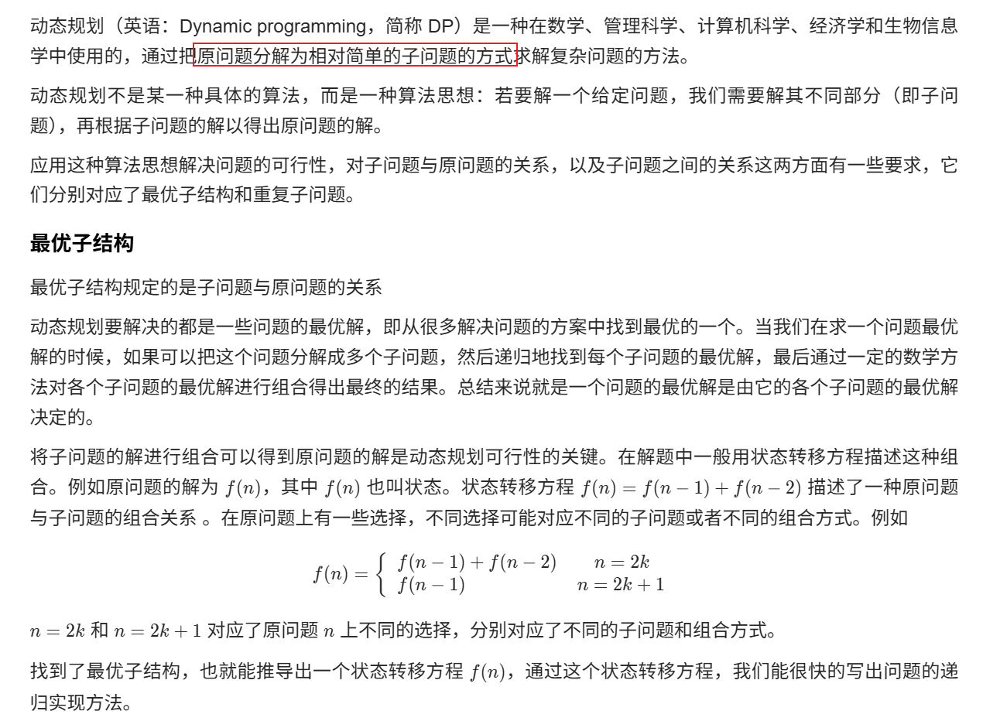


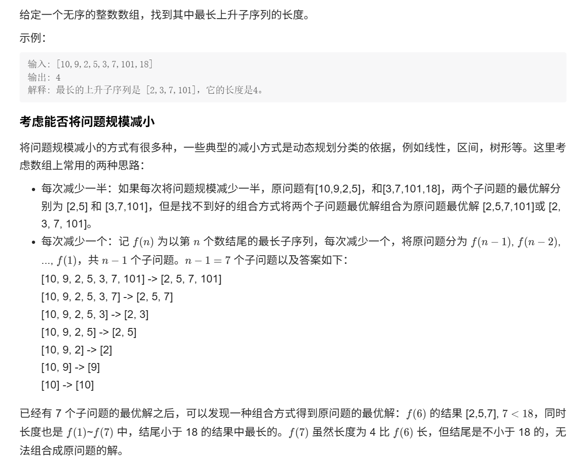


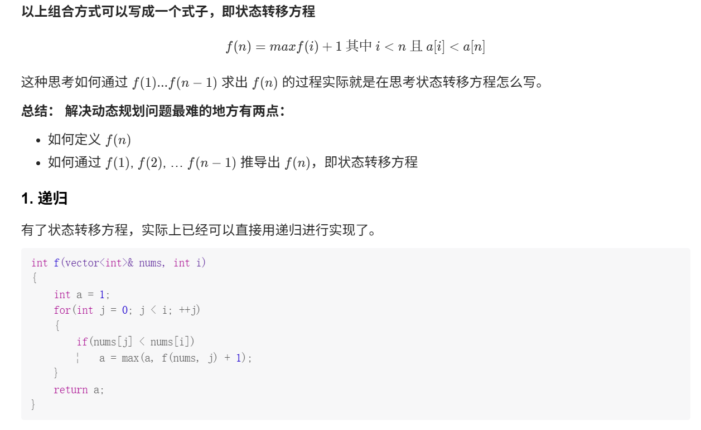

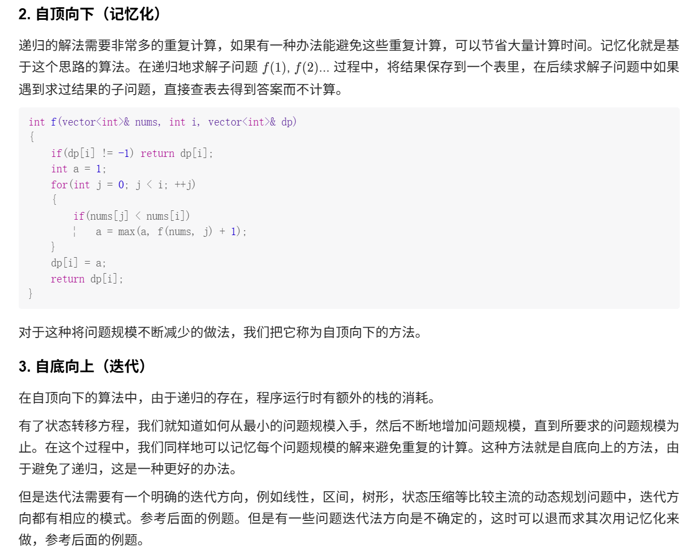


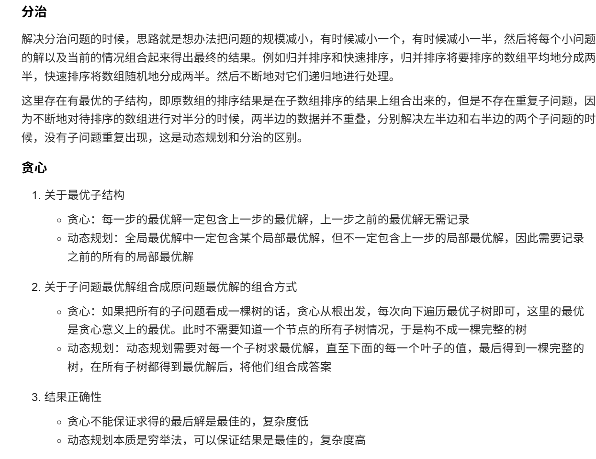


## 线性动æ€è§„划


### å•ä¸²


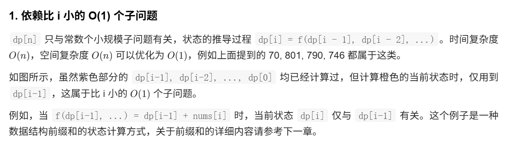


### 带维度å•ä¸² dp[i][k]

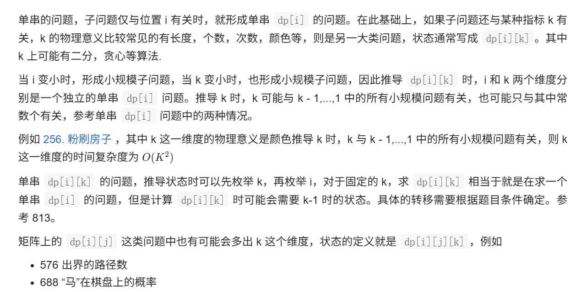

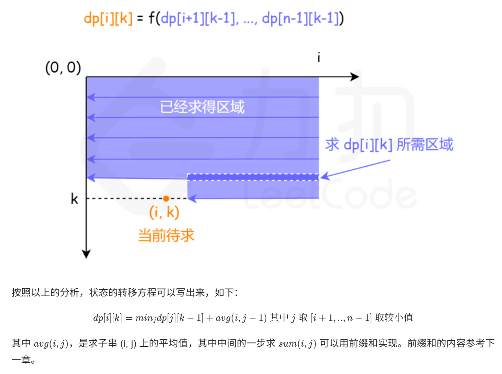

### åŒä¸²


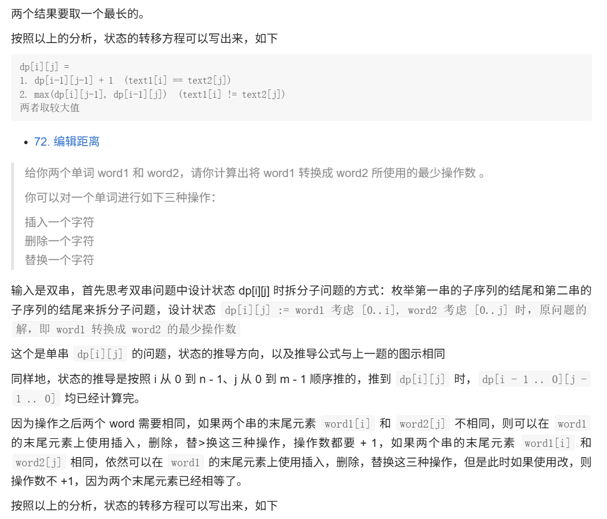


### 矩阵


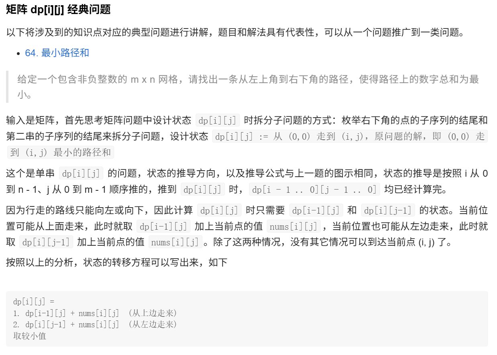
矩阵相关练习题
矩阵 dp[i][j]
矩阵 dp[i][j][k]


线性动æ€è§„划是动æ€è§„划中最基础的一类，它的状æ€ä¸€èˆ¬ç‰©ç†æ„义很æ˜ç¡®ï¼Œæ˜“äºåˆ†æ。在åˆå­¦åŠ¨æ€è§„划时，通过线性动æ€è§„划的大é‡ç»ƒä¹ ï¼Œå¯ä»¥ä¸æ–­åŠ æ·±åŠ¨æ€è§„划的概念ç†è§£ï¼Œä¾‹å¦‚动æ€è§„划中最é‡è¦çš„三个概念：最优å­ç»“æ„，é‡å¤å­é—®é¢˜ï¼Œæ— å效性。下é¢å¯¹åŠ¨æ€è§„划的三个基本概念åšä¸ªç®€è¦å›é¡¾ï¼Œåœ¨çº¿æ€§åŠ¨æ€è§„划的题目练习中å¯ä»¥ä¸æ–­åœ°åŠ æ·±ç†è§£ï¼Œä¹‹åå†å­¦ä¹ å…¶å®ƒçš„动æ€è§„划类å‹å°±ä¼šå®¹æ˜“很多。

最优å­ç»“æ„：如æœé—®é¢˜çš„最优解所包å«çš„å­é—®é¢˜çš„解也是最优的，就称该问题具有最优å­ç»“æ„。
æ— å效性：å³æŸé˜¶æ®µçŠ¶æ€ä¸€æ—¦ç¡®å®šï¼Œå°±ä¸å—这个状æ€ä»¥å决策的影å“。也就是说，æŸçŠ¶æ€ä»¥å的过程ä¸ä¼šå½±å“以å‰çš„状æ€ï¼Œåªä¸å½“å‰çŠ¶æ€æœ‰å…³ã€‚
é‡å¤å­é—®é¢˜ï¼šå³å­é—®é¢˜ä¹‹é—´æ˜¯ä¸ç‹¬ç«‹çš„，一个å­é—®é¢˜åœ¨ä¸‹ä¸€é˜¶æ®µå†³ç­–中å¯èƒ½è¢«å¤šæ¬¡ä½¿ç”¨åˆ°ã€‚（该性质并ä¸æ˜¯åŠ¨æ€è§„划适用的必è¦æ¡ä»¶ï¼Œä½†æ˜¯å¦‚æœæ²¡æœ‰è¿™æ¡æ€§è´¨ï¼ŒåŠ¨æ€è§„划算法åŒå…¶ä»–算法相比就ä¸å…·å¤‡ä¼˜åŠ¿ï¼‰
线性动æ€è§„划是动æ€è§„划中å˜åŒ–最多的一类。

首先线性动æ€è§„划针对的问题是最常è§çš„数组，字符串，矩阵等，这三ç§æ•°æ®ç»“æ„本身就是线性的，因此出ç°è¿™äº›ç±»å‹çš„输入的时候，如æœè¦ç”¨åˆ°åŠ¨æ€è§„划，首先考虑线性动æ€è§„划就很åˆç†äº†ï¼Œå› æ­¤å¾ˆå¤šé—®é¢˜ä¸è®ºæœ€å正解是ä¸æ˜¯çº¿æ€§åŠ¨æ€è§„划，都会首先想一下线性动æ€è§„划是å¦å¯è¡Œã€‚

其次由äºå¤§éƒ¨åˆ†é—®é¢˜çš„æ•°æ®éƒ½æ˜¯ä»¥è¿™ä¸‰ç§å½¢å¼ç»™å‡ºçš„，因此题目的å˜åŒ–会é常多，很多常è§çš„输入形å¼ä»¥åŠé—®é¢˜éƒ½é常ç»å…¸ï¼Œéƒ½å­˜åœ¨ç»å…¸çš„状æ€è®¾è®¡ã€‚å› æ­¤ä¸è€ƒè™‘一些比较 Trick 的解法，仅仅是ç»å…¸é—®é¢˜çš„ç»å…¸çŠ¶æ€è®¾è®¡ï¼Œå°±æ¯”其它ç§ç±»çš„动æ€è§„划问题多很多了。

例如å•ä¸ªæ•°ç»„或字符串上设计一维状æ€ï¼Œä¸¤ä¸ªæ•°ç»„或字符串上设计两维状æ€ï¼Œä»¥åŠçŸ©é˜µä¸Šè®¾è®¡ä¸¤ç»´çŠ¶æ€ç­‰ç­‰ï¼ŒåŒæ—¶ä»¥ä¸Šä¸‰ç§æƒ…况的状æ€è®¾è®¡éƒ½æœ‰å¯èƒ½å†åŠ ä¸Šé¢å¤–的指标的状æ€ï¼Œå°±æ˜¯å‰é¢ä¾‹é¢˜ä¸­çš„ k，这里é¢å˜åŒ–就很多了，比如有的题目在 k 这一维上è¦ä½¿ç”¨äºŒåˆ†ï¼Œè´ªå¿ƒçš„ç­–ç•¥ï¼Œæœ‰çš„é¢˜ç›®éœ€è¦ DP 状æ€ä¸æ•°æ®ç»“æ„é…åˆæ¥è§£å†³é—®é¢˜ã€‚

除此之外还有一类问题没有显å¼çš„数组，字符串，但是在求解的时候ä¾ç„¶æ»¡è¶³å‰é¢æ到的动æ€è§„划三æ¡åŸºæœ¬æ¦‚念，å¯ä»¥ç”¨åŠ¨æ€è§„划求解，这ç§é—®é¢˜é€šå¸¸ä¹Ÿæ˜¯çº¿æ€§åŠ¨æ€è§„划。如此多的å˜åŒ–仅仅本å°èŠ‚例举的题目是远远ä¸å¤Ÿçš„，下一å°èŠ‚是线性动æ€è§„划的练习题，涉åŠåˆ°å¯¹çº¿æ€§åŠ¨æ€è§„划的更多的å˜åŒ–。

## å‰ç¼€å’Œ

å‰ç¼€å’Œæ˜¯ä¸€ç§æŸ¥è¯¢æ•°ç»„中任æ„区间的元素的和的数æ®ç»“æ„，这里数组给定之åå°±ä¸å˜äº†ã€‚针对这个ä¸å˜çš„数组，å‰ç¼€å’Œç”¨äºå¤šæ¬¡æŸ¥è¯¢åŒºé—´ [i, j] 上元素的和。

对äºåŠ¨æ€è§„划而言，å‰ç¼€å’Œçš„æ„义主è¦æœ‰ä¸¤ç‚¹ï¼š

一维和二维å‰ç¼€å’Œçš„æ¨å¯¼ï¼Œåˆ†åˆ«ç”¨åˆ°äº†å•ä¸²å’ŒçŸ©é˜µä¸­æœ€ç»å…¸çš„状æ€è®¾è®¡ä»¥åŠçŠ¶æ€è½¬ç§»ï¼›
在一些更å¤æ‚的动æ€è§„划问题中，状æ€è½¬ç§»çš„时候需è¦ä¾èµ–区间和，因为状æ€è½¬ç§»æ˜¯é常频ç¹çš„æ“作，因此必须高效地求区间和æ‰èƒ½ä½¿å¾—状æ€è½¬ç§»çš„时间å¤æ‚度å¯æ¥å—，此时就必须用到å‰ç¼€å’Œäº†ã€‚
除此之外，一些问题需è¦å‰ç¼€å’Œä¸å…¶å®ƒæ•°æ®ç»“æ„é…åˆæ¥è§£å†³ï¼Œä¹Ÿæœ‰ä¸¤ç±»ï¼š

先预处ç†å‡ºå‰ç¼€å’Œæ•°ç»„，这一步是动æ€è§„划，然å在å‰ç¼€å’Œæ•°ç»„上用其它数æ®ç»“æ„解决；
还是按照动æ€è§„划的方å¼æ±‚å‰ç¼€å’Œï¼Œä¹Ÿéœ€è¦é¢å¤–çš„æ•°æ®ç»“æ„维护å‰ç¼€å’Œï¼Œä½†ä¸æ˜¯é¢„处ç†å¥½å‰ç¼€å’Œæ•°ç»„之åå†ç”¨æ•°æ®ç»“æ„计算，而是æ¯æ±‚出一个å‰ç¼€å’Œï¼Œå°±æ›´æ–°ä¸€æ¬¡æ•°æ®ç»“æ„并维护答案。
å‰ç¼€å’Œçš„æ¨å¯¼å’Œè®¡ç®—éšå«ç€åŠ¨æ€è§„划的基本æ€æƒ³ï¼ŒåŒæ—¶å®ƒçš„状æ€è®¾è®¡æ˜¯çº¿æ€§åŠ¨æ€è§„划中比较简å•çš„那一类。ä¸çº¿æ€§åŠ¨æ€è§„划一样，å‰ç¼€å’Œä¹Ÿæœ‰ä¸€ç»´å’ŒäºŒç»´ä¸¤ç§åœºæ™¯ã€‚
虽然å‰ç¼€å’Œæœ¬èº«å¾ˆç®€å•ï¼Œä½†éœ€è¦ç”¨åˆ°å®ƒè§£å†³çš„问题é常多，ä¸å…¶å®ƒæ•°æ®ç»“æ„é…åˆçš„å˜åŒ–也很多，因此需è¦ä»çº¿æ€§åŠ¨æ€è§„划中剥离出æ¥å•ç‹¬å­¦ä¹ ã€‚

### 求区间和

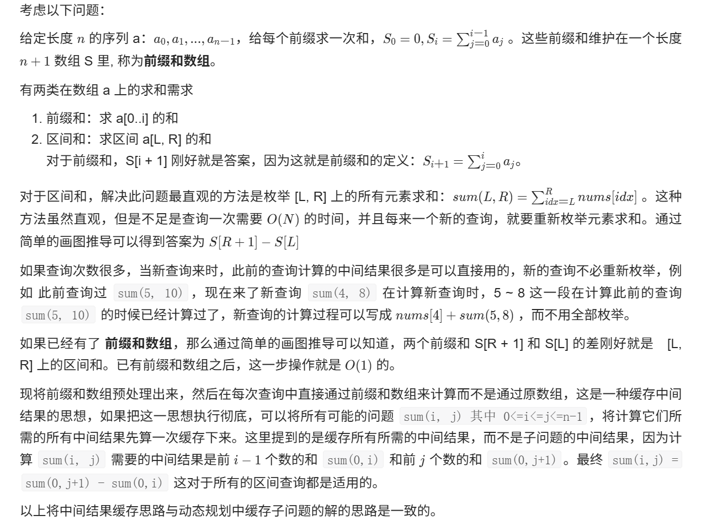

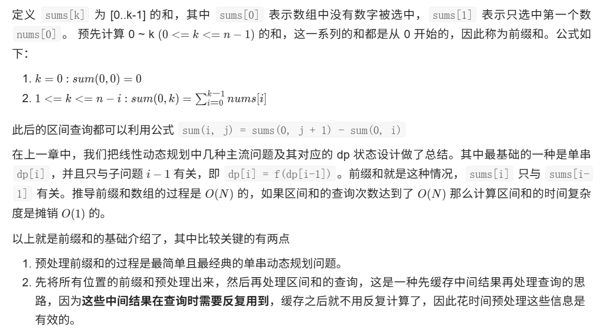


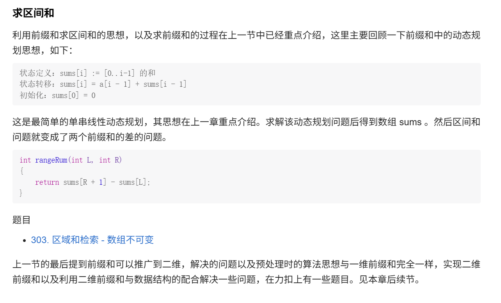

### æ•°æ®ç»“æ„维护å‰ç¼€å’Œ


### è¿ç®—æ¨å¹¿


### 差分


## 区间动æ€è§„划
在输入为长度为 n 的数组时，å­é—®é¢˜ç”¨åŒºé—´ [i..j] 表示。
状æ€çš„定义和转移都ä¸åŒºé—´æœ‰å…³ï¼Œç§°ä¸ºåŒºé—´åŠ¨æ€è§„划


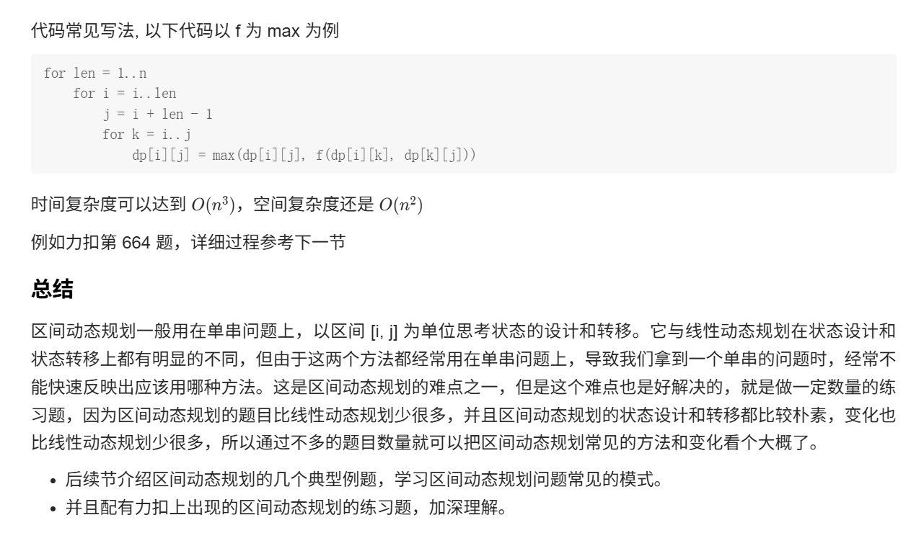

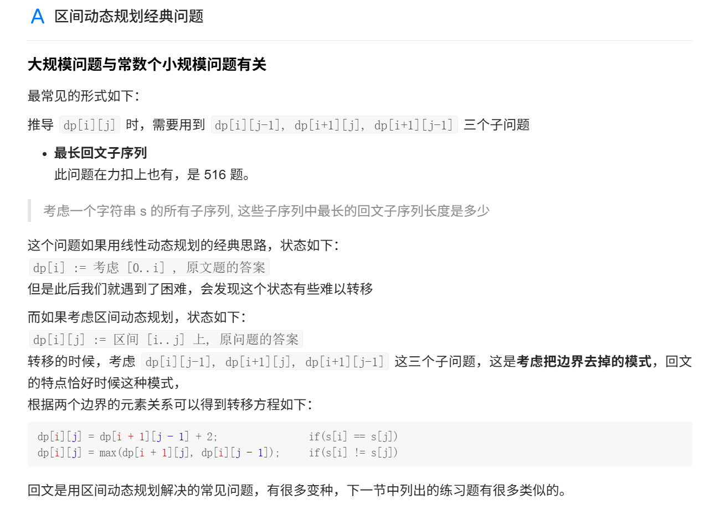

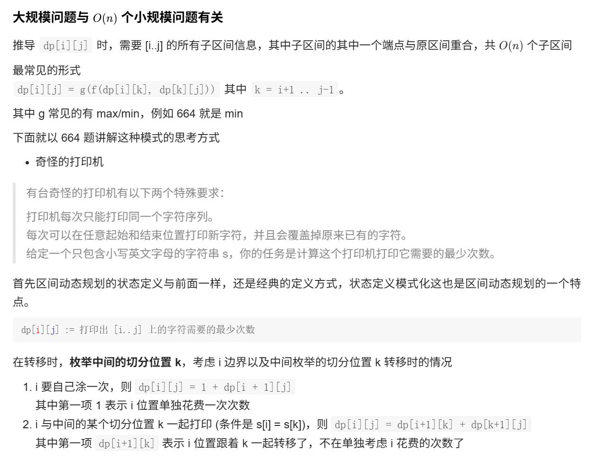

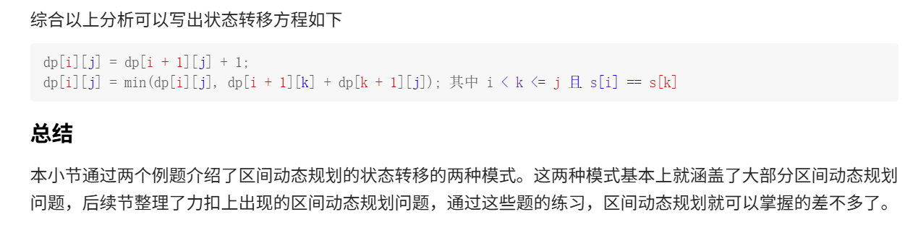

# 动æ€è§„划：状å‹ã€è®¡æ•° & æ•°ä½åŠ¨æ€

## 背包动æ€è§„划
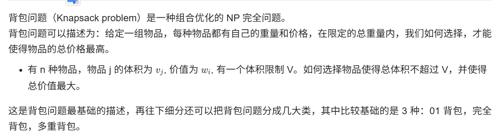


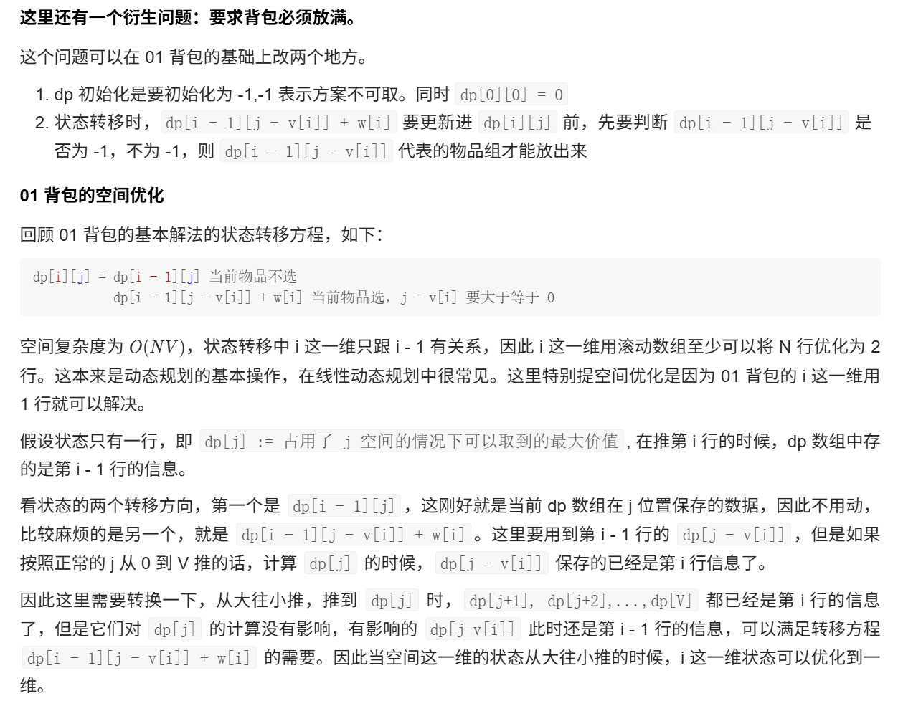
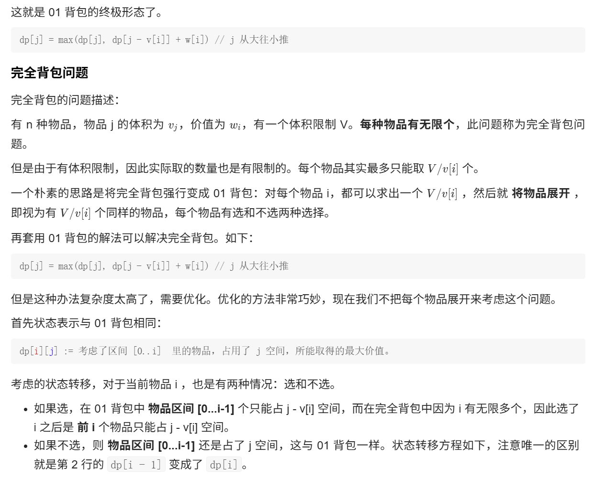


## 状æ€å‹ç¼©åŠ¨æ€è§„划

状æ€å‹ç¼©åŠ¨æ€è§„划是一类é常典å‹çš„动æ€è§„划，通常使用在 NP 问题的å°è§„模求解中，虽然是指数级别的å¤æ‚度，但速度比æœç´¢å¿«ã€‚

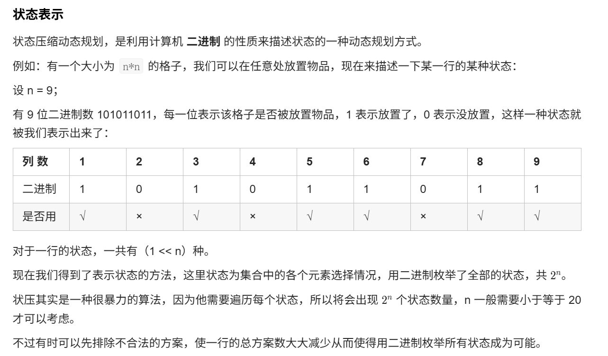


## 计数问题

动æ€è§„划中的计数å‹é—®é¢˜å°±æ˜¯åˆ©ç”¨åŠ¨æ€è§„划的算法æ€æƒ³å»è®¡ç®—出解决这个问题有多少ç§æ–¹æ³•ã€‚
比如，ä»èµ·ç‚¹èµ°åˆ°ç»ˆç‚¹ï¼Œå¯ä»¥æœ‰å¤šå°‘æ¡è·¯å¾„，注æ„，是多少æ¡ï¼Œè€Œä¸æ˜¯å…·ä½“路线的æ述。
当然也有具体æ¯ä¸€æ¡è·¯çº¿çš„问法，这是 dfs 的问题了。


计数问题相关练习题
路径问题
å¡ç‰¹å…°æ•°
铺砖问题
æ–波那契
éšæ™¦çš„递æ¨å…³ç³»


## 矩阵快速幂
是一ç§åŸºç¡€ç®—法，本身ä¸åŠ¨æ€è§„划没有关系，但它å¯ä»¥ç”¨äºä¼˜åŒ–线性递æ¨å…³ç³»çš„计算，并且其æ€è·¯æ¯”较固定，因此在计数问题章节之å，在本章将矩阵快速幂åšåŸºç¡€ä»‹ç»ã€‚


```c
using ll = long long;
const int M = 2;

struct Ma
{
    int a[M][M];
    Ma()
    {
        memset(a, 0, sizeof(a));
    }

    void init() // å¤ä½ä¸ºå•ä½é˜µ
    {
        a[0][0] = a[1][1] = 1;
        a[0][1] = a[1][1] = 0;
    }

    Ma operator*(const Ma& B) const
    {
        Ma ans;
        for(int i = 0; i < M; ++i)
            for(int j = 0; j < M; ++j)
                for(int k = 0; k < M; ++k)
                    ans.a[i][j] += a[i][k] * B.a[k][j];
        return ans;
    }

    Ma operator^(int n) const
    {
        Ma ans;
        ans.init();
        Ma A = *this; // æ‹·è´ä¸€ä¸ªå‡ºæ¥ç”¨äºè‡ªä¹˜
        while(n)
        {
            if(n & 1)
                ans = ans * A;
            A = A * A;
            n >>= 1;
        }
        return ans;
    }
};


```

在上一章中的 16 é“练习题中，部分题目的递æ¨å…³ç³»æ˜¯çº¿æ€§çš„，进而å¯ä»¥ç”¨çŸ©é˜µå¿«é€Ÿå¹‚æ¥åšï¼Œå°è¯•åˆ¤æ–­å“ªäº›é¢˜ç›®å¯ä»¥ç”¨çŸ©é˜µå¿«é€Ÿå¹‚åšï¼Œå¹¶ç”¨çŸ©é˜µå¿«é€Ÿå¹‚解决这些问题，加深对本节的ç†è§£ã€‚

## æ•°ä½ DP 
在基础的动æ€è§„åˆ’é—®é¢˜å½“ä¸­ç®—æ˜¯æ¯”è¾ƒéš¾çš„ä¸€ç±»ï¼Œå› ä¸ºæ•°ä½ DP 的状æ€çš„物ç†æ„义ä¸å¤ªå¥½ç†è§£ã€‚其它的动æ€è§„划，比如区间 DP 状æ€çš„物ç†æ„义就是区间，状æ€å‹ç¼© DP 中状æ€çš„物ç†æ„义就是集åˆï¼Œè¿™éƒ½æ¯”较好ç†è§£ã€‚

ä½†æ˜¯æ•°ä½ DP 比其它 DP 好的一é¢æ˜¯æ•°ä½ DP çš„æ€ç»´ç›¸å¯¹æ¯”较固定。 一个是解决的问题模å¼æ¯”较固定，一个是状æ€è®¾è®¡ä¹Ÿæ¯”较固定，因此å¯ä»¥é€šè¿‡ä¸€äº›å¸¸è§é—®é¢˜æŠŠæ•°ä½ DP 的套路了解个大概。

力扣上有几é“æ•°ä½ DP 的题目，通过这些题目我们å¯ä»¥å¤§è‡´äº†è§£æ•°ä½ DP çš„æ€è€ƒè¿‡ç¨‹å’Œåšæ³•ã€‚


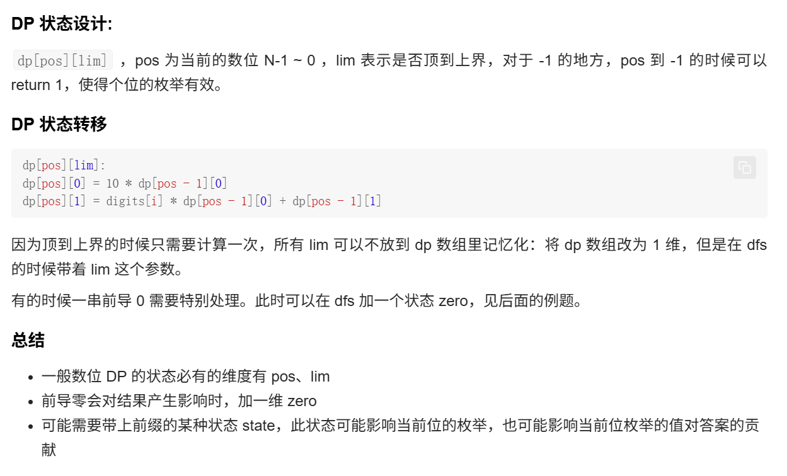

```cpp
int getdp(int pos, int lim, const vector<int>& digits, const set<int>& num_set, vector<vector<int>>& dp)
{
    if(pos == -1) return 1;
    if(dp[pos][lim] != -1)
        return dp[pos][lim];
    dp[pos][lim] = 0;
    int up = lim ? digits[pos] : 9; // 当å‰è¦æšä¸¾åˆ°çš„上界
    for(int i: num_set) // æšä¸¾å½“å‰ä½æ‰€æœ‰å¯èƒ½æ•°å­—
    {
        if(i > up)
            break;
        dp[pos][lim] += getdp(pos - 1, lim && i == up, digits, num_set, dp); // 本ä½è¢«é™åˆ¶ä¸”选顶到上界的数字,下一ä½æ‰è¢«é™åˆ¶
    }
    return dp[pos][lim];
}


```
å‰å¯¼é›¶çš„分æ
å¢åŠ  zero 状æ€, 表示高ä½æ˜¯å¦æ˜¯å‰å¯¼é›¶ã€‚

如æœé«˜ä½é€‰äº†å‰å¯¼é›¶ï¼Œåˆ™å½“å‰ä½æ— é™åˆ¶ï¼Œä¸”还å¯ä»¥é€‰å‰å¯¼é›¶ã€‚
如æœé«˜ä½æ²¡æœ‰é€‰å‰å¯¼é›¶ä¸”未顶到上界，则当å‰ä½åœ¨å¯é€‰æ•°å­—集åˆçš„范围内无é™åˆ¶ã€‚
如æœé«˜ä½é¡¶åˆ°äº†ä¸Šç•Œï¼Œåˆ™å½“å‰ä½çš„选择被é™åˆ¶ã€‚
åŠ›æ‰£ä¸Šæ•°ä½ DP 的题目ä¸å¤šï¼Œä¸‹ä¸€èŠ‚æ供了 9 é“练习题，å¯ä»¥å·©å›ºæ•°ä½ DP çš„æ€ç»´æ–¹å¼ã€‚

# 动æ€è§„划：树形ã€å›¾ä¸Šã€æ¦‚ç‡ & åšå¼ˆåŠ¨æ€

## 1 2期å›é¡¾
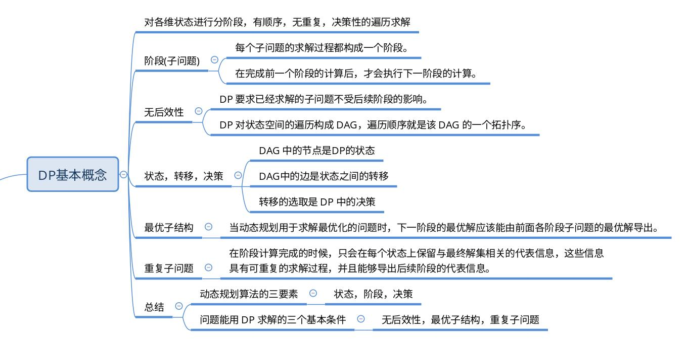


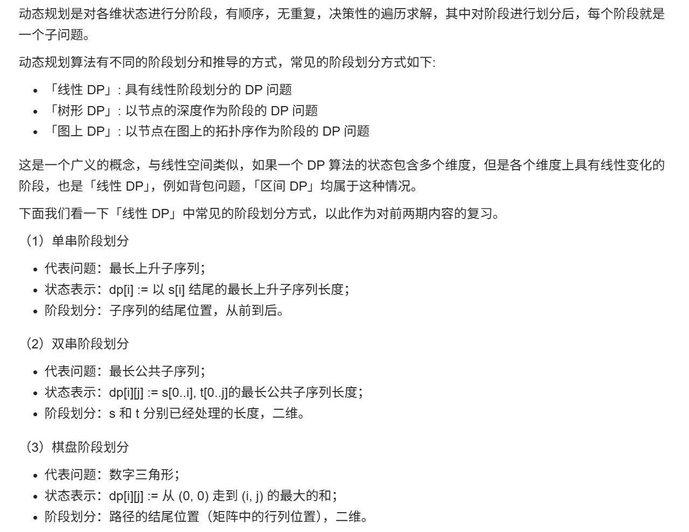

「å•ä¸² DPã€
对äºã€Œå•ä¸²çº¿æ€§ DPã€é—®é¢˜ï¼Œi 是å•ä¸² s 上的ä½ç½®ã€‚作为阶段具有时间或者ä½ç½®ç­‰å«ä¹‰ã€‚有时åªæœ‰å•ä¸²ä¸Šçš„ä½ç½®ä¸è¶³ä»¥è¡¨ç¤ºçŠ¶æ€ï¼Œéœ€è¦åŒæ—¶é™„加一个维度 k，一般 k 有长度ã€ä¸ªæ•°ã€æ¬¡æ•°ã€é¢œè‰²ç­‰å«ä¹‰ã€‚å¦ï¼Œæ‰€é™„加的维度有时候å¯ä»¥æ˜¯å¤šä¸ªï¼Œå¦‚ k1, k2, ...


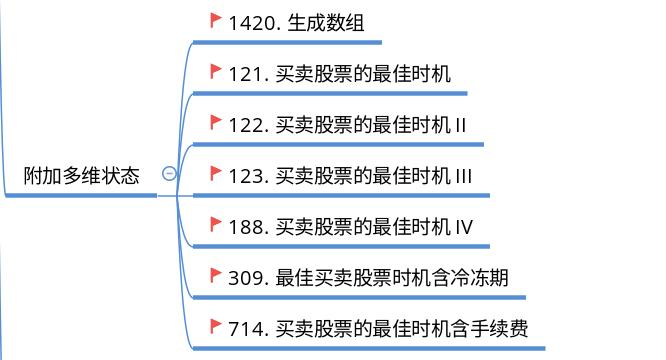


本章我们介ç»ã€Œçº¿æ€§ DPã€ä¸­æ¯”较é‡è¦ï¼ŒåŒæ—¶åœ¨å‰ä¸¤æœŸæ²¡æœ‰è¯¦ç»†ä»‹ç»çš„两å—内容，一个是最长上å‡å­åºåˆ—，一个是「棋盘 DPã€ã€‚

在动æ€è§„划精讲第一期中，我们有介ç»è¿‡æœ€é•¿ä¸Šå‡å­åºåˆ—问题并用动æ€è§„划的方法进行解决。å®é™…上最长上å‡å­åºåˆ—还有其它解法，以åŠåŠ›æ‰£ä¸Šæœ‰å¾ˆå¤šæœ€é•¿ä¸Šå‡å­åºåˆ—çš„å˜ç§é—®é¢˜ä»¥åŠåŒ…装之å的问题。我们在这一å°èŠ‚进行介ç»ã€‚

首先我们介ç»æœ€é•¿ä¸Šå‡å­åºåˆ—基äºäºŒåˆ†çš„解法，这是 LIS 问题的最好的解法，除此之外还有用线段树优化DPçš„æ–¹å¼çš„解法，这部分在动æ€è§„划精讲第四期关äºDP的优化方法中介ç»ã€‚

然å我们介ç»æœ€é•¿ä¸Šå‡å­åºåˆ—çš„å˜å½¢é—®é¢˜ï¼Œä¸€ä¸ªæ˜¯æœ€é•¿ä¸Šå‡å­åºåˆ—个数，一个是最长上å‡å­ä¸²ã€‚

然å我们介ç»ä¸€äº›åŠ›æ‰£ä¸Šçš„一些多维å±æ€§çš„最长上å‡å­åºåˆ—问题。

最å我门介ç»éœ€è¦è‡ªå®šä¹‰ LIS 中的å°äºçš„一些问题，这些问题åªè¦èƒ½æ­£ç¡®å®šä¹‰å°äºï¼Œå°±å¯ä»¥è½¬æ¢æˆæœ€é•¿ä¸Šå‡å­åºåˆ—问题。


在动æ€è§„划精讲第一期中，我们有介ç»è¿‡åœ¨çŸ©é˜µä¸Šè¿›è¡Œçº¿æ€§æ¨å¯¼çš„动æ€è§„划问题，但是没有系统地介ç»ï¼Œæœ¬å°èŠ‚将这个知识点补充一下。

「棋盘 DPã€æ˜¯ä¸€ç§åœ¨çŸ©é˜µä¸Šè¿›è¡ŒçŠ¶æ€æ¨å¯¼çš„动æ€è§„划问题。i, j 分别是棋盘(矩阵)的横纵å标，但并ä¸ä¸€å®šè¦å…±åŒä½œä¸ºé˜¶æ®µã€‚阶段划分有两ç§æƒ…况都比较常è§ï¼š

ä»… i 作为阶段，具有ä½ç½®ç­‰å«ä¹‰ã€‚åŒæ—¶ j 是附加状æ€ã€‚
i, j å…±åŒä½œä¸ºé˜¶æ®µï¼Œå…·æœ‰ä½ç½®ç­‰å«ä¹‰ã€‚没有附加维度。
这两ç§é˜¶æ®µåˆ’分方å¼çš„æ€è·¯æœ‰åŒºåˆ«ï¼Œç¬¬ä¸€ç§æ˜¯ä¸€è¡Œä¸€è¡Œåœ°è€ƒè™‘，第二ç§æ˜¯ä¸€ä¸ªä½ç½®ä¸€ä¸ªä½ç½®åœ°è€ƒè™‘。

## 树形动æ€è§„划
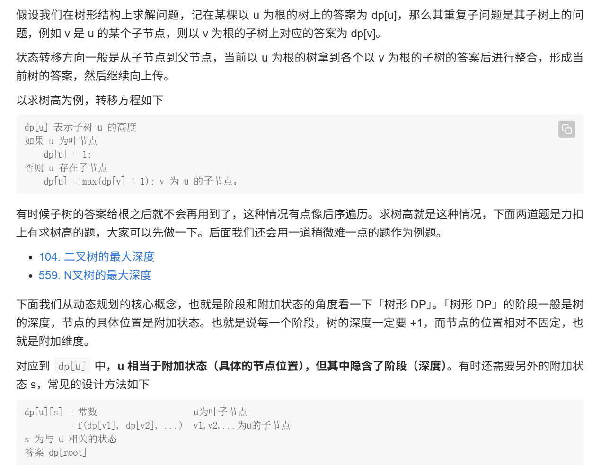


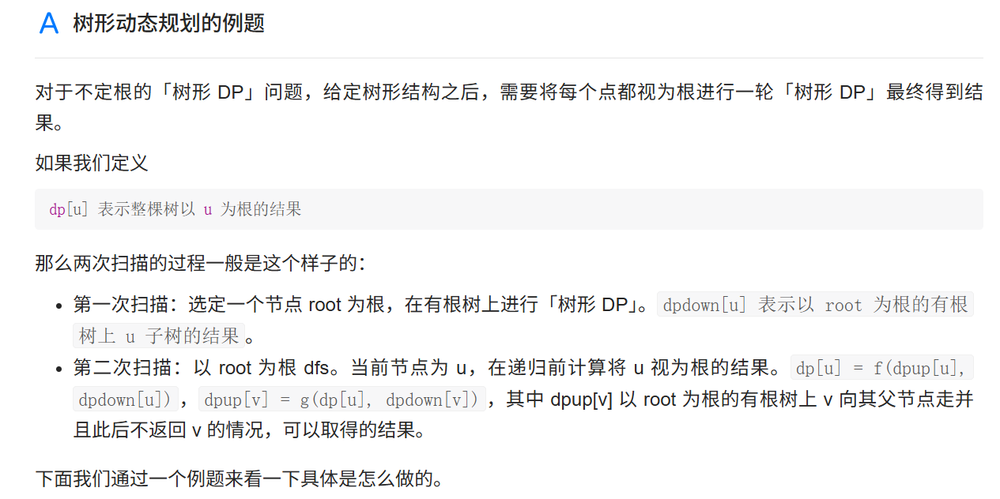

注æ„到在节点 u 时，状æ€è½¬ç§»è¿‡ç¨‹åªéœ€è¦ dp[v][0]，而ä¸éœ€è¦ dp[v][1]，因此 dfs ä»…è¿”å› dp[v][0] å³å¯ã€‚

代ç ä¸­ max1 表示 dp[u][0], max2 表示 dp[u][1]。

```cpp
class Solution {
public:
    int treeDiameter(vector<vector<int>>& edges) {
        int n = edges.size();
        vector<vector<int> > g(n + 1);
        for(const auto &e: edges)
        {
            g[e[0]].push_back(e[1]);
            g[e[1]].push_back(e[0]);
        }
        int ans = 0;
        dfs(0, -1, g, ans);
        return ans;
    }

private:
    int dfs(int u, int fa, const vector<vector<int> >& g, int& ans)
    {
        int max1 = 0, max2 = 0;
        for(int v: g[u])
        {
            if(v != fa)
            {
                int t = dfs(v, u, g, ans) + 1;
                if(max1 < t)
                {
                    max2 = max1;
                    max1 = t;
                }
                else if(max2 < t)
                    max2 = t;
            }
        }
        ans = max(ans, (max1 + max2));
        return max1;
    }
};

```


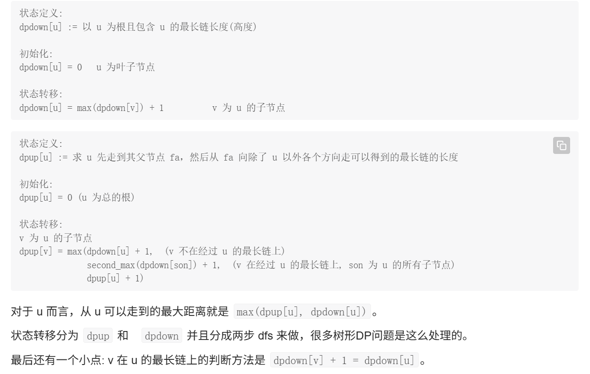
```cpp
class Solution {
public:
    vector<int> findMinHeightTrees(int n, vector<vector<int>>& edges) {
        vector<vector<int> > g(n); // é‚»æ¥è¡¨
        for(vector<int> &edge: edges)
        {
            g[edge[0]].push_back(edge[1]);
            g[edge[1]].push_back(edge[0]);
        }
        vector<int> dpdown(n, 0), dpup(n, 0);
        // 第一次DFS记录æ¯ä¸ªç»“点在作为å­æ ‘根结点的最大高度。
        dfs_1(0, -1, dpdown, g);
        // 第二次DFS补全æ¯ä¸ªç»“点作为总根结点的最大高度，差è·å°±åœ¨äºéœ€è¦ç»Ÿè®¡ä¸Šä»çˆ¶ç»“点传递过æ¥çš„å­æ ‘分支。
        dfs_2(0, -1, dpdown, dpup, g);

        int min_ans = n;
        vector<int> ans;
        for(int i = 0; i < n; ++i)
        {
            if(min_ans > dpdown[i])
            {
                min_ans = dpdown[i];
                ans.clear();
                ans.push_back(i);
            }
            else if(min_ans == dpdown[i])
                ans.push_back(i);
        }
        return ans;
    }

private:
    void dfs_1(int u, int fa, vector<int>& dpdown, vector<vector<int> >& g)
    {
        dpdown[u] = 0;
        for(auto &v: g[u])
        {
            if(v == fa) continue;
            dfs_1(v, u, dpdown, g);
            dpdown[u] = max(dpdown[u], dpdown[v] + 1);
        }
    }

    void dfs_2(int u, int fa, vector<int>& dpdown, vector<int>& dpup, vector<vector<int> >& g)
    {
        dpdown[u] = max(dpdown[u], dpup[u]);
        int max_1 = 0, max_2 = 0; // 这里需è¦æœ€å¤§é«˜åº¦å’Œæ¬¡å¤§é«˜åº¦
        for(auto &v: g[u])
        {
            if(v == fa) continue;
            if(max_1 < dpdown[v] + 1)
            {
                max_2 = max_1;
                max_1 = dpdown[v] + 1;
            }
            else if(max_2 < dpdown[v] + 1)
                max_2 = dpdown[v] + 1;
        }
        for(auto &v: g[u])
        {
            if(v == fa) continue;
            if (max_1 == dpdown[v] + 1) {
                // u 在 fa 的最长链上
                dpup[v] = max(dpup[u], max_2) + 1;
                dfs_2(v, u, dpdown, dpup, g);
            }
            else {
                dpup[v] = max(dpup[u], max_1) + 1;
                dfs_2(v, u, dpdown, dpup, g);
            }
        }
    }
};


```


834. 树中è·ç¦»ä¹‹å’Œ
1569. å°†å­æ•°ç»„é‡æ–°æ’åºå¾—到åŒä¸€ä¸ªäºŒå‰æŸ¥æ‰¾æ ‘的方案数
124. 二å‰æ ‘中的最大路径和
543. 二å‰æ ‘的直径
333. 最大 BST å­æ ‘
337. æ‰“å®¶åŠ«èˆ III
1373. 二å‰æœç´¢å­æ ‘的最大键值和
1372. 二å‰æ ‘中的最长交错路径
968. 监æ§äºŒå‰æ ‘
1273. 删除树节点
1519. å­æ ‘中标签相åŒçš„节点数
1617. 统计å­æ ‘中åŸå¸‚之间最大è·ç¦»


## 图上动æ€è§„划
「图上 DPã€å°±æ˜¯åœ¨å›¾ç»“æ„上的动æ€è§„划问题。一般图节点本身ä¸ä½œä¸ºé˜¶æ®µï¼Œè€Œæ˜¯ä½œä¸ºé˜¶æ®µæŒæœ‰çš„状æ€ã€‚对äºæœ‰å‘图，如æœæ˜¯æ— ç¯çš„，那么就å¯ä»¥å°†èŠ‚点本身作为阶段，此时一般用拓扑åºè¿›è¡Œæ¨å¯¼ã€‚


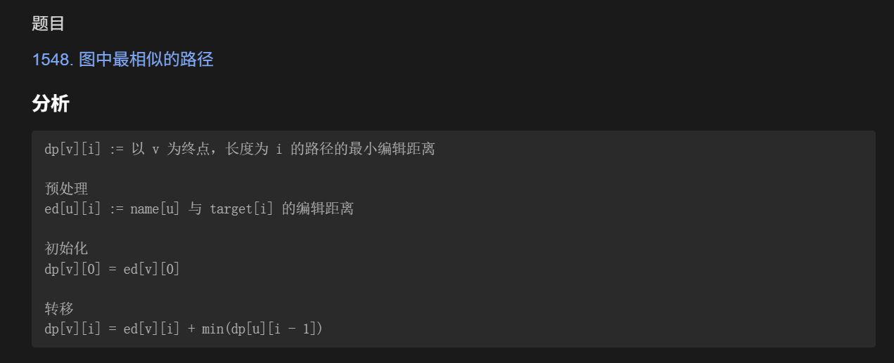
```cpp
class Solution {
public:
    vector<int> mostSimilar(int n, vector<vector<int>>& roads, vector<string>& names, vector<string>& targetPath) {
        vector<vector<int>> g(n);
        for(vector<int> &e: roads)
        {
            g[e[0]].push_back(e[1]);
            g[e[1]].push_back(e[0]);
        }
        int m = targetPath.size();
        vector<vector<int>> ed(n, vector<int>(m, -1));
        for(int v = 0; v < n; ++v)
        {
            for(int i = 0; i < m; ++i)
                ed[v][i] = names[v] != targetPath[i];
        }
        vector<vector<int>> dp(n, vector<int>(m + 1, INT_MAX / 2));
        for(int v = 0; v < n; ++v)
            dp[v][0] = ed[v][0];
        for(int i = 1; i < m; ++i)
            for(int v = 0; v < n; ++v)
            {
                for(int u: g[v])
                    dp[v][i] = min(dp[v][i], ed[v][i] + dp[u][i - 1]);
            }
        int end = -1;
        int min_ed = INT_MAX / 2;
        for(int v = 0; v < n; ++v)
        {
            if(dp[v][m - 1] < min_ed)
            {
                end = v;
                min_ed = dp[v][m - 1];
            }
        }
        vector<int> result(m);
        result[m - 1] = end;
        int next = end;
        for(int i = m - 2; i >= 0; --i)
        {
            int u = -1;
            for(int v: g[next])
                if(dp[v][i] == dp[next][i + 1] - ed[next][i + 1])
                {
                    u = v;
                    break;
                }
            result[i] = u;
            next = u;
        }
        return result;
    }
};


```
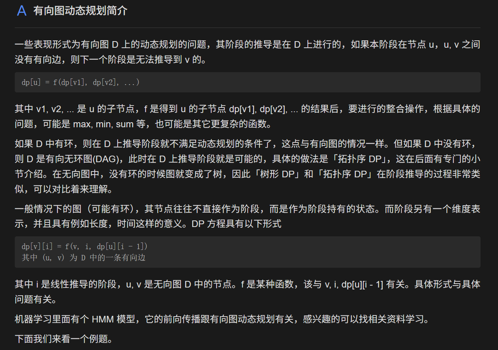

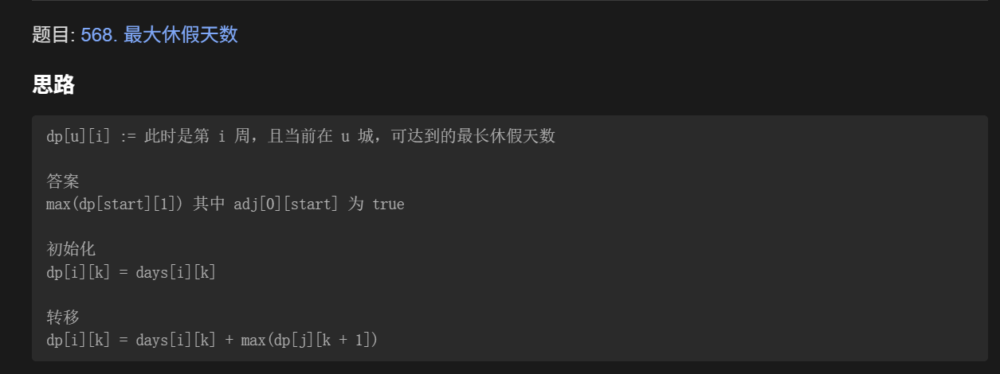
```cpp
class Solution {
public:
    int maxVacationDays(vector<vector<int>>& flights, vector<vector<int>>& days) {
        int N = days.size();
        int K = days[0].size();
        // days : N * K
        vector<vector<int>> dp(N, vector<int>(K, 0));
        vector<vector<int>> &adj = flights;
        for(int i = 0; i < N; ++i)
            dp[i][K - 1] = days[i][K - 1];
        for(int k = K - 2; k >= 0; --k)
            for(int i = 0; i < N; ++i)
            {
                dp[i][k] = dp[i][k + 1]; // ä¸å航ç­
                for(int j = 0; j < N; ++j)
                {
                    if(adj[i][j] == 1)
                        dp[i][k] =  max(dp[i][k], dp[j][k + 1]);
                }
                dp[i][k] += days[i][k];
            }
        int ans = dp[0][0];
        for(int start = 1; start < N; ++start)
        {
            if(adj[0][start] == 1)
                ans = max(ans, dp[start][0]);
        }
        return ans;
    }
};


```


```cpp
class Solution {
public:
    int maxJumps(vector<int>& arr, int d) {
        if(arr.empty()) return 0;
        int n = arr.size();
        dp = vector<int>(n, -1);
        int ans = 1;
        for(int i = 0; i < n; ++i)
            if(dp[i] == -1)
                ans = max(ans, solve(arr, d, i));
        return ans;
    }

private:
    // dp[i] := 以 i 开头的最长路径
    vector<int> dp;

    int solve(const vector<int>& arr, const int d, int pos)
    {
        if(dp[pos] != -1)
            return dp[pos];
        dp[pos] = 0;
        int n = arr.size();
        for(int k = 1; k <= d; ++k)
        {
            int nxt = pos + k;
            if(nxt >= n || arr[pos] <= arr[nxt])
                break;
            dp[pos] = max(dp[pos], 1 + solve(arr, d, nxt));
        }
        for(int k = 1; k <= d; ++k)
        {
            int nxt = pos - k;
            if(nxt < 0 || arr[pos] <= arr[nxt])
                break;
            dp[pos] = max(dp[pos], 1 + solve(arr, d, nxt));
        }
        dp[pos] = max(1, dp[pos]);
        return dp[pos];
    }
};


```


## 概ç‡åŠ¨æ€è§„划
ã€Œæ¦‚ç‡ DPã€ã€ã€ŒæœŸæœ› DP〠是一ç§åº”用动æ€è§„划解决求概ç‡ã€æœŸæœ›é—®é¢˜çš„一类方法。
æœ¬ç« åˆ†ä¸ºã€Œæ¦‚ç‡ DP〠和 「期望 DP〠两部分。首先给出其ç†è®ºåŸºç¡€ä»¥åŠå¯¹åº”çš„ DP 转移方程的形å¼ï¼›ç„¶å通过拆解两é“例题帮助å„ä½åŠ æ·±ç†è§£ï¼›æœ€å列出åŒç±»å‹é¢˜ç›®æ¸…å•ï¼Œå¸®åŠ©å¤§å®¶å·©å›ºå­¦ä¹ ã€‚


```
状æ€å®šä¹‰
dp[i][j] := 第 j è½® i è·èƒœ

答案
max(dp[n - 1][i])

åˆå§‹åŒ–
dp[i][0] = p[i][k], if check(i, 0, k)

状æ€è½¬ç§»
dp[i][j] = sum(dp[i][j - 1] * dp[k]dp[j - 1] * p[i][k])


```

```cpp
#include <cmath>
#include <iostream>
#include <vector>

using namespace std;

bool check(int i, int j, int k)
{
    // 判断 i, k 是å¦å¯èƒ½åœ¨ç¬¬ j è½®æˆä¸ºå¯¹æ‰‹
    i >>= j;
    k >>= j;
    return i ^ k == 1;
}

int main()
{
    int n;
    cin >> n;
    int N = pow(2, n);
    vector<vector<double>> P(N, vector<double>(N, -1.0));
    for(int i = 0; i < N; ++i)
        for(int j = 0; j < N; ++j)
            cin >> P[i][j];
    vector<vector<double>> dp(N, vector<double>(n, -1.0));
    for(int i = 0; i < N; ++i)
    {
        if(i & 1)
            dp[i][0] = P[i][i - 1];
        else
            dp[i][0] = P[i][i + 1];
    }
    for(int j = 1; j < n; ++j)
    {
        for(int i = 0; i < N; ++i)
            for(int k = 0; k < N; ++k)
                if(check(i, j, k))
                    dp[i][j] += dp[i][j - 1] * dp[k][j - 1] * P[i][k];
    }
    double max_p = -1.0;
    int ans = -1;
    for(int i = 0; i < n; ++i)
        if(dp[i][n - 1] > max_p)
        {
            max_p = dp[i][n - 1];
            ans = i;
        }
    cout << ans + 1 << endl;
}


```
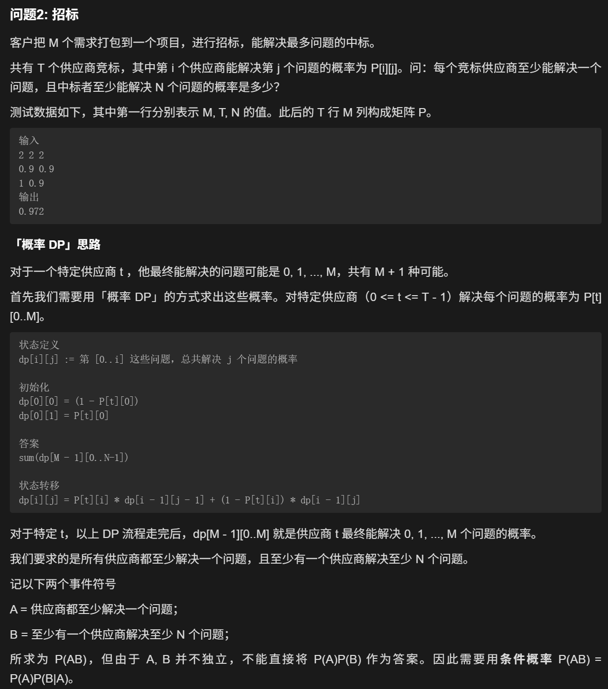

```cpp
#include <vector>
#include <iostream>
#include <iomanip>

using namespace std;

int main()
{
    int M, T, N;
    cin >> M >> T >> N;
    vector<vector<double>> P(T, vector<double>(M, -1.0));
    for(int i = 0; i < T; ++i)
        for(int j = 0; j < M; ++j)
            cin >> P[i][j];
    vector<vector<double>> dp(M, vector<double>(M + 1, -1.0));
    double pa = 1.0;
    double pb_a = 1.0;
    for(int t = 0; t < T; ++t)
    {
        dp.assign(N, vector<double>(M + 1, -1.0));
        dp[0][0] = (1 - P[t][0]);
        dp[0][1] = P[t][0];
        for(int i = 1; i < M; ++i)
        {
            dp[i][0] = (1 - P[t][0]) * dp[i - 1][0];
            for(int j = 1; j <= i; ++j)
                dp[i][j] = P[t][i] * dp[i - 1][j - 1] + (1 - P[t][i]) * dp[i - 1][j];
        }
        pa *= 1 - dp[M - 1][0];
        double tmp = 0.0;
        for(int j = 1; j < N; ++j)
            tmp += dp[M - 1][j];
        pb_a *= tmp / (1 - dp[M - 1][0]);
    }
    pb_a = 1 - pb_a;
    double ans = pa * pb_a;
    cout << std::fixed << std::setprecision(4);
    cout << ans << endl;
}


```
本节为大家汇总了力扣上 8 é“ã€Œæ¦‚ç‡ DPã€çš„题目，大家å¯ä»¥é›†ä¸­ç»ƒä¹ ã€‚

808. 分汤
837. 新21点
1230. 抛æ·ç¡¬å¸
688. “马â€åœ¨æ£‹ç›˜ä¸Šçš„概ç‡
1467. 两个盒å­ä¸­çƒçš„颜色数相åŒçš„概ç‡
剑指 Offer 60. n个骰å­çš„点数
1227. é£æœºåº§ä½åˆ†é…概ç‡
1377. T 秒åé’蛙的ä½ç½®


```cpp
#include <vector>
#include <fstream>
#include <iostream>

using namespace std;

double solve(int i, const int n, const int m, vector<double>& dp)
{
    if(dp[i] > -0.5)
        return dp[i];
    if(i == m)
        return dp[i] = 0.0;

    return dp[i] = (n + (n - i) * solve(i + 1, n, m, dp)) / (n - i);
}

int main()
{
    ifstream fin("data.txt");
    vector<double> dp;
    int n, m;
    while((fin >> n) && (fin >> m))
    {
        cout << "n: " << n << ", m: " << m << endl;
        dp.assign(m + 1, -1.0);
        double ans = solve(0, n, m, dp);
        cout << ans << endl;
    }
}


```
模拟代ç 

```cpp
import numpy as np
from multiprocessing import Pool

class Simulater:
    def __init__(self, n, m):
        self.n = n
        self.m = m

    def test(self, T):
        np.random.seed()
        N = 0
        for _ in range(T):
            i = 0
            j = 0
            visited = [False] * self.n
            while j < self.m:
                i += 1
                x = np.random.randint(0, self.n)
                if not visited[x]:
                    visited[x] = True
                    j += 1
            N += i
        return N / T

with open("data.txt") as f:
    for line in f.readlines():
        line = line.strip().split(" ")
        n = int(line[0])
        m = int(line[1])
        s = Simulater(n, m)
        T = int(5e5)
        pool = Pool(8)
        ts = pool.map(s.test, [T] * 8)
        print(sum(ts) / 8)

```

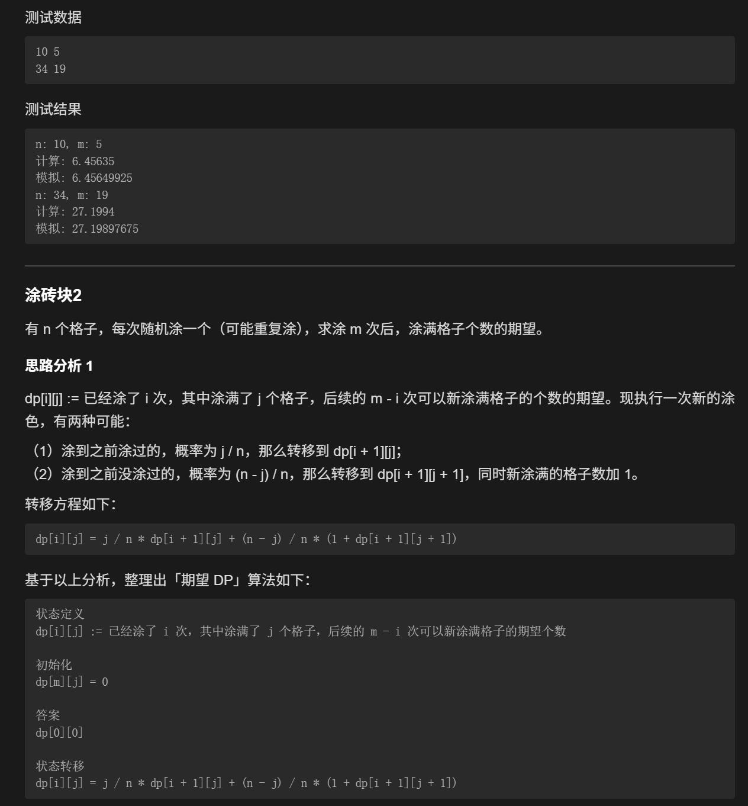

```cpp
#include <vector>
#include <fstream>
#include <iostream>

using namespace std;

double solve(int i, int j, const int n, const int m, vector<vector<double>>& dp)
{
    if(dp[i][j] > -0.5)
        return dp[i][j];
    if(i == m)
        return dp[i][j] = 0.0;

    double ans = 0.0;
    ans += j / (double)n * solve(i + 1, j, n, m, dp);
    ans += (n - j) / (double)n * (1 + solve(i + 1, j + 1, n, m, dp));
    return dp[i][j] = ans;
}

int main()
{
    ifstream fin("data.txt");
    vector<vector<double>> dp;
    int n, m;
    while((fin >> n) && (fin >> m))
    {
        cout << "n: " << n << ", m: " << m << endl;
        dp.assign(m + 1, vector<double>(m + 1, -1.0));
        double ans = solve(0, 0, n, m, dp);
        cout << ans << endl;
    }
}


```
æ€è·¯2
```cpp
#include <vector>
#include <fstream>
#include <iostream>

using namespace std;

double solve(int i, const int n, const int m, vector<double>& dp)
{
    if(dp[i] > -0.5)
        return dp[i];
    if(i == 0)
        return dp[i] = 0.0;
    return dp[i] = 1 + (n - 1) / (double)n * solve(i - 1, n, m, dp);
}

int main()
{
    ifstream fin("data.txt");
    vector<double> dp;
    int n, m;
    while((fin >> n) && (fin >> m))
    {
        cout << "n: " << n << ", m: " << m << endl;
        dp.assign(m + 1, -1.0);
        double ans = solve(m, n, m, dp);
        cout << ans << endl;
    }
}


```


## åšå¼ˆåŠ¨æ€è§„划
åšå¼ˆåŠ¨æ€è§„划
「åšå¼ˆ DPã€ï¼Œä¸€ç§åº”用动æ€è§„划解决åšå¼ˆé—®é¢˜çš„算法。本章首先给出ç†è®ºåŸºç¡€ï¼ˆminimax）以åŠå¯¹åº”çš„ DP 转移方程形å¼ï¼›ç„¶å通过详细拆解 Leetcode 上 4 é“题æ¥å­¦ä¹ è¿™ç±»é—®é¢˜çš„解决æ€è·¯ã€‚「åšå¼ˆ DPã€åœ¨ Leetocde 上有ä¸å°‘题目，章节末尾将集中列出æ¥ï¼Œå¤§å®¶å¯ä»¥è¿›è¡Œé’ˆå¯¹æ€§ç»ƒä¹ ã€‚

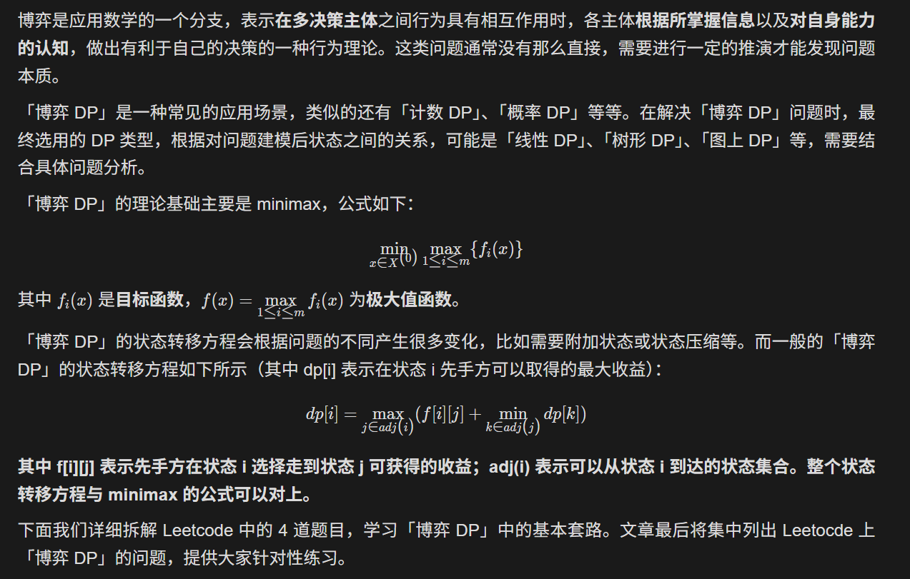
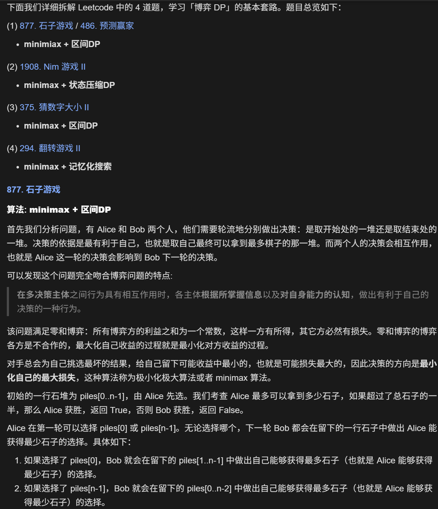

```cpp
class Solution {
public:
    bool stoneGame(vector<int>& piles) {
        int n = piles.size();
        vector<vector<int>> dp(n, vector<int>(n));
        int all = 0;
        for(int i = 0; i < n; ++i)
        {
            all += piles[i];
            dp[i][i] = piles[i];
        }
        for(int i = 0; i < n - 1; ++i)
            dp[i][i + 1] = max(piles[i], piles[i + 1]);
        for(int l = 3; l <= n; ++l)
        {
            // l 为区间长度
            for(int i = 0; i + l <= n; ++i)
            {
                int j = i + l - 1;
                dp[i][j] = max(piles[i] + min(dp[i + 2][j], dp[i + 1][j - 1])
                              ,piles[j] + min(dp[i + 1][j - 1], dp[i][j - 2])
                              );
            }
        }
        return dp[0][n - 1] * 2 > all;
    }
};


```

```cpp
class Solution {
public:
    bool nimGame(vector<int>& piles) {
        int n = piles.size();
        vector<int> dp(1 << (n * 3), -1);
        dp[0] = 0;
        int t = 0;
        for(int i = 0; i < n; ++i)
            t += (piles[i] << (3 * i));
        return solve(t, n, dp) == 1;
    }

private:
    int solve(int s, const int n, vector<int>& dp)
    {
        if(dp[s] != -1)
            return dp[s];
        for(int i = 0; i < n; ++i)
        {
            int m = ((s >> (i * 3)) & 7);
            for(int j = 0; j < m; ++j)
            {
                int t = s & (~(7 << (i * 3)));
                t += j << (i * 3);
                if(solve(t, n, dp) == 0)
                    return dp[s] = 1;
            }
        }
        return dp[s] = 0;
    }
};


```
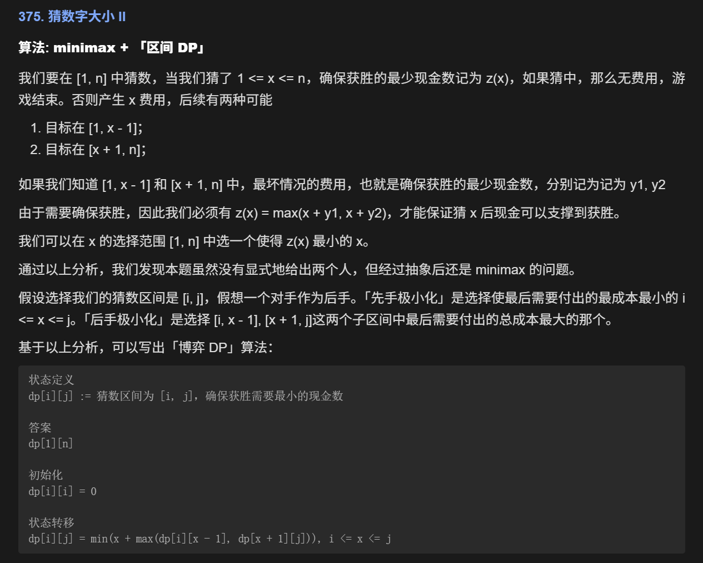
```cpp
class Solution {
public:
    int getMoneyAmount(int n) {
        vector<vector<int> > dp(n + 1, vector<int>(n + 1, INT_MAX));
        for(int i = 1; i <= n; ++i)
            dp[i][i] = 0;
        for(int j = 2; j <= n; ++j)
            for(int i = j - 1; i >= 1; --i)
            {
                dp[i][j] = min(dp[i + 1][j] + i, dp[i][j - 1] + j);
                for(int k = i + 1; k <= j - 1; ++k)
                    dp[i][j] = min(dp[i][j], max(dp[k + 1][j], dp[i][k - 1]) + k);
            }
        return dp[1][n];
    }
};


```

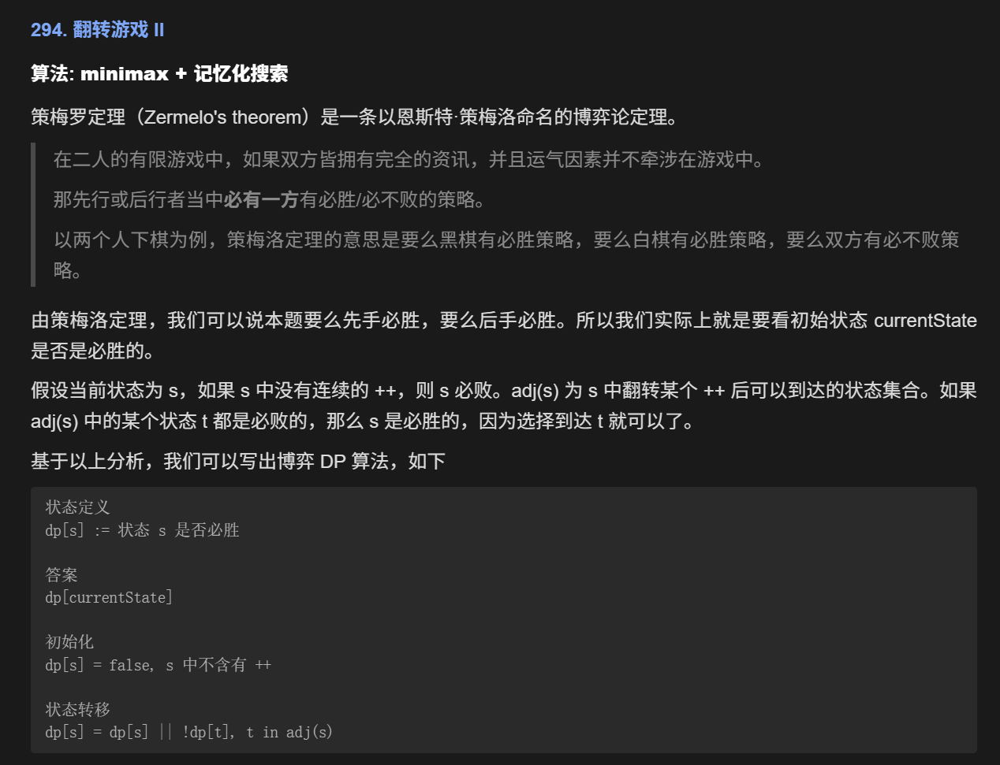
```cpp
class Solution {
public:
    bool canWin(string s) {
        int n = s.size();
        if(n < 2) return false;
        unordered_map<string, bool> dp;
        return solve(s, dp);
    }

private:
    bool solve(string& s, unordered_map<string, bool>& dp)
    {
        int n = s.size();
        if(dp.find(s) != dp.end()) // 该状æ€å·²ç»ç®—过
            return dp[s];
        for(int i = 0; i < n - 1; ++i) // æšä¸¾æ‰€æœ‰æ¬¡æ€
        {
            if(s[i] == '+' && s[i + 1] == '+')
            {
                s[i] = '-';
                s[i + 1] = '-';
                bool f = solve(s, dp);
                s[i] = '+';
                s[i + 1] = '+';
                if(!f)
                    return dp[s] = true;
            }
        }
        return dp[s] = false;
    }
};


```

本å°èŠ‚为大家汇总了力扣上 12 é“å…³äºã€Œåšå¼ˆ DPã€çš„题目，大家å¯ä»¥é›†ä¸­ç»ƒä¹ ã€‚

翻转游æˆ
293. 翻转游æˆ
Nim 游æˆ
292. Nim 游æˆ
石å­æ¸¸æˆ
1140. 石å­æ¸¸æˆ II
1406. 石å­æ¸¸æˆ III
1510. 石å­æ¸¸æˆ IV
井字游æˆ
348. 判定井字棋胜负
794. 有效的井字游æˆ
1275. 找出井字棋的è·èƒœè€…
其它
486. 预测赢家
464. 我能赢å—
1025. 除数åšå¼ˆ
913. 猫和è€é¼ 

# 滑动窗å£å’ŒåŒæŒ‡é’ˆ

滑动窗å£å’ŒåŒæŒ‡é’ˆæ˜¯è§£å†³å­—符串ã€æ•°ç»„等问题的常用技巧。通过维护一个窗å£æˆ–两个指针，å¯ä»¥æœ‰æ•ˆåœ°éå†æ•°æ®ç»“æ„，达到优化时间å¤æ‚度的目的。

滑动窗å£é€šå¸¸ç”¨äºå¤„ç†è¿ç»­å­æ•°ç»„或å­å­—符串的问题。通过动æ€è°ƒæ•´çª—å£çš„å·¦å³è¾¹ç•Œï¼Œå¯ä»¥åœ¨ O(n) 的时间å¤æ‚度内找到满足æ¡ä»¶çš„å­æ•°ç»„或å­å­—符串。
åŒæŒ‡é’ˆåˆ™å¸¸ç”¨äºæ’åºæ•°ç»„或链表的问题。通过两个指针åŒæ—¶éå†æ•°æ®ç»“æ„，å¯ä»¥æœ‰æ•ˆåœ°è§£å†³æŸ¥æ‰¾ã€åˆå¹¶ç­‰é—®é¢˜ã€‚

## 循ç¯ä¸å˜é‡
循ç¯å‰ã€ä¸­ã€åä¿æŒä¸å˜
「循ç¯ä¸å˜é‡ã€ä¸æ˜¯å¾ˆé«˜æ·±çš„概念，在「算法ã€å’Œã€Œæ•°æ®ç»“æ„ã€çš„世界里，到处都有它的身影。

「循ç¯ä¸å˜é‡ã€æ˜¯æŒ‡æˆ‘们在编写代ç çš„过程中，è¦ä¸€ç›´å¾ªåºä¸å˜çš„性质，这样的性质是根æ®è¦è§£å†³çš„问题，由我们自己定义的。「循ç¯ä¸å˜é‡ã€æ˜¯æˆ‘们写对一个问题的基础，ä¿è¯äº†åœ¨ã€Œåˆå§‹åŒ–ã€ã€Œå¾ªç¯éå†ã€ã€Œç»“æŸã€è¿™ä¸‰ä¸ªé˜¶æ®µç›¸åŒçš„性质，使得一个问题能够被正确解决。


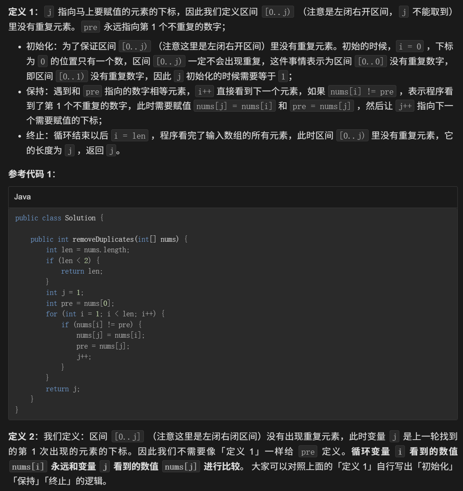


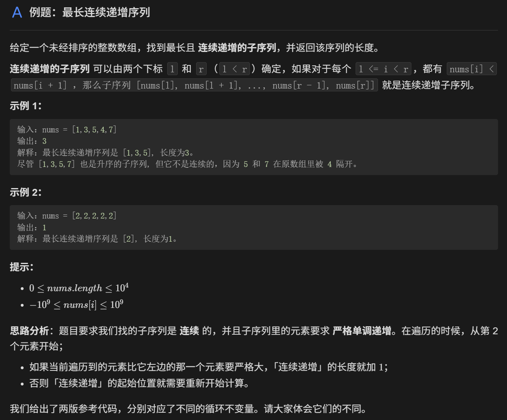
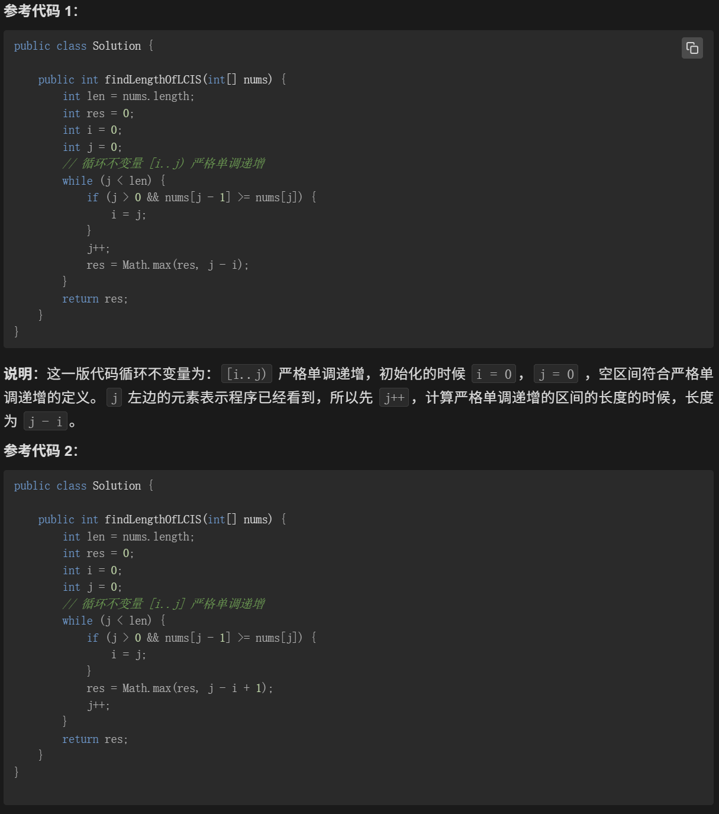


## 使用循ç¯ä¸å˜é‡å†™å¯¹ä»£ç 
这一节我们讲解两个é常基础且常考的问题，å‘大家展示：我们在写代ç çš„时候一定è¦æ˜ç¡®è‡ªå·±å¯¹å˜é‡ä»¥åŠåŒºé—´çš„定义是什么，并且在编写代ç çš„过程中ä¿æŒå®šä¹‰ä¸å˜ã€‚


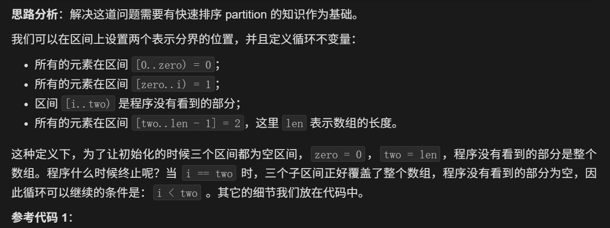
```java
import java.util.Arrays;


public class Solution {

    public void sortColors(int[] nums) {
        int len = nums.length;
        if (len < 2) {
            return;
        }
        
        int zero = 0;
        int two = len;
        int i = 0;
        while (i < two) {
            if (nums[i] == 0) {
                swap(nums, i, zero);
                zero++;
                i++;
            } else if (nums[i] == 1) {
                i++;
            } else {
                two--;
                swap(nums, i, two);
            }
        }
    }

    private void swap(int[] nums, int index1, int index2) {
        int temp = nums[index1];
        nums[index1] = nums[index2];
        nums[index2] = temp;
    }
}


```
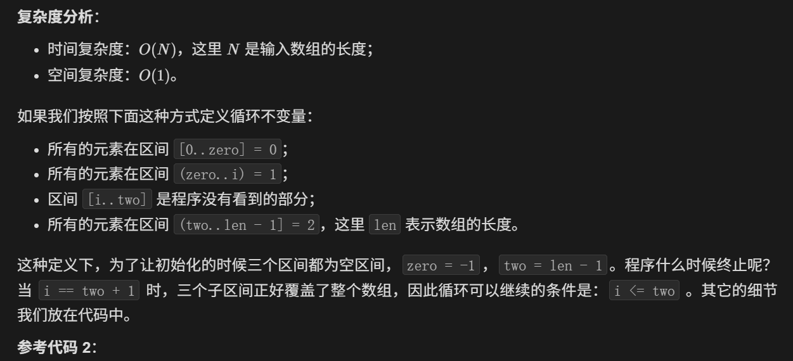
```java
public class Solution {

    public void sortColors(int[] nums) {
        int len = nums.length;
        if (len < 2) {
            return;
        }
        int zero = -1;
        int two = len - 1;
        int i = 0;
        while (i <= two) {
            if (nums[i] == 0) {
                zero++;
                swap(nums, i, zero);
                i++;
            } else if (nums[i] == 1) {
                i++;
            } else {
                swap(nums, i, two);
                two--;
            }
        }
    }

    private void swap(int[] nums, int index1, int index2) {
        int temp = nums[index1];
        nums[index1] = nums[index2];
        nums[index2] = temp;
    }
}


```


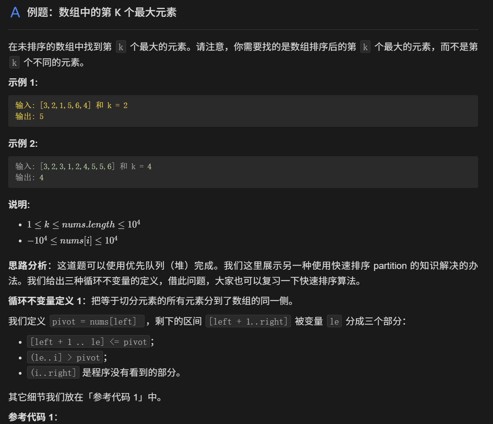

```java
import java.util.Arrays;
import java.util.Random;

public class Solution {

    private static Random random = new Random(System.currentTimeMillis());

    public int findKthLargest(int[] nums, int k) {
        int len = nums.length;
				// 第 k 大元素的下标是 len - k
        int target = len - k;

        int left = 0;
        int right = len - 1;
        while (true) {
            int pIndex = partition(nums, left, right);

            if (pIndex == target) {
                return nums[pIndex];
            } else if (pIndex < target) {
                // 下一轮æœç´¢åŒºé—´ [pIndex + 1..right]
                left = pIndex + 1;
            } else {
                // pIndex > target
                // 下一轮æœç´¢åŒºé—´ [left..pIndex - 1]
                right = pIndex - 1;
            }
        }

    }

    private int partition(int[] nums, int left, int right) {
        // 注æ„：必须éšæœºåŒ–
        int randomIndex = left + random.nextInt(right - left + 1);
        swap(nums, left, randomIndex);

        int pivot = nums[left];
        // [left + 1 .. le] <= pivot
        // (le..i] > pivot
        // 注æ„：一定è¦è®¾ç½®æˆ left ，å¦åˆ™äº¤æ¢ä¼šå‡ºé”™
        int le = left;
        for (int i = left + 1; i <= right; i++) {
            // 这里写 < 或者 <= 都å¯ä»¥
            if (nums[i] <= pivot) {
                le++;
                swap(nums, le, i);
            }
        }

        swap(nums, left, le);
        return le;
    }

    private void swap(int[] nums, int index1, int index2) {
        int temp = nums[index1];
        nums[index1] = nums[index2];
        nums[index2] = temp;
    }
}


```

```java
import java.util.Random;

public class Solution {

    private static Random random = new Random(System.currentTimeMillis());

    public int findKthLargest(int[] nums, int k) {
        int len = nums.length;
        int left = 0;
        int right = len - 1;

        // 第 k 大元素的下标是 len - k
        int target = len - k;

        while (true) {
            int index = partition(nums, left, right);
            if (index == target) {
                return nums[index];
            } else if (index < target) {
                left = index + 1;
            } else {
                right = index - 1;
            }
        }
    }

    public int partition(int[] nums, int left, int right) {
        // 在区间éšæœºé€‰æ‹©ä¸€ä¸ªå…ƒç´ ä½œä¸ºæ ‡å®šç‚¹
        int randomIndex = left + random.nextInt(right - left + 1 );
        swap(nums, left, randomIndex);
        

        int pivot = nums[left];

        // å°†ç­‰äº pivot 的元素分散到两边
        // [left..le) <= pivot
        // (ge..right] >= pivot

        int le = left + 1;
        int ge = right;

        while (true) {
            // é‡åˆ° nums[le] >= pivot 的时候åœä¸‹æ¥
            // é‡åˆ°ä¸ pivot 相等的元素，是通过交æ¢è¢«ç­‰æ¦‚ç‡åˆ†åˆ°ä¸¤è¾¹çš„
            while (le <= ge && nums[le] < pivot) {
                le++;
            }
            while (le <= ge && nums[ge] > pivot) {
                ge--;
            }

            if (le > ge) {
                break;
            }
            swap(nums, le, ge);
            le++;
            ge--;
        }

        // 这里还è¦äº¤æ¢ï¼Œæ³¨æ„是 ge
        swap(nums, left, ge);
        return ge;
    }

    private void swap(int[] nums, int index1, int index2) {
        int temp = nums[index1];
        nums[index1] = nums[index2];
        nums[index2] = temp;
    }
}


```


```java
import java.util.Random;

public class Solution {

    private static Random RANDOM = new Random(System.currentTimeMillis());

    public int findKthLargest(int[] nums, int k) {
        int len = nums.length;
        int target = len - k;

        int left = 0;
        int right = len - 1;
        while (true) {
            int[] pIndex = partition(nums, left, right);

            int index1 = pIndex[0];
            int index2 = pIndex[1];

            if (target < index1) {
                // 下一轮æœç´¢åŒºé—´ [left..index1 - 1]
                right = index1 - 1;
            } else if (target == index1) {
                return nums[index1];
            } else if (target < index2) {
                left = index1 + 1;
                right = index2 - 1;
            } else if (target == index2) {
                return nums[index2];
            } else {
                // pIndex > target
                // 下一轮æœç´¢åŒºé—´ [index2 + 1..right]
                left = index2 + 1;
            }
        }
    }

    private int[] partition(int[] nums, int left, int right) {
        int randomIndex = left + RANDOM.nextInt(right - left + 1);
        swap(nums, randomIndex, left);

        // 循ç¯ä¸å˜é‡ï¼š
        // all in [left + 1..lt] < pivot
        // all in [lt + 1..i) = pivot
        // all in [gt..right] > pivot
        int pivot = nums[left];
        int lt = left;
        int gt = right + 1;

        int i = left + 1;
        while (i < gt) {
            if (nums[i] < pivot) {
                lt++;
                swap(nums, i, lt);
                i++;
            } else if (nums[i] == pivot) {
                i++;
            } else {
                gt--;
                swap(nums, i, gt);
            }
        }
        swap(nums, left, lt);
        // 这里è¦ç‰¹åˆ«å°å¿ƒ
        return new int[]{lt, gt - 1};
    }

    private void swap(int[] nums, int index1, int index2) {
        int temp = nums[index1];
        nums[index1] = nums[index2];
        nums[index2] = temp;
    }
}


```

## æ»‘åŠ¨çª—å£ 1：åŒå‘交替移动的两个å˜é‡
åŒå‘交替移动的两个å˜é‡
有一类数组上的问题，问我们固定长度的滑动窗å£çš„性质，这一类问题在æ€ç»´å±‚é¢ä¸Šç›¸å¯¹ç®€å•ã€‚我们通过两é“简å•çš„例题å‘大家展示这一类问题的写法。

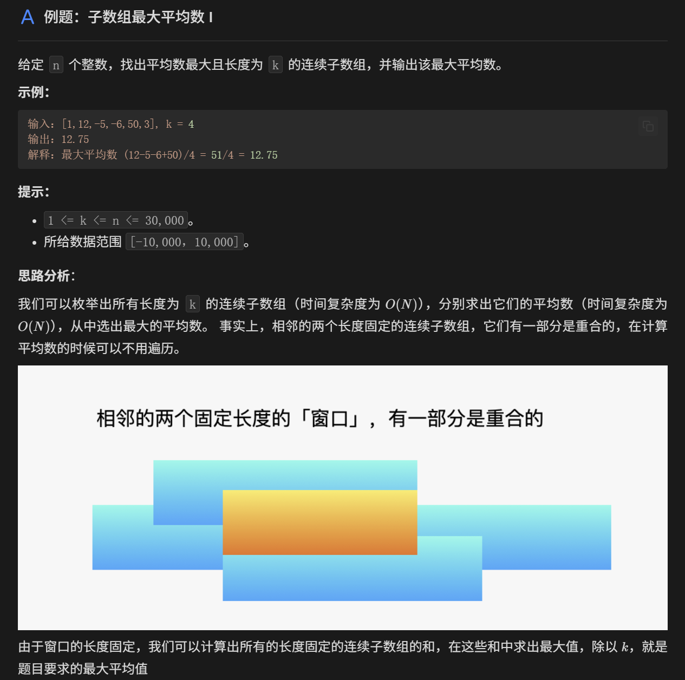
```java
public class Solution {

    public double findMaxAverage(int[] nums, int k) {
        int len = nums.length;
        // ç”±äºé¢˜ç›®é™åˆ¶äº† k <= len，因此ä¸ç”¨åšç‰¹åˆ¤
        int windowSum = 0;
        // 第 1 步：先求出第 1 个窗å£çš„å’Œ
      	for (int i = 0; i < k; i++) {
            windowSum += nums[i];
        }

      	// 第 2 步：通过éå†æ±‚出除了第 1 个窗å£çš„å’Œ
        int res = windowSum;
        // 循ç¯ä¸å˜é‡å®šä¹‰ï¼š[left..right) 是长度为 k 的窗å£
        for (int right = k; right < len; right++) {
            // 加上一个数å†å‡å»ä¸€ä¸ªæ•°
            windowSum = windowSum + nums[right] - nums[right - k];
            res = Math.max(res, windowSum);
        }
        return (double) res / k;
    }
}


```


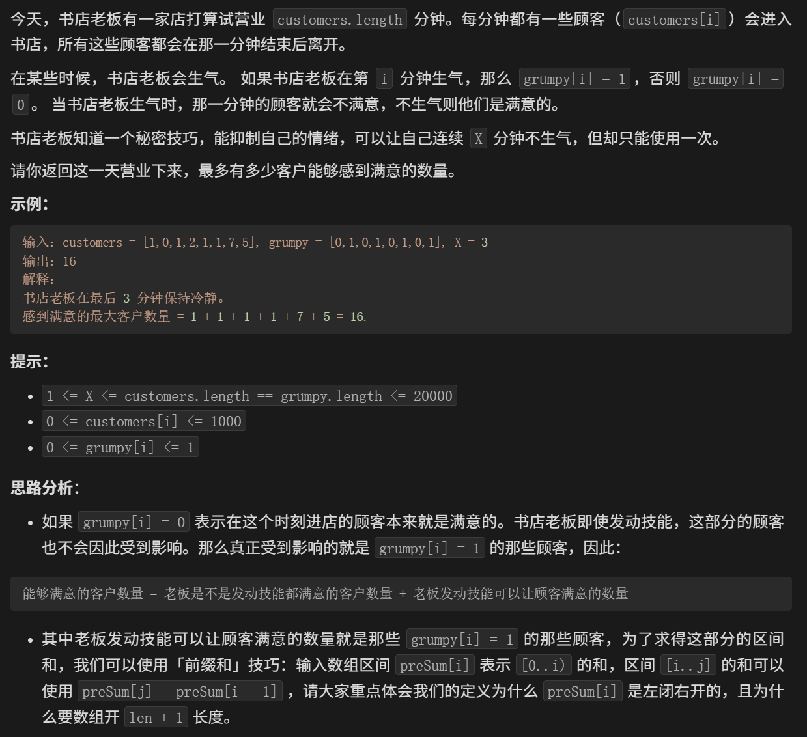
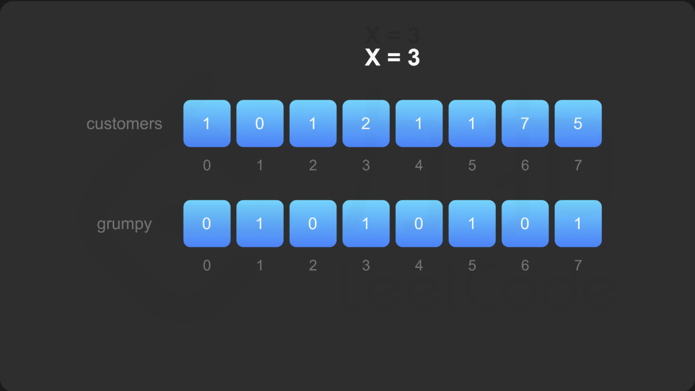
```java
public class Solution {

    public int maxSatisfied(int[] customers, int[] grumpy, int X) {
        int len = grumpy.length;
        // å‰ç¼€å’Œ preSum[i] 表示 [0..i) 里因为è€æ¿ç”Ÿæ°”而感到ä¸å¼€å¿ƒçš„顾客数
        int[] preSum = new int[len + 1];

        // 统计 1. 所有本æ¥å°±ä¸ç”Ÿæ°”的顾客数é‡ï¼›2. å‰ç¼€å’Œæ•°ç»„
        int originCount = 0;
        for (int i = 0; i < len; i++) {
            if (grumpy[i] == 0) {
                // ä¸ç”Ÿæ°”
                originCount += customers[i];
                preSum[i + 1] = preSum[i];
            } else {
                // 生气时候å‰ç¼€å’Œ
                preSum[i + 1] = preSum[i] + customers[i];
            }
        }

        int maxAngryCount = 0;
        // 固定长度的滑动窗å£çš„左边界：[i..i + X)
        for (int left = 0; left < len - X + 1; left++) {
            maxAngryCount = Math.max(maxAngryCount, preSum[left + X] - preSum[left]);
        }
        // 所有本æ¥å°±ä¸ç”Ÿæ°”的顾客
        return originCount + maxAngryCount;
    }
}


```


## æ»‘åŠ¨çª—å£ 2：ä¸å®šé•¿åº¦çš„滑动窗å£
有一类数组上的问题，需è¦ä½¿ç”¨ä¸¤ä¸ªæŒ‡é’ˆå˜é‡ï¼ˆæˆ‘们称为左指针和å³æŒ‡é’ˆï¼‰ï¼ŒåŒå‘ã€äº¤æ›¿å‘å³ç§»åŠ¨å®Œæˆä»»åŠ¡ã€‚这样的过程åƒæ了一个窗å£åœ¨å¹³é¢ä¸Šæ»‘动的过程，因此我们将解决这一类问题的算法称为「滑动窗å£ã€é—®é¢˜ã€‚

æŒæ¡å¥½è¿™ä¸€ç±»ã€Œæ»‘动窗å£ã€çš„问题，需è¦å…ˆä»ã€Œæš´åŠ›è§£æ³•ã€å¼€å§‹åˆ†æ，「滑动窗å£ã€åˆ©ç”¨äº†é—®é¢˜æœ¬èº«çš„特点，在两个指针åŒå‘ã€äº¤æ›¿å‘å³ç§»åŠ¨çš„过程中，少考虑了很多「暴力解法ã€éœ€è¦è€ƒå¯Ÿäº†æƒ…况，将时间å¤æ‚度é™åˆ°äº†çº¿æ€§çº§åˆ« O(N)（这里ğ‘是数组的长度），如下图所示。


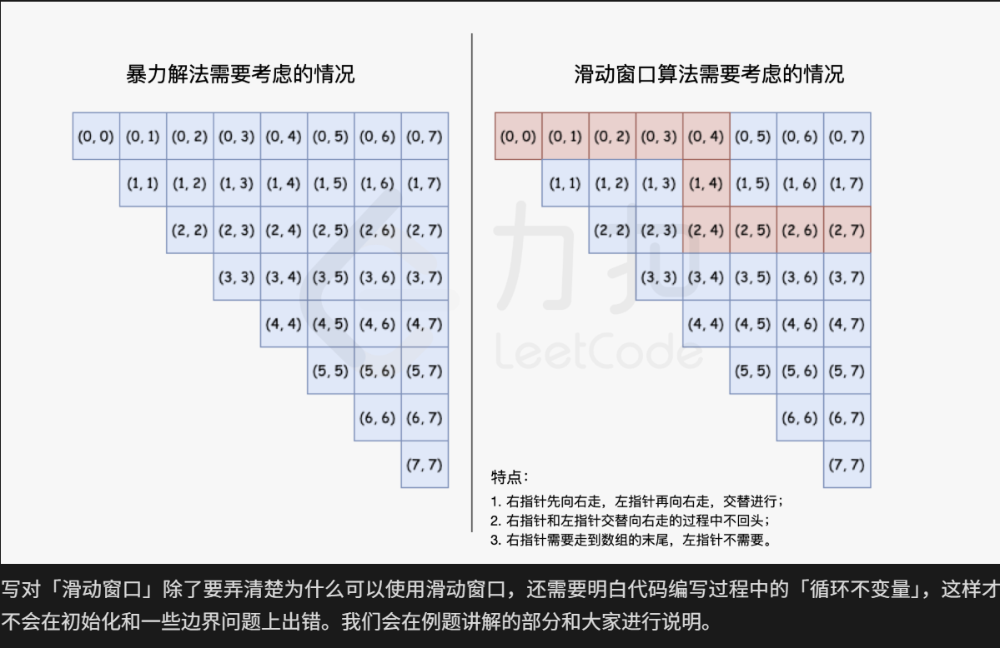

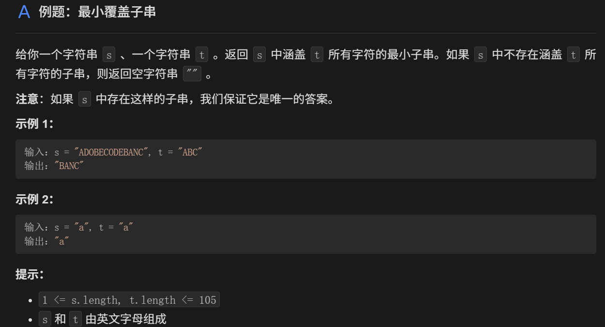
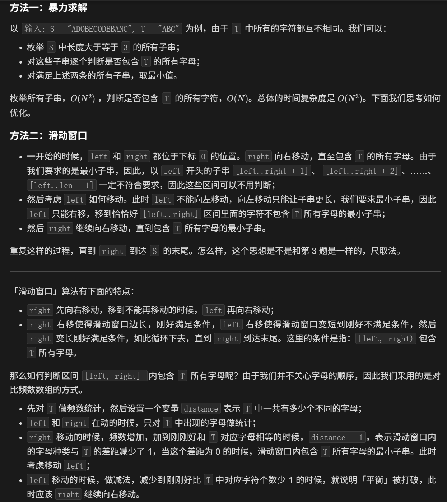

```java
public class Solution {

    public String minWindow(String s, String t) {
        int[] window = new int[128];
        int[] pattern = new int[128];

        final int A = 'A';

        for (Character c : t.toCharArray()) {
            pattern[c - A]++;
        }
        int distance = 0;

        for (int i = 0; i < 128; i++) {
            if (pattern[i] > 0) {
                distance++;
            }
        }

        int sLen = s.length();
        int start = 0;
        int left = 0;
        int right = 0;
        int match = 0;
        int minLen = sLen + 1;

        while (right < sLen) {
            Character curChar = s.charAt(right);
            if (pattern[curChar - A] > 0) {
                window[curChar - A]++;

                if (window[curChar - A] == pattern[curChar - A]) {
                    match++;
                }
            }

            right++;

            while (match == distance) {
                if (right - left < minLen) {
                    start = left;
                    minLen = right - left;
                }

                // 考虑左边界å‘å³è¾¹èµ°
                Character leftChar = s.charAt(left);
                if (pattern[leftChar - A] > 0) {
                    window[leftChar - A]--;

                    if (window[leftChar - A] < pattern[leftChar - A]) {
                        match--;
                    }
                }
                left++;
            }
        }
        return minLen == sLen + 1 ? "" : s.substring(start, start + minLen);
    }
}


```
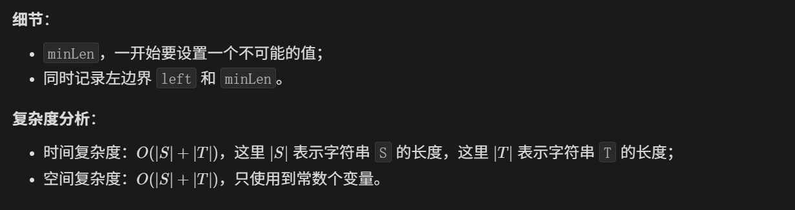
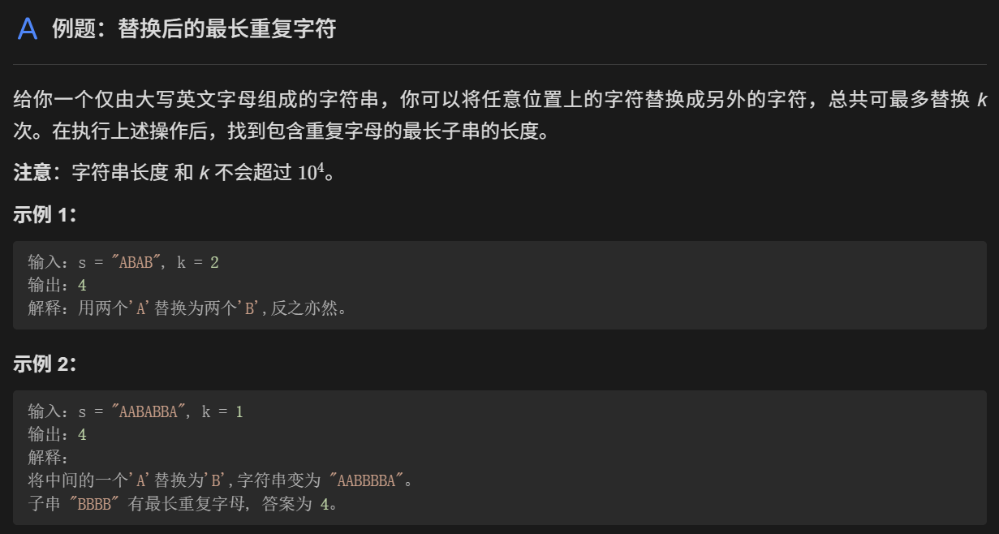
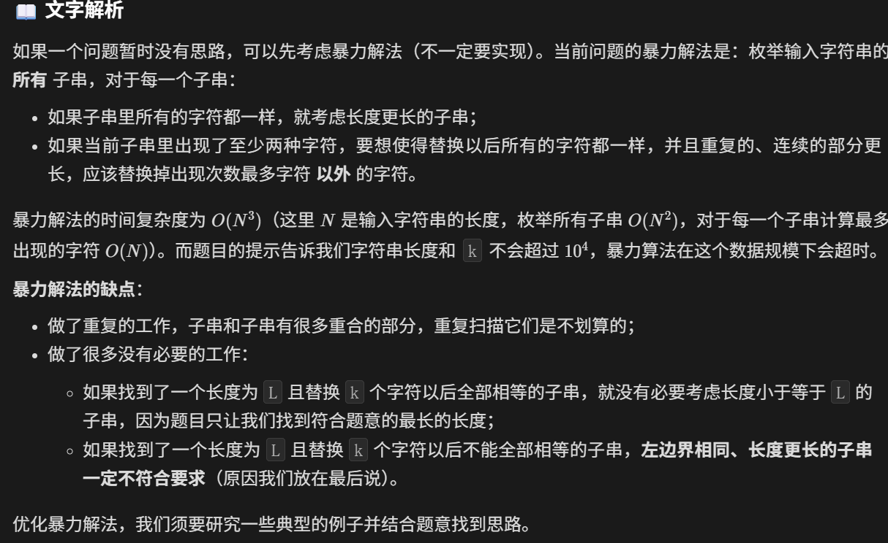

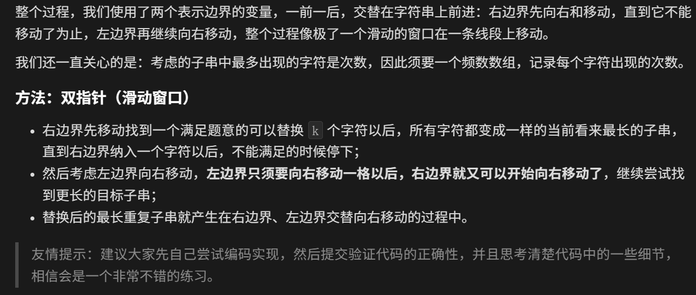
```java
public class Solution {

    public int characterReplacement(String s, int k) {
        int len = s.length();
        if (len < 2) {
            return len;
        }

        char[] charArray = s.toCharArray();
        int left = 0;
        int right = 0;

        int res = 0;
        int maxCount = 0;
        int[] freq = new int[26];
        // [left, right) å†…æœ€å¤šæ›¿æ¢ k 个字符å¯ä»¥å¾—到åªæœ‰ä¸€ç§å­—符的å­ä¸²
        while (right < len){
            freq[charArray[right] - 'A']++;
            // 在这里维护 maxCount，因为æ¯ä¸€æ¬¡å³è¾¹ç•Œè¯»å…¥ä¸€ä¸ªå­—符，字符频数å¢åŠ ï¼Œæ‰ä¼šä½¿å¾— maxCount å¢åŠ 
            maxCount = Math.max(maxCount, freq[charArray[right] - 'A']);
            right++;

            if (right - left > maxCount + k){
              	// 说æ˜æ­¤æ—¶ k ä¸å¤Ÿç”¨
                // 把其它ä¸æ˜¯æœ€å¤šå‡ºç°çš„字符替æ¢ä»¥å，都ä¸èƒ½å¡«æ»¡è¿™ä¸ªæ»‘动的窗å£ï¼Œè¿™ä¸ªæ—¶å€™é¡»è¦è€ƒè™‘左边界å‘å³ç§»åŠ¨
                // 移出滑动窗å£çš„时候，频数数组须è¦ç›¸åº”地åšå‡æ³•
                freq[charArray[left] - 'A']--;
                left++;
            }
            res = Math.max(res, right - left);
        }
        return res;
    }
}


```

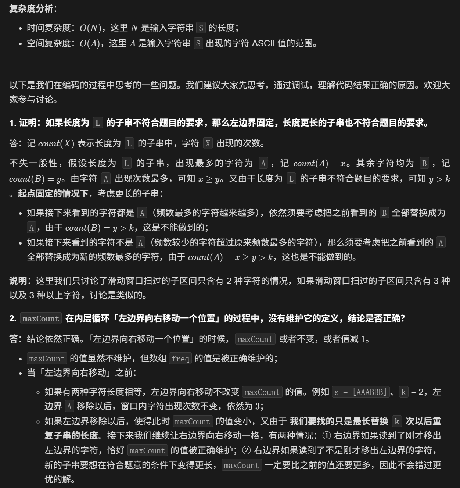
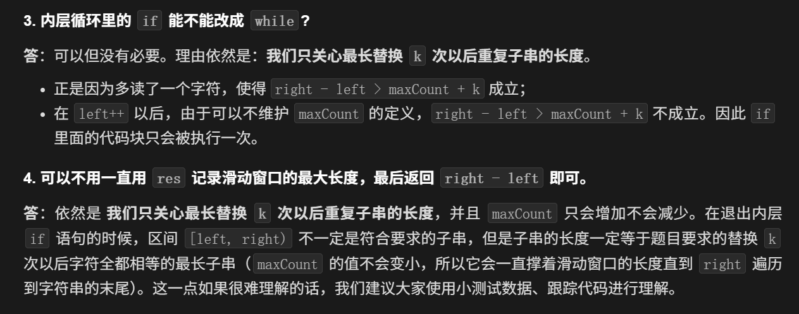

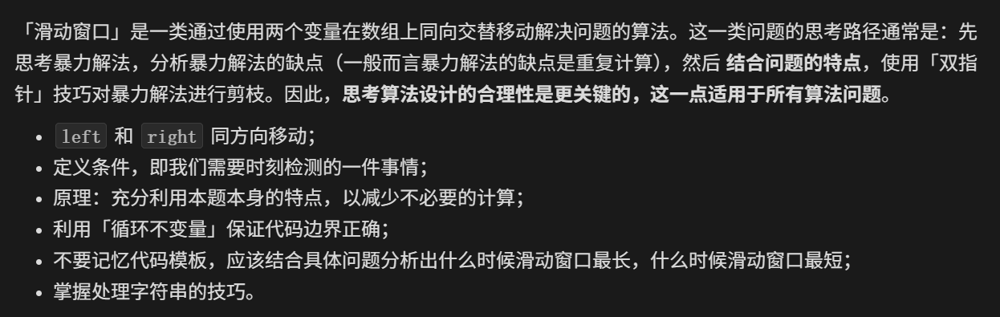

## æ»‘åŠ¨çª—å£ 3：计数问题选讲
这一节我们å‘大家介ç»å‡ ä¸ªå…³äºã€Œæ»‘动窗å£ã€çš„计数问题，写对计数问题的标准是：ä¸é‡ä¸æ¼ã€‚


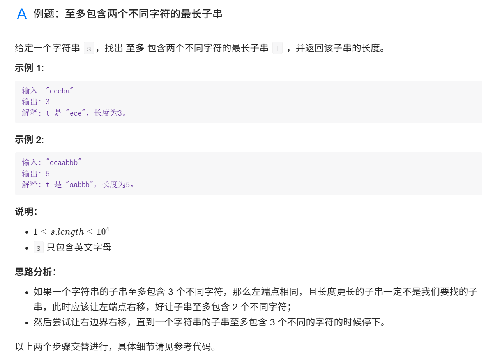

```java
public class Solution {

    public int lengthOfLongestSubstringTwoDistinct(String s) {
        int len = s.length();
        if (len < 3) {
            return len;
        }

        char[] charArray = s.toCharArray();
        int[] freq = new int[128];
        // 滑动窗å£é‡Œä¸åŒå­—符的个数
        int count = 0;

        int res = 2;
        int left = 0;
        int right = 0;
        while (right < len) {
            freq[charArray[right]]++;
            if (freq[charArray[right]] == 1) {
                count++;
            }
            right++;

            while (count == 3) {
                freq[charArray[left]]--;
                if (freq[charArray[left]] == 0) {
                    count--;
                }
                left++;
            }
            // 退出循ç¯ä»¥å有 count = 2，因此在这里选出最大值
            res = Math.max(res, right - left);
        }
        return res;
    }
}


```

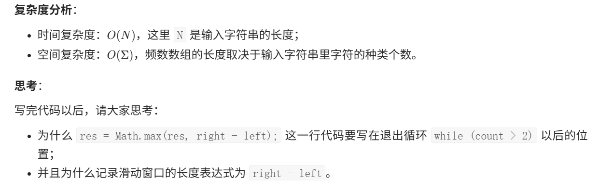

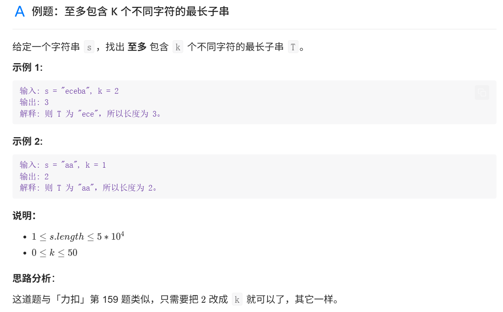

```java
public class Solution {

    public int lengthOfLongestSubstringKDistinct(String s, int k) {
        int len = s.length();
        if (len <= k) {
            return len;
        }

        char[] charArray = s.toCharArray();
        int[] freq = new int[128];
        int count = 0;

        int left = 0;
        int right = 0;
        int res = k;
        while (right < len) {
            freq[charArray[right]]++;
            if (freq[charArray[right]] == 1) {
                count++;
            }
            right++;

            while (count == k + 1) {
                freq[charArray[left]]--;
                if (freq[charArray[left]] == 0) {
                    count--;
                }
                left++;
            }

            res = Math.max(res, right - left);
        }
        return res;
    }
}


```


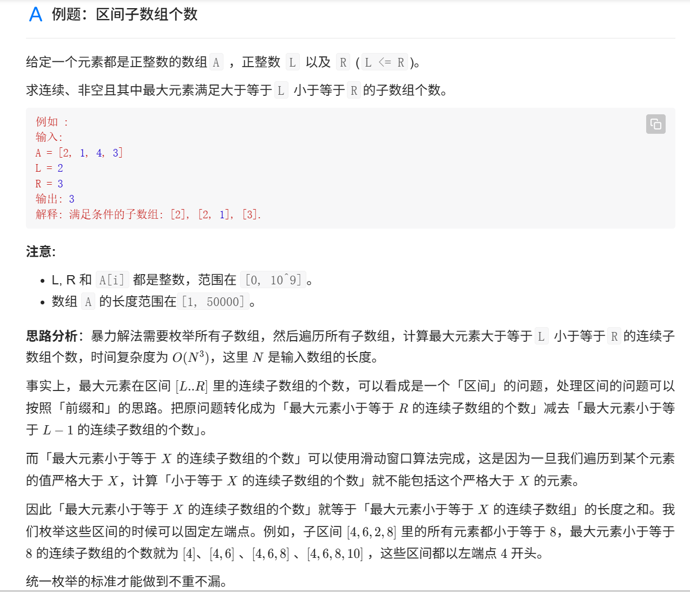
```java
public class Solution {

    public int numSubarrayBoundedMax(int[] nums, int left, int right) {
        return lessEqualsThan(nums, right) - lessEqualsThan(nums, left - 1);
    }

    private int lessEqualsThan(int[] nums, int k) {
        int len = nums.length;
        int res = 0;
        // 循ç¯ä¸å˜é‡ï¼šnums[left..right] 里的所有元素都å°äºç­‰äº k
        for (int left = 0, right = 0; right < len; right++) {
            if (nums[right] > k) {
                left = right + 1;
            }
            res += right - left;
        }
        return res;
    }
}


```


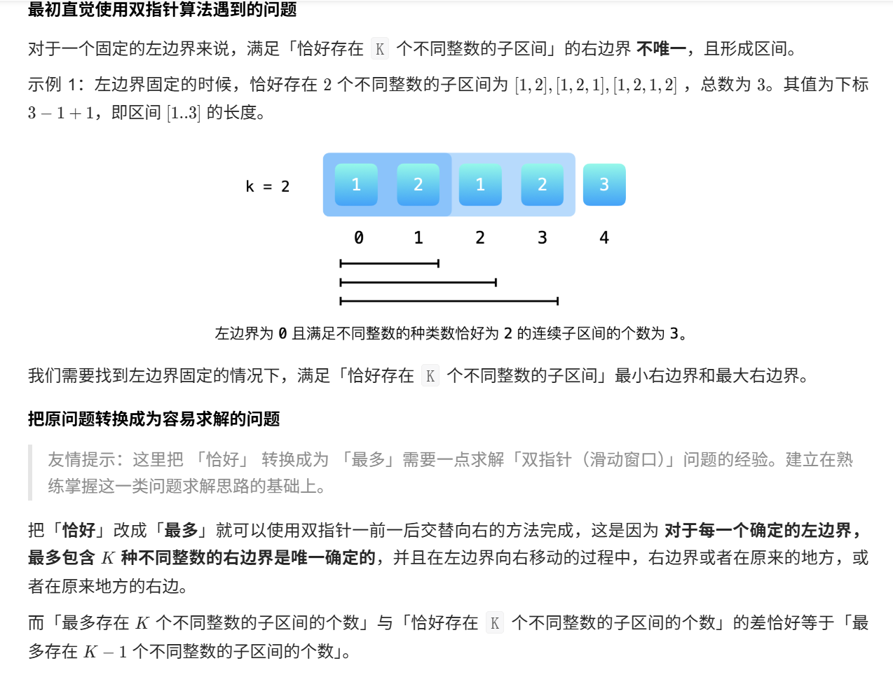

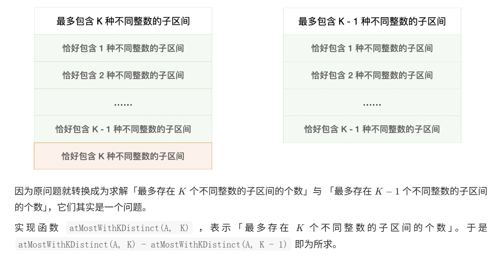
```java

public class Solution {

    public int subarraysWithKDistinct(int[] A, int K) {
        return atMostKDistinct(A, K) - atMostKDistinct(A, K - 1);
    }

    /**
     * @param A
     * @param K
     * @return æœ€å¤šåŒ…å« K 个ä¸åŒæ•´æ•°çš„å­åŒºé—´çš„个数
     */
    private int atMostKDistinct(int[] A, int K) {
        int len = A.length;
        int[] freq = new int[len + 1];

        int left = 0;
        int right = 0;
        // [left, right) 里ä¸åŒæ•´æ•°çš„个数
        int count = 0;
        int res = 0;
        // [left, right) 包å«ä¸åŒæ•´æ•°çš„个数å°äºç­‰äº K
        while (right < len) {
            if (freq[A[right]] == 0) {
                count++;
            }
            freq[A[right]]++;
            right++;

            while (count > K) {
                freq[A[left]]--;
                if (freq[A[left]] == 0) {
                    count--;
                }
                left++;
            }
            // [left, right) 区间的长度就是对结æœçš„贡献
            res += right - left;
        }
        return res;
    }
}


```

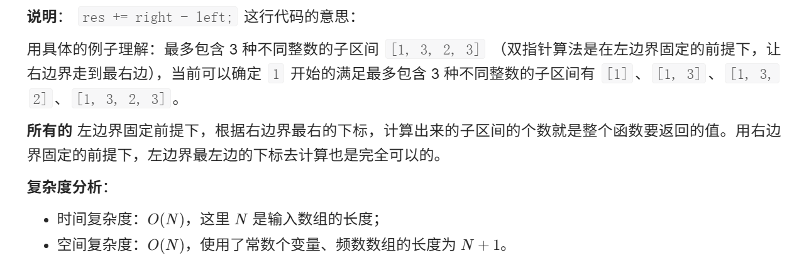


## æ»‘åŠ¨çª—å£ 4：使用数æ®ç»“æ„维护窗å£æ€§è´¨
有一类问题åªæ˜¯å字上å«ã€Œæ»‘动窗å£ã€ï¼Œä½†è§£å†³è¿™ä¸€ç±»é—®é¢˜éœ€è¦ç”¨åˆ°å¸¸è§çš„æ•°æ®ç»“æ„。这一节给出的问题å¯ä»¥å½“åšä¾‹é¢˜è¿›è¡Œå­¦ä¹ ï¼Œä¸€äº›æ¯”较å¤æ‚的问题是基äºè¿™äº›é—®é¢˜è¡ç”Ÿå‡ºæ¥çš„。


