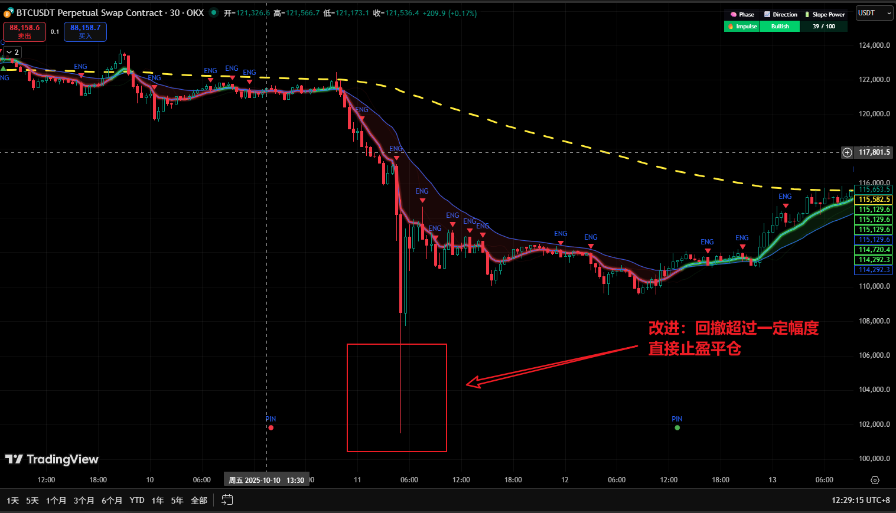

量化是我的优势，我要用量化的方法来做30分钟周期的币币交易策略。
充分利用ai
的强大计算能力和数据处理能力，结合技术分析指标和机器学习模型，设计一个高效的30分钟周期交易策略。
1. 数据收集与预处理
收集历史价格数据、交易量数据和其他相关市场数据。对数据进行清洗和预处理，处理缺失值和异常值，确保数据的准确性和完整性。
2. 特征工程
3. 选择技术指标
选择适合30分钟周期交易的技术指标，如移动平均线（MA）、相对强指数（RSI）、布林带（Bollinger Bands）等。计算这些指标并将其作为特征输入模型。
4. 模型选择与训练

# 改进

